# ArchitecturalDesigner Output
**Agent**: ArchitecturalDesigner
**Execution Order**: 2
**Timestamp**: 2025-07-04 10:29:09

---

## System Architecture Design

### High-Level Architecture

The system is designed as a **Microservices Architecture** leveraging an **Event-Driven Architecture** paradigm. This approach ensures modularity, scalability, resilience, and independent deployability of components, crucial for handling diverse data sources, computationally intensive LLM operations, and varying analytical demands. A central **API Gateway** acts as the single entry point for user interactions and report generation requests.

**Overall System Design and Components:**

1.  **API Gateway:** Serves as the public-facing entry point, handling authentication, request routing, and rate limiting. It orchestrates calls to various backend microservices.
2.  **User Interface (Optional/External):** A web-based portal or API client for users to define research requirements and retrieve reports. (Not explicitly part of this architecture, but implied by usability NFR).
3.  **Core Microservices:**
    *   **Data Ingestion Service:** Collects raw data from diverse external sources.
    *   **Data Processing Service:** Cleanses, transforms, and normalizes raw data.
    *   **Knowledge Store Service:** Manages the structured and semi-structured knowledge base derived from processed data, potentially including a Knowledge Graph.
    *   **LLM Orchestration Service:** Manages interactions with various LLM providers/instances, handling prompt engineering, context management, and response parsing.
    *   **Analysis Services (Specialized Microservices):**
        *   **Industry & Competitive Analysis Service:** Performs SWOT, market share, and competitive mapping.
        *   **Market Trends & Prediction Service:** Identifies historical patterns, current trends, and future predictions.
        *   **Technology Adoption Analysis Service:** Assesses current and emerging tech adoption.
        *   **Strategic Insights & Recommendations Service:** Synthesizes findings and generates actionable recommendations.
    *   **Report Generation Service:** Compiles and formats the analysis into "Gartner-style" reports.
4.  **Data Backbone:**
    *   **Raw Data Lake:** Stores all ingested data in its original format.
    *   **Structured Data Store (Knowledge Base):** Stores processed, normalized, and semantically enriched data.
    *   **Vector Database:** Stores embeddings for semantic search and RAG (Retrieval Augmented Generation) context for LLMs.
    *   **Message Broker (Event Bus):** Facilitates asynchronous communication between services.
5.  **Operational Components:**
    *   **Scheduler/Workflow Orchestrator:** Manages scheduled tasks for continuous data updates and re-analysis.
    *   **Monitoring & Logging Service:** Collects metrics and logs for system health, performance, and error tracking.
    *   **Authentication & Authorization Service:** Manages user identities and access controls across the system.

**Architecture Pattern:** Microservices with Event-Driven Communication.

```mermaid
graph TD
    User(User Interface/Client) --> A[API Gateway]

    subgraph Core Services
        A --> B(Auth & User Service)
        A --> C(Scheduler/Workflow)
        A --> D(Report Generation Service)
        A --> E(Strategic Insights Service)
        E --> F(Industry & Competitive Analysis Service)
        E --> G(Market Trends & Prediction Service)
        E --> H(Technology Adoption Analysis Service)
        F --> I(LLM Orchestration Service)
        G --> I
        H --> I
        E --> I
        I --> J(External LLM Providers)

        K(Data Ingestion Service) --> L(Raw Data Lake)
        L --> M(Data Processing Service)
        M --> N(Knowledge Store Service)
        N --> O(Structured Data Store/Knowledge Base)
        M --> P(Vector Database)
        O --> F
        O --> G
        O --> H
        O --> E
        P --> I
    end

    subgraph Operational
        Monitor(Monitoring & Logging)
        AuthService(Auth & User Service)
    end

    subgraph Data Stores
        RawData(Raw Data Lake)
        StructuredData(Structured Data Store/Knowledge Base)
        VectorDB(Vector Database)
    end

    subgraph External
        ExtData(External Data Sources)
        ExtLLM(External LLM Providers)
    end

    ExtData --> K
    J --> ExtLLM

    B --> A
    C --> K
    C --> F
    C --> G
    C --> H
    C --> E
    D --> User
    K -- emits data events --> MessageBroker[Message Broker]
    MessageBroker --> M -- emits processed events --> MessageBroker
    MessageBroker --> N -- emits knowledge events --> MessageBroker
    MessageBroker --> F
    MessageBroker --> G
    MessageBroker --> H
    MessageBroker --> E
    MessageBroker --> D
    MessageBroker --> Monitor
    AuthService --> B
    Monitor --> Q(Alerts/Dashboards)

```

### Component Design

**Core Components and their Responsibilities:**

1.  **API Gateway:**
    *   **Responsibilities:** Authentication, Authorization enforcement, request validation, routing requests to appropriate microservices, response aggregation (if needed), rate limiting.
    *   **Interfaces:** RESTful API endpoints for report generation requests, user management, and configuration.
    *   **Data Flow:** Receives user requests (e.g., JSON payload with research requirements), forwards to `Strategic Insights Service` (or `Scheduler` for continuous updates), receives generated report metadata/link.

2.  **Authentication & Authorization Service:**
    *   **Responsibilities:** User registration, login, role management, token generation (e.g., JWT), validating user permissions.
    *   **Interfaces:** RESTful API endpoints for user authentication and authorization checks.
    *   **Data Flow:** Interacts with API Gateway for token validation, potentially stores user data in a secure database.

3.  **Data Ingestion Service:**
    *   **Responsibilities:** Connectors for various data sources (APIs, web scrapers, database connectors, file parsers), handling diverse data formats, initial data validation, error handling for external calls.
    *   **Interfaces:** Internal API triggered by `Scheduler` or `User Request`. Outputs raw data.
    *   **Data Flow:** Pulls/pushes data from `External Data Sources` (e.g., SEC filings, news APIs, social media), stores it in `Raw Data Lake`, and publishes "data ingested" events to the `Message Broker`.

4.  **Data Processing Service:**
    *   **Responsibilities:** Data cleansing, deduplication, normalization, transformation, entity extraction (e.g., company names, industries, technologies), basic NLP (tokenization, stemming).
    *   **Interfaces:** Consumes "data ingested" events from `Message Broker`, internal API for specific processing requests. Outputs processed data.
    *   **Data Flow:** Reads from `Raw Data Lake`, performs processing, stores enriched data in `Knowledge Store Service` (via its APIs), publishes "data processed" events.

5.  **Knowledge Store Service:**
    *   **Responsibilities:** Manages the structured representation of market intelligence. Could include a graph database for relationships (e.g., "Company X uses Technology Y," "Trend Z impacts Industry A"). Stores key metrics, competitive profiles, trend definitions. Also manages content for RAG via Vector Database.
    *   **Interfaces:** RESTful API for CRUD operations on knowledge entities, query interface for analytical services.
    *   **Data Flow:** Receives processed data from `Data Processing Service`, stores it in `Structured Data Store/Knowledge Base` and `Vector Database`, provides data to analysis services.

6.  **LLM Orchestration Service:**
    *   **Responsibilities:** Abstracting different LLM providers, prompt engineering (context injection, persona definition, output format), managing API keys, handling rate limits, caching LLM responses, output parsing and validation, potentially fine-tuning management. Implements RAG for grounding LLM responses.
    *   **Interfaces:** Internal API (e.g., `/analyze_text`, `/generate_summary`, `/ask_llm`)
    *   **Data Flow:** Receives requests from analysis services, retrieves context from `Vector Database` and `Knowledge Store Service`, calls `External LLM Providers`, returns parsed responses to calling services.

7.  **Analysis Services (Industry & Competitive, Market Trends & Prediction, Technology Adoption):**
    *   **Responsibilities:** Each service is specialized in its domain. They query the `Knowledge Store Service` for relevant data, use the `LLM Orchestration Service` for advanced analysis (e.g., SWOT generation, trend identification, impact assessment), and generate structured analytical outputs.
    *   **Interfaces:** Internal APIs (e.g., `/analyze_industry`, `/predict_trends`, `/assess_tech_adoption`).
    *   **Data Flow:** Query `Knowledge Store Service`, send analytical tasks to `LLM Orchestration Service`, return structured findings to `Strategic Insights Service`.

8.  **Strategic Insights & Recommendations Service:**
    *   **Responsibilities:** Orchestrates calls to various analysis services based on user-defined research requirements. Synthesizes outputs from analysis services using LLMs to generate high-level strategic insights and actionable, customer-specific recommendations.
    *   **Interfaces:** Internal API (`/generate_insights`) triggered by `API Gateway` or `Scheduler`.
    *   **Data Flow:** Gathers data from `Analysis Services` and `Knowledge Store Service`, uses `LLM Orchestration Service` for synthesis, passes final structured insights to `Report Generation Service`.

9.  **Report Generation Service:**
    *   **Responsibilities:** Takes the structured insights and recommendations, formats them into a professional "Gartner-style" report (e.g., PDF, DOCX, interactive web format). Handles templating, table of contents, executive summary generation.
    *   **Interfaces:** Internal API (`/generate_report`).
    *   **Data Flow:** Receives structured report content from `Strategic Insights Service`, generates report file, stores it (e.g., in cloud storage), and provides a download link/content to the `API Gateway`.

10. **Scheduler/Workflow Orchestrator:**
    *   **Responsibilities:** Manages the continuous update process by triggering `Data Ingestion Service` at defined intervals, and subsequently orchestrating data processing and analysis workflows. Supports scheduled report generation.
    *   **Interfaces:** Internal API for workflow definition, triggered by time or external events.
    *   **Data Flow:** Sends commands to `Data Ingestion Service`, `Data Processing Service`, `Analysis Services` based on schedules or events.

11. **Monitoring & Logging Service:**
    *   **Responsibilities:** Aggregating logs from all microservices, collecting performance metrics (CPU, memory, network, LLM latency), setting up alerts, dashboarding.
    *   **Interfaces:** Log ingestion endpoints, metrics collection agents.
    *   **Data Flow:** Receives logs and metrics from all services, stores them in a centralized logging/metrics system, enables querying and visualization.

### Technology Stack

*   **Programming Language:** Python (adhering to PEP 8, PEP 257, PEP 484)
*   **Web Frameworks (for Microservices APIs):**
    *   **FastAPI:** For building high-performance, asynchronous RESTful APIs, with automatic data validation (Pydantic) and interactive API documentation (OpenAPI/Swagger UI).
*   **Asynchronous Task Queues/Message Brokers:**
    *   **Apache Kafka:** For high-throughput, fault-tolerant, event-driven communication between microservices, essential for continuous updates and decoupling. Alternatively, RabbitMQ for simpler queueing needs.
    *   **Celery:** For background tasks, especially useful for long-running data processing or report generation.
*   **Databases and Storage Solutions:**
    *   **Raw Data Lake:** **Cloud Object Storage (e.g., AWS S3, Google Cloud Storage, Azure Blob Storage):** Cost-effective, scalable for storing vast amounts of raw, unstructured, and semi-structured data.
    *   **Structured Data Store/Knowledge Base:**
        *   **PostgreSQL:** For structured relational data (e.g., company profiles, market metrics, user data).
        *   **Neo4j (Graph Database):** Potentially for the Knowledge Store Service to represent complex relationships between entities (companies, technologies, trends, industries), enabling powerful relationship queries.
        *   **Elasticsearch:** For full-text search capabilities over processed market research content and for analytics dashboards.
    *   **Vector Database (for RAG):** **Pinecone, Weaviate, or Qdrant:** To store vector embeddings of processed knowledge for efficient semantic search and retrieval during LLM prompting.
    *   **Caching:** **Redis:** For session management, caching frequently accessed data, and LLM responses.
*   **LLM Integration:**
    *   **LLM APIs:** OpenAI API, Anthropic Claude API, Google Gemini API.
    *   **Self-hosted LLMs:** Hugging Face Transformers with `vLLM` or `Text Generation Inference (TGI)` for high-performance inference, especially if privacy or cost is a major concern.
    *   **LangChain/LlamaIndex:** Frameworks to streamline LLM application development, prompt engineering, RAG, and agent orchestration.
*   **Data Processing & ETL:**
    *   **Pandas/Polars:** For in-memory data manipulation and analysis within services.
    *   **Apache Spark (PySpark):** For large-scale distributed data processing, especially in `Data Processing Service` if data volumes are very high.
*   **Web Scraping:** **Scrapy, BeautifulSoup, Selenium:** For collecting data from unstructured web sources.
*   **Infrastructure and Deployment:**
    *   **Containerization:** **Docker:** For packaging microservices and their dependencies.
    *   **Orchestration:** **Kubernetes (K8s):** For deploying, scaling, and managing containerized microservices in a fault-tolerant manner.
    *   **Cloud Platform:** **AWS, GCP, or Azure:** For leveraging managed services (e.g., managed Kubernetes, managed databases, object storage, serverless functions for specific tasks).
    *   **CI/CD:** **GitHub Actions, GitLab CI/CD, Jenkins:** For automated testing, building, and deployment pipelines.
    *   **Infrastructure as Code (IaC):** **Terraform, AWS CloudFormation:** For defining and provisioning infrastructure.
*   **Monitoring & Logging:**
    *   **Prometheus & Grafana:** For metrics collection, alerting, and dashboarding.
    *   **ELK Stack (Elasticsearch, Logstash, Kibana):** For centralized log aggregation, search, and visualization.
*   **Version Control:** **Git** (with platforms like GitHub/GitLab/Bitbucket).

### Design Patterns

**Architectural Patterns Used:**

*   **Microservices Architecture:** Decomposing the system into small, independently deployable services, each responsible for a specific business capability. This promotes modularity, scalability, and resilience.
*   **Event-Driven Architecture:** Services communicate asynchronously via a message broker. This decouples producers from consumers, enhances responsiveness, and facilitates continuous data flow and updates.
*   **Data Lakehouse Architecture:** Combines the flexibility and low cost of a data lake for raw data storage with the structured management and query capabilities of a data warehouse (represented by the Knowledge Store and Structured Data Store).
*   **API Gateway Pattern:** Provides a single, unified entry point for clients, abstracting the internal microservice structure.
*   **Service Mesh (e.g., Istio, Linkerd):** (Optional but recommended for large-scale deployments) For managing inter-service communication, traffic management, security, and observability.

**Design Patterns for Implementation:**

*   **Repository Pattern:** Used within each service to abstract data access logic, making it easier to swap data sources or testing.
*   **Strategy Pattern:** For choosing different LLM models or specific analytical algorithms (e.g., different trend prediction models).
*   **Factory Method:** For creating different types of reports (PDF, DOCX) or different data source connectors.
*   **Circuit Breaker:** For handling failures in external service calls (e.g., LLM APIs, external data sources), preventing cascading failures.
*   **Pub/Sub Pattern (via Message Broker):** Enables asynchronous, decoupled communication between services (e.g., `Data Ingestion Service` publishing "data ingested" events, `Data Processing Service` subscribing to them).
*   **Command Pattern:** Can be used for user requests to generate reports, encapsulating the request details and allowing for queuing, logging, and undo operations.
*   **Builder Pattern:** For constructing complex objects like LLM prompts or report structures.
*   **Dependency Injection:** To manage dependencies between components, improving testability and maintainability.
*   **Observer Pattern:** For the `Continuous Update Service` to react to data changes or new information.
*   **Singleton Pattern:** (Used sparingly) For managing shared resources like LLM client instances if resource-intensive.

### Quality Attributes

**How the design addresses scalability:**

*   **Microservices:** Each service can be scaled independently based on its workload. For example, `Data Ingestion` can scale during peak data collection, while `LLM Orchestration` can scale based on LLM inference demands.
*   **Horizontal Scaling:** Components (containers) can be easily replicated across multiple nodes/servers in a Kubernetes cluster, distributing the load.
*   **Asynchronous Processing:** Using `Kafka` and `Celery` decouples producers from consumers, allowing services to process requests at their own pace without blocking. This prevents backpressure and ensures responsiveness.
*   **Stateless Services (where possible):** Most services are designed to be stateless, making it easier to scale them horizontally without session affinity issues. State is managed externally in databases or caches.
*   **Cloud-Native Deployment:** Leveraging managed cloud services (e.g., managed databases, object storage, Kubernetes) provides elastic scalability, automatic provisioning, and reduced operational overhead.
*   **Data Partitioning/Sharding:** Data stores like PostgreSQL or Elasticsearch can be sharded to distribute data and query load across multiple instances.

**Security considerations:**

*   **Authentication & Authorization:** Dedicated `Authentication & Authorization Service` using industry standards (e.g., OAuth2, JWT) to secure API endpoints and control access to features and reports based on user roles.
*   **Data Encryption:**
    *   **Data in Transit:** All communication between services and with external APIs uses TLS/SSL.
    *   **Data at Rest:** All data stored in databases, object storage, and disk volumes is encrypted using platform-provided encryption or application-level encryption.
*   **Network Segmentation:** Microservices are deployed in isolated network segments (VPCs, private subnets), with strict network policies (firewalls, security groups) to control inter-service communication.
*   **Secrets Management:** API keys for LLMs and external data sources, database credentials, etc., are stored securely using secrets management services (e.g., AWS Secrets Manager, Vault, Kubernetes Secrets).
*   **Input Validation & Sanitization:** All user inputs and data ingested from external sources are rigorously validated and sanitized to prevent injection attacks (e.g., prompt injection for LLMs, SQL injection).
*   **Least Privilege Principle:** Services are granted only the minimum necessary permissions to perform their functions.
*   **Regular Security Audits:** Periodic security assessments, penetration testing, and vulnerability scanning.
*   **LLM Hallucination Mitigation:** Implement robust validation mechanisms, human-in-the-loop review for critical insights, and prompt engineering techniques to reduce bias and ground LLM outputs with verifiable data. RAG (Retrieval Augmented Generation) architecture helps provide specific, verifiable context to LLMs.

**Performance optimizations:**

*   **Asynchronous I/O:** Using `FastAPI` with `asyncio` for non-blocking operations, especially for I/O-bound tasks like external API calls or database queries.
*   **Caching:** `Redis` is used to cache frequently accessed data, LLM responses, and processed insights to reduce redundant computations and database lookups.
*   **Efficient Data Processing:** Leveraging tools like `Pandas`, `Polars`, or `PySpark` for optimized in-memory or distributed data transformations.
*   **Database Indexing:** Proper indexing in PostgreSQL and Elasticsearch for fast query retrieval.
*   **LLM Prompt Optimization:** Careful prompt engineering to reduce token usage and improve LLM response times. Batching LLM requests where possible.
*   **Vector Database for RAG:** Enables fast semantic retrieval of relevant context for LLMs, significantly improving response quality and reducing unnecessary LLM calls.
*   **Distributed Tracing:** Tools like Jaeger or Zipkin for monitoring end-to-end request latency across microservices, identifying bottlenecks.

**Maintainability features:**

*   **Modular Architecture:** Microservices isolate functionalities, making it easier to develop, test, deploy, and update individual components without affecting the entire system.
*   **Clear Interfaces and Contracts:** Well-defined API contracts (e.g., OpenAPI specification for FastAPI) and message schemas ensure clear communication and reduce integration issues between services.
*   **Comprehensive Documentation:**
    *   **Code-level:** Adherence to PEP 257 for docstrings, PEP 484 for type hints, and PEP 8 for coding style within Python.
    *   **Project-level:** `README.md`, `requirements.txt`, detailed architectural diagrams, API documentation, and usage guides for implementers and users.
*   **Automated Testing:** Unit tests, integration tests, and end-to-end tests for all services to ensure quality and prevent regressions during updates.
*   **Observability:** Integrated logging, metrics, and tracing facilitate understanding system behavior, debugging issues, and monitoring performance in production.
*   **Version Control:** Strict Git-based version control workflows (e.g., GitFlow, Trunk-based development).
*   **Dependency Management:** Using `pipenv` or `poetry` for consistent and isolated project dependencies.
*   **Idempotent Operations:** Designing operations (especially for event processing) to be idempotent to handle retries gracefully without side effects, improving system resilience.

---
*Saved by after_agent_callback on 2025-07-04 10:29:09*
