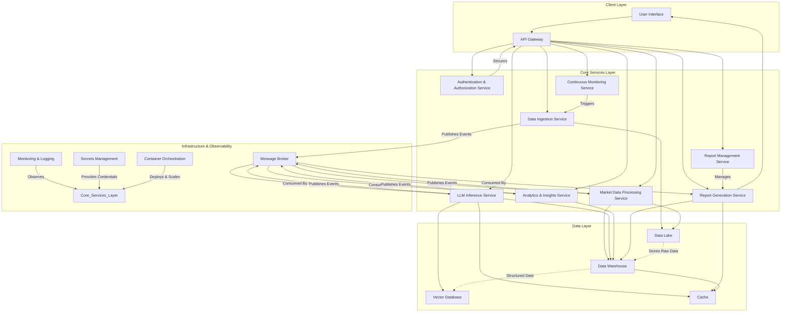

# ArchitecturalDesigner Output
**Agent**: ArchitecturalDesigner
**Execution Order**: 2
**Timestamp**: 2025-07-06 14:39:15

---

## System Architecture Design

### High-Level Architecture

The framework will employ a **Microservices Architecture** augmented by an **Event-Driven Architecture** for real-time data processing and continuous monitoring. This highly modular approach ensures scalability, maintainability, and allows for independent development and deployment of components. Within each microservice, a **Clean Architecture** approach will be followed to maintain separation of concerns and facilitate testability.

**Overall System Design and Components:**

1.  **Client Layer:**
    *   **User Interface (UI):** A web-based application providing an intuitive interface for users to define research requirements, track report generation status, and view generated reports.
    *   **API Gateway:** A single entry point for all client requests and external integrations, routing requests to appropriate microservices, handling authentication, and potentially rate limiting.

2.  **Core Services Layer (Microservices):**
    *   **Authentication & Authorization Service:** Manages user identities, roles, and permissions.
    *   **Report Management Service:** Handles report creation requests, tracks status, and manages access to completed reports.
    *   **Data Ingestion Service:** Responsible for collecting and pre-processing raw data from diverse external sources.
    *   **Market Data Processing Service:** Transforms raw data into a structured format suitable for LLM consumption and further analysis.
    *   **LLM Inference Service:** The core intelligence component, interacting with Large Language Models for advanced analysis, insight extraction, and content generation.
    *   **Analytics & Insights Service:** Applies structured analytical methods and statistical models to processed data and LLM outputs to generate deep insights and validate LLM outputs.
    *   **Report Generation Service:** Compiles all processed data, LLM outputs, and analytical insights into the final "Gartner-style" report format.
    *   **Continuous Monitoring Service:** Orchestrates scheduled data ingestion, re-analysis, and report updates based on real-time market changes.

3.  **Data Layer:**
    *   **Data Lake:** Stores raw, immutable data from all ingestion sources.
    *   **Data Warehouse:** Stores processed, structured, and transformed data, optimized for analytical queries.
    *   **Vector Database:** Stores embeddings for Retrieval Augmented Generation (RAG) and semantic search.
    *   **Cache:** For frequently accessed data and LLM responses to improve performance.

4.  **Infrastructure & Observability Layer:**
    *   **Message Broker (Event Bus):** Facilitates asynchronous communication and event propagation between microservices.
    *   **Container Orchestration:** Manages the deployment, scaling, and operation of microservices.
    *   **Monitoring & Logging:** Collects metrics, logs, and traces for system health, performance, and debugging.
    *   **Secrets Management:** Securely stores sensitive credentials.

### Component Design

**1. API Gateway**
*   **Responsibilities:** Request routing, authentication enforcement, rate limiting, SSL termination.
*   **Interfaces:** RESTful API endpoints for client requests (e.g., `/reports`, `/data-sources`, `/config`).
*   **Data Flow:** Receives HTTP/S requests from UI/external systems, forwards to relevant microservices. Returns responses from services to clients.

**2. Authentication & Authorization Service**
*   **Responsibilities:** User registration, login, session management, token issuance (JWT), role-based access control (RBAC).
*   **Interfaces:** Internal RESTful APIs for token validation, user/role lookup.
*   **Data Flow:** Interacts with API Gateway and other services to validate user identity and permissions.

**3. Report Management Service**
*   **Responsibilities:** Manages report lifecycle (request, status, completion), report metadata storage, report access control.
*   **Interfaces:** RESTful API (e.g., `POST /reports`, `GET /reports/{id}`, `GET /reports/{id}/status`).
*   **Data Flow:** Receives report generation requests from UI via API Gateway. Publishes `ReportRequested` events to the Message Broker. Stores report metadata in a relational database.

**4. Data Ingestion Service (AI Agent for Aggregation)**
*   **Responsibilities:**
    *   **Connectors:** Integrates with diverse external data sources (APIs for news, financial data, social media, web scraping for company reports, SEC filings, market databases, research papers, primary research sources).
    *   **Data Collection:** Fetches data based on configured schedules or real-time triggers.
    *   **Initial Validation & Cleansing:** Performs basic data quality checks and deduplication.
    *   **Raw Data Storage:** Stores raw, immutable data in the Data Lake.
*   **Interfaces:** Internal API for source configuration (`POST /sources`, `GET /sources/{id}`).
*   **Data Flow:** Periodically or on-demand, pulls data, writes to Data Lake. Publishes `RawDataIngested` events to Message Broker.

**5. Market Data Processing Service**
*   **Responsibilities:**
    *   **Data Transformation:** Converts raw data from Data Lake into a standardized, structured format suitable for LLM processing and analytical databases.
    *   **Feature Engineering:** Extracts relevant features and entities from unstructured text.
    *   **Data Loading:** Loads processed data into the Data Warehouse.
*   **Interfaces:** Consumes `RawDataIngested` events from Message Broker.
*   **Data Flow:** Reads from Data Lake, transforms data, writes to Data Warehouse. Publishes `ProcessedDataReady` events to Message Broker.

**6. LLM Inference Service**
*   **Responsibilities:**
    *   **LLM Orchestration:** Manages interactions with various LLM providers (e.g., OpenAI, custom fine-tuned models).
    *   **Prompt Engineering:** Constructs context-rich prompts based on processed data and specific analytical tasks (e.g., competitive analysis, trend identification).
    *   **Retrieval Augmented Generation (RAG):** Uses Vector Database to retrieve relevant factual information to ground LLM responses and mitigate hallucinations.
    *   **Insight Extraction:** Leverages LLMs for summarization, entity recognition, sentiment analysis, correlation identification, future prediction generation.
    *   **Confidence Scoring:** Attaches confidence scores to LLM outputs where possible.
*   **Interfaces:** Consumes `ProcessedDataReady` events. Internal API for LLM calls.
*   **Data Flow:** Reads from Data Warehouse and Vector Database. Sends requests to LLMs. Processes LLM responses. Publishes `LLMInsightsGenerated` events to Message Broker. Stores LLM outputs in Data Warehouse/Vector DB.

**7. Analytics & Insights Service**
*   **Responsibilities:**
    *   **Structured Analysis:** Performs quantitative and qualitative analysis on processed data and LLM insights (e.g., market share calculations, growth rate projections, statistical modeling, SWOT analysis).
    *   **Cross-Validation:** Validates LLM-generated insights against structured data and predefined rules.
    *   **Actionable Recommendation Generation:** Translates high-level insights into concrete, actionable recommendations based on business context.
*   **Interfaces:** Consumes `LLMInsightsGenerated` events.
*   **Data Flow:** Reads from Data Warehouse. Performs computations. Publishes `FinalInsightsReady` events to Message Broker. Stores final insights and recommendations in Data Warehouse.

**8. Report Generation Service**
*   **Responsibilities:**
    *   **Report Assembly:** Combines data from Data Warehouse (processed data, LLM insights, analytical findings, recommendations).
    *   **Executive Summary Generation:** Uses LLM for concise summarization of key findings.
    *   **Formatting & Layout:** Structures the report according to "Gartner-style" templates, including charts and visualizations.
    *   **Output Formats:** Generates reports in various formats (e.g., PDF, DOCX, interactive HTML).
*   **Interfaces:** Consumes `FinalInsightsReady` events. Provides API for report download (`GET /reports/{id}/download`).
*   **Data Flow:** Reads from Data Warehouse. Generates report. Stores final report artifacts in object storage (e.g., S3).

**9. Continuous Monitoring Service**
*   **Responsibilities:**
    *   **Event Listening:** Monitors the Message Broker for new data ingestion events.
    *   **Scheduling:** Periodically triggers Data Ingestion and re-analysis workflows for continuous market monitoring.
    *   **Change Detection:** Identifies significant changes in market data that warrant report updates.
*   **Interfaces:** Consumes relevant events from Message Broker. Internal API to trigger analysis workflows.
*   **Data Flow:** Triggers relevant services based on events or schedules.

### Technology Stack

*   **Programming Languages:**
    *   **Backend:** Python (Primary, for all core services, leveraging its rich ecosystem for AI/ML and data processing).
    *   **Frontend:** JavaScript/TypeScript (for the User Interface).
*   **Web Frameworks:**
    *   **Backend:** FastAPI (for its high performance, async capabilities, and Pydantic integration) or Flask (for smaller, more focused services).
    *   **Frontend:** React, Angular, or Vue.js (for building a dynamic and responsive UI).
*   **Data Processing & LLM Orchestration:**
    *   **LLM Libraries:** LangChain, LlamaIndex (for prompt engineering, RAG, agentic workflows).
    *   **Data Manipulation:** Pandas, Polars.
    *   **Data Validation:** Pydantic.
*   **Databases & Storage Solutions:**
    *   **Raw Data Lake:** AWS S3, Azure Data Lake Storage, or Google Cloud Storage (for cost-effective, scalable object storage).
    *   **Relational Database (for metadata, core data):** PostgreSQL (highly reliable, extensible, supports JSONB for semi-structured data).
    *   **Vector Database (for LLM embeddings/RAG):** Pinecone, Weaviate, or ChromaDB (if self-hosted).
    *   **Cache:** Redis (for caching LLM responses, frequently accessed data, session management).
    *   **Data Warehouse (for analytical queries):** Snowflake, Google BigQuery, or Amazon Redshift (for large-scale analytical processing).
*   **Messaging & Event Streaming:**
    *   Apache Kafka, RabbitMQ, AWS SQS/SNS, Azure Service Bus, or Google Cloud Pub/Sub (for asynchronous communication and event-driven architecture).
*   **Containerization & Orchestration:**
    *   **Container Runtime:** Docker.
    *   **Orchestration:** Kubernetes (AWS EKS, Azure AKS, Google GKE for managed solutions) for deploying and managing microservices.
*   **Cloud Platform:**
    *   AWS, Microsoft Azure, or Google Cloud Platform (for managed services, compute resources like GPUs for LLMs, and scalability).
*   **DevOps & CI/CD:**
    *   **Version Control:** Git (GitHub, GitLab, Bitbucket).
    *   **CI/CD Pipelines:** GitHub Actions, GitLab CI, Jenkins, Azure DevOps, AWS CodePipeline/CodeBuild.
*   **Monitoring & Logging:**
    *   **Logging:** ELK Stack (Elasticsearch, Logstash, Kibana), Splunk, Datadog, Grafana Loki.
    *   **Monitoring & Alerting:** Prometheus, Grafana, Datadog.
    *   **Tracing:** OpenTelemetry, Jaeger.
*   **Security:**
    *   **Secrets Management:** AWS Secrets Manager, Azure Key Vault, Google Secret Manager, HashiCorp Vault.
    *   **API Security:** OAuth2, JWT.
*   **Data Visualization (Optional Integration):** Tableau, Power BI, Looker (for advanced interactive dashboards).

### Design Patterns

**Architectural Patterns:**

*   **Microservices Architecture:** Decomposes the application into small, independent, loosely coupled services.
*   **Event-Driven Architecture:** Services communicate asynchronously via events published to a message broker, enabling loose coupling and scalability.
*   **API Gateway:** A single entry point for all client requests, providing unified access and security.
*   **Data Lakehouse:** Combines the flexibility and low cost of a data lake with the structure and query capabilities of a data warehouse.
*   **Clean Architecture (within services):** Organizes code into layers (Domain, Application, Infrastructure, Presentation) to enforce separation of concerns, making code testable and maintainable.

**Design Patterns (within microservices):**

*   **Repository Pattern:** Abstracts data access logic, making services independent of specific database technologies.
*   **Strategy Pattern:** Allows selection of different algorithms at runtime, e.g., for various LLM providers, data sources, or report formats.
*   **Factory Pattern:** Creates objects of different types based on input, e.g., for different report output formats or LLM model instances.
*   **Observer Pattern:** Used by the Continuous Monitoring Service to react to events from other services (e.g., new data ingested).
*   **Command Pattern:** Encapsulates a request as an object, allowing for parameterization, queuing, and logging of requests (e.g., report generation requests).
*   **Saga Pattern (Choreography/Orchestration):** To manage distributed transactions across multiple services for complex workflows like report generation, ensuring consistency despite failures.
*   **Circuit Breaker:** Prevents cascading failures when interacting with external APIs (e.g., LLM providers, external data sources).
*   **Retry Pattern:** Automatically retries transient failures in external calls or database operations.
*   **Builder Pattern:** For constructing complex objects, such as elaborate LLM prompts with multiple context segments.
*   **Chain of Responsibility:** For processing LLM prompts through a sequence of steps (e.g., pre-processing, RAG, prompt formatting).
*   **Façade Pattern:** Provides a simplified interface to a complex subsystem (e.g., the LLM Inference Service could provide a façade over various LLM provider APIs).

### Quality Attributes

**1. Scalability:**
*   **Microservices:** Each service can be scaled independently based on its specific load requirements (e.g., LLM Inference Service might need more GPU resources than Report Management Service).
*   **Cloud-Native Services:** Leveraging managed services (e.g., S3, RDS, EKS/AKS/GKE, Kafka) provides inherent scalability and reduces operational overhead.
*   **Asynchronous Processing & Message Queues:** Decouples services, allowing them to process messages at their own pace, absorbing spikes in load and providing resilience.
*   **Containerization & Orchestration (Kubernetes):** Enables horizontal scaling of service instances by adding more pods/containers as demand increases.
*   **Data Layer Scaling:** Use of distributed data stores (Data Lake, Data Warehouse) and read replicas for databases to handle increasing data volumes and query loads.
*   **LLM Optimization:** Techniques like prompt batching, caching LLM responses (Redis), and leveraging smaller, fine-tuned models for specific tasks to optimize inference costs and throughput.

**2. Security Considerations:**
*   **Authentication & Authorization:** OAuth2/JWT for user authentication, RBAC for granular access control to reports and features. The API Gateway enforces these policies.
*   **Data Encryption:** All data will be encrypted at rest (e.g., S3 bucket encryption, database encryption) and in transit (TLS/SSL for all inter-service and client-service communication).
*   **Secrets Management:** Sensitive credentials (API keys, database passwords) are stored and managed using dedicated secrets management services (e.g., AWS Secrets Manager, Vault).
*   **Least Privilege Principle:** Service accounts and user roles are granted only the minimum necessary permissions to perform their functions.
*   **Input Validation & Output Sanitization:** To prevent injection attacks and ensure data integrity.
*   **Network Segmentation:** Microservices are deployed in isolated network segments with strict firewall rules to limit lateral movement.
*   **Regular Security Audits & Vulnerability Scanning:** Automated and manual checks for security vulnerabilities in code and infrastructure.
*   **Data Governance:** Adherence to data privacy regulations (GDPR, CCPA) by design, including data anonymization/pseudonymization where necessary.

**3. Performance Optimizations:**
*   **Asynchronous I/O:** Python's `asyncio` and frameworks like FastAPI are used to handle concurrent requests efficiently, especially for I/O-bound operations like external API calls.
*   **Caching:** Redis is used for caching frequently accessed data, LLM responses, and report segments to reduce latency and database load.
*   **Efficient Data Storage & Retrieval:** Optimized database schema design, indexing, and use of appropriate data stores (e.g., Vector DB for semantic search, Data Warehouse for analytical queries).
*   **LLM Prompt Engineering:** Crafting concise and effective prompts to minimize token usage and LLM processing time.
*   **Batch Processing:** For large data analysis tasks and LLM inference, batching requests can significantly improve throughput and reduce costs.
*   **Content Delivery Network (CDN):** If reports are served as static files or web pages, a CDN can deliver them quickly to geographically dispersed users.
*   **Real-time vs. Batch:** Design for real-time data streaming for continuous monitoring where needed, while leveraging batch processing for less time-sensitive, large-scale analyses.

**4. Maintainability Features:**
*   **Modularity (Microservices):** Each service is a small, cohesive codebase, easier to understand, develop, test, and debug independently.
*   **Clean Architecture:** Enforces separation of concerns within services, making it easier to swap out external dependencies (e.g., different LLM providers, database types) without affecting business logic.
*   **Comprehensive Documentation:**
    *   **API Documentation:** OpenAPI/Swagger specifications for all service APIs.
    *   **Code Documentation:** Adherence to PEP 257 for docstrings, clear inline comments.
    *   **Project Documentation:** READMEs for each service/module, architectural diagrams, deployment guides.
*   **Standardized Coding Practices:** Strict adherence to PEP 8, consistent naming conventions, and code style across the entire codebase.
*   **Automated Testing:** Comprehensive suite of unit, integration, and end-to-end tests to ensure code quality and prevent regressions.
*   **Centralized Logging & Monitoring:** Provides a holistic view of system health, making it easier to diagnose issues and trace requests across services.
*   **Containerization (Docker):** Ensures consistent deployment environments across development, testing, and production, eliminating "it works on my machine" issues.
*   **Version Control (Git):** Facilitates collaborative development, change tracking, and rollbacks.

---
*Saved by after_agent_callback on 2025-07-06 14:39:15*
