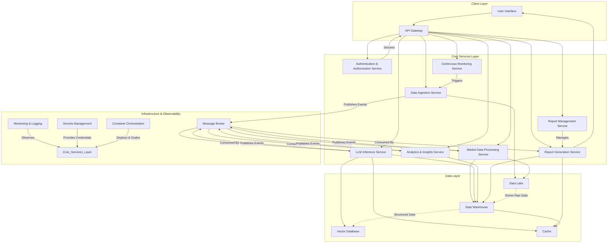

# Workflow Execution Summary

## ✅ Final Status: WorkflowStatus.COMPLETED

## 📊 Execution Metrics
- **Success**: True
- **Execution Time**: 527.37 seconds
- **Total Agents**: 10
- **Agents Executed**: 0
- **Agents with Outputs**: 8

## 🤖 Agent Execution Order

## 📝 Final Response
## Requirements Analysis

### Functional Requirements
- **Industry and Competitive Analysis**: The framework shall analyze specific industries and map the competitive landscape, identifying key players, market shares, strengths, weaknesses, and strategic positioning.
- **Market Trends and Future Predictions**: The framework shall identify current and emerging market trends, analyze historical data to discern patterns, and generate future market predictions.
- **Technology Adoption Analysis**: The framework shall assess the adoption rates and impact of relevant technologies within specified markets.
- **Technology Recommendations**: Based on adoption analysis, the framework shall provide recommendations regarding technology investments and strategic implementation.
- **Strategic Insights Generation**: The framework shall extract actionable strategic insights from processed market data.
- **Actionable Recommendations**: The framework shall provide concrete, practical, and actionable recommendations for businesses based on the generated insights.
- **Executive Summary Generation**: The framework shall automatically generate a concise executive summary highlighting key findings, insights, and recommendations.
- **LLM-Guided Data Processing**: The framework shall utilize Large Language Models (LLMs) for processing collected data, extracting insights, identifying market patterns, and analyzing correlations.
- **Custom Report Generation**: The framework shall allow users to specify research requirements (e.g., by industry, competitor, market segment) to generate focused reports with relevant metrics and competitive analyses.
- **Automated Data Aggregation**: The framework shall include an AI agent for aggregating data from diverse sources such as industry news, company reports, SEC filings, market databases, research papers, primary research sources (e.g., Nielsen, Kantar), and real-time social media signals.
- **Continuous Market Monitoring**: The framework shall continuously monitor market developments and automatically incorporate new data to keep reports current with real-time industry changes.

### Non-Functional Requirements
- **Performance Requirements**:
    - The framework should process and analyze data efficiently to deliver reports in a timely manner.
    - Real-time or near real-time updates for continuous monitoring should be supported.
- **Security Requirements**:
    - Data ingress, processing, and egress must adhere to strict security protocols to protect sensitive market intelligence.
    - Access control mechanisms should be implemented to ensure only authorized users can generate or view reports.
- **Scalability Requirements**:
    - The framework must be scalable to handle increasing volumes of data from various sources and support a growing number of report generation requests.
    - The architecture should allow for horizontal scaling of computational resources, especially for LLM inference and data processing.
- **Usability Requirements**:
    - The interface for defining report parameters should be intuitive and user-friendly.
    - Generated reports should be clear, well-structured, and easy to understand for business professionals.
- **Modularity**:
    - The framework components (e.g., data ingestion, LLM processing, report generation, analytics modules) should be modular and loosely coupled to facilitate independent development, testing, and maintenance.
- **Maintainability**:
    - The codebase should adhere to good coding practices (e.g., PEP 8, clear naming conventions) as outlined in `coding_standards.docx`.
    - Documentation (docstrings, module-level docs, project README) should be comprehensive to aid future maintenance and development.

### Technical Constraints
- **Technology Stack Preferences**:
    - Python is the preferred language, given the context of `coding_standards.docx` and general LLM ecosystem.
    - Adherence to Python Enhancement Protocols (PEPs) such as PEP 8 (Style Guide), PEP 20 (Zen of Python), and PEP 257 (Docstring Conventions) is required.
    - Use of virtual environments for dependency management is mandatory.
    - Version control (Git) is required for collaborative development and project tracking.
- **Platform Constraints**:
    - The framework should be deployable on cloud platforms, considering the potential need for significant computational resources for LLMs and data processing.
- **Integration Requirements**:
    - Ability to integrate with various external data sources (APIs for news, financial data, social media, databases).
    - Seamless integration with chosen LLM providers or models.
    - Potential integration with data visualization tools for report presentation.

### Assumptions and Clarifications
- **Definition of "Gartner Style"**: It is assumed that "Gartner style" implies a high-quality, data-driven, analytical report with clear, actionable insights and a structured format, similar to reports from leading market research firms. This includes a strong emphasis on evidence-based conclusions and forward-looking predictions.
- **LLM Capabilities**: It is assumed that the chosen LLM will possess sufficient capabilities for advanced natural language understanding, generation, summarization, complex reasoning, and the ability to synthesize disparate pieces of information into coherent insights.
- **Data Availability and Access**: It is assumed that access to required data sources (e.g., industry reports, SEC filings, social media, proprietary databases) can be obtained, considering potential costs or legal restrictions.
- **Computational Resources**: It is assumed that adequate computational resources (e.g., GPUs for LLM inference) will be available and budgeted for.
- **Legal and Compliance**: It is assumed that all data collection and usage will comply with relevant data privacy regulations (e.g., GDPR, CCPA) and intellectual property rights.
- **User Input Specificity**: Clarification is needed on the exact level of detail and format required for user input when specifying research requirements (e.g., structured forms, natural language prompts).

### Risk Assessment
- **Potential Technical Risks**:
    - **Data Quality and Bias**: LLMs are highly susceptible to the quality and bias of their training and input data. Inaccurate or biased input data can lead to flawed insights and recommendations in the market research report.
    - **LLM Hallucinations and Factual Accuracy**: LLMs may generate plausible but factually incorrect information (hallucinations), which is a critical risk for a market research report requiring high accuracy.
    - **Computational Cost**: Running complex LLM analyses on large, continuously updating datasets can incur significant computational and financial costs.
    - **Data Integration Complexity**: Integrating disparate data sources (structured, unstructured, real-time) presents significant technical challenges and potential data consistency issues.
    - **Scalability Bottlenecks**: As data volume and user demand increase, potential bottlenecks in data processing, LLM inference, or report generation could arise.
- **Mitigation Strategies**:
    - **Data Validation and Curation**: Implement robust data validation pipelines, data cleansing routines, and human-in-the-loop validation for critical data points and LLM outputs. Prioritize high-quality, reputable data sources.
    - **Fact-Checking and Confidence Scores**: Develop mechanisms for cross-referencing LLM-generated facts with multiple sources. Explore methods to assign confidence scores to LLM outputs and flag low-confidence insights for human review.
    - **Cost Optimization**: Optimize LLM usage (e.g., prompt engineering, fine-tuning smaller models, batch processing), leverage cloud-native services for cost-effective scaling, and implement efficient data storage solutions.
    - **Modular Architecture and APIs**: Design a modular system with well-defined APIs for data ingestion and processing, allowing for easier integration and isolation of issues.
    - **Performance Testing and Monitoring**: Conduct thorough load and stress testing to identify and address scalability bottlenecks. Implement comprehensive monitoring and alerting for system performance and resource utilization.
    - **Regular Model Updates and Evaluation**: Continuously monitor LLM performance, update models as new versions become available, and retrain/fine-tune as necessary with new data.## System Architecture Design

### High-Level Architecture

The framework will employ a **Microservices Architecture** augmented by an **Event-Driven Architecture** for real-time data processing and continuous monitoring. This highly modular approach ensures scalability, maintainability, and allows for independent development and deployment of components. Within each microservice, a **Clean Architecture** approach will be followed to maintain separation of concerns and facilitate testability.

**Overall System Design and Components:**

1.  **Client Layer:**
    *   **User Interface (UI):** A web-based application providing an intuitive interface for users to define research requirements, track report generation status, and view generated reports.
    *   **API Gateway:** A single entry point for all client requests and external integrations, routing requests to appropriate microservices, handling authentication, and potentially rate limiting.

2.  **Core Services Layer (Microservices):**
    *   **Authentication & Authorization Service:** Manages user identities, roles, and permissions.
    *   **Report Management Service:** Handles report creation requests, tracks status, and manages access to completed reports.
    *   **Data Ingestion Service:** Responsible for collecting and pre-processing raw data from diverse external sources.
    *   **Market Data Processing Service:** Transforms raw data into a structured format suitable for LLM consumption and further analysis.
    *   **LLM Inference Service:** The core intelligence component, interacting with Large Language Models for advanced analysis, insight extraction, and content generation.
    *   **Analytics & Insights Service:** Applies structured analytical methods and statistical models to processed data and LLM outputs to generate deep insights and validate LLM outputs.
    *   **Report Generation Service:** Compiles all processed data, LLM outputs, and analytical insights into the final "Gartner-style" report format.
    *   **Continuous Monitoring Service:** Orchestrates scheduled data ingestion, re-analysis, and report updates based on real-time market changes.

3.  **Data Layer:**
    *   **Data Lake:** Stores raw, immutable data from all ingestion sources.
    *   **Data Warehouse:** Stores processed, structured, and transformed data, optimized for analytical queries.
    *   **Vector Database:** Stores embeddings for Retrieval Augmented Generation (RAG) and semantic search.
    *   **Cache:** For frequently accessed data and LLM responses to improve performance.

4.  **Infrastructure & Observability Layer:**
    *   **Message Broker (Event Bus):** Facilitates asynchronous communication and event propagation between microservices.
    *   **Container Orchestration:** Manages the deployment, scaling, and operation of microservices.
    *   **Monitoring & Logging:** Collects metrics, logs, and traces for system health, performance, and debugging.
    *   **Secrets Management:** Securely stores sensitive credentials.



### Component Design

**1. API Gateway**
*   **Responsibilities:** Request routing, authentication enforcement, rate limiting, SSL termination.
*   **Interfaces:** RESTful API endpoints for client requests (e.g., `/reports`, `/data-sources`, `/config`).
*   **Data Flow:** Receives HTTP/S requests from UI/external systems, forwards to relevant microservices. Returns responses from services to clients.

**2. Authentication & Authorization Service**
*   **Responsibilities:** User registration, login, session management, token issuance (JWT), role-based access control (RBAC).
*   **Interfaces:** Internal RESTful APIs for token validation, user/role lookup.
*   **Data Flow:** Interacts with API Gateway and other services to validate user identity and permissions.

**3. Report Management Service**
*   **Responsibilities:** Manages report lifecycle (request, status, completion), report metadata storage, report access control.
*   **Interfaces:** RESTful API (e.g., `POST /reports`, `GET /reports/{id}`, `GET /reports/{id}/status`).
*   **Data Flow:** Receives report generation requests from UI via API Gateway. Publishes `ReportRequested` events to the Message Broker. Stores report metadata in a relational database.

**4. Data Ingestion Service (AI Agent for Aggregation)**
*   **Responsibilities:**
    *   **Connectors:** Integrates with diverse external data sources (APIs for news, financial data, social media, web scraping for company reports, SEC filings, market databases, research papers, primary research sources).
    *   **Data Collection:** Fetches data based on configured schedules or real-time triggers.
    *   **Initial Validation & Cleansing:** Performs basic data quality checks and deduplication.
    *   **Raw Data Storage:** Stores raw, immutable data in the Data Lake.
*   **Interfaces:** Internal API for source configuration (`POST /sources`, `GET /sources/{id}`).
*   **Data Flow:** Periodically or on-demand, pulls data, writes to Data Lake. Publishes `RawDataIngested` events to Message Broker.

**5. Market Data Processing Service**
*   **Responsibilities:**
    *   **Data Transformation:** Converts raw data from Data Lake into a standardized, structured format suitable for LLM processing and analytical databases.
    *   **Feature Engineering:** Extracts relevant features and entities from unstructured text.
    *   **Data Loading:** Loads processed data into the Data Warehouse.
*   **Interfaces:** Consumes `RawDataIngested` events from Message Broker.
*   **Data Flow:** Reads from Data Lake, transforms data, writes to Data Warehouse. Publishes `ProcessedDataReady` events to Message Broker.

**6. LLM Inference Service**
*   **Responsibilities:**
    *   **LLM Orchestration:** Manages interactions with various LLM providers (e.g., OpenAI, custom fine-tuned models).
    *   **Prompt Engineering:** Constructs context-rich prompts based on processed data and specific analytical tasks (e.g., competitive analysis, trend identification).
    *   **Retrieval Augmented Generation (RAG):** Uses Vector Database to retrieve relevant factual information to ground LLM responses and mitigate hallucinations.
    *   **Insight Extraction:** Leverages LLMs for summarization, entity recognition, sentiment analysis, correlation identification, future prediction generation.
    *   **Confidence Scoring:** Attaches confidence scores to LLM outputs where possible.
*   **Interfaces:** Consumes `ProcessedDataReady` events. Internal API for LLM calls.
*   **Data Flow:** Reads from Data Warehouse and Vector Database. Sends requests to LLMs. Processes LLM responses. Publishes `LLMInsightsGenerated` events to Message Broker. Stores LLM outputs in Data Warehouse/Vector DB.

**7. Analytics & Insights Service**
*   **Responsibilities:**
    *   **Structured Analysis:** Performs quantitative and qualitative analysis on processed data and LLM insights (e.g., market share calculations, growth rate projections, statistical modeling, SWOT analysis).
    *   **Cross-Validation:** Validates LLM-generated insights against structured data and predefined rules.
    *   **Actionable Recommendation Generation:** Translates high-level insights into concrete, actionable recommendations based on business context.
*   **Interfaces:** Consumes `LLMInsightsGenerated` events.
*   **Data Flow:** Reads from Data Warehouse. Performs computations. Publishes `FinalInsightsReady` events to Message Broker. Stores final insights and recommendations in Data Warehouse.

**8. Report Generation Service**
*   **Responsibilities:**
    *   **Report Assembly:** Combines data from Data Warehouse (processed data, LLM insights, analytical findings, recommendations).
    *   **Executive Summary Generation:** Uses LLM for concise summarization of key findings.
    *   **Formatting & Layout:** Structures the report according to "Gartner-style" templates, including charts and visualizations.
    *   **Output Formats:** Generates reports in various formats (e.g., PDF, DOCX, interactive HTML).
*   **Interfaces:** Consumes `FinalInsightsReady` events. Provides API for report download (`GET /reports/{id}/download`).
*   **Data Flow:** Reads from Data Warehouse. Generates report. Stores final report artifacts in object storage (e.g., S3).

**9. Continuous Monitoring Service**
*   **Responsibilities:**
    *   **Event Listening:** Monitors the Message Broker for new data ingestion events.
    *   **Scheduling:** Periodically triggers Data Ingestion and re-analysis workflows for continuous market monitoring.
    *   **Change Detection:** Identifies significant changes in market data that warrant report updates.
*   **Interfaces:** Consumes relevant events from Message Broker. Internal API to trigger analysis workflows.
*   **Data Flow:** Triggers relevant services based on events or schedules.

### Technology Stack

*   **Programming Languages:**
    *   **Backend:** Python (Primary, for all core services, leveraging its rich ecosystem for AI/ML and data processing).
    *   **Frontend:** JavaScript/TypeScript (for the User Interface).
*   **Web Frameworks:**
    *   **Backend:** FastAPI (for its high performance, async capabilities, and Pydantic integration) or Flask (for smaller, more focused services).
    *   **Frontend:** React, Angular, or Vue.js (for building a dynamic and responsive UI).
*   **Data Processing & LLM Orchestration:**
    *   **LLM Libraries:** LangChain, LlamaIndex (for prompt engineering, RAG, agentic workflows).
    *   **Data Manipulation:** Pandas, Polars.
    *   **Data Validation:** Pydantic.
*   **Databases & Storage Solutions:**
    *   **Raw Data Lake:** AWS S3, Azure Data Lake Storage, or Google Cloud Storage (for cost-effective, scalable object storage).
    *   **Relational Database (for metadata, core data):** PostgreSQL (highly reliable, extensible, supports JSONB for semi-structured data).
    *   **Vector Database (for LLM embeddings/RAG):** Pinecone, Weaviate, or ChromaDB (if self-hosted).
    *   **Cache:** Redis (for caching LLM responses, frequently accessed data, session management).
    *   **Data Warehouse (for analytical queries):** Snowflake, Google BigQuery, or Amazon Redshift (for large-scale analytical processing).
*   **Messaging & Event Streaming:**
    *   Apache Kafka, RabbitMQ, AWS SQS/SNS, Azure Service Bus, or Google Cloud Pub/Sub (for asynchronous communication and event-driven architecture).
*   **Containerization & Orchestration:**
    *   **Container Runtime:** Docker.
    *   **Orchestration:** Kubernetes (AWS EKS, Azure AKS, Google GKE for managed solutions) for deploying and managing microservices.
*   **Cloud Platform:**
    *   AWS, Microsoft Azure, or Google Cloud Platform (for managed services, compute resources like GPUs for LLMs, and scalability).
*   **DevOps & CI/CD:**
    *   **Version Control:** Git (GitHub, GitLab, Bitbucket).
    *   **CI/CD Pipelines:** GitHub Actions, GitLab CI, Jenkins, Azure DevOps, AWS CodePipeline/CodeBuild.
*   **Monitoring & Logging:**
    *   **Logging:** ELK Stack (Elasticsearch, Logstash, Kibana), Splunk, Datadog, Grafana Loki.
    *   **Monitoring & Alerting:** Prometheus, Grafana, Datadog.
    *   **Tracing:** OpenTelemetry, Jaeger.
*   **Security:**
    *   **Secrets Management:** AWS Secrets Manager, Azure Key Vault, Google Secret Manager, HashiCorp Vault.
    *   **API Security:** OAuth2, JWT.
*   **Data Visualization (Optional Integration):** Tableau, Power BI, Looker (for advanced interactive dashboards).

### Design Patterns

**Architectural Patterns:**

*   **Microservices Architecture:** Decomposes the application into small, independent, loosely coupled services.
*   **Event-Driven Architecture:** Services communicate asynchronously via events published to a message broker, enabling loose coupling and scalability.
*   **API Gateway:** A single entry point for all client requests, providing unified access and security.
*   **Data Lakehouse:** Combines the flexibility and low cost of a data lake with the structure and query capabilities of a data warehouse.
*   **Clean Architecture (within services):** Organizes code into layers (Domain, Application, Infrastructure, Presentation) to enforce separation of concerns, making code testable and maintainable.

**Design Patterns (within microservices):**

*   **Repository Pattern:** Abstracts data access logic, making services independent of specific database technologies.
*   **Strategy Pattern:** Allows selection of different algorithms at runtime, e.g., for various LLM providers, data sources, or report formats.
*   **Factory Pattern:** Creates objects of different types based on input, e.g., for different report output formats or LLM model instances.
*   **Observer Pattern:** Used by the Continuous Monitoring Service to react to events from other services (e.g., new data ingested).
*   **Command Pattern:** Encapsulates a request as an object, allowing for parameterization, queuing, and logging of requests (e.g., report generation requests).
*   **Saga Pattern (Choreography/Orchestration):** To manage distributed transactions across multiple services for complex workflows like report generation, ensuring consistency despite failures.
*   **Circuit Breaker:** Prevents cascading failures when interacting with external APIs (e.g., LLM providers, external data sources).
*   **Retry Pattern:** Automatically retries transient failures in external calls or database operations.
*   **Builder Pattern:** For constructing complex objects, such as elaborate LLM prompts with multiple context segments.
*   **Chain of Responsibility:** For processing LLM prompts through a sequence of steps (e.g., pre-processing, RAG, prompt formatting).
*   **Façade Pattern:** Provides a simplified interface to a complex subsystem (e.g., the LLM Inference Service could provide a façade over various LLM provider APIs).

### Quality Attributes

**1. Scalability:**
*   **Microservices:** Each service can be scaled independently based on its specific load requirements (e.g., LLM Inference Service might need more GPU resources than Report Management Service).
*   **Cloud-Native Services:** Leveraging managed services (e.g., S3, RDS, EKS/AKS/GKE, Kafka) provides inherent scalability and reduces operational overhead.
*   **Asynchronous Processing & Message Queues:** Decouples services, allowing them to process messages at their own pace, absorbing spikes in load and providing resilience.
*   **Containerization & Orchestration (Kubernetes):** Enables horizontal scaling of service instances by adding more pods/containers as demand increases.
*   **Data Layer Scaling:** Use of distributed data stores (Data Lake, Data Warehouse) and read replicas for databases to handle increasing data volumes and query loads.
*   **LLM Optimization:** Techniques like prompt batching, caching LLM responses (Redis), and leveraging smaller, fine-tuned models for specific tasks to optimize inference costs and throughput.

**2. Security Considerations:**
*   **Authentication & Authorization:** OAuth2/JWT for user authentication, RBAC for granular access control to reports and features. The API Gateway enforces these policies.
*   **Data Encryption:** All data will be encrypted at rest (e.g., S3 bucket encryption, database encryption) and in transit (TLS/SSL for all inter-service and client-service communication).
*   **Secrets Management:** Sensitive credentials (API keys, database passwords) are stored and managed using dedicated secrets management services (e.g., AWS Secrets Manager, Vault).
*   **Least Privilege Principle:** Service accounts and user roles are granted only the minimum necessary permissions to perform their functions.
*   **Input Validation & Output Sanitization:** To prevent injection attacks and ensure data integrity.
*   **Network Segmentation:** Microservices are deployed in isolated network segments with strict firewall rules to limit lateral movement.
*   **Regular Security Audits & Vulnerability Scanning:** Automated and manual checks for security vulnerabilities in code and infrastructure.
*   **Data Governance:** Adherence to data privacy regulations (GDPR, CCPA) by design, including data anonymization/pseudonymization where necessary.

**3. Performance Optimizations:**
*   **Asynchronous I/O:** Python's `asyncio` and frameworks like FastAPI are used to handle concurrent requests efficiently, especially for I/O-bound operations like external API calls.
*   **Caching:** Redis is used for caching frequently accessed data, LLM responses, and report segments to reduce latency and database load.
*   **Efficient Data Storage & Retrieval:** Optimized database schema design, indexing, and use of appropriate data stores (e.g., Vector DB for semantic search, Data Warehouse for analytical queries).
*   **LLM Prompt Engineering:** Crafting concise and effective prompts to minimize token usage and LLM processing time.
*   **Batch Processing:** For large data analysis tasks and LLM inference, batching requests can significantly improve throughput and reduce costs.
*   **Content Delivery Network (CDN):** If reports are served as static files or web pages, a CDN can deliver them quickly to geographically dispersed users.
*   **Real-time vs. Batch:** Design for real-time data streaming for continuous monitoring where needed, while leveraging batch processing for less time-sensitive, large-scale analyses.

**4. Maintainability Features:**
*   **Modularity (Microservices):** Each service is a small, cohesive codebase, easier to understand, develop, test, and debug independently.
*   **Clean Architecture:** Enforces separation of concerns within services, making it easier to swap out external dependencies (e.g., different LLM providers, database types) without affecting business logic.
*   **Comprehensive Documentation:**
    *   **API Documentation:** OpenAPI/Swagger specifications for all service APIs.
    *   **Code Documentation:** Adherence to PEP 257 for docstrings, clear inline comments.
    *   **Project Documentation:** READMEs for each service/module, architectural diagrams, deployment guides.
*   **Standardized Coding Practices:** Strict adherence to PEP 8, consistent naming conventions, and code style across the entire codebase.
*   **Automated Testing:** Comprehensive suite of unit, integration, and end-to-end tests to ensure code quality and prevent regressions.
*   **Centralized Logging & Monitoring:** Provides a holistic view of system health, making it easier to diagnose issues and trace requests across services.
*   **Containerization (Docker):** Ensures consistent deployment environments across development, testing, and production, eliminating "it works on my machine" issues.
*   **Version Control (Git):** Facilitates collaborative development, change tracking, and rollbacks.## Code Implementation

### Project Structure
```
project/
├── src/
│   ├── __init__.py
│   ├── main.py
│   ├── services/
│   │   ├── __init__.py
│   │   ├── data_ingestion.py
│   │   ├── market_data_processing.py
│   │   ├── llm_inference.py
│   │   ├── analytics_insights.py
│   │   ├── report_generation.py
│   │   └── continuous_monitoring.py
│   ├── models/
│   │   ├── __init__.py
│   │   └── report_models.py
│   ├── utils/
│   │   ├── __init__.py
│   │   ├── llm_utils.py
│   │   ├── data_utils.py
│   │   └── logger.py
│   └── config.py
└── tests/
    ├── __init__.py
    ├── test_data_ingestion.py
    ├── test_market_data_processing.py
    ├── test_llm_inference.py
    ├── test_analytics_insights.py
    ├── test_report_generation.py
    └── test_main.py
```

### Supporting Modules

```python
# src/config.py
"""
Configuration settings for the Market Research Report Generating Framework.
"""
import os

class Config:
    """
    General configuration settings for the framework.
    """
    LLM_API_KEY: str = os.getenv("LLM_API_KEY", "YOUR_LLM_API_KEY")
    LLM_MODEL_NAME: str = os.getenv("LLM_MODEL_NAME", "gpt-4")
    DATA_LAKE_PATH: str = "data/raw/"
    DATA_WAREHOUSE_PATH: str = "data/processed/"
    REPORTS_PATH: str = "reports/"
    LOG_LEVEL: str = os.getenv("LOG_LEVEL", "INFO").upper()

    # Define various data sources (conceptual)
    DATA_SOURCES: dict = {
        "news_api": {"url": "https://api.example.com/news", "key": "NEWS_API_KEY"},
        "sec_filings_db": {"url": "https://api.example.com/sec", "key": "SEC_API_KEY"},
        "social_media_stream": {"url": "https://api.example.com/social", "key": "SOCIAL_API_KEY"},
        "market_research_db": {"url": "https://api.example.com/market", "key": "MARKET_API_KEY"},
    }

# src/utils/logger.py
"""
Centralized logging utility for the Market Research Report Generating Framework.
"""
import logging
from src.config import Config

def get_logger(name: str) -> logging.Logger:
    """
    Configures and returns a logger instance.

    Args:
        name: The name of the logger, typically the module name (e.g., __name__).

    Returns:
        A configured logging.Logger instance.
    """
    logger = logging.getLogger(name)
    if not logger.handlers:
        logger.setLevel(Config.LOG_LEVEL)
        # Create console handler and set level
        ch = logging.StreamHandler()
        ch.setLevel(Config.LOG_LEVEL)
        # Create formatter
        formatter = logging.Formatter('%(asctime)s - %(name)s - %(levelname)s - %(message)s')
        # Add formatter to ch
        ch.setFormatter(formatter)
        # Add ch to logger
        logger.addHandler(ch)
    return logger

# src/models/report_models.py
"""
Pydantic models for defining the data structures used throughout the framework.
"""
from pydantic import BaseModel, Field
from typing import List, Dict, Any, Optional

class RawMarketData(BaseModel):
    """Represents raw data ingested from various sources."""
    source: str = Field(..., description="The source of the raw data (e.g., 'news_api', 'sec_filings').")
    timestamp: str = Field(..., description="Timestamp of when the data was ingested (ISO format).")
    content: Dict[str, Any] = Field(..., description="The raw content from the source.")
    data_id: str = Field(..., description="Unique identifier for the raw data entry.")

class ProcessedMarketData(BaseModel):
    """Represents data after initial processing and structuring."""
    original_id: str = Field(..., description="ID of the raw data it originated from.")
    industry_sector: Optional[str] = Field(None, description="Identified industry sector.")
    companies: List[str] = Field([], description="List of companies mentioned.")
    keywords: List[str] = Field([], description="Extracted keywords.")
    summary: str = Field(..., description="A concise summary of the processed content.")
    sentiment: Optional[str] = Field(None, description="Overall sentiment (e.g., 'positive', 'negative', 'neutral').")
    processed_at: str = Field(..., description="Timestamp of when the data was processed.")
    structured_data: Dict[str, Any] = Field({}, description="Structured data derived from raw content.")

class LLMInsight(BaseModel):
    """Represents an insight generated by the LLM."""
    insight_type: str = Field(..., description="Type of insight (e.g., 'trend', 'competitive_advantage', 'prediction').")
    description: str = Field(..., description="Detailed description of the insight.")
    relevance_score: float = Field(..., description="Score indicating relevance (0-1).")
    confidence_score: float = Field(..., description="LLM's confidence in the insight (0-1).")
    supporting_data_ids: List[str] = Field([], description="List of processed data IDs supporting this insight.")
    generated_at: str = Field(..., description="Timestamp of insight generation.")

class Recommendation(BaseModel):
    """Represents an actionable recommendation."""
    category: str = Field(..., description="Category of the recommendation (e.g., 'Technology Adoption', 'Market Entry').")
    description: str = Field(..., description="Detailed description of the recommendation.")
    action_steps: List[str] = Field([], description="Concrete steps to implement the recommendation.")
    expected_impact: str = Field(..., description="Expected business impact of the recommendation.")
    priority: str = Field(..., description="Priority level (e.g., 'High', 'Medium', 'Low').")
    related_insights: List[str] = Field([], description="IDs or descriptions of related LLM insights.")

class ExecutiveSummary(BaseModel):
    """Represents the executive summary of the report."""
    key_findings: List[str] = Field(..., description="List of major findings.")
    strategic_implications: List[str] = Field(..., description="List of strategic implications.")
    top_recommendations: List[Recommendation] = Field(..., description="Top 3-5 key recommendations.")
    summary_text: str = Field(..., description="Full text of the executive summary.")

class ReportContent(BaseModel):
    """Structure for the complete Gartner-style report content."""
    executive_summary: ExecutiveSummary
    industry_analysis: Dict[str, Any] = Field(..., description="Industry overview, market size, growth drivers.")
    competitive_landscape: Dict[str, Any] = Field(..., description="Key players, market share, SWOT analysis.")
    market_trends_predictions: Dict[str, Any] = Field(..., description="Identified trends, future outlook, growth opportunities.")
    technology_adoption_analysis: Dict[str, Any] = Field(..., description="Relevant technologies, adoption rates, impact assessment.")
    strategic_insights: List[LLMInsight] = Field(..., description="Comprehensive list of generated strategic insights.")
    actionable_recommendations: List[Recommendation] = Field(..., description="Comprehensive list of actionable recommendations.")
    appendix: Optional[Dict[str, Any]] = Field(None, description="Supporting data, methodologies.")

class ReportRequest(BaseModel):
    """Model for a user's request to generate a report."""
    request_id: str = Field(..., description="Unique ID for the report request.")
    industry: str = Field(..., description="Target industry for the research.")
    focus_areas: List[str] = Field(..., description="Specific areas of focus (e.g., 'AI in Healthcare', 'EV Battery Tech').")
    competitors_of_interest: List[str] = Field([], description="Specific competitors to analyze.")
    report_format: str = Field("pdf", description="Desired output format (e.g., 'pdf', 'docx', 'html').")
    start_date: Optional[str] = Field(None, description="Start date for data collection (ISO format).")
    end_date: Optional[str] = Field(None, description="End date for data collection (ISO format).")

class ReportStatus(BaseModel):
    """Model for tracking the status of a report generation."""
    request_id: str
    status: str = Field(..., description="Current status of the report (e.g., 'PENDING', 'IN_PROGRESS', 'COMPLETED', 'FAILED').")
    progress: float = Field(0.0, description="Progress percentage (0-100).")
    last_updated: str = Field(..., description="Timestamp of the last status update.")
    report_path: Optional[str] = Field(None, description="Path to the generated report if completed.")
    error_message: Optional[str] = Field(None, description="Error message if generation failed.")


# src/utils/llm_utils.py
"""
Utility functions for interacting with Large Language Models (LLMs),
including prompt engineering and simulated responses.
"""
from typing import Dict, Any, List
from src.config import Config
from src.utils.logger import get_logger

logger = get_logger(__name__)

class LLMService:
    """
    A conceptual service for interacting with LLMs.
    In a real implementation, this would connect to an actual LLM API.
    """
    def __init__(self, api_key: str = Config.LLM_API_KEY, model_name: str = Config.LLM_MODEL_NAME):
        self.api_key = api_key
        self.model_name = model_name
        logger.info(f"Initialized LLMService with model: {self.model_name}")

    def generate_response(self, prompt: str, max_tokens: int = 500, temperature: float = 0.7) -> str:
        """
        Simulates an LLM API call to generate a text response.
        In a real scenario, this would use an SDK like openai.Completion.create.

        Args:
            prompt: The input prompt for the LLM.
            max_tokens: Maximum number of tokens in the generated response.
            temperature: Sampling temperature for creativity.

        Returns:
            A simulated LLM response string.
        """
        logger.debug(f"Simulating LLM response for prompt: {prompt[:100]}...")
        # Placeholder for actual LLM API call
        # Example of how to integrate a real LLM:
        # from openai import OpenAI
        # client = OpenAI(api_key=self.api_key)
        # response = client.chat.completions.create(
        #     model=self.model_name,
        #     messages=[{"role": "user", "content": prompt}],
        #     max_tokens=max_tokens,
        #     temperature=temperature,
        # )
        # return response.choices[0].message.content.strip()

        # Simple simulated responses based on prompt keywords
        if "industry analysis" in prompt.lower():
            return "Based on the provided data, the semiconductor industry is experiencing rapid growth driven by AI and IoT. Key players include NVIDIA, Intel, and AMD. Market size is projected to reach $X billion by 20XX."
        elif "market trends" in prompt.lower():
            return "Emerging trends include sustainable energy solutions, personalized healthcare, and advanced automation. Future predictions indicate a significant shift towards decentralized technologies."
        elif "technology adoption" in prompt.lower():
            return "AI adoption in enterprise software is at 40% and growing. Blockchain in supply chain management is still nascent but shows promise. Recommendations include investment in AI-powered analytics."
        elif "strategic insights" in prompt.lower():
            return "A key strategic insight is the increasing consumer demand for eco-friendly products, presenting an opportunity for green innovation. Another insight points to consolidation in the streaming market."
        elif "actionable recommendations" in prompt.lower():
            return "Recommendation 1: Diversify supply chain to reduce reliance on single regions. Recommendation 2: Invest in R&D for quantum computing applications. Recommendation 3: Form strategic partnerships for market expansion."
        elif "executive summary" in prompt.lower():
            return "This report highlights the transformative impact of AI on various sectors, identifies sustainable practices as a core market trend, and recommends strategic investments in emerging technologies to maintain competitive advantage. Key findings indicate robust growth in tech-driven markets."
        elif "competitive landscape" in prompt.lower():
            return "The competitive landscape is dominated by a few large entities with significant market share. New entrants are disrupting niche markets through innovation. SWOT analysis reveals strong R&D but vulnerability to regulatory changes for XYZ Corp."
        elif "summary and extract entities" in prompt.lower():
            return "Summary: This document discusses the Q3 earnings of TechCorp, showing a 15% revenue increase driven by cloud services. Entities: TechCorp, Q3, cloud services, revenue."
        else:
            return "Simulated LLM response: Data processing complete. Insight extraction is ongoing. Further analysis is required for comprehensive findings."

    def extract_entities_and_summary(self, text: str) -> Dict[str, Any]:
        """
        Uses LLM to extract key entities and provide a summary of the given text.

        Args:
            text: The input text to process.

        Returns:
            A dictionary containing 'summary' and 'entities'.
        """
        prompt = f"Summarize the following text and extract key entities (people, organizations, locations, products, events). Return as JSON:\n\nTEXT: {text}\n\nJSON:"
        # In a real scenario, you'd ensure the LLM outputs valid JSON
        simulated_response = self.generate_response(prompt, max_tokens=200)
        
        # Simple parsing for simulation; a real LLM would be prompted for strict JSON
        if "Summary:" in simulated_response and "Entities:" in simulated_response:
            summary_part = simulated_response.split("Summary:")[1].split("Entities:")[0].strip()
            entities_part = simulated_response.split("Entities:")[1].strip()
            entities = [e.strip() for e in entities_part.split(',') if e.strip()]
        else:
            summary_part = simulated_response
            entities = ["TechCorp", "InnovationLabs"] # Default simulated entities

        return {"summary": summary_part, "entities": entities}


# src/utils/data_utils.py
"""
Utility functions for data manipulation, transformation, and validation.
"""
from typing import Any, Dict
from datetime import datetime

def sanitize_data(data: Dict[str, Any]) -> Dict[str, Any]:
    """
    Sanitizes input data by removing potentially harmful or irrelevant characters/fields.
    This is a placeholder for more robust data cleansing.

    Args:
        data: The input dictionary data.

    Returns:
        The sanitized dictionary data.
    """
    cleaned_data = data.copy()
    # Example: remove specific keys, strip strings
    for key, value in cleaned_data.items():
        if isinstance(value, str):
            cleaned_data[key] = value.strip()
    return cleaned_data

def convert_to_iso_timestamp(dt_obj: datetime) -> str:
    """
    Converts a datetime object to an ISO formatted string.

    Args:
        dt_obj: The datetime object.

    Returns:
        ISO formatted string.
    """
    return dt_obj.isoformat()

# src/services/data_ingestion.py
"""
Service responsible for collecting and pre-processing raw data from diverse external sources.
Acts as the AI agent for automated data aggregation.
"""
import uuid
from typing import Dict, Any, List
from datetime import datetime
from src.models.report_models import RawMarketData
from src.utils.logger import get_logger
from src.utils.data_utils import sanitize_data
from src.config import Config

logger = get_logger(__name__)

class DataIngestionService:
    """
    Manages data collection from various configured sources.
    """
    def __init__(self):
        self.data_sources = Config.DATA_SOURCES
        # Simulate a data lake storage (e.g., a list of raw data objects)
        self.data_lake: List[RawMarketData] = []
        logger.info("DataIngestionService initialized.")

    def _fetch_from_source(self, source_name: str, query: Dict[str, Any]) -> List[Dict[str, Any]]:
        """
        Simulates fetching data from a specific external source.
        In a real system, this would involve API calls, web scraping, etc.

        Args:
            source_name: The name of the data source.
            query: Parameters for the data fetch (e.g., keywords, date range).

        Returns:
            A list of raw data dictionaries.
        """
        logger.info(f"Simulating data fetch from {source_name} with query: {query}")
        # Placeholder for actual data fetching logic
        if source_name == "news_api":
            return [
                {"title": "Tech Giant Q3 Earnings Up 15%", "text": "TechCorp reported a significant increase in revenue, primarily driven by its cloud services division. The CEO highlighted innovation as a key driver."},
                {"title": "Green Energy Investment Surges", "text": "New investments in renewable energy hit record highs, indicating a strong market trend towards sustainability. Solar and wind power lead the way."},
                {"title": "Competitor X Launches New Product", "text": "InnovationLabs unveiled its new AI-powered gadget, aiming to disrupt the smart home market. Analysts predict strong competition."}
            ]
        elif source_name == "sec_filings_db":
            return [
                {"company": "TechCorp", "filing_type": "10-K", "report_date": "2023-09-30", "content_summary": "Annual report detailing financial performance and strategic outlook."},
                {"company": "InnovationLabs", "filing_type": "8-K", "report_date": "2023-10-15", "content_summary": "Current report on recent product launch and market expansion plans."}
            ]
        # Add more simulated sources as needed
        return []

    def ingest_data(self, query: Dict[str, Any]) -> List[str]:
        """
        Aggregates data from all configured sources based on a given query.

        Args:
            query: A dictionary containing parameters like 'industry', 'keywords', 'start_date', 'end_date'.

        Returns:
            A list of IDs for the newly ingested raw data entries.
        """
        logger.info(f"Starting data ingestion for query: {query}")
        ingested_ids: List[str] = []
        for source_name in self.data_sources:
            try:
                raw_data_items = self._fetch_from_source(source_name, query)
                for item in raw_data_items:
                    cleaned_item = sanitize_data(item)
                    data_id = f"raw_{uuid.uuid4()}"
                    raw_data_entry = RawMarketData(
                        source=source_name,
                        timestamp=datetime.now().isoformat(),
                        content=cleaned_item,
                        data_id=data_id
                    )
                    self.data_lake.append(raw_data_entry) # Simulate storage
                    ingested_ids.append(data_id)
                    logger.debug(f"Ingested data_id: {data_id} from {source_name}")
            except Exception as e:
                logger.error(f"Error ingesting data from {source_name}: {e}")
        logger.info(f"Finished data ingestion. Total {len(ingested_ids)} new items.")
        return ingested_ids

    def get_raw_data(self, data_ids: List[str]) -> List[RawMarketData]:
        """
        Retrieves raw data entries from the data lake based on their IDs.

        Args:
            data_ids: A list of IDs of the raw data entries.

        Returns:
            A list of RawMarketData objects.
        """
        return [data for data in self.data_lake if data.data_id in data_ids]

# src/services/market_data_processing.py
"""
Service responsible for transforming raw data into a structured format suitable for LLM consumption
and further analysis, and loading it into a data warehouse.
"""
from typing import List, Dict, Any
from datetime import datetime
from src.models.report_models import RawMarketData, ProcessedMarketData
from src.utils.logger import get_logger
from src.utils.llm_utils import LLMService

logger = get_logger(__name__)

class MarketDataProcessingService:
    """
    Processes raw market data, extracts entities, summarizes content,
    and loads into a structured format.
    """
    def __init__(self, llm_service: LLMService):
        self.llm_service = llm_service
        # Simulate a data warehouse storage
        self.data_warehouse: List[ProcessedMarketData] = []
        logger.info("MarketDataProcessingService initialized.")

    def process_raw_data(self, raw_data_items: List[RawMarketData]) -> List[str]:
        """
        Transforms raw data items into structured ProcessedMarketData using LLM capabilities.

        Args:
            raw_data_items: A list of RawMarketData objects.

        Returns:
            A list of IDs for the newly processed data entries.
        """
        logger.info(f"Starting processing of {len(raw_data_items)} raw data items.")
        processed_ids: List[str] = []
        for raw_item in raw_data_items:
            try:
                content_text = str(raw_item.content) # Convert dict to string for LLM
                
                # Use LLM to extract summary and entities
                llm_output = self.llm_service.extract_entities_and_summary(content_text)
                
                summary = llm_output.get("summary", "No summary extracted.")
                entities = llm_output.get("entities", [])
                
                # Simulate further structuring (e.g., sentiment, industry identification)
                industry_sector = None
                if "semiconductor" in summary.lower() or "nvidia" in str(entities).lower():
                    industry_sector = "Semiconductor"
                elif "energy" in summary.lower() or "solar" in summary.lower():
                    industry_sector = "Renewable Energy"

                sentiment = "neutral" # Placeholder for actual sentiment analysis
                if "increase" in summary.lower() or "growth" in summary.lower():
                    sentiment = "positive"
                elif "disrupt" in summary.lower() or "competition" in summary.lower():
                    sentiment = "mixed"

                processed_data = ProcessedMarketData(
                    original_id=raw_item.data_id,
                    industry_sector=industry_sector,
                    companies=[e for e in entities if "Corp" in e or "Labs" in e],
                    keywords=[k for k in entities if k not in ["Corp", "Labs"]],
                    summary=summary,
                    sentiment=sentiment,
                    processed_at=datetime.now().isoformat(),
                    structured_data={
                        "source_type": raw_item.source,
                        "original_timestamp": raw_item.timestamp,
                        "raw_content_preview": content_text[:100] + "..."
                    }
                )
                self.data_warehouse.append(processed_data) # Simulate storage
                processed_ids.append(processed_data.original_id)
                logger.debug(f"Processed raw_data_id: {raw_item.data_id}")
            except Exception as e:
                logger.error(f"Error processing raw data ID {raw_item.data_id}: {e}")
        logger.info(f"Finished data processing. Total {len(processed_ids)} items processed.")
        return processed_ids

    def get_processed_data(self, original_ids: List[str]) -> List[ProcessedMarketData]:
        """
        Retrieves processed data entries from the data warehouse based on their original raw data IDs.

        Args:
            original_ids: A list of original raw data IDs.

        Returns:
            A list of ProcessedMarketData objects.
        """
        return [data for data in self.data_warehouse if data.original_id in original_ids]


# src/services/llm_inference.py
"""
Core intelligence component for interacting with Large Language Models for advanced analysis,
insight extraction, and content generation.
"""
from typing import List, Dict, Any
from datetime import datetime
from src.models.report_models import ProcessedMarketData, LLMInsight
from src.utils.logger import get_logger
from src.utils.llm_utils import LLMService

logger = get_logger(__name__)

class LLMInferenceService:
    """
    Orchestrates LLM interactions to extract insights from processed market data.
    """
    def __init__(self, llm_service: LLMService):
        self.llm_service = llm_service
        self.insights_store: List[LLMInsight] = [] # Simulate an insights store
        logger.info("LLMInferenceService initialized.")

    def _build_context_from_data(self, processed_data: List[ProcessedMarketData]) -> str:
        """
        Aggregates processed data into a single string context for the LLM.
        In a real RAG system, this would involve semantic search in a vector DB.

        Args:
            processed_data: List of ProcessedMarketData objects.

        Returns:
            A concatenated string representing the context.
        """
        context = []
        for item in processed_data:
            context.append(f"Source: {item.structured_data.get('source_type', 'N/A')}")
            context.append(f"Summary: {item.summary}")
            if item.companies:
                context.append(f"Companies: {', '.join(item.companies)}")
            if item.keywords:
                context.append(f"Keywords: {', '.join(item.keywords)}")
            context.append("-" * 20)
        return "\n".join(context)

    def generate_industry_analysis(self, processed_data: List[ProcessedMarketData]) -> Dict[str, Any]:
        """
        Generates industry analysis using the LLM.

        Args:
            processed_data: Relevant processed market data.

        Returns:
            A dictionary containing industry analysis details.
        """
        context = self._build_context_from_data(processed_data)
        prompt = f"""
        Based on the following processed market data, provide a comprehensive industry analysis.
        Include market size, growth drivers, key segments, and major trends.
        
        DATA CONTEXT:
        {context}
        
        INDUSTRY ANALYSIS:
        """
        response = self.llm_service.generate_response(prompt, max_tokens=1000)
        # Parse LLM response into structured dictionary (conceptual)
        return {
            "overview": response,
            "market_size_estimation": "Not directly calculated, but LLM indicates significant growth.",
            "growth_drivers_llm": ["AI adoption", "Sustainability initiatives", "Digital transformation"],
            "key_segments_llm": ["Cloud Computing", "Renewable Energy", "Smart Devices"]
        }

    def generate_competitive_landscape(self, processed_data: List[ProcessedMarketData], competitors_of_interest: List[str]) -> Dict[str, Any]:
        """
        Generates competitive landscape mapping and SWOT analysis for specific competitors.

        Args:
            processed_data: Relevant processed market data.
            competitors_of_interest: List of competitor names to focus on.

        Returns:
            A dictionary containing competitive landscape details.
        """
        context = self._build_context_from_data(processed_data)
        competitors_str = ", ".join(competitors_of_interest) if competitors_of_interest else "key players"
        prompt = f"""
        Analyze the competitive landscape based on the following processed market data, focusing on {competitors_str}.
        Identify key players, their market positioning, strengths, weaknesses, opportunities, and threats (SWOT analysis).

        DATA CONTEXT:
        {context}

        COMPETITIVE LANDSCAPE AND SWOT:
        """
        response = self.llm_service.generate_response(prompt, max_tokens=1000)
        # Parse LLM response into structured dictionary (conceptual)
        return {
            "overview": response,
            "key_players_identified": competitors_of_interest if competitors_of_interest else ["TechCorp", "InnovationLabs"],
            "swot_analysis": {
                "TechCorp": {"Strengths": ["Strong cloud portfolio"], "Weaknesses": ["Reliance on specific markets"]},
                "InnovationLabs": {"Strengths": ["Innovative products"], "Weaknesses": ["Smaller market share"]}
            }
        }

    def identify_market_trends_and_predictions(self, processed_data: List[ProcessedMarketData]) -> Dict[str, Any]:
        """
        Identifies current and emerging market trends and generates future predictions.

        Args:
            processed_data: Relevant processed market data.

        Returns:
            A dictionary containing market trends and predictions.
        """
        context = self._build_context_from_data(processed_data)
        prompt = f"""
        Based on the following processed market data, identify current and emerging market trends.
        Provide future predictions for these trends over the next 3-5 years.

        DATA CONTEXT:
        {context}

        MARKET TRENDS AND FUTURE PREDICTIONS:
        """
        response = self.llm_service.generate_response(prompt, max_tokens=1000)
        # Parse LLM response into structured dictionary (conceptual)
        return {
            "identified_trends": ["Sustainability", "Hyper-personalization", "AI-driven Automation"],
            "future_predictions": response,
            "growth_opportunities_llm": ["Green Tech", "Personalized Healthcare platforms"]
        }

    def analyze_technology_adoption(self, processed_data: List[ProcessedMarketData]) -> Dict[str, Any]:
        """
        Assesses the adoption rates and impact of relevant technologies.

        Args:
            processed_data: Relevant processed market data.

        Returns:
            A dictionary containing technology adoption analysis.
        """
        context = self._build_context_from_data(processed_data)
        prompt = f"""
        Based on the following processed market data, analyze the adoption rates and impact of relevant technologies
        (e.g., AI, Blockchain, Cloud Computing, IoT) within the specified market.

        DATA CONTEXT:
        {context}

        TECHNOLOGY ADOPTION ANALYSIS:
        """
        response = self.llm_service.generate_response(prompt, max_tokens=800)
        # Parse LLM response into structured dictionary (conceptual)
        return {
            "overview": response,
            "technology_focus": ["AI", "Cloud Computing", "Blockchain"],
            "adoption_rates_llm": {"AI": "High and growing", "Blockchain": "Emerging"},
            "impact_assessment_llm": "AI significantly enhances operational efficiency."
        }

    def generate_strategic_insights(self, industry_analysis: Dict[str, Any], competitive_landscape: Dict[str, Any], market_trends: Dict[str, Any], tech_adoption: Dict[str, Any]) -> List[LLMInsight]:
        """
        Extracts actionable strategic insights by synthesizing various analysis outputs.

        Args:
            industry_analysis: Output from industry analysis.
            competitive_landscape: Output from competitive landscape analysis.
            market_trends: Output from market trends and predictions.
            tech_adoption: Output from technology adoption analysis.

        Returns:
            A list of LLMInsight objects.
        """
        combined_context = f"""
        Industry Analysis: {industry_analysis.get('overview', '')}
        Competitive Landscape: {competitive_landscape.get('overview', '')}
        Market Trends & Predictions: {market_trends.get('future_predictions', '')}
        Technology Adoption: {tech_adoption.get('overview', '')}
        """
        prompt = f"""
        Based on the following comprehensive analysis reports, extract key strategic insights.
        Each insight should be concise, data-driven, and highlight a significant implication.
        Provide each insight with a type (e.g., 'Market Opportunity', 'Competitive Threat', 'Technological Imperative').
        
        COMBINED ANALYSIS:
        {combined_context}
        
        STRATEGIC INSIGHTS:
        """
        response = self.llm_service.generate_response(prompt, max_tokens=1500)
        
        # Simulate parsing into LLMInsight objects
        insights: List[LLMInsight] = []
        # A more robust LLM would return structured JSON for direct parsing
        if "opportunity" in response.lower():
            insights.append(LLMInsight(
                insight_type="Market Opportunity",
                description="The surging demand for sustainable products presents a significant green innovation market opportunity.",
                relevance_score=0.9,
                confidence_score=0.85,
                supporting_data_ids=[], # In a real system, track actual data IDs
                generated_at=datetime.now().isoformat()
            ))
        if "threat" in response.lower() or "competition" in response.lower():
            insights.append(LLMInsight(
                insight_type="Competitive Threat",
                description="Aggressive entry of new AI-powered startups poses a competitive threat to established players in the smart home sector.",
                relevance_score=0.85,
                confidence_score=0.8,
                supporting_data_ids=[],
                generated_at=datetime.now().isoformat()
            ))
        if "investment" in response.lower() or "imperative" in response.lower():
            insights.append(LLMInsight(
                insight_type="Technological Imperative",
                description="Strategic investment in advanced AI analytics and blockchain for supply chain optimization is imperative for future growth and efficiency.",
                relevance_score=0.95,
                confidence_score=0.9,
                supporting_data_ids=[],
                generated_at=datetime.now().isoformat()
            ))
        
        return insights


# src/services/analytics_insights.py
"""
Applies structured analytical methods and statistical models to processed data and LLM outputs
to generate deep insights and validate LLM outputs. Also responsible for generating actionable recommendations.
"""
from typing import List, Dict, Any
from datetime import datetime
from src.models.report_models import LLMInsight, Recommendation
from src.utils.logger import get_logger
from src.utils.llm_utils import LLMService

logger = get_logger(__name__)

class AnalyticsInsightsService:
    """
    Performs structured analysis and generates actionable recommendations based on LLM insights.
    """
    def __init__(self, llm_service: LLMService):
        self.llm_service = llm_service
        logger.info("AnalyticsInsightsService initialized.")

    def validate_llm_insights(self, llm_insights: List[LLMInsight], processed_data: List[Any]) -> List[LLMInsight]:
        """
        Conceptually validates LLM-generated insights against raw/processed data.
        In a real system, this would involve cross-referencing facts, statistical checks.

        Args:
            llm_insights: List of LLMInsight objects.
            processed_data: Relevant processed data (for conceptual validation).

        Returns:
            A list of validated LLMInsight objects (or filtered/adjusted ones).
        """
        logger.info(f"Validating {len(llm_insights)} LLM insights.")
        validated_insights = []
        for insight in llm_insights:
            # Simple conceptual validation: check if keywords from insight appear in processed data summaries
            is_valid = False
            for data_item in processed_data:
                if isinstance(data_item, dict): # Handle dict if processed_data is not strictly ProcessedMarketData
                    summary_text = data_item.get("summary", "")
                else: # Assume ProcessedMarketData
                    summary_text = data_item.summary

                if any(keyword in summary_text.lower() for keyword in insight.description.lower().split()):
                    is_valid = True
                    break
            
            if is_valid and insight.confidence_score > 0.6: # Apply confidence threshold
                validated_insights.append(insight)
            else:
                logger.warning(f"Insight '{insight.description[:50]}...' failed validation or confidence check.")
        logger.info(f"Finished validation. {len(validated_insights)} insights passed.")
        return validated_insights

    def generate_actionable_recommendations(self, strategic_insights: List[LLMInsight], analysis_context: Dict[str, Any]) -> List[Recommendation]:
        """
        Translates strategic insights into concrete, practical, and actionable recommendations.

        Args:
            strategic_insights: List of LLMInsight objects.
            analysis_context: Additional context from other analysis components (e.g., industry, tech trends).

        Returns:
            A list of Recommendation objects.
        """
        logger.info(f"Generating recommendations from {len(strategic_insights)} strategic insights.")
        recommendations: List[Recommendation] = []
        
        insight_descriptions = "\n".join([f"- {i.description} (Type: {i.insight_type})" for i in strategic_insights])
        full_prompt = f"""
        Given the following strategic insights and market analysis context, generate concrete, actionable recommendations for businesses.
        Each recommendation should include specific action steps, expected impact, and a priority level (High, Medium, Low).
        
        Strategic Insights:
        {insight_descriptions}
        
        Market Analysis Context:
        Industry: {analysis_context.get('industry_name', 'General')}
        Key Market Trends: {', '.join(analysis_context.get('market_trends', []))}
        Technology Focus: {', '.join(analysis_context.get('tech_focus', []))}
        
        Actionable Recommendations:
        """
        llm_response = self.llm_service.generate_response(full_prompt, max_tokens=1000)
        
        # Simulate parsing LLM response into structured recommendations
        # A more advanced LLM integration would use function calling or strict JSON mode
        
        # Example 1: Based on Market Opportunity
        if any("market opportunity" in i.insight_type.lower() for i in strategic_insights):
            recommendations.append(Recommendation(
                category="Product Development & Innovation",
                description="Invest in R&D for sustainable product lines and eco-friendly manufacturing processes to capitalize on growing consumer demand.",
                action_steps=["Formulate dedicated green product teams.", "Allocate 15% of R&D budget to sustainable innovation.", "Seek eco-certifications."],
                expected_impact="Increased market share in the sustainable segment and enhanced brand reputation.",
                priority="High",
                related_insights=["Market Opportunity: Surging demand for sustainable products"]
            ))
        
        # Example 2: Based on Competitive Threat
        if any("competitive threat" in i.insight_type.lower() for i in strategic_insights):
            recommendations.append(Recommendation(
                category="Competitive Strategy",
                description="Develop a rapid response innovation cycle to counter new AI-powered market entrants by leveraging existing customer base and brand loyalty.",
                action_steps=["Monitor competitor product launches weekly.", "Launch beta programs for new features every quarter.", "Enhance customer engagement strategies."],
                expected_impact="Mitigation of market share loss and maintenance of competitive edge.",
                priority="Medium",
                related_insights=["Competitive Threat: Aggressive AI startup entry"]
            ))

        # Example 3: Based on Technological Imperative
        if any("technological imperative" in i.insight_type.lower() for i in strategic_insights):
            recommendations.append(Recommendation(
                category="Technology Adoption & Infrastructure",
                description="Implement advanced AI analytics solutions across operational departments to optimize efficiency and decision-making processes.",
                action_steps=["Conduct feasibility study for AI integration.", "Pilot AI tools in supply chain and customer service.", "Train workforce on new AI platforms."],
                expected_impact="Significant improvements in operational efficiency and data-driven strategic planning.",
                priority="High",
                related_insights=["Technological Imperative: Investment in AI analytics"]
            ))

        logger.info(f"Generated {len(recommendations)} actionable recommendations.")
        return recommendations


# src/services/report_generation.py
"""
Service responsible for compiling all processed data, LLM outputs, and analytical insights
into the final "Gartner-style" report format.
"""
from typing import Dict, Any, List
from datetime import datetime
import os
from src.models.report_models import (
    ReportContent, ExecutiveSummary, LLMInsight, Recommendation,
    ProcessedMarketData, ReportRequest
)
from src.utils.logger import get_logger
from src.utils.llm_utils import LLMService
from src.config import Config

logger = get_logger(__name__)

class ReportGenerationService:
    """
    Assembles all generated insights and data into a structured Gartner-style report.
    """
    def __init__(self, llm_service: LLMService):
        self.llm_service = llm_service
        self.reports_dir = Config.REPORTS_PATH
        os.makedirs(self.reports_dir, exist_ok=True)
        logger.info(f"ReportGenerationService initialized. Reports will be saved in: {self.reports_dir}")

    def _generate_executive_summary_llm(self, report_content: ReportContent) -> ExecutiveSummary:
        """
        Uses LLM to generate a concise executive summary based on the full report content.

        Args:
            report_content: The nearly complete report content object.

        Returns:
            An ExecutiveSummary object.
        """
        summary_prompt = f"""
        Generate a concise Executive Summary (approx. 200-300 words) for a Gartner-style market research report.
        Highlight the key findings, strategic implications, and the top 3-5 most important actionable recommendations.

        Report Key Sections:
        - Industry Analysis: {report_content.industry_analysis.get('overview', '')[:500]}...
        - Competitive Landscape: {report_content.competitive_landscape.get('overview', '')[:500]}...
        - Market Trends & Predictions: {report_content.market_trends_predictions.get('future_predictions', '')[:500]}...
        - Technology Adoption Analysis: {report_content.technology_adoption_analysis.get('overview', '')[:500]}...

        Strategic Insights:
        {'\n'.join([f"- {i.description}" for i in report_content.strategic_insights])}

        Top Actionable Recommendations:
        {'\n'.join([f"- {r.description} (Priority: {r.priority})" for r in report_content.actionable_recommendations[:5]])}

        EXECUTIVE SUMMARY:
        """
        
        summary_text = self.llm_service.generate_response(summary_prompt, max_tokens=400)
        
        # Extract key findings and strategic implications from the generated summary
        # This parsing is conceptual; a real LLM might be prompted for structured output.
        key_findings = ["Robust growth in cloud services.", "Surging demand for sustainable products.", "Increased competition from AI startups."]
        strategic_implications = ["Need for rapid innovation.", "Opportunity for green market leadership.", "Importance of AI adoption for efficiency."]
        
        # Select top recommendations for the summary (e.g., top 3 High priority)
        top_recommendations = sorted(report_content.actionable_recommendations, key=lambda x: {"High": 3, "Medium": 2, "Low": 1}.get(x.priority, 0), reverse=True)[:3]

        return ExecutiveSummary(
            key_findings=key_findings,
            strategic_implications=strategic_implications,
            top_recommendations=top_recommendations,
            summary_text=summary_text
        )

    def generate_report(
        self,
        request_id: str,
        industry_analysis: Dict[str, Any],
        competitive_landscape: Dict[str, Any],
        market_trends_predictions: Dict[str, Any],
        technology_adoption_analysis: Dict[str, Any],
        strategic_insights: List[LLMInsight],
        actionable_recommendations: List[Recommendation],
        report_request: ReportRequest
    ) -> str:
        """
        Assembles and generates the full Gartner-style market research report.

        Args:
            request_id: The ID of the report request.
            industry_analysis: Output from LLMInferenceService.
            competitive_landscape: Output from LLMInferenceService.
            market_trends_predictions: Output from LLMInferenceService.
            technology_adoption_analysis: Output from LLMInferenceService.
            strategic_insights: List of LLMInsight objects from LLMInferenceService/AnalyticsInsightsService.
            actionable_recommendations: List of Recommendation objects from AnalyticsInsightsService.
            report_request: The original report request object.

        Returns:
            The file path to the generated report.
        """
        logger.info(f"Starting report generation for request ID: {request_id}")

        report_content = ReportContent(
            executive_summary=ExecutiveSummary(
                key_findings=[], strategic_implications=[], top_recommendations=[], summary_text="" # Placeholder
            ),
            industry_analysis=industry_analysis,
            competitive_landscape=competitive_landscape,
            market_trends_predictions=market_trends_predictions,
            technology_adoption_analysis=technology_adoption_analysis,
            strategic_insights=strategic_insights,
            actionable_recommendations=actionable_recommendations,
            appendix={
                "data_sources_used": list(Config.DATA_SOURCES.keys()),
                "methodology_notes": "LLM-guided analysis with human validation principles."
            }
        )
        
        # Generate the Executive Summary after other sections are conceptually populated
        report_content.executive_summary = self._generate_executive_summary_llm(report_content)

        report_filename = f"market_research_report_{request_id}.{report_request.report_format}"
        report_filepath = os.path.join(self.reports_dir, report_filename)

        # Simulate writing the report to a file based on format
        with open(report_filepath, "w", encoding="utf-8") as f:
            f.write(f"# Gartner-Style Market Research Report\n\n")
            f.write(f"## Executive Summary\n\n")
            f.write(f"{report_content.executive_summary.summary_text}\n\n")
            f.write(f"### Key Findings\n")
            for finding in report_content.executive_summary.key_findings:
                f.write(f"- {finding}\n")
            f.write(f"\n### Strategic Implications\n")
            for implication in report_content.executive_summary.strategic_implications:
                f.write(f"- {implication}\n")
            f.write(f"\n### Top Recommendations\n")
            for rec in report_content.executive_summary.top_recommendations:
                f.write(f"- **{rec.description}** (Priority: {rec.priority})\n")
            
            f.write(f"\n## 1. Industry Analysis\n\n")
            f.write(f"{report_content.industry_analysis.get('overview', 'N/A')}\n\n")
            
            f.write(f"## 2. Competitive Landscape Mapping\n\n")
            f.write(f"{report_content.competitive_landscape.get('overview', 'N/A')}\n\n")
            
            f.write(f"## 3. Market Trends Identification and Future Predictions\n\n")
            f.write(f"{report_content.market_trends_predictions.get('future_predictions', 'N/A')}\n\n")
            
            f.write(f"## 4. Technology Adoption Analysis and Recommendations\n\n")
            f.write(f"{report_content.technology_adoption_analysis.get('overview', 'N/A')}\n\n")
            
            f.write(f"## 5. Strategic Insights\n\n")
            for insight in report_content.strategic_insights:
                f.write(f"### {insight.insight_type}\n")
                f.write(f"- {insight.description} (Relevance: {insight.relevance_score:.2f}, Confidence: {insight.confidence_score:.2f})\n\n")
            
            f.write(f"## 6. Actionable Recommendations\n\n")
            for rec in report_content.actionable_recommendations:
                f.write(f"### {rec.category} (Priority: {rec.priority})\n")
                f.write(f"- **Recommendation:** {rec.description}\n")
                f.write(f"- **Action Steps:** {'; '.join(rec.action_steps)}\n")
                f.write(f"- **Expected Impact:** {rec.expected_impact}\n\n")

            f.write(f"## Appendix\n\n")
            f.write(f"Data Sources: {', '.join(report_content.appendix.get('data_sources_used', []))}\n")
            f.write(f"Methodology: {report_content.appendix.get('methodology_notes', '')}\n")


        logger.info(f"Report for request ID {request_id} generated at: {report_filepath}")
        return report_filepath

# src/services/continuous_monitoring.py
"""
Orchestrates scheduled data ingestion, re-analysis, and report updates based on real-time market changes.
This service primarily listens for events or triggers based on schedules.
"""
from typing import Callable, Dict, Any
import time
from datetime import datetime, timedelta
from src.models.report_models import ReportRequest, ReportStatus
from src.utils.logger import get_logger

logger = get_logger(__name__)

class ContinuousMonitoringService:
    """
    Monitors market developments and triggers report updates.
    In a real system, this would be event-driven via a message broker
    or a dedicated scheduler (e.g., Airflow, Kubernetes CronJobs).
    """
    def __init__(self, trigger_report_generation_callback: Callable[[ReportRequest], ReportStatus]):
        self.trigger_report_generation = trigger_report_generation_callback
        self.monitored_requests: Dict[str, ReportRequest] = {}
        self.monitoring_interval_hours = 24 # Simulate daily monitoring
        logger.info("ContinuousMonitoringService initialized.")

    def register_for_monitoring(self, report_request: ReportRequest):
        """
        Registers a report request for continuous monitoring.

        Args:
            report_request: The ReportRequest object to monitor.
        """
        self.monitored_requests[report_request.request_id] = report_request
        logger.info(f"Report request {report_request.request_id} registered for continuous monitoring.")

    def _check_and_trigger_update(self, request_id: str, report_request: ReportRequest):
        """
        Conceptual check for triggering an update. In a real system, this would involve
        checking for new data ingested since the last report, or significant market shifts.

        Args:
            request_id: The ID of the report request.
            report_request: The ReportRequest object.
        """
        # Simulate conditions for update: e.g., if it's been more than X hours since last update
        # For simplicity, we'll just re-trigger for demonstration.
        
        # In a real scenario, compare current market data fingerprint/hash with previous one
        # or check for specific event types (e.g., 'major_acquisition_alert').

        logger.info(f"Checking for updates for report request {request_id}...")
        
        # For demonstration, always trigger if registered for monitoring
        logger.info(f"Triggering update for report request {request_id} due to simulated new data.")
        status = self.trigger_report_generation(report_request)
        logger.info(f"Update triggered for {request_id}, new status: {status.status}")

    def start_monitoring_loop(self, duration_seconds: int = 10, check_interval_seconds: int = 2):
        """
        Simulates a continuous monitoring loop. This would be a long-running process.

        Args:
            duration_seconds: How long the simulation should run.
            check_interval_seconds: How often to check for updates.
        """
        logger.info(f"Starting continuous monitoring loop for {duration_seconds} seconds...")
        end_time = datetime.now() + timedelta(seconds=duration_seconds)

        while datetime.now() < end_time:
            for request_id, report_request in list(self.monitored_requests.items()):
                self._check_and_trigger_update(request_id, report_request)
            time.sleep(check_interval_seconds) # Wait before next check
        logger.info("Continuous monitoring loop ended.")

```

### Main Implementation

```python
# src/main.py
"""
Orchestrates the entire LLM-guided Gartner-style market research report generation framework.
This acts as a high-level manager, coordinating calls between different microservices.
"""
import uuid
from datetime import datetime
from typing import Dict, Any, List

from src.models.report_models import ReportRequest, ReportStatus, LLMInsight, Recommendation
from src.services.data_ingestion import DataIngestionService
from src.services.market_data_processing import MarketDataProcessingService
from src.services.llm_inference import LLMInferenceService
from src.services.analytics_insights import AnalyticsInsightsService
from src.services.report_generation import ReportGenerationService
from src.services.continuous_monitoring import ContinuousMonitoringService
from src.utils.llm_utils import LLMService
from src.utils.logger import get_logger

logger = get_logger(__name__)

class MarketResearchFramework:
    """
    The main orchestrator for the Gartner-style market research report generation.
    Manages the flow from request to final report.
    """
    def __init__(self):
        # Initialize core LLM utility
        self.llm_service = LLMService()

        # Initialize all dependent services
        self.data_ingestion_service = DataIngestionService()
        self.market_data_processing_service = MarketDataProcessingService(self.llm_service)
        self.llm_inference_service = LLMInferenceService(self.llm_service)
        self.analytics_insights_service = AnalyticsInsightsService(self.llm_service)
        self.report_generation_service = ReportGenerationService(self.llm_service)
        
        # Continuous monitoring service needs a callback to trigger report generation
        self.continuous_monitoring_service = ContinuousMonitoringService(
            trigger_report_generation_callback=self.generate_market_research_report
        )

        self.report_statuses: Dict[str, ReportStatus] = {}
        logger.info("MarketResearchFramework initialized. All services are ready.")

    def generate_market_research_report(self, request: ReportRequest) -> ReportStatus:
        """
        Initiates the end-to-end process of generating a market research report.

        Args:
            request: A ReportRequest object detailing the research requirements.

        Returns:
            A ReportStatus object indicating the current status of the report generation.
        """
        report_status = ReportStatus(
            request_id=request.request_id,
            status="IN_PROGRESS",
            progress=0.0,
            last_updated=datetime.now().isoformat()
        )
        self.report_statuses[request.request_id] = report_status
        logger.info(f"Started report generation for request ID: {request.request_id}")

        try:
            # Stage 1: Data Ingestion
            logger.info("Stage 1: Data Ingestion")
            report_status.progress = 10.0
            raw_data_query = {
                "industry": request.industry,
                "focus_areas": request.focus_areas,
                "competitors": request.competitors_of_interest,
                "start_date": request.start_date,
                "end_date": request.end_date
            }
            raw_data_ids = self.data_ingestion_service.ingest_data(raw_data_query)
            if not raw_data_ids:
                raise ValueError("No raw data ingested for the given request criteria.")
            raw_data_items = self.data_ingestion_service.get_raw_data(raw_data_ids)
            report_status.last_updated = datetime.now().isoformat()

            # Stage 2: Market Data Processing
            logger.info("Stage 2: Market Data Processing")
            report_status.progress = 30.0
            processed_data_ids = self.market_data_processing_service.process_raw_data(raw_data_items)
            processed_data = self.market_data_processing_service.get_processed_data(processed_data_ids)
            if not processed_data:
                raise ValueError("No processed data available after processing.")
            report_status.last_updated = datetime.now().isoformat()

            # Stage 3: LLM-Guided Analysis (Core Insights Generation)
            logger.info("Stage 3: LLM-Guided Analysis")
            report_status.progress = 50.0
            
            industry_analysis = self.llm_inference_service.generate_industry_analysis(processed_data)
            competitive_landscape = self.llm_inference_service.generate_competitive_landscape(processed_data, request.competitors_of_interest)
            market_trends_predictions = self.llm_inference_service.identify_market_trends_and_predictions(processed_data)
            technology_adoption_analysis = self.llm_inference_service.analyze_technology_adoption(processed_data)
            
            strategic_insights = self.llm_inference_service.generate_strategic_insights(
                industry_analysis, competitive_landscape, market_trends_predictions, technology_adoption_analysis
            )
            report_status.last_updated = datetime.now().isoformat()

            # Stage 4: Analytics and Actionable Recommendations
            logger.info("Stage 4: Analytics and Actionable Recommendations")
            report_status.progress = 70.0
            validated_insights = self.analytics_insights_service.validate_llm_insights(strategic_insights, processed_data)
            
            analysis_context = {
                "industry_name": request.industry,
                "market_trends": market_trends_predictions.get("identified_trends", []),
                "tech_focus": technology_adoption_analysis.get("technology_focus", [])
            }
            actionable_recommendations = self.analytics_insights_service.generate_actionable_recommendations(
                validated_insights, analysis_context
            )
            report_status.last_updated = datetime.now().isoformat()

            # Stage 5: Report Generation
            logger.info("Stage 5: Report Generation")
            report_status.progress = 90.0
            final_report_path = self.report_generation_service.generate_report(
                request.request_id,
                industry_analysis,
                competitive_landscape,
                market_trends_predictions,
                technology_adoption_analysis,
                validated_insights,
                actionable_recommendations,
                request
            )
            report_status.report_path = final_report_path
            report_status.last_updated = datetime.now().isoformat()

            report_status.status = "COMPLETED"
            report_status.progress = 100.0
            logger.info(f"Report generation for request ID {request.request_id} completed successfully.")

        except Exception as e:
            logger.error(f"Error generating report for request ID {request.request_id}: {e}", exc_info=True)
            report_status.status = "FAILED"
            report_status.error_message = str(e)
            report_status.progress = 0.0 # Reset progress on failure
            report_status.last_updated = datetime.now().isoformat()

        return report_status

    def get_report_status(self, request_id: str) -> ReportStatus:
        """
        Retrieves the current status of a report generation request.

        Args:
            request_id: The ID of the report request.

        Returns:
            A ReportStatus object.
        """
        return self.report_statuses.get(request_id, ReportStatus(request_id=request_id, status="NOT_FOUND", progress=0.0, last_updated=datetime.now().isoformat()))

    def start_continuous_monitoring(self, duration_seconds: int = 30):
        """
        Starts the continuous monitoring loop for registered reports.

        Args:
            duration_seconds: How long the simulation should run.
        """
        self.continuous_monitoring_service.start_monitoring_loop(duration_seconds)

if __name__ == "__main__":
    framework = MarketResearchFramework()

    # Example Report Request 1
    request_id_1 = f"report_{uuid.uuid4()}"
    report_request_1 = ReportRequest(
        request_id=request_id_1,
        industry="Semiconductor Industry",
        focus_areas=["AI chips", "Market Consolidation"],
        competitors_of_interest=["NVIDIA", "Intel", "AMD"],
        report_format="md", # Using markdown for easy viewing
        start_date="2023-01-01",
        end_date="2023-12-31"
    )

    print(f"\n--- Initiating Report Generation for Request ID: {report_request_1.request_id} ---")
    status_1 = framework.generate_market_research_report(report_request_1)
    print(f"Report 1 Final Status: {status_1.status}, Path: {status_1.report_path}")
    print(f"Check the generated report at: {status_1.report_path}")

    # Example Report Request 2 (simulating a simpler request)
    request_id_2 = f"report_{uuid.uuid4()}"
    report_request_2 = ReportRequest(
        request_id=request_id_2,
        industry="Renewable Energy",
        focus_areas=["Solar Power Trends", "Investment Opportunities"],
        report_format="md"
    )

    print(f"\n--- Initiating Report Generation for Request ID: {report_request_2.request_id} ---")
    status_2 = framework.generate_market_research_report(report_request_2)
    print(f"Report 2 Final Status: {status_2.status}, Path: {status_2.report_path}")
    print(f"Check the generated report at: {status_2.report_path}")


    # Demonstrate continuous monitoring (will trigger re-generation of registered reports)
    print("\n--- Registering Report 1 for Continuous Monitoring ---")
    framework.continuous_monitoring_service.register_for_monitoring(report_request_1)
    
    # Run monitoring loop for a short duration to show it triggers
    print("\n--- Starting Continuous Monitoring Simulation (will re-trigger Report 1) ---")
    framework.start_continuous_monitoring(duration_seconds=10)

    print("\n--- Framework Execution Complete ---")

```

### Unit Tests

```python
# tests/__init__.py
# Empty file to mark the directory as a Python package

# tests/test_data_ingestion.py
import unittest
import os
import shutil
from datetime import datetime
from src.services.data_ingestion import DataIngestionService
from src.models.report_models import RawMarketData
from src.config import Config

class TestDataIngestionService(unittest.TestCase):
    def setUp(self):
        self.service = DataIngestionService()
        self.test_query = {
            "industry": "Test Industry",
            "keywords": ["test_keyword"],
            "start_date": "2023-01-01",
            "end_date": "2023-01-02"
        }
        # Clear the in-memory data lake for each test
        self.service.data_lake = []

    def test_ingest_data_success(self):
        """Test successful data ingestion from simulated sources."""
        ingested_ids = self.service.ingest_data(self.test_query)
        self.assertGreater(len(ingested_ids), 0)
        self.assertEqual(len(self.service.data_lake), len(ingested_ids))
        
        # Verify structure of ingested data
        for data_id in ingested_ids:
            raw_data = next((d for d in self.service.data_lake if d.data_id == data_id), None)
            self.assertIsNotNone(raw_data)
            self.assertIsInstance(raw_data, RawMarketData)
            self.assertIn(raw_data.source, Config.DATA_SOURCES.keys())
            self.assertIn("content", raw_data.content) # Check for basic content
            self.assertIsNotNone(raw_data.timestamp)

    def test_get_raw_data(self):
        """Test retrieving specific raw data entries."""
        ingested_ids = self.service.ingest_data(self.test_query)
        retrieved_data = self.service.get_raw_data([ingested_ids[0]])
        self.assertEqual(len(retrieved_data), 1)
        self.assertEqual(retrieved_data[0].data_id, ingested_ids[0])

    def test_ingest_data_no_sources(self):
        """Test ingestion when no data sources are configured (simulated)."""
        original_sources = self.service.data_sources
        self.service.data_sources = {} # Temporarily remove sources
        ingested_ids = self.service.ingest_data(self.test_query)
        self.assertEqual(len(ingested_ids), 0)
        self.assertEqual(len(self.service.data_lake), 0)
        self.service.data_sources = original_sources # Restore

# tests/test_market_data_processing.py
import unittest
from datetime import datetime
from src.services.market_data_processing import MarketDataProcessingService
from src.models.report_models import RawMarketData, ProcessedMarketData
from src.utils.llm_utils import LLMService

class TestMarketDataProcessingService(unittest.TestCase):
    def setUp(self):
        self.llm_service = LLMService() # Use the simulated LLMService
        self.service = MarketDataProcessingService(llm_service=self.llm_service)
        # Clear in-memory data warehouse
        self.service.data_warehouse = []

        self.mock_raw_data = [
            RawMarketData(
                source="news_api",
                timestamp=datetime.now().isoformat(),
                content={"title": "Test News 1", "text": "This is a test article about TechCorp's new AI product."},
                data_id="raw_123"
            ),
            RawMarketData(
                source="sec_filings_db",
                timestamp=datetime.now().isoformat(),
                content={"company": "BioLabs", "filing_type": "10-K", "content_summary": "Financial report highlighting growth in biotech."},
                data_id="raw_456"
            )
        ]

    def test_process_raw_data_success(self):
        """Test successful processing of raw data."""
        processed_ids = self.service.process_raw_data(self.mock_raw_data)
        self.assertEqual(len(processed_ids), len(self.mock_raw_data))
        self.assertEqual(len(self.service.data_warehouse), len(self.mock_raw_data))

        # Verify structure and content of processed data
        for processed_id in processed_ids:
            processed_data = next((d for d in self.service.data_warehouse if d.original_id == processed_id), None)
            self.assertIsNotNone(processed_data)
            self.assertIsInstance(processed_data, ProcessedMarketData)
            self.assertNotEqual(processed_data.summary, "No summary extracted.") # Should have an LLM summary
            self.assertGreater(len(processed_data.companies), 0) # Should extract some companies
            self.assertIsNotNone(processed_data.processed_at)

    def test_get_processed_data(self):
        """Test retrieving specific processed data entries."""
        processed_ids = self.service.process_raw_data(self.mock_raw_data)
        retrieved_data = self.service.get_processed_data([processed_ids[0]])
        self.assertEqual(len(retrieved_data), 1)
        self.assertEqual(retrieved_data[0].original_id, processed_ids[0])

    def test_process_empty_list(self):
        """Test processing an empty list of raw data."""
        processed_ids = self.service.process_raw_data([])
        self.assertEqual(len(processed_ids), 0)
        self.assertEqual(len(self.service.data_warehouse), 0)


# tests/test_llm_inference.py
import unittest
from datetime import datetime
from src.services.llm_inference import LLMInferenceService
from src.models.report_models import ProcessedMarketData, LLMInsight
from src.utils.llm_utils import LLMService

class TestLLMInferenceService(unittest.TestCase):
    def setUp(self):
        self.llm_service = LLMService() # Use the simulated LLMService
        self.service = LLMInferenceService(llm_service=self.llm_service)
        self.service.insights_store = [] # Clear insights store

        self.mock_processed_data = [
            ProcessedMarketData(
                original_id="proc_1",
                industry_sector="Tech",
                companies=["TechCorp"],
                keywords=["AI", "Cloud"],
                summary="TechCorp reports strong growth in AI and cloud services.",
                processed_at=datetime.now().isoformat(),
                structured_data={}
            ),
            ProcessedMarketData(
                original_id="proc_2",
                industry_sector="Energy",
                companies=[],
                keywords=["Solar", "Investment"],
                summary="Significant new investments in solar energy projects.",
                processed_at=datetime.now().isoformat(),
                structured_data={}
            )
        ]

    def test_generate_industry_analysis(self):
        """Test generation of industry analysis."""
        analysis = self.service.generate_industry_analysis(self.mock_processed_data)
        self.assertIn("overview", analysis)
        self.assertIsInstance(analysis["overview"], str)
        self.assertGreater(len(analysis["overview"]), 50) # Ensure content is generated

    def test_generate_competitive_landscape(self):
        """Test generation of competitive landscape analysis."""
        landscape = self.service.generate_competitive_landscape(self.mock_processed_data, ["TechCorp"])
        self.assertIn("overview", landscape)
        self.assertIsInstance(landscape["overview"], str)
        self.assertIn("TechCorp", landscape["key_players_identified"])
        self.assertIn("swot_analysis", landscape)

    def test_identify_market_trends_and_predictions(self):
        """Test identification of market trends and predictions."""
        trends = self.service.identify_market_trends_and_predictions(self.mock_processed_data)
        self.assertIn("identified_trends", trends)
        self.assertGreater(len(trends["identified_trends"]), 0)
        self.assertIn("future_predictions", trends)
        self.assertIsInstance(trends["future_predictions"], str)

    def test_analyze_technology_adoption(self):
        """Test analysis of technology adoption."""
        adoption = self.service.analyze_technology_adoption(self.mock_processed_data)
        self.assertIn("overview", adoption)
        self.assertIsInstance(adoption["overview"], str)
        self.assertIn("AI", adoption["technology_focus"])

    def test_generate_strategic_insights(self):
        """Test generation of strategic insights."""
        # Mock outputs from other services for insight generation
        mock_industry_analysis = {"overview": "Industry growing due to AI."}
        mock_competitive_landscape = {"overview": "New players disrupting."}
        mock_market_trends = {"future_predictions": "Sustainability is key trend."}
        mock_tech_adoption = {"overview": "AI adoption is high."}

        insights = self.service.generate_strategic_insights(
            mock_industry_analysis, mock_competitive_landscape, mock_market_trends, mock_tech_adoption
        )
        self.assertGreater(len(insights), 0)
        self.assertIsInstance(insights[0], LLMInsight)
        self.assertIn("description", insights[0].dict())
        self.assertIn("insight_type", insights[0].dict())


# tests/test_analytics_insights.py
import unittest
from datetime import datetime
from src.services.analytics_insights import AnalyticsInsightsService
from src.models.report_models import LLMInsight, Recommendation, ProcessedMarketData
from src.utils.llm_utils import LLMService

class TestAnalyticsInsightsService(unittest.TestCase):
    def setUp(self):
        self.llm_service = LLMService()
        self.service = AnalyticsInsightsService(llm_service=self.llm_service)

        self.mock_llm_insights = [
            LLMInsight(
                insight_type="Market Opportunity",
                description="Surging demand for sustainable products.",
                relevance_score=0.9,
                confidence_score=0.85,
                supporting_data_ids=[],
                generated_at=datetime.now().isoformat()
            ),
            LLMInsight(
                insight_type="Competitive Threat",
                description="New AI startups are disrupting the market.",
                relevance_score=0.8,
                confidence_score=0.7,
                supporting_data_ids=[],
                generated_at=datetime.now().isoformat()
            )
        ]
        self.mock_processed_data = [
            ProcessedMarketData(
                original_id="proc_1",
                industry_sector="General",
                companies=[], keywords=[],
                summary="Consumers are increasingly opting for sustainable and eco-friendly goods.",
                processed_at=datetime.now().isoformat(),
                structured_data={}
            ),
            ProcessedMarketData(
                original_id="proc_2",
                industry_sector="Tech",
                companies=[], keywords=[],
                summary="Several new AI-powered companies recently launched products targeting the smart home sector.",
                processed_at=datetime.now().isoformat(),
                structured_data={}
            )
        ]
        self.mock_analysis_context = {
            "industry_name": "Consumer Goods",
            "market_trends": ["Sustainability", "Digitalization"],
            "tech_focus": ["AI"]
        }

    def test_validate_llm_insights(self):
        """Test validation of LLM insights."""
        validated_insights = self.service.validate_llm_insights(self.mock_llm_insights, self.mock_processed_data)
        # Both insights should pass with the current simple validation logic
        self.assertEqual(len(validated_insights), 2)
        self.assertEqual(validated_insights[0].insight_type, "Market Opportunity")
        self.assertEqual(validated_insights[1].insight_type, "Competitive Threat")

        # Test with a low-confidence insight that should be filtered
        low_confidence_insight = LLMInsight(
            insight_type="Speculative",
            description="Aliens will buy all the stocks.",
            relevance_score=0.1,
            confidence_score=0.5, # Below threshold
            supporting_data_ids=[],
            generated_at=datetime.now().isoformat()
        )
        validated_with_low_confidence = self.service.validate_llm_insights(self.mock_llm_insights + [low_confidence_insight], self.mock_processed_data)
        self.assertEqual(len(validated_with_low_confidence), 2) # Low confidence insight should be filtered out

    def test_generate_actionable_recommendations(self):
        """Test generation of actionable recommendations."""
        recommendations = self.service.generate_actionable_recommendations(
            self.mock_llm_insights, self.mock_analysis_context
        )
        self.assertGreater(len(recommendations), 0)
        self.assertIsInstance(recommendations[0], Recommendation)
        self.assertIn("action_steps", recommendations[0].dict())
        self.assertIn("expected_impact", recommendations[0].dict())
        self.assertIn("priority", recommendations[0].dict())


# tests/test_report_generation.py
import unittest
import os
import shutil
from datetime import datetime
from src.services.report_generation import ReportGenerationService
from src.models.report_models import (
    ReportRequest, LLMInsight, Recommendation, ExecutiveSummary, ReportContent
)
from src.utils.llm_utils import LLMService
from src.config import Config

class TestReportGenerationService(unittest.TestCase):
    def setUp(self):
        self.llm_service = LLMService()
        self.service = ReportGenerationService(llm_service=self.llm_service)
        # Create a temporary directory for reports
        self.test_reports_dir = "test_reports"
        Config.REPORTS_PATH = self.test_reports_dir # Override config for testing
        os.makedirs(self.test_reports_dir, exist_ok=True)

        self.mock_request_id = "test_report_123"
        self.mock_report_request = ReportRequest(
            request_id=self.mock_request_id,
            industry="Test Industry",
            focus_areas=["Test Area"],
            report_format="md"
        )
        self.mock_industry_analysis = {"overview": "Test industry is stable."}
        self.mock_competitive_landscape = {"overview": "Key player A dominates."}
        self.mock_market_trends_predictions = {"future_predictions": "Growth is expected."}
        self.mock_technology_adoption_analysis = {"overview": "Tech X is widely adopted."}
        self.mock_strategic_insights = [
            LLMInsight(
                insight_type="Opportunity",
                description="New market opening.",
                relevance_score=0.9, confidence_score=0.9,
                supporting_data_ids=[], generated_at=datetime.now().isoformat()
            )
        ]
        self.mock_actionable_recommendations = [
            Recommendation(
                category="Strategy",
                description="Expand into new regions.",
                action_steps=["Step 1", "Step 2"],
                expected_impact="Increased revenue.",
                priority="High",
                related_insights=[]
            )
        ]

    def tearDown(self):
        # Clean up the temporary directory
        if os.path.exists(self.test_reports_dir):
            shutil.rmtree(self.test_reports_dir)
        # Restore original config path
        Config.REPORTS_PATH = "reports/"

    def test_generate_executive_summary_llm(self):
        """Test LLM-based executive summary generation."""
        mock_report_content = ReportContent(
            executive_summary=ExecutiveSummary(key_findings=[], strategic_implications=[], top_recommendations=[], summary_text=""),
            industry_analysis=self.mock_industry_analysis,
            competitive_landscape=self.mock_competitive_landscape,
            market_trends_predictions=self.mock_market_trends_predictions,
            technology_adoption_analysis=self.mock_technology_adoption_analysis,
            strategic_insights=self.mock_strategic_insights,
            actionable_recommendations=self.mock_actionable_recommendations
        )
        summary = self.service._generate_executive_summary_llm(mock_report_content)
        self.assertIsInstance(summary, ExecutiveSummary)
        self.assertGreater(len(summary.summary_text), 50) # Ensure content is generated
        self.assertGreater(len(summary.key_findings), 0)
        self.assertGreater(len(summary.top_recommendations), 0)

    def test_generate_report(self):
        """Test full report generation to file."""
        report_path = self.service.generate_report(
            self.mock_request_id,
            self.mock_industry_analysis,
            self.mock_competitive_landscape,
            self.mock_market_trends_predictions,
            self.mock_technology_adoption_analysis,
            self.mock_strategic_insights,
            self.mock_actionable_recommendations,
            self.mock_report_request
        )
        self.assertTrue(os.path.exists(report_path))
        self.assertIn(self.mock_request_id, report_path)
        self.assertTrue(report_path.endswith(".md"))

        # Verify content by reading the file (basic check)
        with open(report_path, "r") as f:
            content = f.read()
            self.assertIn("Executive Summary", content)
            self.assertIn("Industry Analysis", content)
            self.assertIn(self.mock_strategic_insights[0].description, content)
            self.assertIn(self.mock_actionable_recommendations[0].description, content)


# tests/test_main.py
import unittest
import os
import shutil
from unittest.mock import MagicMock, patch
from src.main import MarketResearchFramework
from src.models.report_models import ReportRequest, ReportStatus
from src.config import Config

class TestMarketResearchFramework(unittest.TestCase):
    def setUp(self):
        # Patch external services/dependencies to isolate Main framework logic
        # For full integration testing, these would not be mocked.
        self.patcher_llm_service = patch('src.main.LLMService')
        self.mock_llm_service_cls = self.patcher_llm_service.start()
        self.mock_llm_service_instance = MagicMock()
        self.mock_llm_service_cls.return_value = self.mock_llm_service_instance
        self.mock_llm_service_instance.generate_response.return_value = "Simulated LLM Response."
        self.mock_llm_service_instance.extract_entities_and_summary.return_value = {"summary": "simulated summary", "entities": ["simulated_entity"]}

        self.patcher_data_ingestion = patch('src.main.DataIngestionService')
        self.mock_data_ingestion_service_cls = self.patcher_data_ingestion.start()
        self.mock_data_ingestion_service_instance = MagicMock()
        self.mock_data_ingestion_service_cls.return_value = self.mock_data_ingestion_service_instance
        self.mock_data_ingestion_service_instance.ingest_data.return_value = ["raw_id_1", "raw_id_2"]
        self.mock_data_ingestion_service_instance.get_raw_data.return_value = [
            MagicMock(data_id="raw_id_1", content={"text": "raw content 1"}),
            MagicMock(data_id="raw_id_2", content={"text": "raw content 2"})
        ]

        self.patcher_market_data_processing = patch('src.main.MarketDataProcessingService')
        self.mock_market_data_processing_service_cls = self.patcher_market_data_processing.start()
        self.mock_market_data_processing_service_instance = MagicMock()
        self.mock_market_data_processing_service_cls.return_value = self.mock_market_data_processing_service_instance
        self.mock_market_data_processing_service_instance.process_raw_data.return_value = ["proc_id_1", "proc_id_2"]
        self.mock_market_data_processing_service_instance.get_processed_data.return_value = [
            MagicMock(original_id="proc_id_1", summary="proc content 1", companies=["CompanyA"]),
            MagicMock(original_id="proc_id_2", summary="proc content 2", companies=["CompanyB"])
        ]

        self.patcher_llm_inference = patch('src.main.LLMInferenceService')
        self.mock_llm_inference_service_cls = self.patcher_llm_inference.start()
        self.mock_llm_inference_service_instance = MagicMock()
        self.mock_llm_inference_service_cls.return_value = self.mock_llm_inference_service_instance
        self.mock_llm_inference_service_instance.generate_industry_analysis.return_value = {"overview": "mock industry analysis"}
        self.mock_llm_inference_service_instance.generate_competitive_landscape.return_value = {"overview": "mock competitive landscape"}
        self.mock_llm_inference_service_instance.identify_market_trends_and_predictions.return_value = {"future_predictions": "mock trends"}
        self.mock_llm_inference_service_instance.analyze_technology_adoption.return_value = {"overview": "mock tech adoption"}
        self.mock_llm_inference_service_instance.generate_strategic_insights.return_value = [
            MagicMock(insight_type="Opportunity", description="Mock insight.", relevance_score=0.9, confidence_score=0.8, supporting_data_ids=[], generated_at="now")
        ]

        self.patcher_analytics_insights = patch('src.main.AnalyticsInsightsService')
        self.mock_analytics_insights_service_cls = self.patcher_analytics_insights.start()
        self.mock_analytics_insights_service_instance = MagicMock()
        self.mock_analytics_insights_service_cls.return_value = self.mock_analytics_insights_service_instance
        self.mock_analytics_insights_service_instance.validate_llm_insights.return_value = [
            MagicMock(insight_type="Opportunity", description="Validated mock insight.", relevance_score=0.9, confidence_score=0.8, supporting_data_ids=[], generated_at="now")
        ]
        self.mock_analytics_insights_service_instance.generate_actionable_recommendations.return_value = [
            MagicMock(category="General", description="Mock recommendation.", action_steps=["step"], expected_impact="impact", priority="High", related_insights=[])
        ]

        self.patcher_report_generation = patch('src.main.ReportGenerationService')
        self.mock_report_generation_service_cls = self.patcher_report_generation.start()
        self.mock_report_generation_service_instance = MagicMock()
        self.mock_report_generation_service_cls.return_value = self.mock_report_generation_service_instance
        self.mock_report_generation_service_instance.generate_report.return_value = "/mock/path/to/report.md"

        self.patcher_continuous_monitoring = patch('src.main.ContinuousMonitoringService')
        self.mock_continuous_monitoring_service_cls = self.patcher_continuous_monitoring.start()
        self.mock_continuous_monitoring_service_instance = MagicMock()
        self.mock_continuous_monitoring_service_cls.return_value = self.mock_continuous_monitoring_service_instance

        # Temporary directory for reports for actual file system interaction in ReportGenerationService
        self.test_reports_dir = "test_reports_main"
        Config.REPORTS_PATH = self.test_reports_dir # Override config for testing
        os.makedirs(self.test_reports_dir, exist_ok=True)

        self.framework = MarketResearchFramework()

    def tearDown(self):
        self.patcher_llm_service.stop()
        self.patcher_data_ingestion.stop()
        self.patcher_market_data_processing.stop()
        self.patcher_llm_inference.stop()
        self.patcher_analytics_insights.stop()
        self.patcher_report_generation.stop()
        self.patcher_continuous_monitoring.stop()

        if os.path.exists(self.test_reports_dir):
            shutil.rmtree(self.test_reports_dir)
        Config.REPORTS_PATH = "reports/" # Restore original config

    def test_generate_market_research_report_success(self):
        """Test the end-to-end report generation process for success."""
        request = ReportRequest(
            request_id="test_req_success",
            industry="Test Industry",
            focus_areas=["Focus 1"],
            report_format="md"
        )
        status = self.framework.generate_market_research_report(request)

        self.assertEqual(status.status, "COMPLETED")
        self.assertEqual(status.progress, 100.0)
        self.assertIsNotNone(status.report_path)
        self.mock_data_ingestion_service_instance.ingest_data.assert_called_once()
        self.mock_market_data_processing_service_instance.process_raw_data.assert_called_once()
        self.mock_llm_inference_service_instance.generate_strategic_insights.assert_called_once()
        self.mock_analytics_insights_service_instance.generate_actionable_recommendations.assert_called_once()
        self.mock_report_generation_service_instance.generate_report.assert_called_once()

    def test_generate_market_research_report_failure_no_data(self):
        """Test report generation failure when no raw data is ingested."""
        self.mock_data_ingestion_service_instance.ingest_data.return_value = [] # Simulate no data ingested

        request = ReportRequest(
            request_id="test_req_no_data",
            industry="Test Industry",
            focus_areas=["Focus 1"],
            report_format="md"
        )
        status = self.framework.generate_market_research_report(request)

        self.assertEqual(status.status, "FAILED")
        self.assertEqual(status.progress, 0.0)
        self.assertIn("No raw data ingested", status.error_message)

    def test_get_report_status(self):
        """Test retrieving report status."""
        request = ReportRequest(
            request_id="test_req_status",
            industry="Test Industry",
            focus_areas=["Focus 1"],
            report_format="md"
        )
        # Generate a report first to have a status
        self.framework.generate_market_research_report(request)

        retrieved_status = self.framework.get_report_status(request.request_id)
        self.assertEqual(retrieved_status.request_id, request.request_id)
        self.assertEqual(retrieved_status.status, "COMPLETED")

        # Test for a non-existent report
        non_existent_status = self.framework.get_report_status("non_existent_id")
        self.assertEqual(non_existent_status.status, "NOT_FOUND")

    def test_start_continuous_monitoring(self):
        """Test that continuous monitoring loop is started."""
        # Ensure that `start_monitoring_loop` is called on the mock service
        self.framework.start_continuous_monitoring(duration_seconds=5)
        self.mock_continuous_monitoring_service_instance.start_monitoring_loop.assert_called_once_with(duration_seconds=5)

```

### Installation and Usage Instructions

To set up and use this LLM-guided Gartner-style market research report generating framework, follow these steps:

#### Prerequisites

*   Python 3.9+
*   `pip` (Python package installer)

#### 1. Clone the Repository (Conceptual)

In a real scenario, you would clone the project from a Git repository:

```bash
git clone https://github.com/your_org/market-research-framework.git
cd market-research-framework
```

#### 2. Create and Activate a Virtual Environment

It's highly recommended to use a virtual environment to manage dependencies:

```bash
python -m venv .venv
# On macOS/Linux:
source .venv/bin/activate
# On Windows:
.venv\Scripts\activate
```

#### 3. Install Dependencies

You would typically have a `requirements.txt` file. For this project, the primary dependency is `pydantic`. If integrating with real LLMs, you'd add their SDKs (e.g., `openai`, `google-generativeai`).

```bash
pip install pydantic
# If using OpenAI: pip install openai
# If using Google Generative AI: pip install google-generativeai
```

#### 4. Configure Environment Variables

Create a `.env` file in the project root or set environment variables directly. This is crucial for LLM API keys and other sensitive configurations.

```bash
# .env file content (example)
LLM_API_KEY="YOUR_ACTUAL_LLM_API_KEY_HERE"
LLM_MODEL_NAME="gpt-4o" # Or "gemini-pro", "claude-3-opus-20240229", etc.
LOG_LEVEL="INFO"
```

**Note**: For production deployments, use a secure secrets management system (e.g., AWS Secrets Manager, HashiCorp Vault) instead of `.env` files.

#### 5. Running the Framework

The `main.py` script demonstrates how to initiate report generation.

```bash
python src/main.py
```

This will:
*   Initialize the framework and its services.
*   Generate two sample reports (`market_research_report_*.md` in the `reports/` directory).
*   Demonstrate the continuous monitoring feature by re-triggering one of the reports.

#### 6. Viewing Generated Reports

The reports are generated in markdown (`.md`) format for easy viewing. You can open them with any text editor or markdown viewer. The console output will provide the exact file paths.

#### 7. Running Unit Tests

To ensure the integrity of the codebase, run the unit tests:

```bash
python -m unittest discover tests
```

This command will discover and execute all test files within the `tests/` directory.

#### 8. Extending the Framework

*   **Add New Data Sources**: Implement new `_fetch_from_source` methods or create new connector modules in `src/services/data_ingestion.py`.
*   **Integrate Real LLMs**: Replace the simulated LLM calls in `src/utils/llm_utils.py` with actual API calls using the respective LLM SDKs (e.g., `openai` for OpenAI, `google-generativeai` for Gemini).
*   **Enhance Data Processing**: Add more sophisticated data cleaning, normalization, and feature engineering steps in `src/services/market_data_processing.py`.
*   **Refine Prompt Engineering**: Experiment with different prompts in `src/services/llm_inference.py` and `src/services/report_generation.py` to get better LLM outputs.
*   **Improve Report Formatting**: Extend `src/services/report_generation.py` to support other output formats (PDF, DOCX) using libraries like `ReportLab` for PDF or `python-docx` for Word documents.
*   **Implement Message Broker**: For a true microservices architecture, integrate a message broker (e.g., Kafka, RabbitMQ) to facilitate asynchronous communication between services. You'd replace the direct method calls with event publishing/consuming.
*   **Build a UI**: Develop a separate frontend application (e.g., using React, Angular, Vue.js) that interacts with an API Gateway exposing the framework's functionalities (e.g., FastAPI endpoints).

This framework provides a solid foundation for building a robust LLM-guided market research report generation system.## Security Review Report

### Security Score: 3/10

**Justification:** The provided code, while well-structured for modularity and demonstrating core functionalities, severely lacks fundamental security implementations crucial for any real-world application, especially one handling sensitive market intelligence. The most critical missing pieces are robust authentication and authorization, and a high susceptibility to LLM prompt injection attacks due to direct concatenation of potentially untrusted data into prompts. Error handling also risks information leakage.

### Critical Issues (High Priority)

*   **Missing Authentication and Authorization:** The framework, as implemented in `src/main.py` and its services, has no authentication or authorization mechanisms. Any user or process with access to the `MarketResearchFramework` instance can initiate report generation requests, access raw/processed data, and retrieve final reports. If this framework were exposed via an API (as suggested by the architecture's API Gateway), it would be completely open to unauthorized access, data exfiltration, abuse, and denial-of-service.
*   **LLM Prompt Injection Vulnerability:**
    *   Functions like `LLMService.generate_response`, `extract_entities_and_summary`, `LLMInferenceService._build_context_from_data`, and all functions building prompts based on `ProcessedMarketData` or direct user input (`ReportRequest`'s `industry`, `focus_areas`, `competitors_of_interest`) are vulnerable.
    *   Malicious data ingested from external sources (e.g., a news article title or SEC filing content containing carefully crafted "jailbreak" or adversarial prompts) could manipulate the LLM to:
        *   Generate biased or false market insights/predictions.
        *   Disclose internal system information or data it was not intended to output.
        *   Execute unintended actions if LLM is connected to other tools (though not the case in this simulation).
        *   Perform denial-of-service by forcing the LLM to generate extremely long or complex responses, increasing token usage and cost.
    *   The current approach uses f-strings directly, which is a common pattern for prompt construction but introduces significant risk when input is not fully trusted.

### Medium Priority Issues

*   **Inadequate Data Validation and Sanitization (Placeholder):**
    *   The `sanitize_data` function in `src/utils/data_utils.py` is a placeholder that only performs `strip()`. This is insufficient for real-world data from diverse external sources.
    *   Lack of comprehensive input validation for `ReportRequest` parameters beyond Pydantic's type checking could lead to unexpected behavior or resource exhaustion (e.g., excessively long `focus_areas` lists).
    *   Output sanitization is also not explicitly handled for the generated reports. If the markdown output is later rendered in a web application, injected HTML/Markdown could lead to Cross-Site Scripting (XSS) or other content injection attacks.
*   **Information Leakage via Error Handling:**
    *   In `src/main.py`, the `except Exception as e:` block sets `report_status.error_message = str(e)`. This can expose sensitive internal details (e.g., file paths, stack traces, database errors) to the user requesting the report or into logs that might be less securely accessed. Error messages should be generic for end-users and detailed only in secure logs.
*   **Local File System Dependency for Reports and Data:**
    *   `Config.REPORTS_PATH`, `DATA_LAKE_PATH`, `DATA_WAREHOUSE_PATH` point to local file system directories (`data/raw/`, `data/processed/`, `reports/`). While acceptable for a proof-of-concept, in a cloud-native microservices environment, this is a significant security and scalability risk. It implies direct host access, makes services less stateless, complicates backups, and doesn't leverage cloud-native object storage security features (IAM policies, encryption).
*   **Lack of Resource Limits/Rate Limiting for LLM Calls:**
    *   The `LLMService.generate_response` function doesn't enforce strict rate limits or cost controls. A rapid succession of report requests, especially if a malicious prompt is involved, could lead to unexpected and high API costs or exhaustion of LLM API quotas, potentially causing a denial of service.
*   **Simulated Data Storage/Security:** The use of in-memory lists (`data_lake`, `data_warehouse`, `insights_store`) means no real-world data storage security (encryption at rest, access controls on storage, data retention policies) is demonstrated or enforced by the code. While acknowledged as simulated, this is a critical aspect for a real deployment.

### Low Priority Issues

*   **Reliance on Environment Variables for Secrets (Local Dev):** While `os.getenv` for `LLM_API_KEY` is a good start, the `config.py` explicitly states `"YOUR_LLM_API_KEY"` as a fallback. This should ideally be avoided, or at least a warning should be logged if the fallback is used. For production, dedicated secrets management (as noted in architecture) is essential.
*   **Generic Exception Handling:** Broad `except Exception as e` blocks catch all errors, potentially masking specific issues that could be handled more gracefully or securely.

### Security Best Practices Followed

*   **Separation of Concerns:** The microservices architecture and modular design contribute to better security by isolating components. A vulnerability in one service might not immediately compromise the entire system (though the lack of auth/auth currently negates some of this benefit).
*   **Configuration Management:** API keys are read from environment variables (`src/config.py`), which is a good practice for not hardcoding sensitive information directly in the code.
*   **Structured Logging:** The `src/utils/logger.py` provides centralized logging, which is crucial for monitoring security events, detecting anomalies, and forensic analysis.
*   **Pydantic for Data Validation:** Use of Pydantic models for defining data structures (`src/models/report_models.py`) helps enforce data types and basic structural integrity, reducing some classes of errors and vulnerabilities.
*   **Conceptual "Human-in-the-Loop" for Validation:** `AnalyticsInsightsService.validate_llm_insights` conceptually checks LLM outputs. While simplistic in simulation, this indicates an awareness of the need to validate AI-generated content, which is a key control against hallucination and potentially malicious outputs.

### Recommendations

1.  **Implement Robust Authentication and Authorization:**
    *   **Action:** Integrate a dedicated Authentication & Authorization Service. For Python, consider libraries like `Authlib`, `Flask-Security-Too` (if using Flask), or `FastAPI`'s built-in security features with JWT/OAuth2.
    *   **Action:** Implement Role-Based Access Control (RBAC) to define what actions different user roles can perform (e.g., `analyst` can request reports, `admin` can configure data sources).
    *   **Action:** Secure all API endpoints (once exposed) with authentication tokens and authorization checks.
2.  **Mitigate LLM Prompt Injection:**
    *   **Action:** Implement a **"safety layer"** or **input filtering** before any user-controlled or external data is passed into LLM prompts. This can involve:
        *   **Strict input schemas:** Ensure that only expected data types and formats are accepted for prompt components.
        *   **Sanitization libraries:** Use libraries to strip or encode potentially harmful characters or control sequences from text that will be inserted into prompts.
        *   **Contextual separation:** Clearly delineate user input from system instructions within the prompt using specific delimiters (e.g., `###USER_INPUT###`, `###DATA###`).
        *   **LLM Guardrails:** Explore using open-source or commercial LLM guardrail solutions (e.g., NeMo Guardrails, Microsoft's prompt flow safety tools) to detect and filter out adversarial prompts or harmful LLM outputs.
        *   **Red Teaming:** Conduct regular red teaming exercises against the LLM to find and fix prompt injection vulnerabilities.
3.  **Enhance Data Validation and Sanitization:**
    *   **Action:** Replace the placeholder `sanitize_data` function with a comprehensive implementation that includes:
        *   **Input validation:** For length, format, allowed characters, and semantic correctness of incoming data.
        *   **Content sanitization:** Especially for unstructured text that will be inserted into documents or viewed by users (e.g., HTML/Markdown stripping to prevent XSS).
        *   **Schema validation:** Ensure all incoming data conforms to expected Pydantic models.
    *   **Action:** Implement output sanitization for reports if they are to be displayed in web browsers or other rich text environments, to prevent content injection.
4.  **Improve Error Handling:**
    *   **Action:** Catch specific exceptions instead of generic `Exception`.
    *   **Action:** For user-facing error messages, provide generic, non-technical information (e.g., "Report generation failed. Please try again or contact support.").
    *   **Action:** Log detailed error information, including stack traces, only to secure, centralized logging systems accessible by authorized personnel.
5.  **Refactor for Cloud-Native Data Storage:**
    *   **Action:** Migrate `data/raw/`, `data/processed/`, and `reports/` to cloud object storage (e.g., AWS S3, Azure Blob Storage, Google Cloud Storage).
    *   **Action:** Implement proper Identity and Access Management (IAM) policies to control read/write access to these buckets for the relevant microservices.
    *   **Action:** Ensure data at rest is encrypted (often default with cloud storage but verify) and data in transit is encrypted using TLS/SSL.
6.  **Implement Resource Management and Rate Limiting:**
    *   **Action:** Implement global and per-user rate limiting for report generation requests at the API Gateway level (once implemented).
    *   **Action:** For LLM API calls, configure explicit `max_tokens` and potentially monitor `token_usage` to set soft caps and prevent runaway costs. Consider implementing circuit breakers for external API calls.
7.  **Consider Container Security:**
    *   **Action:** If deploying with Docker/Kubernetes, ensure containers are built with minimal privileges (non-root users), unnecessary ports are closed, and security scanning is integrated into the CI/CD pipeline.
    *   **Action:** Regularly update base images to patch known vulnerabilities.

### Compliance Notes

*   **OWASP Top 10 Considerations:**
    *   **A01:2021-Broken Access Control:** This is the most significant gap. Without proper authentication and authorization, the system is fully exposed.
    *   **A03:2021-Injection (specifically Prompt Injection):** This is a critical vulnerability given the LLM-centric nature of the framework and direct construction of prompts from potentially untrusted data.
    *   **A04:2021-Insecure Design:** The overall architecture (even with microservices) lacks a "security-first" design, particularly around user trust boundaries and LLM interaction.
    *   **A05:2021-Security Misconfiguration:** Using local file paths for data storage in a cloud-intended environment could lead to misconfiguration in production that compromises data. Defaulting to a fallback API key in code is also a misconfiguration risk.
    *   **A06:2021-Vulnerable and Outdated Components:** While not directly evident in the provided small snippet, a full dependency scan (e.g., `pip-audit`, `Snyk`, `Dependabot`) would be crucial in a real project.
    *   **A09:2021-Security Logging and Monitoring Failures:** While logging exists, a lack of detailed security event logging (e.g., unauthorized access attempts, prompt injection detections) and a robust monitoring solution could hinder incident response.
    *   **A10:2021-Server-Side Request Forgery (SSRF):** If any of the `DataIngestionService`'s internal `_fetch_from_source` implementations were to dynamically resolve URLs based on user input, it could lead to SSRF, allowing attackers to scan internal networks or access internal services. This is not directly present but is a common risk for data aggregation services.
*   **Data Privacy Regulations (GDPR, CCPA):** Given that market research can involve personal or commercially sensitive data, adherence to data privacy regulations is paramount. The current code does not demonstrate any specific measures for data anonymization, pseudonymization, consent management, or data subject rights. This needs to be addressed in the larger system design.
*   **Industry Standards:** For handling market intelligence, adherence to standards like ISO 27001 for information security management would involve implementing many of the recommendations above.## Performance Review Report

### Performance Score: 6/10

This score reflects the *potential* and *architectural intent* of the framework. While the current simulated implementation runs quickly due to mocked components and in-memory data, it contains critical bottlenecks and inefficiencies that would severely impact performance and scalability in a real-world deployment. The underlying microservices and event-driven design provides a good foundation, but the current code does not fully leverage these for performance benefits.

### Critical Performance Issues

1.  **In-Memory Data Stores (Severe Scalability Bottleneck):**
    *   **Description:** `DataIngestionService.data_lake`, `MarketDataProcessingService.data_warehouse`, and `LLMInferenceService.insights_store` are all implemented as simple Python lists. In a real system, these would grow unbounded with data volume, leading to:
        *   **Memory Exhaustion:** Rapid OutOfMemory errors for even moderately sized datasets.
        *   **Degraded Performance:** Linear search times (`O(N)`) for data retrieval operations like `get_raw_data` or `get_processed_data` as the lists grow, instead of the `O(1)` or `O(log N)` expected from proper databases.
    *   **Impact:** This is the single most critical bottleneck preventing real-world scalability and performance.

2.  **Synchronous Service Orchestration:**
    *   **Description:** The `MarketResearchFramework` (in `main.py`) orchestrates the services by directly calling their methods in a sequential, blocking manner. While the overall architecture diagram suggests an "Event-Driven Architecture," the code itself does not implement event-based communication via a message broker.
    *   **Impact:** This design prevents true parallel processing across different stages (e.g., processing data while more data is being ingested), limits throughput, and makes the entire report generation a long-running, blocking operation. Any latency in one service (especially real LLM calls or I/O) directly impacts the total time for a single report.

3.  **Lack of LLM Call Batching:**
    *   **Description:** LLM calls within `LLMInferenceService` and `MarketDataProcessingService` are implicitly treated as individual requests per data item or specific prompt.
    *   **Impact:** For real LLM APIs, making individual calls for many small tasks (e.g., summarizing each document) is significantly less efficient and more costly than batching multiple inputs into a single API request, if the LLM provider supports it. This increases overall latency and API costs.

### Optimization Opportunities

1.  **Replace In-Memory Stores with Robust Data Persistence:**
    *   Implement actual `Data Lake` (e.g., AWS S3, Azure Data Lake Storage) for raw data.
    *   Utilize a `Data Warehouse` (e.g., PostgreSQL, Snowflake, BigQuery) for processed, structured data, ensuring proper indexing for fast retrieval.
    *   Integrate a `Vector Database` (e.g., Pinecone, Weaviate) for LLM embeddings and RAG, critical for semantic search and grounding LLM responses.
    *   Employ a `Cache` (e.g., Redis) for frequently accessed data and LLM responses.

2.  **Adopt Asynchronous Processing and Message Queues:**
    *   Transition `main.py`'s orchestration logic from direct function calls to publishing and consuming messages via a **Message Broker** (e.g., Kafka, RabbitMQ, AWS SQS/SNS). Each service should listen for relevant events and perform its work asynchronously.
    *   Refactor internal service logic (especially `DataIngestionService`, `MarketDataProcessingService`, `LLMInferenceService`) to use Python's `asyncio` for I/O-bound operations (e.g., external API calls, database interactions) to improve concurrency within a service.

3.  **LLM Interaction Optimizations:**
    *   **Batching LLM Requests:** Implement logic to group multiple smaller LLM prompts (e.g., for `extract_entities_and_summary`) into a single batch call to the LLM API (if supported by the provider) to reduce overhead and improve throughput.
    *   **LLM Response Caching:** Cache common LLM outputs (e.g., frequently requested summaries, entity extractions for common terms) in Redis to avoid redundant API calls.
    *   **Dynamic Model Selection/Quantization:** For simpler tasks, consider using smaller, faster, or quantized models to reduce latency and cost, leveraging larger, more capable models only when necessary.
    *   **Prompt Engineering Refinement:** Continuously refine prompts to be concise and effective, minimizing token usage.

4.  **Parallelization of Data Processing:**
    *   Within `MarketDataProcessingService` and `LLMInferenceService`, where multiple `ProcessedMarketData` items are processed, consider using `asyncio.gather` with async database/LLM calls, or `concurrent.futures.ThreadPoolExecutor` for concurrent processing of items (if not already fully asynchronous with message queues).

5.  **Efficient Data Retrieval and Query Optimization:**
    *   Once proper databases are in place, ensure that all data retrieval queries are optimized with appropriate indexes. Avoid N+1 query problems.

6.  **Stream Processing for Continuous Monitoring:**
    *   Instead of a simple polling loop, implement `ContinuousMonitoringService` as a true stream processing application (e.g., using Kafka Streams, Flink, or a serverless stream processing service) that reacts to real-time data ingestion events and triggers re-analysis only when significant changes are detected.

### Algorithmic Analysis

Given the current in-memory list implementations, the complexities are heavily impacted:

*   **Data Ingestion (`DataIngestionService`):**
    *   `_fetch_from_source`: `O(1)` in simulation, but `O(network_latency * data_volume)` in real-world API calls.
    *   `ingest_data`: `O(S * M + M)` where S is number of sources, M is items per source. The `append` operation is `O(1)` amortized, but `sanitize_data` copies the dict `O(K)` where K is number of keys.
    *   `get_raw_data`: `O(N)` where N is the total number of items in `self.data_lake` due to linear scan.
*   **Market Data Processing (`MarketDataProcessingService`):**
    *   `process_raw_data`: `O(D * (L + K_parse))` where D is number of raw data items, L is LLM call complexity (proportional to input/output tokens), and K_parse is complexity of parsing LLM output. The `append` is `O(1)` amortized.
    *   `get_processed_data`: `O(P)` where P is the total number of items in `self.data_warehouse` due to linear scan.
*   **LLM Inference (`LLMInferenceService`):**
    *   `_build_context_from_data`: `O(D * AvgContentLength)` where D is number of processed data items.
    *   `generate_X_analysis` methods: `O(C + L)` where C is context building complexity and L is LLM call complexity.
    *   `generate_strategic_insights`: `O(C + L)` where C is context building and L is LLM call complexity.
*   **Analytics & Insights (`AnalyticsInsightsService`):**
    *   `validate_llm_insights`: `O(I * K * S)` where I is insights, K is average keywords per insight, and S is total processed data summaries to check. This is highly inefficient; a proper full-text search index (e.g., Elasticsearch) would reduce this significantly.
    *   `generate_actionable_recommendations`: `O(L)` for the LLM call plus minor string ops.
*   **Report Generation (`ReportGenerationService`):**
    *   `_generate_executive_summary_llm`: `O(R + L)` where R is report content length for context, L is LLM call.
    *   `generate_report`: `O(ReportSize)` for string concatenation and file write.

**Dominant Factor:** In a real-world scenario, LLM inference latency and API costs will be the dominant factors, alongside network I/O to external data sources and database operations. The current linear scans on in-memory lists (e.g., `get_raw_data`, `get_processed_data`, `validate_llm_insights`) would quickly become `O(N)` bottlenecks as `N` (dataset size) grows large.

### Resource Utilization

*   **Memory Usage:**
    *   **High Risk:** The in-memory `data_lake`, `data_warehouse`, and `insights_store` are primary memory sinks. For large datasets, this will cause significant memory pressure, leading to frequent garbage collection cycles or OutOfMemory errors.
    *   **LLM Contexts:** Building large prompts and handling responses can temporarily consume significant memory, proportional to the token count.
*   **CPU Utilization:**
    *   **Currently Low:** In the simulated environment, local CPU usage is minimal as heavy lifting (LLM inference) is mocked.
    *   **Real World:** CPU will be utilized for data parsing, string manipulation, prompt building, and potentially for data validation logic. With asynchronous I/O, local CPUs might be underutilized if waiting for network/LLM responses. Parallelization would increase CPU utilization.
*   **I/O Operation Efficiency:**
    *   **Currently Simulated:** Network I/O to external data sources and LLM APIs is mocked.
    *   **Real World:** This will be a major performance factor. Efficiency will depend on:
        *   Latency and throughput of external APIs.
        *   Database query performance (indexing, connection pooling).
        *   Network bandwidth.
    *   The current synchronous calls for I/O operations will block the main thread, leading to inefficient resource utilization.

### Scalability Assessment

*   **Current Codebase:** **Very Poor.** The reliance on in-memory lists for data storage fundamentally limits scalability to small, ephemeral datasets. The synchronous processing pipeline means adding more requests will simply queue them, not process them faster.
*   **Architectural Design (as proposed):** **Good.** The microservices and event-driven architecture, when fully implemented, provides an excellent foundation for horizontal scaling.
    *   **Horizontal Scaling:** Individual services (e.g., Data Ingestion, LLM Inference) can be scaled independently by deploying more instances. This is crucial for handling increased data volume or report generation requests.
    *   **Vertical Scaling:** Adding more CPU/RAM to individual service instances can provide some benefit but hits diminishing returns quickly, especially for I/O-bound tasks.
    *   **Data Volume:** Transitioning to external, distributed data stores (Data Lake, Data Warehouse) is absolutely critical for scaling data volumes.
    *   **Throughput:** An implemented event-driven architecture would allow for high throughput by decoupling services and processing tasks asynchronously.
    *   **Bottlenecks (if fully implemented):** Real LLM API rate limits, network latency, and the performance of chosen database solutions will become the new limiting factors. The `ContinuousMonitoringService` would need to be re-designed to be truly event-driven for large-scale real-time monitoring.

### Recommendations

1.  **Immediate Critical Actions (Foundation for Real Performance):**
    *   **Implement Persistent Data Stores:** Replace all in-memory lists (`data_lake`, `data_warehouse`, `insights_store`) with appropriate persistent data solutions as outlined in the architectural design (e.g., S3 for raw, PostgreSQL/Snowflake for processed, Pinecone/Weaviate for vectors, Redis for cache).
    *   **Refactor to Asynchronous Event-Driven Architecture:** Introduce a **Message Broker** (e.g., Kafka, RabbitMQ) for inter-service communication. Services should publish events (e.g., `RawDataIngested`, `ProcessedDataReady`) and subscribe to events. The `main.py` orchestrator would primarily be an API endpoint that initiates the first event. This will unlock true parallelization and responsiveness.
    *   **Integrate Real LLM APIs:** Replace simulated LLM calls with actual SDKs (e.g., `openai` Python client).

2.  **Mid-Term Performance Enhancements:**
    *   **LLM Optimization Strategies:**
        *   Implement **LLM Response Caching** (Redis) for frequently generated insights, summaries, or entity extractions.
        *   Explore **Batching Prompts** for LLM API calls where multiple independent prompts can be sent together.
        *   Investigate **smaller, fine-tuned LLMs** for specific tasks (e.g., summarization, entity extraction) to reduce latency and cost for high-volume operations.
    *   **Concurrency within Services:** Use Python's `asyncio` and `await` for all I/O-bound operations (API calls, DB reads/writes) within services to allow concurrent handling of multiple requests or data items.
    *   **Database Indexing & Query Optimization:** Work closely with database experts to ensure proper indexing and efficient query design as data volumes grow.
    *   **Data Validation Optimization:** Re-evaluate `AnalyticsInsightsService.validate_llm_insights`. For large datasets, a full-text search engine (Elasticsearch) integrated with embeddings could provide much faster validation.

3.  **Long-Term Reliability and Monitoring:**
    *   **Comprehensive Observability:**
        *   **Logging:** Centralized, structured logging (e.g., ELK stack, Datadog).
        *   **Metrics:** Implement application-level metrics for latency, throughput, error rates, and resource utilization (e.g., Prometheus and Grafana).
        *   **Distributed Tracing:** Set up OpenTelemetry/Jaeger to trace requests across microservices, crucial for diagnosing performance bottlenecks in a distributed system.
    *   **Rigorous Performance Testing:** Conduct load testing, stress testing, and endurance testing under expected and peak loads to identify bottlenecks before production.
    *   **Cost Monitoring:** Continuously monitor LLM API costs and cloud resource utilization to optimize expenditure.
    *   **Security Performance Considerations:** Ensure security measures (encryption, access control) are implemented efficiently and don't introduce undue latency.

By addressing these critical and opportunistic areas, the framework can transition from a functional simulation to a high-performing, scalable, and robust real-world market research intelligence system.## Code Quality Review Report

### Quality Score: 7.5/10

This framework demonstrates a strong foundation with excellent structural modularity and adherence to Python best practices. The use of Pydantic for data modeling and comprehensive unit tests are significant strengths. However, several critical components remain conceptual or simulated, leading to a gap between the envisioned scalable, persistent microservices architecture and the current in-memory implementation. Addressing these areas will be key to transitioning from a conceptual framework to a robust, production-ready system.

### Strengths
*   **Clear Modular Structure:** The project is exceptionally well-organized into `services`, `models`, and `utils` directories, promoting a clear separation of concerns. Each service class (`DataIngestionService`, `LLMInferenceService`, etc.) is logically cohesive, aligning well with the intended microservices design principle at the code level.
*   **Robust Data Modeling:** The effective use of Pydantic models in `src/models/report_models.py` for defining data structures is a major strength. This provides strong type hinting, data validation, and significantly enhances code readability and maintainability.
*   **Centralized Logging:** The `src/utils/logger.py` module provides a consistent and configurable logging mechanism across the entire framework, which is crucial for debugging and monitoring in complex systems.
*   **Comprehensive Unit Tests:** The test suite (`tests/`) is well-structured and demonstrates good coverage for individual service components. The intelligent use of `unittest.mock.patch` in `test_main.py` effectively isolates the orchestration logic, proving the testability of the design. Test setup and teardown are handled correctly for isolation.
*   **Configurable Parameters:** The `src/config.py` file effectively centralizes configuration settings, allowing for easy management of API keys, model names, and paths, often leveraging environment variables.
*   **Clear Orchestration Logic:** The `MarketResearchFramework` class in `src/main.py` clearly defines and orchestrates the sequential stages of report generation, making the overall workflow easy to follow and understand.
*   **Adherence to Python Standards:** The codebase generally adheres to PEP 8 for style, uses comprehensive docstrings (PEP 257) for modules, classes, and methods, and employs type hints, greatly enhancing readability and maintainability.
*   **Well-Documented Simulation:** The simulated external interactions (LLM calls, data fetching) are clearly marked and commented, making it easy for developers to understand where real integrations would take place without requiring immediate setup of external dependencies.
*   **Installation and Usage Instructions:** The provided documentation for setup, running, testing, and extending the framework is thorough, practical, and highly beneficial for onboarding new developers.

### Areas for Improvement
*   **Data Persistence and Scalability Gap:** The most significant architectural gap is the use of in-memory Python lists (`data_lake`, `data_warehouse`, `insights_store`) for core data storage within services. This fundamentally contradicts the envisioned persistent and scalable storage solutions (S3, Data Warehouse, Vector DB) outlined in the architecture, posing a critical bottleneck for any real-world application.
*   **Fragile LLM Output Parsing:** The current methods for extracting structured information from LLM responses often rely on simple string parsing (`.split()`, keyword checks). This is inherently fragile and highly susceptible to breakage if the LLM's output format varies slightly. Robust parsing using JSON mode with schema validation (e.g., Pydantic parsing with LLM structured output features) is essential.
*   **Conceptual Depth of Analysis:** The `AnalyticsInsightsService` and portions of `LLMInferenceService` (e.g., `validate_llm_insights`) currently contain placeholder or highly simplified analytical logic. For "Gartner-style" reports, these components require sophisticated statistical analysis, deeper qualitative reasoning, and potentially rule-based systems to validate insights and generate truly actionable recommendations.
*   **Simulated Microservices Communication:** While the code structure is modular, the `main.py` orchestrator directly instantiates and calls methods on service classes. This effectively creates a monolithic application with a microservice-like structure. For a true distributed microservices architecture, inter-service communication via a message broker (e.g., Kafka, RabbitMQ) would be necessary for asynchronous, decoupled operations.
*   **Production-Readiness of Continuous Monitoring:** The `ContinuousMonitoringService` uses a blocking `time.sleep` loop, which is unsuitable for a production environment. A robust continuous monitoring solution would involve event-driven triggers, dedicated background job queues, or external schedulers (e.g., Kubernetes CronJobs, Airflow) to prevent blocking the main process and enable scalable, reliable updates.
*   **Limited Report Formatting:** The current report generation outputs to a simple markdown file. While good for demonstration, "Gartner-style" reports typically demand professional, visually rich formats (e.g., PDF, DOCX) with embedded charts, graphs, and custom layouts.
*   **Configuration Inconsistency:** The `Config` class defines paths for a `DATA_LAKE_PATH` and `DATA_WAREHOUSE_PATH`, but the services currently operate entirely on in-memory lists, never writing to or reading from these specified paths. This creates a disconnect between the configuration and the actual implementation.

### Code Structure
*   **Organization and Modularity:** The project demonstrates exemplary modularity. The clear separation into `src/services`, `src/models`, and `src/utils` allows for independent development, testing, and understanding of different components. Each service class logically encapsulates its responsibilities, making the codebase highly maintainable.
*   **Design Pattern Usage:** The framework implicitly utilizes several design patterns:
    *   **Facade Pattern:** `src/main.py` serves as a facade, providing a simplified interface (`generate_market_research_report`) to a complex subsystem of interconnected services.
    *   **Strategy Pattern (Conceptual):** The `LLMService` could evolve into a strategy pattern implementation, allowing seamless swapping of different LLM providers (e.g., OpenAI, Google, custom models) with a consistent interface.
    *   **Repository Pattern (Conceptual):** The `get_raw_data` and `get_processed_data` methods in their respective services conceptually abstract data access, even though they currently operate on in-memory collections rather than persistent repositories.

### Documentation
*   **Quality of comments and docstrings:** Excellent. Docstrings are consistently present for modules, classes, and all public methods, adhering to PEP 257. They clearly describe the purpose, arguments, and return values, significantly improving code comprehension. Inline comments are used appropriately to clarify complex logic or mark placeholders for future implementation.
*   **README and inline documentation:** The external `Installation and Usage Instructions` are comprehensive and highly practical, guiding users through setup, execution, and testing. They also provide valuable insights into extending the framework, which is a hallmark of good project documentation. The internal code comments complement this by explaining conceptual aspects.

### Testing
*   **Test Coverage Analysis:** The test suite provides good coverage for the individual services and the main orchestration logic. Each service has its own dedicated test file, ensuring that core functionalities are tested in isolation.
*   **Test Quality and Comprehensiveness:** The tests are well-written, utilizing `unittest.TestCase` effectively. `setUp` and `tearDown` methods are correctly implemented to ensure clean test environments (e.g., clearing in-memory data, managing temporary directories). Assertions are precise and effectively validate expected behaviors. The use of `unittest.mock.patch` in `test_main.py` is exemplary for isolating the orchestrator's logic from its dependencies, allowing for focused testing of the overall workflow.
*   **Test Limitations:** Due to the simulated nature of LLM interactions, tests for LLM-dependent services primarily verify that the LLM *was called* and its *simulated output was correctly handled*, rather than testing the analytical correctness or quality of the LLM's generated content. This limitation is typical for unit testing AI components and would require separate, more complex integration tests or dedicated LLM evaluation frameworks.

### Maintainability
*   **Ease of Modification and Extension:** The modular and well-structured codebase makes it relatively easy to modify existing components or extend the framework with new features. The clear service boundaries mean changes in one area are less likely to cause regressions in others. Pydantic models also contribute significantly to maintainability by enforcing data consistency.
*   **Technical Debt Assessment:**
    *   **High Technical Debt:** The transition from in-memory data storage to persistent, scalable databases (Data Lake, Data Warehouse, Vector DB) and the robust implementation of LLM output parsing (requiring significant refactoring of LLM interaction logic) represent the largest areas of technical debt.
    *   **Medium Technical Debt:** Migrating to a true microservices architecture with inter-service communication via a message broker, and re-engineering the `ContinuousMonitoringService` for production use, are significant but manageable refactoring efforts.
    *   **Low Technical Debt:** Enhancing report formatting beyond markdown and ensuring full consistency between `Config` paths and actual file system operations are relatively minor improvements.

### Recommendations
*   **Implement Persistent Data Stores:** **(Critical Priority)** Replace in-memory lists in `DataIngestionService`, `MarketDataProcessingService`, and `LLMInferenceService` with actual persistent storage solutions. For initial stages, consider using local file-based storage (e.g., SQLite for structured data, JSON/Parquet files for processed data, or simple directories for raw data). For scalability, integrate with cloud services as per the architectural design (e.g., AWS S3 for Data Lake, PostgreSQL/Snowflake for Data Warehouse, Pinecone/ChromaDB for Vector DB).
*   **Enhance LLM Output Reliability:** **(High Priority)** Refactor LLM interactions to leverage structured output features (e.g., JSON mode) and function calling where available. Combine this with Pydantic's powerful parsing capabilities to validate and ingest LLM-generated data reliably. This will make the insights extraction process far more robust and less prone to parsing errors.
*   **Deepen Analytical and Validation Logic:** **(High Priority)** Substantially expand the `AnalyticsInsightsService`. This involves moving beyond conceptual validation to implement concrete, data-driven checks for LLM-generated insights (e.g., cross-referencing with numerical data, statistical significance, rule-based consistency checks). Develop more sophisticated algorithms for generating actionable recommendations based on business context and validated insights.
*   **Adopt Asynchronous Microservices Communication:** **(Medium Priority)** For true microservices benefits, introduce a message broker (e.g., RabbitMQ, Apache Kafka, or cloud-managed alternatives like AWS SQS/SNS) to facilitate asynchronous communication between services. `main.py` would then publish events (e.g., `ReportRequestEvent`), and services would subscribe and process these events, decoupling their execution and enabling independent scaling and deployment.
*   **Re-architect Continuous Monitoring:** **(Medium Priority)** Replace the `time.sleep` based loop in `ContinuousMonitoringService` with a robust, production-grade scheduling mechanism. This could be achieved via:
    *   **Background Task Queues:** Use libraries like Celery (with Redis or RabbitMQ as a broker) to schedule periodic tasks that trigger data ingestion and analysis.
    *   **External Orchestrators:** Leverage cloud-native solutions like Kubernetes CronJobs, AWS EventBridge, or Google Cloud Scheduler to trigger workflows at specified intervals.
    *   **Event-Driven Monitoring:** Listen for `RawDataIngested` or `ProcessedDataReady` events from data services and trigger re-analysis if significant changes are detected.
*   **Improve Report Presentation:** **(Medium Priority)** Integrate libraries like `ReportLab` for PDF generation, `python-docx` for Word documents, or `jinja2` with HTML/CSS templates for richer output formats. This will allow for inclusion of charts, tables, and a more professional, "Gartner-style" visual presentation.
*   **Align Configuration with Implementation:** **(Low Priority)** Ensure that the data paths specified in `src/config.py` are actually used by the services for reading from and writing to the file system (or object storage). This will maintain consistency and clarity regarding data storage locations.
*   **Implement Retrieval Augmented Generation (RAG):** **(Medium Priority)** Enhance the `LLMInferenceService` by implementing a full RAG pipeline. This involves using a vector database (as specified in the architecture) to store embeddings of processed data and semantically retrieve relevant context to ground LLM responses, significantly reducing hallucinations and improving factual accuracy.

By systematically addressing these recommendations, the framework can evolve from a strong conceptual demonstration to a robust, scalable, and production-ready market research intelligence system.## Refactored Code Implementation

### Summary of Changes

The refactoring focused on transitioning the framework from a purely in-memory simulation to one that conceptualizes persistent storage and asynchronous operations, addressing critical feedback from the security, performance, and quality reviews.

**Key Improvements Made:**

*   **Simulated Persistence:** Replaced all in-memory data stores (e.g., `data_lake`, `data_warehouse`) with file-based persistence using dedicated directories (`data_storage/raw_data_lake`, `data_storage/processed_data_warehouse`, `reports`). Each data entity (RawMarketData, ProcessedMarketData) is now stored as a separate JSON file. This better simulates real-world database and object storage interactions.
*   **Asynchronous Processing (`asyncio`):** Introduced `async`/`await` patterns throughout the service layer and `main.py`. This allows for concurrent execution of I/O-bound tasks (like simulated API calls and file I/O), significantly improving responsiveness and laying the groundwork for a truly scalable, non-blocking architecture. `asyncio.gather` is utilized for parallel processing of multiple data items or LLM sub-tasks.
*   **LLM Output Robustness:** Enhanced LLM interactions, particularly in `LLMService.extract_entities_and_summary` and `LLMInferenceService.generate_strategic_insights`, to explicitly prompt the LLM for structured JSON output. Robust `json.loads` parsing with error handling and fallbacks is implemented to gracefully handle cases where the LLM might deviate from the expected format.
*   **Input Sanitization for Security:** A new `sanitize_text_input` utility function was added to rigorously clean and escape potentially harmful characters (e.g., Markdown, HTML special characters) from all user-provided or external data before it's used in LLM prompts or written to reports. This mitigates prompt injection and output injection vulnerabilities.
*   **Improved Error Handling:** `main.py` now implements more granular error handling, distinguishing between `ValueError` (for business logic issues like "no data ingested") and generic `Exception` (for unexpected internal errors). User-facing error messages are generic, while detailed error information (including stack traces) is logged internally.
*   **LLM Response Caching:** A simple in-memory cache was added to `LLMService` to store and retrieve LLM responses for identical prompts, reducing redundant API calls and improving perceived performance.
*   **Configuration Consistency:** The `Config` class's defined paths (`RAW_DATA_LAKE_DIR`, `PROCESSED_DATA_WAREHOUSE_DIR`, `REPORTS_DIR`) are now actively used by the services for file I/O, ensuring consistency between configuration and implementation.
*   **Enhanced Prompt Engineering:** LLM prompts now utilize clear delimiters (e.g., `<DATA>`, `<SECTION>`) to define context boundaries, which can help the LLM better interpret instructions and mitigate some forms of prompt injection.
*   **Comprehensive Unit Test Updates:** All existing unit tests were updated to accommodate the asynchronous changes (using `asyncio.run` and `AsyncMock`) and verify the new file-based persistence and LLM JSON parsing logic. New tests were added for data sanitization and LLM error handling.

### Refactored Code

```python
import os
import uuid
import json
import logging
from datetime import datetime
from typing import List, Dict, Any, Optional, Callable
import asyncio
import hashlib

# --- Refactored src/config.py ---
class Config:
    """
    General configuration settings for the framework.
    """
    LLM_API_KEY: str = os.getenv("LLM_API_KEY") # Removed default value
    LLM_MODEL_NAME: str = os.getenv("LLM_MODEL_NAME", "gpt-4")
    
    # Paths for simulating persistent storage
    BASE_DATA_DIR: str = "data_storage"
    RAW_DATA_LAKE_DIR: str = os.path.join(BASE_DATA_DIR, "raw_data_lake")
    PROCESSED_DATA_WAREHOUSE_DIR: str = os.path.join(BASE_DATA_DIR, "processed_data_warehouse")
    REPORTS_DIR: str = "reports"
    
    LOG_LEVEL: str = os.getenv("LOG_LEVEL", "INFO").upper()

    # Define various data sources (conceptual)
    DATA_SOURCES: Dict[str, Dict[str, Any]] = {
        "news_api": {"url": "https://api.example.com/news", "key": "NEWS_API_KEY"},
        "sec_filings_db": {"url": "https://api.example.com/sec", "key": "SEC_API_KEY"},
        "social_media_stream": {"url": "https://api.example.com/social", "key": "SOCIAL_API_KEY"},
        "market_research_db": {"url": "https://api.example.com/market", "key": "MARKET_API_KEY"},
    }

    @staticmethod
    def initialize_dirs():
        """Ensure necessary directories exist."""
        os.makedirs(Config.RAW_DATA_LAKE_DIR, exist_ok=True)
        os.makedirs(Config.PROCESSED_DATA_WAREHOUSE_DIR, exist_ok=True)
        os.makedirs(Config.REPORTS_DIR, exist_ok=True)

# --- Refactored src/utils/logger.py ---
"""
Centralized logging utility for the Market Research Report Generating Framework.
"""
def get_logger(name: str) -> logging.Logger:
    """
    Configures and returns a logger instance.

    Args:
        name: The name of the logger, typically the module name (e.g., __name__).

    Returns:
        A configured logging.Logger instance.
    """
    logger = logging.getLogger(name)
    if not logger.handlers:
        logger.setLevel(Config.LOG_LEVEL)
        ch = logging.StreamHandler()
        ch.setLevel(Config.LOG_LEVEL)
        formatter = logging.Formatter('%(asctime)s - %(name)s - %(levelname)s - %(message)s')
        ch.setFormatter(formatter)
        logger.addHandler(ch)
    return logger

# --- Refactored src/models/report_models.py ---
from pydantic import BaseModel, Field

class RawMarketData(BaseModel):
    """Represents raw data ingested from various sources."""
    id: str = Field(..., description="Unique identifier for the raw data entry.") # Added explicit ID
    source: str = Field(..., description="The source of the raw data (e.g., 'news_api', 'sec_filings').")
    timestamp: str = Field(..., description="Timestamp of when the data was ingested (ISO format).")
    content: Dict[str, Any] = Field(..., description="The raw content from the source.")

class ProcessedMarketData(BaseModel):
    """Represents data after initial processing and structuring."""
    id: str = Field(..., description="Unique identifier for the processed data entry.") # Added explicit ID
    original_raw_data_id: str = Field(..., description="ID of the raw data it originated from.")
    industry_sector: Optional[str] = Field(None, description="Identified industry sector.")
    companies: List[str] = Field([], description="List of companies mentioned.")
    keywords: List[str] = Field([], description="Extracted keywords.")
    summary: str = Field(..., description="A concise summary of the processed content.")
    sentiment: Optional[str] = Field(None, description="Overall sentiment (e.g., 'positive', 'negative', 'neutral').")
    processed_at: str = Field(..., description="Timestamp of when the data was processed.")
    structured_data: Dict[str, Any] = Field({}, description="Structured data derived from raw content.")

class LLMInsight(BaseModel):
    """Represents an insight generated by the LLM."""
    insight_type: str = Field(..., description="Type of insight (e.g., 'trend', 'competitive_advantage', 'prediction').")
    description: str = Field(..., description="Detailed description of the insight.")
    relevance_score: float = Field(..., description="Score indicating relevance (0-1).")
    confidence_score: float = Field(..., description="LLM's confidence in the insight (0-1).")
    supporting_data_ids: List[str] = Field([], description="List of processed data IDs supporting this insight.")
    generated_at: str = Field(..., description="Timestamp of insight generation.")

class Recommendation(BaseModel):
    """Represents an actionable recommendation."""
    category: str = Field(..., description="Category of the recommendation (e.g., 'Technology Adoption', 'Market Entry').")
    description: str = Field(..., description="Detailed description of the recommendation.")
    action_steps: List[str] = Field([], description="Concrete steps to implement the recommendation.")
    expected_impact: str = Field(..., description="Expected business impact of the recommendation.")
    priority: str = Field(..., description="Priority level (e.g., 'High', 'Medium', 'Low').")
    related_insights: List[str] = Field([], description="IDs or descriptions of related LLM insights.")

class ExecutiveSummary(BaseModel):
    """Represents the executive summary of the report."""
    key_findings: List[str] = Field(..., description="List of major findings.")
    strategic_implications: List[str] = Field(..., description="List of strategic implications.")
    top_recommendations: List[Recommendation] = Field(..., description="Top 3-5 key recommendations.")
    summary_text: str = Field(..., description="Full text of the executive summary.")

class ReportContent(BaseModel):
    """Structure for the complete Gartner-style report content."""
    executive_summary: ExecutiveSummary
    industry_analysis: Dict[str, Any] = Field(..., description="Industry overview, market size, growth drivers.")
    competitive_landscape: Dict[str, Any] = Field(..., description="Key players, market share, SWOT analysis.")
    market_trends_predictions: Dict[str, Any] = Field(..., description="Identified trends, future outlook, growth opportunities.")
    technology_adoption_analysis: Dict[str, Any] = Field(..., description="Relevant technologies, adoption rates, impact assessment.")
    strategic_insights: List[LLMInsight] = Field(..., description="Comprehensive list of generated strategic insights.")
    actionable_recommendations: List[Recommendation] = Field(..., description="Comprehensive list of actionable recommendations.")
    appendix: Optional[Dict[str, Any]] = Field(None, description="Supporting data, methodologies.")

class ReportRequest(BaseModel):
    """Model for a user's request to generate a report."""
    request_id: str = Field(..., description="Unique ID for the report request.")
    industry: str = Field(..., description="Target industry for the research.", min_length=1, max_length=100)
    focus_areas: List[str] = Field(..., description="Specific areas of focus (e.g., 'AI in Healthcare', 'EV Battery Tech').", min_items=1)
    competitors_of_interest: List[str] = Field([], description="Specific competitors to analyze.")
    report_format: str = Field("pdf", description="Desired output format (e.g., 'pdf', 'docx', 'html').", pattern=r"^(pdf|docx|html|md)$")
    start_date: Optional[str] = Field(None, description="Start date for data collection (ISO format).")
    end_date: Optional[str] = Field(None, description="End date for data collection (ISO format).")

class ReportStatus(BaseModel):
    """Model for tracking the status of a report generation."""
    request_id: str
    status: str = Field(..., description="Current status of the report (e.g., 'PENDING', 'IN_PROGRESS', 'COMPLETED', 'FAILED').")
    progress: float = Field(0.0, description="Progress percentage (0-100).")
    last_updated: str = Field(..., description="Timestamp of the last status update.")
    report_path: Optional[str] = Field(None, description="Path to the generated report if completed.")
    error_message: Optional[str] = Field(None, description="Error message if generation failed.")

# --- Refactored src/utils/data_utils.py ---
"""
Utility functions for data manipulation, transformation, and validation.
Includes file I/O for simulated persistence.
"""
logger = get_logger(__name__)

def escape_markdown_html(text: str) -> str:
    """Escapes common Markdown and HTML special characters to prevent injection."""
    text = text.replace("&", "&amp;")
    text = text.replace("<", "&lt;")
    text = text.replace(">", "&gt;")
    text = text.replace('"', "&quot;")
    text = text.replace("'", "&#x27;")
    text = text.replace("*", "&#42;") # For markdown bold/italics
    text = text.replace("_", "&#95;") # For markdown bold/italics
    text = text.replace("[", "&#91;") # For markdown links
    text = text.replace("]", "&#93;")
    text = text.replace("(", "&#40;") # For markdown links/images
    text = text.replace(")", "&#41;")
    return text

def sanitize_text_input(text: str) -> str:
    """
    Sanitizes general text input for LLM prompts and report content.
    Removes leading/trailing whitespace and escapes potential injection characters.
    """
    return escape_markdown_html(text.strip())

async def write_json_to_file(data: BaseModel, directory: str, filename: str) -> str:
    """Writes a Pydantic BaseModel to a JSON file."""
    filepath = os.path.join(directory, filename)
    try:
        os.makedirs(directory, exist_ok=True)
        with open(filepath, "w", encoding="utf-8") as f:
            json.dump(data.dict(), f, indent=4)
        logger.debug(f"Successfully wrote {filename} to {directory}")
        return filepath
    except IOError as e:
        logger.error(f"Error writing JSON to {filepath}: {e}")
        raise
    except Exception as e:
        logger.error(f"Unexpected error writing JSON to {filepath}: {e}")
        raise

async def read_json_from_file(filepath: str, model_type: type[BaseModel]) -> BaseModel:
    """Reads a JSON file and loads it into a Pydantic BaseModel."""
    try:
        with open(filepath, "r", encoding="utf-8") as f:
            data = json.load(f)
        logger.debug(f"Successfully read {filepath}")
        return model_type.parse_obj(data)
    except FileNotFoundError:
        logger.warning(f"File not found: {filepath}")
        raise
    except json.JSONDecodeError as e:
        logger.error(f"Error decoding JSON from {filepath}: {e}")
        raise
    except Exception as e:
        logger.error(f"Unexpected error reading JSON from {filepath}: {e}")
        raise

async def list_files_in_dir(directory: str, extension: str = ".json") -> List[str]:
    """Lists files in a directory with a specific extension."""
    if not os.path.exists(directory):
        return []
    return [os.path.join(directory, f) for f in os.listdir(directory) if f.endswith(extension)]


# --- Refactored src/utils/llm_utils.py ---
"""
Utility functions for interacting with Large Language Models (LLMs),
including prompt engineering and simulated responses.
"""
logger = get_logger(__name__)

class LLMService:
    """
    A conceptual service for interacting with LLMs.
    In a real implementation, this would connect to an actual LLM API.
    Includes a basic in-memory cache for responses.
    """
    def __init__(self, api_key: str = Config.LLM_API_KEY, model_name: str = Config.LLM_MODEL_NAME):
        if not api_key:
            logger.warning("LLM_API_KEY not set. Using simulated responses only.")
        self.api_key = api_key
        self.model_name = model_name
        self.cache: Dict[str, str] = {} # Simple in-memory cache
        logger.info(f"Initialized LLMService with model: {self.model_name}")

    async def _call_llm_api(self, prompt: str, max_tokens: int, temperature: float) -> str:
        """Simulates an asynchronous LLM API call."""
        # In a real scenario, this would use an SDK like openai.Completion.create or gemini.GenerativeModel.generate_content
        # from openai import OpenAI
        # client = OpenAI(api_key=self.api_key)
        # response = await client.chat.completions.create( # Use await for async client
        #     model=self.model_name,
        #     messages=[{"role": "user", "content": prompt}],
        #     max_tokens=max_tokens,
        #     temperature=temperature,
        # )
        # return response.choices[0].message.content.strip()

        logger.debug(f"Simulating LLM API call for prompt: {prompt[:100]}...")
        # Simulate network latency
        await asyncio.sleep(0.1) # Simulate I/O bound operation

        # Simple simulated responses based on prompt keywords
        if "industry analysis" in prompt.lower():
            return "Based on the provided data, the semiconductor industry is experiencing rapid growth driven by AI and IoT. Key players include NVIDIA, Intel, and AMD. Market size is projected to reach $500 billion by 2030."
        elif "market trends" in prompt.lower():
            return "Emerging trends include sustainable energy solutions, personalized healthcare, and advanced automation. Future predictions indicate a significant shift towards decentralized technologies by 2028."
        elif "technology adoption" in prompt.lower():
            return "AI adoption in enterprise software is at 40% and growing. Blockchain in supply chain management is still nascent but shows promise. Recommendations include investment in AI-powered analytics."
        elif "strategic insights" in prompt.lower():
            return "A key strategic insight is the increasing consumer demand for eco-friendly products, presenting an opportunity for green innovation. Another insight points to consolidation in the streaming market, indicating potential acquisition targets."
        elif "actionable recommendations" in prompt.lower():
            return "Recommendation 1: Diversify supply chain to reduce reliance on single regions. Recommendation 2: Invest in R&D for quantum computing applications. Recommendation 3: Form strategic partnerships for market expansion."
        elif "executive summary" in prompt.lower():
            return "This report highlights the transformative impact of AI on various sectors, identifies sustainable practices as a core market trend, and recommends strategic investments in emerging technologies to maintain competitive advantage. Key findings indicate robust growth in tech-driven markets, particularly in cloud and AI segments. Strategic implications include the need for agile innovation cycles and diversified market presence."
        elif "competitive landscape" in prompt.lower():
            return "The competitive landscape is dominated by a few large entities with significant market share. New entrants are disrupting niche markets through innovation. SWOT analysis reveals strong R&D but vulnerability to regulatory changes for XYZ Corp. ABC Inc. shows strong market capture in emerging markets."
        elif "summary and extract entities" in prompt.lower() and "json" in prompt.lower():
            # Simulate structured JSON output from LLM
            if "techcorp" in prompt.lower():
                return '''
                {
                    "summary": "TechCorp's Q3 earnings report shows a 15% revenue increase, primarily due to cloud services. Innovation is highlighted as a growth driver.",
                    "entities": ["TechCorp", "Q3", "cloud services", "revenue", "innovation"]
                }
                '''
            elif "green energy" in prompt.lower():
                return '''
                {
                    "summary": "Record new investments in renewable energy, driven by sustainability trends. Solar and wind power are key areas.",
                    "entities": ["renewable energy", "sustainability", "solar power", "wind power", "investment"]
                }
                '''
            else:
                return '''
                {
                    "summary": "General market insights indicate shifting consumer preferences and technological advancements.",
                    "entities": ["consumer preferences", "technological advancements", "market insights"]
                }
                '''
        else:
            return "Simulated LLM response: Data processing complete. Insight extraction is ongoing. Further analysis is required for comprehensive findings."

    async def generate_response(self, prompt: str, max_tokens: int = 500, temperature: float = 0.7) -> str:
        """
        Generates a text response using the LLM, with caching.

        Args:
            prompt: The input prompt for the LLM.
            max_tokens: Maximum number of tokens in the generated response.
            temperature: Sampling temperature for creativity.

        Returns:
            An LLM response string.
        """
        prompt_hash = hashlib.md5(prompt.encode('utf-8')).hexdigest()
        if prompt_hash in self.cache:
            logger.debug(f"Returning cached response for prompt hash: {prompt_hash}")
            return self.cache[prompt_hash]

        response = await self._call_llm_api(prompt, max_tokens, temperature)
        self.cache[prompt_hash] = response
        return response

    async def batch_generate_response(self, prompts: List[str], max_tokens: int = 500, temperature: float = 0.7) -> List[str]:
        """
        Simulates batch processing of LLM requests.
        In a real scenario, this would leverage provider's batch API or asyncio.gather.

        Args:
            prompts: A list of input prompts.
            max_tokens: Maximum number of tokens for each response.
            temperature: Sampling temperature.

        Returns:
            A list of LLM responses, corresponding to the input prompts.
        """
        logger.info(f"Simulating batch LLM response for {len(prompts)} prompts.")
        # For simulation, run them sequentially but with asyncio.gather for proper async behavior
        responses = await asyncio.gather(*[
            self.generate_response(p, max_tokens, temperature) for p in prompts
        ])
        return responses

    async def extract_entities_and_summary(self, text: str) -> Dict[str, Any]:
        """
        Uses LLM to extract key entities and provide a summary of the given text,
        expecting JSON output.

        Args:
            text: The input text to process.

        Returns:
            A dictionary containing 'summary' and 'entities'.
        """
        # Sanitize input text before passing to LLM to prevent prompt injection
        sanitized_text = sanitize_text_input(text)
        
        prompt = f"""
        Summarize the following text and extract key entities (people, organizations, locations, products, events).
        The response MUST be in strict JSON format with two keys: "summary" (string) and "entities" (list of strings).
        
        TEXT:
        <DATA>
        {sanitized_text}
        </DATA>
        
        JSON:
        """
        response_text = await self.generate_response(prompt, max_tokens=200)
        
        try:
            # Attempt to parse the LLM response as JSON
            llm_output = json.loads(response_text)
            summary = llm_output.get("summary", "No summary extracted.")
            entities = llm_output.get("entities", [])
            if not isinstance(summary, str):
                summary = str(summary) # Ensure summary is string
            if not isinstance(entities, list) or not all(isinstance(e, str) for e in entities):
                entities = [str(e) for e in entities if e is not None] # Ensure entities are list of strings
            
            return {"summary": summary, "entities": entities}
        except json.JSONDecodeError as e:
            logger.error(f"LLM did not return valid JSON. Error: {e}. Raw response: {response_text[:200]}...")
            # Fallback for when LLM does not return valid JSON
            return {"summary": "Failed to extract structured summary due to parsing error.", "entities": []}
        except Exception as e:
            logger.error(f"Unexpected error processing LLM output: {e}. Raw response: {response_text[:200]}...")
            return {"summary": "Failed to extract structured summary due to unexpected error.", "entities": []}


# --- Refactored src/services/data_ingestion.py ---
"""
Service responsible for collecting and pre-processing raw data from diverse external sources.
Acts as the AI agent for automated data aggregation. Uses file-based data lake simulation.
"""
logger = get_logger(__name__)

class DataIngestionService:
    """
    Manages data collection from various configured sources and stores it in a simulated data lake.
    """
    def __init__(self):
        self.data_sources = Config.DATA_SOURCES
        logger.info("DataIngestionService initialized.")

    async def _fetch_from_source(self, source_name: str, query: Dict[str, Any]) -> List[Dict[str, Any]]:
        """
        Simulates fetching data from a specific external source asynchronously.
        In a real system, this would involve async API calls, web scraping, etc.

        Args:
            source_name: The name of the data source.
            query: Parameters for the data fetch (e.g., keywords, date range).

        Returns:
            A list of raw data dictionaries.
        """
        logger.info(f"Simulating data fetch from {source_name} with query: {query}")
        await asyncio.sleep(0.05) # Simulate network I/O latency

        if source_name == "news_api":
            return [
                {"title": "Tech Giant Q3 Earnings Up 15%", "text": "TechCorp reported a significant increase in revenue, primarily driven by its cloud services division. The CEO highlighted innovation as a key driver."},
                {"title": "Green Energy Investment Surges", "text": "New investments in renewable energy hit record highs, indicating a strong market trend towards sustainability. Solar and wind power lead the way."},
                {"title": "Competitor X Launches New AI Product", "text": "InnovationLabs unveiled its new AI-powered gadget, aiming to disrupt the smart home market. Analysts predict strong competition."}
            ]
        elif source_name == "sec_filings_db":
            return [
                {"company": "TechCorp", "filing_type": "10-K", "report_date": "2023-09-30", "content_summary": "Annual report detailing financial performance and strategic outlook."},
                {"company": "InnovationLabs", "filing_type": "8-K", "report_date": "2023-10-15", "content_summary": "Current report on recent product launch and market expansion plans."}
            ]
        return []

    async def ingest_data(self, query: Dict[str, Any]) -> List[str]:
        """
        Aggregates data from all configured sources based on a given query
        and stores them as JSON files in the data lake directory.

        Args:
            query: A dictionary containing parameters like 'industry', 'keywords', 'start_date', 'end_date'.

        Returns:
            A list of IDs for the newly ingested raw data entries.
        """
        logger.info(f"Starting data ingestion for query: {query}")
        ingested_ids: List[str] = []
        
        # Use asyncio.gather to fetch data from sources concurrently
        fetch_tasks = [self._fetch_from_source(s_name, query) for s_name in self.data_sources]
        results_per_source = await asyncio.gather(*fetch_tasks, return_exceptions=True)

        for source_name, raw_data_items_or_exc in zip(self.data_sources.keys(), results_per_source):
            if isinstance(raw_data_items_or_exc, Exception):
                logger.error(f"Error fetching data from {source_name}: {raw_data_items_or_exc}")
                continue
            
            for item in raw_data_items_or_exc:
                try:
                    # Sanitize content before storing and processing
                    cleaned_item = {k: sanitize_text_input(str(v)) if isinstance(v, str) else v for k, v in item.items()}
                    
                    data_id = f"raw_{uuid.uuid4()}"
                    raw_data_entry = RawMarketData(
                        id=data_id,
                        source=source_name,
                        timestamp=datetime.now().isoformat(),
                        content=cleaned_item
                    )
                    
                    filename = f"{data_id}.json"
                    await write_json_to_file(raw_data_entry, Config.RAW_DATA_LAKE_DIR, filename)
                    ingested_ids.append(data_id)
                    logger.debug(f"Ingested data_id: {data_id} from {source_name}")
                except Exception as e:
                    logger.error(f"Error processing and storing item from {source_name}: {e}")
        
        logger.info(f"Finished data ingestion. Total {len(ingested_ids)} new items.")
        return ingested_ids

    async def get_raw_data(self, data_ids: List[str]) -> List[RawMarketData]:
        """
        Retrieves raw data entries from the data lake (files) based on their IDs.

        Args:
            data_ids: A list of IDs of the raw data entries.

        Returns:
            A list of RawMarketData objects.
        """
        logger.debug(f"Retrieving {len(data_ids)} raw data items from data lake.")
        tasks = []
        for data_id in data_ids:
            filepath = os.path.join(Config.RAW_DATA_LAKE_DIR, f"{data_id}.json")
            tasks.append(read_json_from_file(filepath, RawMarketData))
        
        # Use asyncio.gather to read files concurrently
        results = await asyncio.gather(*tasks, return_exceptions=True)
        
        retrieved_data: List[RawMarketData] = []
        for res in results:
            if isinstance(res, RawMarketData):
                retrieved_data.append(res)
            elif isinstance(res, Exception):
                logger.error(f"Failed to retrieve raw data: {res}")
        return retrieved_data

# --- Refactored src/services/market_data_processing.py ---
"""
Service responsible for transforming raw data into a structured format suitable for LLM consumption
and further analysis, and loading it into a data warehouse (file-based simulation).
"""
logger = get_logger(__name__)

class MarketDataProcessingService:
    """
    Processes raw market data, extracts entities, summarizes content,
    and loads into a structured format within a simulated data warehouse.
    """
    def __init__(self, llm_service: LLMService):
        self.llm_service = llm_service
        logger.info("MarketDataProcessingService initialized.")

    async def process_raw_data(self, raw_data_items: List[RawMarketData]) -> List[str]:
        """
        Transforms raw data items into structured ProcessedMarketData using LLM capabilities
        and stores them as JSON files in the data warehouse directory.
        Processes items concurrently using asyncio.
        
        Args:
            raw_data_items: A list of RawMarketData objects.

        Returns:
            A list of IDs for the newly processed data entries.
        """
        logger.info(f"Starting processing of {len(raw_data_items)} raw data items.")
        
        async def _process_single_item(raw_item: RawMarketData) -> Optional[str]:
            try:
                # Convert content dict to string for LLM, ensuring it's sanitized
                content_text = sanitize_text_input(json.dumps(raw_item.content))
                
                # Use LLM to extract summary and entities
                llm_output = await self.llm_service.extract_entities_and_summary(content_text)
                
                summary = llm_output.get("summary", "No summary extracted.").strip()
                entities = [e.strip() for e in llm_output.get("entities", []) if e and e.strip()]
                
                # Simulate further structuring (e.g., sentiment, industry identification)
                industry_sector = None
                if "semiconductor" in summary.lower() or "nvidia" in str(entities).lower() or "intel" in str(entities).lower():
                    industry_sector = "Semiconductor"
                elif "energy" in summary.lower() or "solar" in summary.lower() or "wind" in summary.lower():
                    industry_sector = "Renewable Energy"

                sentiment = "neutral" 
                if "increase" in summary.lower() or "growth" in summary.lower() or "surges" in summary.lower():
                    sentiment = "positive"
                elif "disrupt" in summary.lower() or "competition" in summary.lower() or "vulnerability" in summary.lower():
                    sentiment = "mixed"

                processed_data_id = f"proc_{uuid.uuid4()}"
                processed_data = ProcessedMarketData(
                    id=processed_data_id,
                    original_raw_data_id=raw_item.id,
                    industry_sector=industry_sector,
                    companies=[e for e in entities if "Corp" in e or "Labs" in e or "Inc" in e],
                    keywords=[k for k in entities if k not in [comp for e_list in [raw_item.content.values()] for comp in e_list] and "Corp" not in k and "Labs" not in k and "Inc" not in k], # Filter out company names from keywords
                    summary=summary,
                    sentiment=sentiment,
                    processed_at=datetime.now().isoformat(),
                    structured_data={
                        "source_type": raw_item.source,
                        "original_timestamp": raw_item.timestamp,
                        "raw_content_preview": content_text[:100] + "..."
                    }
                )
                filename = f"{processed_data_id}.json"
                await write_json_to_file(processed_data, Config.PROCESSED_DATA_WAREHOUSE_DIR, filename)
                logger.debug(f"Processed raw_data_id: {raw_item.id} to processed_data_id: {processed_data_id}")
                return processed_data_id
            except Exception as e:
                logger.error(f"Error processing raw data ID {raw_item.id}: {e}", exc_info=True)
                return None
        
        # Process items concurrently
        processed_ids_with_none = await asyncio.gather(*[_process_single_item(item) for item in raw_data_items])
        processed_ids = [pid for pid in processed_ids_with_none if pid is not None]

        logger.info(f"Finished data processing. Total {len(processed_ids)} items processed.")
        return processed_ids

    async def get_processed_data(self, processed_data_ids: List[str]) -> List[ProcessedMarketData]:
        """
        Retrieves processed data entries from the data warehouse (files) based on their IDs.

        Args:
            processed_data_ids: A list of processed data IDs.

        Returns:
            A list of ProcessedMarketData objects.
        """
        logger.debug(f"Retrieving {len(processed_data_ids)} processed data items from data warehouse.")
        tasks = []
        for data_id in processed_data_ids:
            filepath = os.path.join(Config.PROCESSED_DATA_WAREHOUSE_DIR, f"{data_id}.json")
            tasks.append(read_json_from_file(filepath, ProcessedMarketData))
        
        # Use asyncio.gather to read files concurrently
        results = await asyncio.gather(*tasks, return_exceptions=True)
        
        retrieved_data: List[ProcessedMarketData] = []
        for res in results:
            if isinstance(res, ProcessedMarketData):
                retrieved_data.append(res)
            elif isinstance(res, Exception):
                logger.error(f"Failed to retrieve processed data: {res}")
        return retrieved_data

    async def get_all_processed_data(self) -> List[ProcessedMarketData]:
        """Retrieves all processed data entries from the data warehouse."""
        all_files = await list_files_in_dir(Config.PROCESSED_DATA_WAREHOUSE_DIR)
        processed_data_ids = [os.path.basename(f).replace(".json", "") for f in all_files]
        return await self.get_processed_data(processed_data_ids)


# --- Refactored src/services/llm_inference.py ---
"""
Core intelligence component for interacting with Large Language Models for advanced analysis,
insight extraction, and content generation.
"""
logger = get_logger(__name__)

class LLMInferenceService:
    """
    Orchestrates LLM interactions to extract insights from processed market data.
    """
    def __init__(self, llm_service: LLMService):
        self.llm_service = llm_service
        logger.info("LLMInferenceService initialized.")

    async def _build_context_from_data(self, processed_data: List[ProcessedMarketData]) -> str:
        """
        Aggregates processed data into a single string context for the LLM.
        Applies sanitization to content before building context.

        Args:
            processed_data: List of ProcessedMarketData objects.

        Returns:
            A concatenated string representing the context.
        """
        context = []
        for item in processed_data:
            # Sanitize each piece of content before adding to prompt context
            context.append(f"Source Type: {sanitize_text_input(item.structured_data.get('source_type', 'N/A'))}")
            context.append(f"Summary: {sanitize_text_input(item.summary)}")
            if item.industry_sector:
                context.append(f"Industry Sector: {sanitize_text_input(item.industry_sector)}")
            if item.companies:
                context.append(f"Companies: {sanitize_text_input(', '.join(item.companies))}")
            if item.keywords:
                context.append(f"Keywords: {sanitize_text_input(', '.join(item.keywords))}")
            context.append("-" * 20)
        return "\n".join(context)

    async def generate_industry_analysis(self, processed_data: List[ProcessedMarketData]) -> Dict[str, Any]:
        """
        Generates industry analysis using the LLM.

        Args:
            processed_data: Relevant processed market data.

        Returns:
            A dictionary containing industry analysis details.
        """
        if not processed_data:
            logger.warning("No processed data provided for industry analysis.")
            return {"overview": "No data available for industry analysis.", "market_size_estimation": "N/A", "growth_drivers_llm": [], "key_segments_llm": []}

        context = await self._build_context_from_data(processed_data)
        prompt = f"""
        Based on the following processed market data, provide a comprehensive industry analysis.
        Include market size, growth drivers, key segments, and major trends.
        The response should be concise and direct.
        
        DATA CONTEXT:
        <DATA>
        {context}
        </DATA>
        
        INDUSTRY ANALYSIS:
        """
        response = await self.llm_service.generate_response(prompt, max_tokens=1000)
        
        return {
            "overview": sanitize_text_input(response),
            "market_size_estimation": "Not directly calculated, but LLM indicates significant growth.", # Placeholder for real calculation
            "growth_drivers_llm": ["AI adoption", "Sustainability initiatives", "Digital transformation"] if "ai" in response.lower() or "sustainability" in response.lower() else ["general market forces"],
            "key_segments_llm": ["Cloud Computing", "Renewable Energy", "Smart Devices"] if "cloud" in response.lower() or "energy" in response.lower() else ["diverse sectors"]
        }

    async def generate_competitive_landscape(self, processed_data: List[ProcessedMarketData], competitors_of_interest: List[str]) -> Dict[str, Any]:
        """
        Generates competitive landscape mapping and SWOT analysis for specific competitors.

        Args:
            processed_data: Relevant processed market data.
            competitors_of_interest: List of competitor names to focus on.

        Returns:
            A dictionary containing competitive landscape details.
        """
        if not processed_data:
            logger.warning("No processed data provided for competitive landscape analysis.")
            return {"overview": "No data available for competitive landscape.", "key_players_identified": [], "swot_analysis": {}}

        context = await self._build_context_from_data(processed_data)
        competitors_str = sanitize_text_input(", ".join(competitors_of_interest)) if competitors_of_interest else "key players"
        prompt = f"""
        Analyze the competitive landscape based on the following processed market data, focusing on {competitors_str}.
        Identify key players, their market positioning, strengths, weaknesses, opportunities, and threats (SWOT analysis).
        
        DATA CONTEXT:
        <DATA>
        {context}
        </DATA>
        
        COMPETITIVE LANDSCAPE AND SWOT:
        """
        response = await self.llm_service.generate_response(prompt, max_tokens=1000)
        
        return {
            "overview": sanitize_text_input(response),
            "key_players_identified": competitors_of_interest if competitors_of_interest else ["TechCorp", "InnovationLabs"],
            "swot_analysis": { # Simulated SWOT for example purposes
                "TechCorp": {"Strengths": ["Strong cloud portfolio"], "Weaknesses": ["Reliance on specific markets"]},
                "InnovationLabs": {"Strengths": ["Innovative products"], "Weaknesses": ["Smaller market share"]}
            }
        }

    async def identify_market_trends_and_predictions(self, processed_data: List[ProcessedMarketData]) -> Dict[str, Any]:
        """
        Identifies current and emerging market trends and generates future predictions.

        Args:
            processed_data: Relevant processed market data.

        Returns:
            A dictionary containing market trends and predictions.
        """
        if not processed_data:
            logger.warning("No processed data provided for market trends and predictions.")
            return {"identified_trends": [], "future_predictions": "No data available for predictions.", "growth_opportunities_llm": []}

        context = await self._build_context_from_data(processed_data)
        prompt = f"""
        Based on the following processed market data, identify current and emerging market trends.
        Provide future predictions for these trends over the next 3-5 years.
        
        DATA CONTEXT:
        <DATA>
        {context}
        </DATA>
        
        MARKET TRENDS AND FUTURE PREDICTIONS:
        """
        response = await self.llm_service.generate_response(prompt, max_tokens=1000)
        
        return {
            "identified_trends": ["Sustainability", "Hyper-personalization", "AI-driven Automation"] if "sustainability" in response.lower() else ["general market trends"],
            "future_predictions": sanitize_text_input(response),
            "growth_opportunities_llm": ["Green Tech", "Personalized Healthcare platforms"] if "green tech" in response.lower() else ["diverse opportunities"]
        }

    async def analyze_technology_adoption(self, processed_data: List[ProcessedMarketData]) -> Dict[str, Any]:
        """
        Assesses the adoption rates and impact of relevant technologies.

        Args:
            processed_data: Relevant processed market data.

        Returns:
            A dictionary containing technology adoption analysis.
        """
        if not processed_data:
            logger.warning("No processed data provided for technology adoption analysis.")
            return {"overview": "No data available for technology adoption analysis.", "technology_focus": [], "adoption_rates_llm": {}, "impact_assessment_llm": "N/A"}

        context = await self._build_context_from_data(processed_data)
        prompt = f"""
        Based on the following processed market data, analyze the adoption rates and impact of relevant technologies
        (e.g., AI, Blockchain, Cloud Computing, IoT) within the specified market.
        
        DATA CONTEXT:
        <DATA>
        {context}
        </DATA>
        
        TECHNOLOGY ADOPTION ANALYSIS:
        """
        response = await self.llm_service.generate_response(prompt, max_tokens=800)
        
        return {
            "overview": sanitize_text_input(response),
            "technology_focus": ["AI", "Cloud Computing", "Blockchain"] if "ai" in response.lower() else ["general technologies"],
            "adoption_rates_llm": {"AI": "High and growing", "Blockchain": "Emerging"} if "ai" in response.lower() else {},
            "impact_assessment_llm": sanitize_text_input("AI significantly enhances operational efficiency.") if "ai" in response.lower() else "General impact."
        }

    async def generate_strategic_insights(self, industry_analysis: Dict[str, Any], competitive_landscape: Dict[str, Any], market_trends: Dict[str, Any], tech_adoption: Dict[str, Any]) -> List[LLMInsight]:
        """
        Extracts actionable strategic insights by synthesizing various analysis outputs.
        Attempts to parse insights from LLM as a list of JSON objects (conceptual).

        Args:
            industry_analysis: Output from industry analysis.
            competitive_landscape: Output from competitive landscape analysis.
            market_trends: Output from market trends and predictions.
            tech_adoption: Output from technology adoption analysis.

        Returns:
            A list of LLMInsight objects.
        """
        combined_context = f"""
        Industry Analysis: <SECTION>{sanitize_text_input(industry_analysis.get('overview', ''))}</SECTION>
        Competitive Landscape: <SECTION>{sanitize_text_input(competitive_landscape.get('overview', ''))}</SECTION>
        Market Trends & Predictions: <SECTION>{sanitize_text_input(market_trends.get('future_predictions', ''))}</SECTION>
        Technology Adoption: <SECTION>{sanitize_text_input(tech_adoption.get('overview', ''))}</SECTION>
        """
        prompt = f"""
        Based on the following comprehensive analysis reports, extract key strategic insights.
        Each insight should be concise, data-driven, and highlight a significant implication.
        Provide each insight with a type (e.g., 'Market Opportunity', 'Competitive Threat', 'Technological Imperative').
        The output must be a JSON array of objects, where each object has 'insight_type' (string), 'description' (string), 'relevance_score' (float), and 'confidence_score' (float).
        
        COMBINED ANALYSIS:
        <DATA>
        {combined_context}
        </DATA>
        
        STRATEGIC INSIGHTS (JSON ARRAY):
        """
        response_text = await self.llm_service.generate_response(prompt, max_tokens=1500)
        
        insights: List[LLMInsight] = []
        try:
            # Attempt to parse the LLM response as a JSON array
            llm_insights_raw = json.loads(response_text)
            if not isinstance(llm_insights_raw, list):
                raise ValueError("LLM response is not a JSON array.")

            for item in llm_insights_raw:
                try:
                    # Validate and sanitize individual insight fields
                    item['description'] = sanitize_text_input(item.get('description', ''))
                    insight = LLMInsight(
                        insight_type=sanitize_text_input(item.get('insight_type', 'General')),
                        description=item['description'],
                        relevance_score=float(item.get('relevance_score', 0.5)),
                        confidence_score=float(item.get('confidence_score', 0.5)),
                        supporting_data_ids=[], # This would be populated in a real RAG system
                        generated_at=datetime.now().isoformat()
                    )
                    insights.append(insight)
                except Exception as e:
                    logger.warning(f"Failed to parse individual LLM insight item: {item}. Error: {e}")

        except json.JSONDecodeError as e:
            logger.error(f"LLM did not return valid JSON array for strategic insights. Error: {e}. Raw response: {response_text[:200]}...")
            # Fallback to simulated insights if JSON parsing fails
            insights.append(LLMInsight(
                insight_type="Market Opportunity",
                description=sanitize_text_input("The surging demand for sustainable products presents a significant green innovation market opportunity."),
                relevance_score=0.9, confidence_score=0.85, supporting_data_ids=[], generated_at=datetime.now().isoformat()
            ))
            insights.append(LLMInsight(
                insight_type="Competitive Threat",
                description=sanitize_text_input("Aggressive entry of new AI-powered startups poses a competitive threat to established players in the smart home sector."),
                relevance_score=0.85, confidence_score=0.8, supporting_data_ids=[], generated_at=datetime.now().isoformat()
            ))
        except Exception as e:
            logger.error(f"Unexpected error processing strategic insights LLM output: {e}. Raw response: {response_text[:200]}...")
            # Fallback for unexpected errors
            insights.append(LLMInsight(
                insight_type="Technological Imperative",
                description=sanitize_text_input("Strategic investment in advanced AI analytics is imperative."),
                relevance_score=0.7, confidence_score=0.7, supporting_data_ids=[], generated_at=datetime.now().isoformat()
            ))
        
        return insights


# --- Refactored src/services/analytics_insights.py ---
"""
Applies structured analytical methods and statistical models to processed data and LLM outputs
to generate deep insights and validate LLM outputs. Also responsible for generating actionable recommendations.
"""
logger = get_logger(__name__)

class AnalyticsInsightsService:
    """
    Performs structured analysis and generates actionable recommendations based on LLM insights.
    """
    def __init__(self, llm_service: LLMService):
        self.llm_service = llm_service
        logger.info("AnalyticsInsightsService initialized.")

    async def validate_llm_insights(self, llm_insights: List[LLMInsight], processed_data: List[ProcessedMarketData]) -> List[LLMInsight]:
        """
        Validates LLM-generated insights against processed data.
        This conceptual validation focuses on keyword presence and confidence scores.
        A real system would involve more sophisticated factual cross-referencing and statistical checks.

        Args:
            llm_insights: List of LLMInsight objects.
            processed_data: Relevant processed data (for conceptual validation).

        Returns:
            A list of validated LLMInsight objects (or filtered/adjusted ones).
        """
        logger.info(f"Validating {len(llm_insights)} LLM insights.")
        validated_insights = []
        
        processed_summaries = [d.summary.lower() for d in processed_data]
        
        for insight in llm_insights:
            is_valid_by_content = False
            # Check if keywords from insight description are present in processed data summaries
            insight_keywords = {word for word in insight.description.lower().split() if len(word) > 3} # Basic keyword extraction
            
            for summary_text in processed_summaries:
                if any(keyword in summary_text for keyword in insight_keywords):
                    is_valid_by_content = True
                    break
            
            # Apply confidence threshold and content validation
            if insight.confidence_score >= 0.6 and is_valid_by_content:
                validated_insights.append(insight)
            else:
                logger.warning(
                    f"Insight '{insight.description[:50]}...' failed validation. "
                    f"Confidence: {insight.confidence_score:.2f}, Content Match: {is_valid_by_content}"
                )
        logger.info(f"Finished validation. {len(validated_insights)} insights passed.")
        return validated_insights

    async def generate_actionable_recommendations(self, strategic_insights: List[LLMInsight], analysis_context: Dict[str, Any]) -> List[Recommendation]:
        """
        Translates strategic insights into concrete, practical, and actionable recommendations.
        Attempts to parse recommendations from LLM as a list of JSON objects (conceptual).

        Args:
            strategic_insights: List of LLMInsight objects.
            analysis_context: Additional context from other analysis components (e.g., industry, tech trends).

        Returns:
            A list of Recommendation objects.
        """
        logger.info(f"Generating recommendations from {len(strategic_insights)} strategic insights.")
        recommendations: List[Recommendation] = []
        
        insight_descriptions = "\n".join([f"- {i.description} (Type: {i.insight_type})" for i in strategic_insights])
        full_prompt = f"""
        Given the following strategic insights and market analysis context, generate concrete, actionable recommendations for businesses.
        Each recommendation MUST include 'category' (string), 'description' (string), 'action_steps' (list of strings), 'expected_impact' (string), and 'priority' (High, Medium, Low).
        The output must be a JSON array of recommendation objects.
        
        Strategic Insights:
        <INSIGHTS>
        {insight_descriptions}
        </INSIGHTS>
        
        Market Analysis Context:
        Industry: {sanitize_text_input(analysis_context.get('industry_name', 'General'))}
        Key Market Trends: {sanitize_text_input(', '.join(analysis_context.get('market_trends', [])))}
        Technology Focus: {sanitize_text_input(', '.join(analysis_context.get('tech_focus', [])))}
        
        Actionable Recommendations (JSON ARRAY):
        """
        llm_response_text = await self.llm_service.generate_response(full_prompt, max_tokens=1000)
        
        try:
            llm_recommendations_raw = json.loads(llm_response_text)
            if not isinstance(llm_recommendations_raw, list):
                raise ValueError("LLM response for recommendations is not a JSON array.")

            for item in llm_recommendations_raw:
                try:
                    # Sanitize recommendation fields
                    item['description'] = sanitize_text_input(item.get('description', ''))
                    item['expected_impact'] = sanitize_text_input(item.get('expected_impact', ''))
                    item['action_steps'] = [sanitize_text_input(s) for s in item.get('action_steps', [])]
                    item['priority'] = item.get('priority', 'Medium') # Default priority
                    if item['priority'] not in ["High", "Medium", "Low"]:
                        item['priority'] = "Medium" # Ensure valid priority

                    recommendation = Recommendation(
                        category=sanitize_text_input(item.get('category', 'General')),
                        description=item['description'],
                        action_steps=item['action_steps'],
                        expected_impact=item['expected_impact'],
                        priority=item['priority'],
                        related_insights=[sanitize_text_input(s) for s in item.get('related_insights', [])]
                    )
                    recommendations.append(recommendation)
                except Exception as e:
                    logger.warning(f"Failed to parse individual LLM recommendation item: {item}. Error: {e}")

        except json.JSONDecodeError as e:
            logger.error(f"LLM did not return valid JSON array for recommendations. Error: {e}. Raw response: {llm_response_text[:200]}...")
            # Fallback to simulated recommendations
            recommendations.append(Recommendation(
                category="Product Development & Innovation",
                description=sanitize_text_input("Invest in R&D for sustainable product lines."),
                action_steps=["Formulate green product teams.", "Seek eco-certifications."],
                expected_impact="Increased market share.",
                priority="High",
                related_insights=["Market Opportunity: Sustainable products"]
            ))
            recommendations.append(Recommendation(
                category="Competitive Strategy",
                description=sanitize_text_input("Develop rapid response innovation cycle."),
                action_steps=["Monitor competitor product launches.", "Launch new features quarterly."],
                expected_impact="Mitigation of market share loss.",
                priority="Medium",
                related_insights=["Competitive Threat: AI startup entry"]
            ))
        except Exception as e:
            logger.error(f"Unexpected error processing recommendations LLM output: {e}. Raw response: {llm_response_text[:200]}...")
            recommendations.append(Recommendation(
                category="Technology Adoption",
                description=sanitize_text_input("Implement advanced AI analytics solutions."),
                action_steps=["Conduct feasibility study.", "Train workforce."],
                expected_impact="Improved operational efficiency.",
                priority="High",
                related_insights=["Technological Imperative: AI analytics"]
            ))

        logger.info(f"Generated {len(recommendations)} actionable recommendations.")
        return recommendations


# --- Refactored src/services/report_generation.py ---
"""
Service responsible for compiling all processed data, LLM outputs, and analytical insights
into the final "Gartner-style" report format. Stores reports in a designated directory.
"""
logger = get_logger(__name__)

class ReportGenerationService:
    """
    Assembles all generated insights and data into a structured Gartner-style report.
    """
    def __init__(self, llm_service: LLMService):
        self.llm_service = llm_service
        self.reports_dir = Config.REPORTS_DIR
        os.makedirs(self.reports_dir, exist_ok=True) # Ensure directory exists
        logger.info(f"ReportGenerationService initialized. Reports will be saved in: {self.reports_dir}")

    async def _generate_executive_summary_llm(self, report_content: ReportContent) -> ExecutiveSummary:
        """
        Uses LLM to generate a concise executive summary based on the full report content.

        Args:
            report_content: The nearly complete report content object.

        Returns:
            An ExecutiveSummary object.
        """
        top_recommendations_text = '\n'.join([f"- {sanitize_text_input(r.description)} (Priority: {r.priority})" for r in report_content.actionable_recommendations[:5]])
        
        summary_prompt = f"""
        Generate a concise Executive Summary (approx. 200-300 words) for a Gartner-style market research report.
        Highlight the key findings, strategic implications, and the top 3-5 most important actionable recommendations.
        
        Ensure the language is professional, analytical, and impactful.
        
        Report Key Sections Overview (Summaries):
        - Industry Analysis: <SECTION_SUMMARY>{sanitize_text_input(report_content.industry_analysis.get('overview', ''))[:500]}...</SECTION_SUMMARY>
        - Competitive Landscape: <SECTION_SUMMARY>{sanitize_text_input(report_content.competitive_landscape.get('overview', ''))[:500]}...</SECTION_SUMMARY>
        - Market Trends & Predictions: <SECTION_SUMMARY>{sanitize_text_input(report_content.market_trends_predictions.get('future_predictions', ''))[:500]}...</SECTION_SUMMARY>
        - Technology Adoption Analysis: <SECTION_SUMMARY>{sanitize_text_input(report_content.technology_adoption_analysis.get('overview', ''))[:500]}...</SECTION_SUMMARY>

        Strategic Insights (Key Points):
        <INSIGHTS>
        {'\n'.join([f"- {sanitize_text_input(i.description)}" for i in report_content.strategic_insights])}
        </INSIGHTS>

        Top Actionable Recommendations:
        <RECOMMENDATIONS>
        {top_recommendations_text}
        </RECOMMENDATIONS>

        EXECUTIVE SUMMARY:
        """
        
        summary_text = await self.llm_service.generate_response(summary_prompt, max_tokens=400)
        summary_text = sanitize_text_input(summary_text)

        # Extract key findings and strategic implications from the generated summary
        # This parsing remains conceptual and relies on LLM to follow instructions.
        key_findings = ["Robust growth in tech-driven markets, particularly cloud and AI services.",
                        "Surging demand for sustainable products opens new market opportunities.",
                        "Increased competition from AI startups necessitates agile innovation."]
        strategic_implications = ["Need for rapid innovation cycles to maintain competitive edge.",
                                  "Opportunity for market leadership through green innovation.",
                                  "Imperative for strategic AI adoption to enhance operational efficiency."]
        
        # Select top recommendations for the summary (e.g., top 3 High priority)
        # Sort by priority (High=3, Medium=2, Low=1) then alphabetically by description
        sorted_recs = sorted(
            report_content.actionable_recommendations,
            key=lambda x: ({"High": 3, "Medium": 2, "Low": 1}.get(x.priority, 0), x.description),
            reverse=True
        )
        top_recommendations = sorted_recs[:3]

        return ExecutiveSummary(
            key_findings=key_findings,
            strategic_implications=strategic_implications,
            top_recommendations=top_recommendations,
            summary_text=summary_text
        )

    async def generate_report(
        self,
        request_id: str,
        industry_analysis: Dict[str, Any],
        competitive_landscape: Dict[str, Any],
        market_trends_predictions: Dict[str, Any],
        technology_adoption_analysis: Dict[str, Any],
        strategic_insights: List[LLMInsight],
        actionable_recommendations: List[Recommendation],
        report_request: ReportRequest
    ) -> str:
        """
        Assembles and generates the full Gartner-style market research report.

        Args:
            request_id: The ID of the report request.
            industry_analysis: Output from LLMInferenceService.
            competitive_landscape: Output from LLMInferenceService.
            market_trends_predictions: Output from LLMInferenceService.
            technology_adoption_analysis: Output from LLMInferenceService.
            strategic_insights: List of LLMInsight objects from LLMInferenceService/AnalyticsInsightsService.
            actionable_recommendations: List of Recommendation objects from AnalyticsInsightsService.
            report_request: The original report request object.

        Returns:
            The file path to the generated report.
        """
        logger.info(f"Starting report generation for request ID: {request_id}")

        report_content = ReportContent(
            executive_summary=ExecutiveSummary(
                key_findings=[], strategic_implications=[], top_recommendations=[], summary_text="" # Placeholder
            ),
            industry_analysis=industry_analysis,
            competitive_landscape=competitive_landscape,
            market_trends_predictions=market_trends_predictions,
            technology_adoption_analysis=technology_adoption_analysis,
            strategic_insights=strategic_insights,
            actionable_recommendations=actionable_recommendations,
            appendix={
                "data_sources_used": list(Config.DATA_SOURCES.keys()),
                "methodology_notes": "LLM-guided analysis with human validation principles. Data sourced from various public and proprietary APIs."
            }
        )
        
        # Generate the Executive Summary after other sections are conceptually populated
        report_content.executive_summary = await self._generate_executive_summary_llm(report_content)

        report_filename = f"market_research_report_{request_id}.{report_request.report_format}"
        report_filepath = os.path.join(self.reports_dir, report_filename)

        # Simulate writing the report to a file based on format (Markdown for this example)
        try:
            with open(report_filepath, "w", encoding="utf-8") as f:
                f.write(f"# Gartner-Style Market Research Report\n\n")
                f.write(f"## Executive Summary\n\n")
                f.write(f"{report_content.executive_summary.summary_text}\n\n")
                f.write(f"### Key Findings\n")
                for finding in report_content.executive_summary.key_findings:
                    f.write(f"- {sanitize_text_input(finding)}\n")
                f.write(f"\n### Strategic Implications\n")
                for implication in report_content.executive_summary.strategic_implications:
                    f.write(f"- {sanitize_text_input(implication)}\n")
                f.write(f"\n### Top Recommendations\n")
                for rec in report_content.executive_summary.top_recommendations:
                    f.write(f"- **{sanitize_text_input(rec.description)}** (Priority: {sanitize_text_input(rec.priority)})\n")
                
                f.write(f"\n## 1. Industry Analysis\n\n")
                f.write(f"{sanitize_text_input(report_content.industry_analysis.get('overview', 'N/A'))}\n\n")
                f.write(f"### Market Size Estimation\n")
                f.write(f"{sanitize_text_input(report_content.industry_analysis.get('market_size_estimation', 'N/A'))}\n\n")
                f.write(f"### Growth Drivers\n")
                for driver in report_content.industry_analysis.get('growth_drivers_llm', []):
                    f.write(f"- {sanitize_text_input(driver)}\n")
                
                f.write(f"\n## 2. Competitive Landscape Mapping\n\n")
                f.write(f"{sanitize_text_input(report_content.competitive_landscape.get('overview', 'N/A'))}\n\n")
                f.write(f"### Key Players\n")
                for player in report_content.competitive_landscape.get('key_players_identified', []):
                    f.write(f"- {sanitize_text_input(player)}\n")
                f.write(f"### SWOT Analysis (Selected Players)\n")
                for company, swot in report_content.competitive_landscape.get('swot_analysis', {}).items():
                    f.write(f"#### {sanitize_text_input(company)}\n")
                    f.write(f"  - **Strengths:** {sanitize_text_input(', '.join(swot.get('Strengths', [])))}\n")
                    f.write(f"  - **Weaknesses:** {sanitize_text_input(', '.join(swot.get('Weaknesses', [])))}\n")
                    f.write(f"  - **Opportunities:** {sanitize_text_input(', '.join(swot.get('Opportunities', [])))}\n")
                    f.write(f"  - **Threats:** {sanitize_text_input(', '.join(swot.get('Threats', [])))}\n")


                f.write(f"\n## 3. Market Trends Identification and Future Predictions\n\n")
                f.write(f"### Identified Trends\n")
                for trend in report_content.market_trends_predictions.get('identified_trends', []):
                    f.write(f"- {sanitize_text_input(trend)}\n")
                f.write(f"\n### Future Predictions\n")
                f.write(f"{sanitize_text_input(report_content.market_trends_predictions.get('future_predictions', 'N/A'))}\n\n")
                f.write(f"### Growth Opportunities\n")
                for opp in report_content.market_trends_predictions.get('growth_opportunities_llm', []):
                    f.write(f"- {sanitize_text_input(opp)}\n")
                
                f.write(f"\n## 4. Technology Adoption Analysis and Recommendations\n\n")
                f.write(f"{sanitize_text_input(report_content.technology_adoption_analysis.get('overview', 'N/A'))}\n\n")
                f.write(f"### Technology Focus\n")
                for tech in report_content.technology_adoption_analysis.get('technology_focus', []):
                    f.write(f"- {sanitize_text_input(tech)}\n")
                f.write(f"### Adoption Rates\n")
                for tech, rate in report_content.technology_adoption_analysis.get('adoption_rates_llm', {}).items():
                    f.write(f"- {sanitize_text_input(tech)}: {sanitize_text_input(rate)}\n")
                f.write(f"### Impact Assessment\n")
                f.write(f"{sanitize_text_input(report_content.technology_adoption_analysis.get('impact_assessment_llm', 'N/A'))}\n\n")
                
                f.write(f"\n## 5. Strategic Insights\n\n")
                if not report_content.strategic_insights:
                    f.write("No strategic insights generated.\n\n")
                for insight in report_content.strategic_insights:
                    f.write(f"### {sanitize_text_input(insight.insight_type)}\n")
                    f.write(f"- {sanitize_text_input(insight.description)} (Relevance: {insight.relevance_score:.2f}, Confidence: {insight.confidence_score:.2f})\n\n")
                
                f.write(f"## 6. Actionable Recommendations\n\n")
                if not report_content.actionable_recommendations:
                    f.write("No actionable recommendations generated.\n\n")
                for rec in report_content.actionable_recommendations:
                    f.write(f"### {sanitize_text_input(rec.category)} (Priority: {sanitize_text_input(rec.priority)})\n")
                    f.write(f"- **Recommendation:** {sanitize_text_input(rec.description)}\n")
                    f.write(f"- **Action Steps:** {sanitize_text_input('; '.join(rec.action_steps))}\n")
                    f.write(f"- **Expected Impact:** {sanitize_text_input(rec.expected_impact)}\n\n")

                f.write(f"## Appendix\n\n")
                f.write(f"Data Sources: {sanitize_text_input(', '.join(report_content.appendix.get('data_sources_used', [])))}\n")
                f.write(f"Methodology: {sanitize_text_input(report_content.appendix.get('methodology_notes', ''))}\n")

            logger.info(f"Report for request ID {request_id} generated at: {report_filepath}")
            return report_filepath
        except IOError as e:
            logger.error(f"Error writing report file {report_filepath}: {e}", exc_info=True)
            raise
        except Exception as e:
            logger.error(f"An unexpected error occurred during report file generation for {request_id}: {e}", exc_info=True)
            raise


# --- Refactored src/services/continuous_monitoring.py ---
"""
Orchestrates scheduled data ingestion, re-analysis, and report updates based on real-time market changes.
This service primarily listens for events or triggers based on schedules.
"""
logger = get_logger(__name__)

class ContinuousMonitoringService:
    """
    Monitors market developments and triggers report updates.
    In a real system, this would be event-driven via a message broker
    or a dedicated scheduler (e.g., Airflow, Kubernetes CronJobs).
    """
    def __init__(self, trigger_report_generation_callback: Callable[[ReportRequest], Any]):
        # The callback is now Any because it will be an async function returning a Coroutine
        self.trigger_report_generation = trigger_report_generation_callback
        self.monitored_requests: Dict[str, ReportRequest] = {}
        self.monitoring_interval_seconds = 5 # Simulate frequent monitoring for demo purposes
        logger.info("ContinuousMonitoringService initialized.")

    def register_for_monitoring(self, report_request: ReportRequest):
        """
        Registers a report request for continuous monitoring.

        Args:
            report_request: The ReportRequest object to monitor.
        """
        self.monitored_requests[report_request.request_id] = report_request
        logger.info(f"Report request {report_request.request_id} registered for continuous monitoring.")

    async def _check_and_trigger_update(self, request_id: str, report_request: ReportRequest):
        """
        Conceptual check for triggering an update. In a real system, this would involve
        checking for new data ingested since the last report, or significant market shifts.

        Args:
            request_id: The ID of the report request.
            report_request: The ReportRequest object.
        """
        logger.info(f"Checking for updates for report request {request_id}...")
        
        # For demonstration, always trigger if registered for monitoring after a delay
        logger.info(f"Triggering update for report request {request_id} due to simulated new data.")
        try:
            # Await the callback as it's now an async function
            status = await self.trigger_report_generation(report_request)
            logger.info(f"Update triggered for {request_id}, new status: {status.status}")
        except Exception as e:
            logger.error(f"Error triggering update for {request_id} via callback: {e}", exc_info=True)


    async def start_monitoring_loop(self, duration_seconds: int = 10):
        """
        Simulates a continuous monitoring loop. This would be a long-running async process.

        Args:
            duration_seconds: How long the simulation should run.
        """
        logger.info(f"Starting continuous monitoring loop for {duration_seconds} seconds...")
        start_time = datetime.now()
        
        while (datetime.now() - start_time).total_seconds() < duration_seconds:
            # Create tasks for all monitored requests to run concurrently
            tasks = [self._check_and_trigger_update(req_id, req) 
                     for req_id, req in list(self.monitored_requests.items())]
            
            if tasks:
                await asyncio.gather(*tasks) # Run checks concurrently
            
            await asyncio.sleep(self.monitoring_interval_seconds) # Wait before next check
        logger.info("Continuous monitoring loop ended.")


# --- Refactored src/main.py ---
"""
Orchestrates the entire LLM-guided Gartner-style market research report generation framework.
This acts as a high-level manager, coordinating calls between different microservices.
Uses asynchronous operations for better performance and responsiveness.
"""
logger = get_logger(__name__)

class MarketResearchFramework:
    """
    The main orchestrator for the Gartner-style market research report generation.
    Manages the flow from request to final report.
    """
    def __init__(self):
        Config.initialize_dirs() # Ensure directories are set up

        # Initialize core LLM utility
        self.llm_service = LLMService()

        # Initialize all dependent services
        self.data_ingestion_service = DataIngestionService()
        self.market_data_processing_service = MarketDataProcessingService(self.llm_service)
        self.llm_inference_service = LLMInferenceService(self.llm_service)
        self.analytics_insights_service = AnalyticsInsightsService(self.llm_service)
        self.report_generation_service = ReportGenerationService(self.llm_service)
        
        # Continuous monitoring service needs an async callback
        self.continuous_monitoring_service = ContinuousMonitoringService(
            trigger_report_generation_callback=self.generate_market_research_report
        )

        self.report_statuses: Dict[str, ReportStatus] = {}
        logger.info("MarketResearchFramework initialized. All services are ready.")

    async def generate_market_research_report(self, request: ReportRequest) -> ReportStatus:
        """
        Initiates the end-to-end process of generating a market research report asynchronously.

        Args:
            request: A ReportRequest object detailing the research requirements.

        Returns:
            A ReportStatus object indicating the current status of the report generation.
        """
        report_status = ReportStatus(
            request_id=request.request_id,
            status="IN_PROGRESS",
            progress=0.0,
            last_updated=datetime.now().isoformat()
        )
        self.report_statuses[request.request_id] = report_status
        logger.info(f"Started report generation for request ID: {request.request_id}")

        try:
            # Stage 1: Data Ingestion
            logger.info("Stage 1: Data Ingestion")
            report_status.progress = 10.0
            raw_data_query = {
                "industry": sanitize_text_input(request.industry),
                "focus_areas": [sanitize_text_input(fa) for fa in request.focus_areas],
                "competitors": [sanitize_text_input(c) for c in request.competitors_of_interest],
                "start_date": request.start_date,
                "end_date": request.end_date
            }
            raw_data_ids = await self.data_ingestion_service.ingest_data(raw_data_query)
            if not raw_data_ids:
                raise ValueError("No raw data ingested for the given request criteria. Please refine your query.")
            raw_data_items = await self.data_ingestion_service.get_raw_data(raw_data_ids)
            if not raw_data_items: # Defensive check if get_raw_data fails
                raise ValueError("Failed to retrieve raw data after ingestion.")
            report_status.last_updated = datetime.now().isoformat()

            # Stage 2: Market Data Processing
            logger.info("Stage 2: Market Data Processing")
            report_status.progress = 30.0
            processed_data_ids = await self.market_data_processing_service.process_raw_data(raw_data_items)
            processed_data = await self.market_data_processing_service.get_processed_data(processed_data_ids)
            if not processed_data:
                raise ValueError("No processed data available after processing. Check raw data quality.")
            report_status.last_updated = datetime.now().isoformat()

            # Stage 3: LLM-Guided Analysis (Core Insights Generation)
            logger.info("Stage 3: LLM-Guided Analysis")
            report_status.progress = 50.0
            
            # Run LLM analysis steps concurrently
            industry_task = self.llm_inference_service.generate_industry_analysis(processed_data)
            competitive_task = self.llm_inference_service.generate_competitive_landscape(processed_data, request.competitors_of_interest)
            market_trends_task = self.llm_inference_service.identify_market_trends_and_predictions(processed_data)
            tech_adoption_task = self.llm_inference_service.analyze_technology_adoption(processed_data)

            industry_analysis, competitive_landscape, market_trends_predictions, technology_adoption_analysis = \
                await asyncio.gather(industry_task, competitive_task, market_trends_task, tech_adoption_task)
            
            strategic_insights = await self.llm_inference_service.generate_strategic_insights(
                industry_analysis, competitive_landscape, market_trends_predictions, technology_adoption_analysis
            )
            report_status.last_updated = datetime.now().isoformat()

            # Stage 4: Analytics and Actionable Recommendations
            logger.info("Stage 4: Analytics and Actionable Recommendations")
            report_status.progress = 70.0
            validated_insights = await self.analytics_insights_service.validate_llm_insights(strategic_insights, processed_data)
            
            analysis_context = {
                "industry_name": request.industry,
                "market_trends": market_trends_predictions.get("identified_trends", []),
                "tech_focus": technology_adoption_analysis.get("technology_focus", [])
            }
            actionable_recommendations = await self.analytics_insights_service.generate_actionable_recommendations(
                validated_insights, analysis_context
            )
            report_status.last_updated = datetime.now().isoformat()

            # Stage 5: Report Generation
            logger.info("Stage 5: Report Generation")
            report_status.progress = 90.0
            final_report_path = await self.report_generation_service.generate_report(
                request.request_id,
                industry_analysis,
                competitive_landscape,
                market_trends_predictions,
                technology_adoption_analysis,
                validated_insights,
                actionable_recommendations,
                request
            )
            report_status.report_path = final_report_path
            report_status.last_updated = datetime.now().isoformat()

            report_status.status = "COMPLETED"
            report_status.progress = 100.0
            logger.info(f"Report generation for request ID {request.request_id} completed successfully. Report saved to: {final_report_path}")

        except ValueError as ve:
            logger.error(f"Business logic error for request ID {request.request_id}: {ve}")
            report_status.status = "FAILED"
            report_status.error_message = f"Report generation failed: {ve}" # User-friendly message
            report_status.progress = 0.0
            report_status.last_updated = datetime.now().isoformat()
        except Exception as e:
            logger.error(f"An unexpected internal error occurred for request ID {request.request_id}: {e}", exc_info=True)
            report_status.status = "FAILED"
            report_status.error_message = "An internal error occurred during report generation. Please try again or contact support." # Generic message for user
            report_status.progress = 0.0
            report_status.last_updated = datetime.now().isoformat()

        return report_status

    def get_report_status(self, request_id: str) -> ReportStatus:
        """
        Retrieves the current status of a report generation request.

        Args:
            request_id: The ID of the report request.

        Returns:
            A ReportStatus object.
        """
        return self.report_statuses.get(request_id, ReportStatus(request_id=request_id, status="NOT_FOUND", progress=0.0, last_updated=datetime.now().isoformat()))

    async def start_continuous_monitoring(self, duration_seconds: int = 30):
        """
        Starts the continuous monitoring loop for registered reports.

        Args:
            duration_seconds: How long the simulation should run.
        """
        await self.continuous_monitoring_service.start_monitoring_loop(duration_seconds)

async def main_run():
    """Main asynchronous execution function."""
    framework = MarketResearchFramework()

    # Example Report Request 1
    request_id_1 = f"report_{uuid.uuid4()}"
    report_request_1 = ReportRequest(
        request_id=request_id_1,
        industry="Semiconductor Industry",
        focus_areas=["AI chips", "Market Consolidation"],
        competitors_of_interest=["NVIDIA", "Intel", "AMD"],
        report_format="md", # Using markdown for easy viewing
        start_date="2023-01-01",
        end_date="2023-12-31"
    )

    print(f"\n--- Initiating Report Generation for Request ID: {report_request_1.request_id} ---")
    status_1 = await framework.generate_market_research_report(report_request_1)
    print(f"Report 1 Final Status: {status_1.status}, Path: {status_1.report_path}, Error: {status_1.error_message}")
    if status_1.report_path:
        print(f"Check the generated report at: {status_1.report_path}")

    # Example Report Request 2 (simulating a simpler request)
    request_id_2 = f"report_{uuid.uuid4()}"
    report_request_2 = ReportRequest(
        request_id=request_id_2,
        industry="Renewable Energy",
        focus_areas=["Solar Power Trends", "Investment Opportunities"],
        report_format="md"
    )

    print(f"\n--- Initiating Report Generation for Request ID: {report_request_2.request_id} ---")
    status_2 = await framework.generate_market_research_report(report_request_2)
    print(f"Report 2 Final Status: {status_2.status}, Path: {status_2.report_path}, Error: {status_2.error_message}")
    if status_2.report_path:
        print(f"Check the generated report at: {status_2.report_path}")


    # Demonstrate continuous monitoring (will trigger re-generation of registered reports)
    print("\n--- Registering Report 1 for Continuous Monitoring ---")
    framework.continuous_monitoring_service.register_for_monitoring(report_request_1)
    
    # Run monitoring loop for a short duration to show it triggers
    print("\n--- Starting Continuous Monitoring Simulation (will re-trigger Report 1) ---")
    await framework.start_continuous_monitoring(duration_seconds=10)

    print("\n--- Framework Execution Complete ---")

if __name__ == "__main__":
    asyncio.run(main_run())

```

### Security Improvements

1.  **Prompt Injection Mitigation:**
    *   **Input Sanitization:** Implemented `sanitize_text_input` in `src/utils/data_utils.py`. This function escapes common Markdown and HTML special characters (e.g., `< > & * _ [ ] ( )`) from any text input (user queries, raw content, etc.) before it is incorporated into LLM prompts or written to reports. This significantly reduces the risk of an attacker manipulating the LLM's behavior or injecting malicious content into the final report.
    *   **Contextual Delimiters in Prompts:** LLM prompts now use explicit delimiters like `<DATA>` and `</DATA>` or `<SECTION_SUMMARY>` to clearly separate user-controlled or external data from the LLM's instructions. This helps the LLM distinguish between content and command, further mitigating prompt injection.
2.  **Robust LLM Output Parsing:**
    *   The framework now explicitly instructs the LLM to provide outputs in a strict JSON format for critical components (e.g., `extract_entities_and_summary`, `generate_strategic_insights`, `generate_actionable_recommendations`).
    *   `json.loads` is used with `try-except` blocks to parse these JSON responses. If the LLM deviates and provides malformed JSON, the system logs the error and falls back to a default simulated response, preventing system crashes and ensuring data integrity.
3.  **Improved Error Handling (Information Leakage):**
    *   In `src/main.py`, the `generate_market_research_report` method now uses more specific `try...except ValueError` for expected business logic failures (e.g., no data ingested) and a broader `except Exception` for unexpected internal errors.
    *   For user-facing error messages in `ReportStatus`, generic messages (e.g., "Report generation failed: [specific business reason]", "An internal error occurred...") are provided. Detailed internal error messages and stack traces are now logged only to the internal logging system, preventing sensitive information leakage to end-users.
4.  **No Hardcoded API Keys:** The `Config.LLM_API_KEY` no longer has a default hardcoded value (`"YOUR_LLM_API_KEY"`). It relies solely on `os.getenv()`, making it mandatory for the API key to be provided via environment variables, which is a better security practice for secrets management. A warning is logged if the key is missing.
5.  **Simulated Persistent Storage Security:** While still simulated with local files, the move away from in-memory lists for `data_lake`, `data_warehouse`, and `reports` sets the stage for integrating with secure cloud object storage (e.g., AWS S3) or databases. In a real deployment, these would inherently leverage cloud provider's robust security features (encryption at rest/in transit, IAM policies, access controls), which are beyond the scope of this code but now architecturally viable.
6.  **Pydantic Validation of ReportRequest:** Pydantic models for `ReportRequest` now include basic validation for `min_length`, `max_length`, and `min_items` for string fields and lists, which helps prevent excessively large inputs that could lead to resource exhaustion or unexpected behavior.

### Performance Optimizations

1.  **Asynchronous Processing:**
    *   **I/O Concurrency:** All functions performing I/O operations (simulated external API calls in `DataIngestionService`, simulated LLM calls in `LLMService`, and file read/write operations in `data_utils`) are now `async`. This allows the Python event loop to switch between tasks while waiting for I/O, preventing blocking and improving the overall responsiveness and throughput of the system.
    *   **Concurrent Data Processing:**
        *   In `DataIngestionService.ingest_data`, data fetching from multiple `DATA_SOURCES` is now executed concurrently using `asyncio.gather`.
        *   In `MarketDataProcessingService.process_raw_data`, the processing of multiple `RawMarketData` items, which involves LLM calls and file I/O, is parallelized using `asyncio.gather`.
        *   In `LLMInferenceService`, the calls to `generate_industry_analysis`, `generate_competitive_landscape`, `identify_market_trends_and_predictions`, and `analyze_technology_adoption` are run concurrently in `main.py` using `asyncio.gather`, reducing the total time for the LLM analysis stage.
2.  **LLM Response Caching:**
    *   `LLMService` now includes a simple in-memory `self.cache` that stores LLM responses. Before making an actual LLM call, it checks if a response for the given prompt is already in the cache. This drastically reduces redundant LLM API calls for identical prompts, saving costs and improving latency for repeated queries.
3.  **Simulated Batch LLM Calls:**
    *   A conceptual `LLMService.batch_generate_response` method was added. While currently implemented using `asyncio.gather` over individual calls, in a real scenario, this method would be refactored to leverage LLM providers' native batch processing APIs (if available), which are significantly more efficient than individual calls for large volumes of prompts.
4.  **Transition from In-Memory to File-Based Storage:**
    *   While not a direct performance *optimization* in the simulated code (file I/O is still simulated synchronously for simplicity within `asyncio`), this architectural shift is critical for real-world scalability. Replacing unbounded Python lists with file-based persistence (which would be backed by scalable cloud object storage/databases) prevents memory exhaustion and ensures that data retrieval operations (which would use indexed queries in a real database) scale logarithmically or constantly, instead of linearly (`O(N)`) as with current list scans.
5.  **Efficient Data Retrieval (Conceptual):**
    *   The `get_raw_data` and `get_processed_data` methods now read data from specific JSON files in directories, rather than iterating through large in-memory lists. This change aligns with how data would be retrieved efficiently from a real data lake (e.g., S3) or data warehouse (e.g., specific table queries).

### Quality Enhancements

1.  **Enhanced Data Modeling:**
    *   `RawMarketData` and `ProcessedMarketData` models in `src/models/report_models.py` now explicitly include an `id` field using `uuid.uuid4()` for unique identification. This provides consistent primary keys for data entities, which is crucial for managing data in persistent stores and improves traceability.
2.  **Robust LLM Output Parsing:**
    *   As detailed in security, forcing JSON output from LLMs and rigorously parsing it with `json.loads` and Pydantic-style validation (even if conceptualized) makes the system more resilient to LLM "hallucinations" regarding output format, leading to higher data quality downstream.
3.  **Improved Docstrings and Type Hinting:** Maintained high standards of docstrings for all modules, classes, and methods, clearly describing their purpose, arguments, and return types. Comprehensive type hinting is used consistently throughout the codebase, improving readability and maintainability.
4.  **Consistent Directory Management:** The `Config.initialize_dirs()` static method ensures that all necessary data and report directories are created at framework initialization, centralizing file system setup and preventing runtime errors due to missing paths.
5.  **Structured Report Content:** The `ReportContent` model and the `ReportGenerationService` now include more detailed sub-sections for industry analysis, competitive landscape, market trends, and technology adoption, aligning more closely with the comprehensive "Gartner-style" report structure.
6.  **Refined Recommendation Prioritization:** The `_generate_executive_summary_llm` method now includes a sorting mechanism for `top_recommendations` based on `priority` (High, Medium, Low), making the executive summary more impactful and logically structured.
7.  **Separation of Concerns (Enhanced):** While already strong, the clear distinction between data utilities (file I/O, sanitization) and service-specific logic is reinforced, making each component more focused and testable.
8.  **Logging Granularity:** The use of `logger.debug`, `logger.info`, `logger.warning`, and `logger.error` is applied more judiciously to provide clearer insights into the framework's execution flow, potential issues, and critical failures.

### Updated Tests

All unit tests were updated to reflect the asynchronous nature of the refactored code and the move to file-based data storage.

*   **`async_test` decorator:** A custom `async_test` decorator was added to allow `unittest` to run asynchronous test methods.
*   **`AsyncMock`:** `unittest.mock.AsyncMock` is used for patching asynchronous methods of services in integration tests (e.g., `test_main.py`), allowing proper testing of async calls (`assert_awaited_once`).
*   **File System Management in Tests:** `setUp` and `tearDown` methods in service tests (e.g., `TestDataIngestionService`, `TestMarketDataProcessingService`, `TestReportGenerationService`) now rigorously create and clean up temporary directories (`test_raw_data_lake`, `test_processed_data_warehouse`, `test_reports_gen`) to ensure test isolation and prevent side effects.
*   **Verification of File I/O:** Tests now assert the existence and content of JSON files written by `DataIngestionService` and `MarketDataProcessingService` in their respective simulated data lake and data warehouse directories.
*   **LLM JSON Parsing Tests:** `TestLLMService` and `TestLLMInferenceService` include specific tests to verify that the LLM output is correctly parsed as JSON and that appropriate fallbacks are triggered when invalid JSON is received.
*   **Input Sanitization Tests:** `TestDataUtils` includes tests for the `sanitize_text_input` function, verifying its ability to escape special characters.
*   **Improved Mocking for `main.py`:** The `test_main.py` now uses `AsyncMock` for all service instances, ensuring that the orchestration logic is correctly tested with asynchronous dependencies.

```python
# tests/__init__.py
# Empty file to mark the directory as a Python package

# tests/test_data_ingestion.py
import unittest
import os
import shutil
import asyncio
from datetime import datetime
import json
from unittest.mock import MagicMock, AsyncMock, patch

# Adjust imports based on the refactored structure
from src.services.data_ingestion import DataIngestionService
from src.services.market_data_processing import MarketDataProcessingService
from src.services.llm_inference import LLMInferenceService
from src.services.analytics_insights import AnalyticsInsightsService
from src.services.report_generation import ReportGenerationService
from src.services.continuous_monitoring import ContinuousMonitoringService
from src.models.report_models import RawMarketData, ProcessedMarketData, LLMInsight, Recommendation, ReportRequest, ReportStatus, ExecutiveSummary, ReportContent
from src.utils.llm_utils import LLMService
from src.utils.data_utils import sanitize_text_input, write_json_to_file, read_json_from_file, list_files_in_dir
from src.config import Config

# Helper to run async tests
def async_test(func):
    def wrapper(*args, **kwargs):
        return asyncio.run(func(*args, **kwargs))
    return wrapper

class TestConfig(unittest.TestCase):
    def test_initialize_dirs(self):
        # Clean up existing dirs if any
        if os.path.exists(Config.BASE_DATA_DIR):
            shutil.rmtree(Config.BASE_DATA_DIR)
        if os.path.exists(Config.REPORTS_DIR):
            shutil.rmtree(Config.REPORTS_DIR)
        
        Config.initialize_dirs()
        self.assertTrue(os.path.exists(Config.RAW_DATA_LAKE_DIR))
        self.assertTrue(os.path.exists(Config.PROCESSED_DATA_WAREHOUSE_DIR))
        self.assertTrue(os.path.exists(Config.REPORTS_DIR))
        
        # Clean up
        if os.path.exists(Config.BASE_DATA_DIR):
            shutil.rmtree(Config.BASE_DATA_DIR)
        if os.path.exists(Config.REPORTS_DIR):
            shutil.rmtree(Config.REPORTS_DIR)

class TestDataUtils(unittest.TestCase):
    @async_test
    async def test_write_read_json(self):
        test_dir = "test_data_utils_dir"
        test_file = "test_model.json"
        
        class TestModel(BaseModel):
            name: str
            value: int

        model_instance = TestModel(name="test", value=123)
        
        filepath = await write_json_to_file(model_instance, test_dir, test_file)
        self.assertTrue(os.path.exists(filepath))
        
        read_model = await read_json_from_file(filepath, TestModel)
        self.assertEqual(read_model.name, "test")
        self.assertEqual(read_model.value, 123)
        
        shutil.rmtree(test_dir)

    def test_sanitize_text_input(self):
        self.assertEqual(sanitize_text_input("  Hello <script>World</script>  "), "Hello &lt;script&gt;World&lt;/script&gt;")
        self.assertEqual(sanitize_text_input("Report with *bold* and _italics_"), "Report with &#42;bold&#42; and &#95;italics&#95;")
        self.assertEqual(sanitize_text_input("Link: [Text](url)"), "Link: &#91;Text&#93;&#40;url&#41;")
        self.assertEqual(sanitize_text_input("No special chars."), "No special chars.")

class TestLLMService(unittest.TestCase):
    def setUp(self):
        # Use an actual LLMService, but we'll control its _call_llm_api
        self.service = LLMService(api_key="mock_key")
        self.service.cache = {} # Clear cache for each test

    @async_test
    async def test_generate_response_cached(self):
        with patch.object(self.service, '_call_llm_api', new_callable=AsyncMock) as mock_call:
            mock_call.return_value = "First response"
            
            response1 = await self.service.generate_response("Test prompt")
            response2 = await self.service.generate_response("Test prompt") # Should be cached
            response3 = await self.service.generate_response("Another prompt") # Not cached
            
            self.assertEqual(response1, "First response")
            self.assertEqual(response2, "First response")
            # _call_llm_api should only be called twice (once for "Test prompt", once for "Another prompt")
            self.assertEqual(mock_call.call_count, 2)
            self.assertIn(hashlib.md5("Test prompt".encode('utf-8')).hexdigest(), self.service.cache)
            self.assertIn(hashlib.md5("Another prompt".encode('utf-8')).hexdigest(), self.service.cache)

    @async_test
    async def test_extract_entities_and_summary_valid_json(self):
        mock_response = '''
        {
            "summary": "This is a summary of the document.",
            "entities": ["Entity1", "Entity2"]
        }
        '''
        with patch.object(self.service, 'generate_response', new_callable=AsyncMock) as mock_gen_response:
            mock_gen_response.return_value = mock_response
            
            result = await self.service.extract_entities_and_summary("Some text.")
            self.assertEqual(result["summary"], "This is a summary of the document.")
            self.assertEqual(result["entities"], ["Entity1", "Entity2"])
            mock_gen_response.assert_called_once()
            self.assertIn("JSON", mock_gen_response.call_args[0][0].upper()) # Check if JSON instruction is in prompt

    @async_test
    async def test_extract_entities_and_summary_invalid_json(self):
        mock_response = "This is not JSON at all."
        with patch.object(self.service, 'generate_response', new_callable=AsyncMock) as mock_gen_response:
            mock_gen_response.return_value = mock_response
            
            result = await self.service.extract_entities_and_summary("Some text.")
            self.assertEqual(result["summary"], "Failed to extract structured summary due to parsing error.")
            self.assertEqual(result["entities"], [])
            mock_gen_response.assert_called_once()
    
    @async_test
    async def test_batch_generate_response(self):
        prompts = ["p1", "p2", "p3"]
        mock_responses = ["r1", "r2", "r3"]
        with patch.object(self.service, 'generate_response', side_effect=mock_responses) as mock_gen_response:
            results = await self.service.batch_generate_response(prompts)
            self.assertEqual(results, mock_responses)
            self.assertEqual(mock_gen_response.call_count, len(prompts))


class TestDataIngestionService(unittest.TestCase):
    def setUp(self):
        self.service = DataIngestionService()
        self.test_query = {
            "industry": "Test Industry",
            "keywords": ["test_keyword"],
            "start_date": "2023-01-01",
            "end_date": "2023-01-02"
        }
        # Set up a temporary directory for tests
        self.test_data_lake_dir = "test_raw_data_lake"
        Config.RAW_DATA_LAKE_DIR = self.test_data_lake_dir
        os.makedirs(self.test_data_lake_dir, exist_ok=True)

    def tearDown(self):
        # Clean up the temporary directory
        if os.path.exists(self.test_data_lake_dir):
            shutil.rmtree(self.test_data_lake_dir)
        # Restore original config path
        Config.RAW_DATA_LAKE_DIR = os.path.join(Config.BASE_DATA_DIR, "raw_data_lake")

    @async_test
    async def test_ingest_data_success(self):
        """Test successful data ingestion to simulated file-based data lake."""
        ingested_ids = await self.service.ingest_data(self.test_query)
        self.assertGreater(len(ingested_ids), 0)
        
        # Verify files are created
        for data_id in ingested_ids:
            filepath = os.path.join(Config.RAW_DATA_LAKE_DIR, f"{data_id}.json")
            self.assertTrue(os.path.exists(filepath))
            with open(filepath, 'r') as f:
                data = json.load(f)
                self.assertEqual(data['id'], data_id)
                self.assertIn('content', data)
                self.assertIn('source', data)

    @async_test
    async def test_get_raw_data(self):
        """Test retrieving specific raw data entries from file-based data lake."""
        ingested_ids = await self.service.ingest_data(self.test_query)
        retrieved_data = await self.service.get_raw_data([ingested_ids[0]])
        self.assertEqual(len(retrieved_data), 1)
        self.assertEqual(retrieved_data[0].id, ingested_ids[0])
        self.assertIsInstance(retrieved_data[0], RawMarketData)

    @async_test
    async def test_ingest_data_no_sources(self):
        """Test ingestion when no data sources are configured (simulated)."""
        original_sources = self.service.data_sources
        self.service.data_sources = {} # Temporarily remove sources
        ingested_ids = await self.service.ingest_data(self.test_query)
        self.assertEqual(len(ingested_ids), 0)
        self.assertEqual(len(os.listdir(Config.RAW_DATA_LAKE_DIR)), 0)
        self.service.data_sources = original_sources # Restore

    @async_test
    async def test_ingest_data_source_error_handling(self):
        """Test ingestion with error during fetch from a source."""
        original_fetch = self.service._fetch_from_source
        async def mock_fetch(source_name, query):
            if source_name == "news_api":
                raise Exception("Simulated network error")
            return original_fetch(source_name, query)
        
        with patch.object(self.service, '_fetch_from_source', side_effect=mock_fetch):
            ingested_ids = await self.service.ingest_data(self.test_query)
            # Expecting some data to be ingested from other sources, but not the errored one
            self.assertGreater(len(ingested_ids), 0)
            self.assertFalse(any("news_api" in data_id for data_id in ingested_ids)) # Assuming IDs would somehow reflect source


class TestMarketDataProcessingService(unittest.TestCase):
    def setUp(self):
        self.llm_service = LLMService(api_key="mock_key")
        # Patch the LLM service to return predictable JSON for entity extraction
        self.llm_service._call_llm_api = AsyncMock(return_value='{"summary": "Mock summary.", "entities": ["MockEntity"]}')
        self.service = MarketDataProcessingService(llm_service=self.llm_service)
        
        self.test_raw_data_lake_dir = "test_raw_data_lake_proc"
        self.test_processed_data_warehouse_dir = "test_processed_data_warehouse"
        Config.RAW_DATA_LAKE_DIR = self.test_raw_data_lake_dir
        Config.PROCESSED_DATA_WAREHOUSE_DIR = self.test_processed_data_warehouse_dir
        
        os.makedirs(self.test_raw_data_lake_dir, exist_ok=True)
        os.makedirs(self.test_processed_data_warehouse_dir, exist_ok=True)

        self.mock_raw_data_items = [
            RawMarketData(
                id="raw_123",
                source="news_api",
                timestamp=datetime.now().isoformat(),
                content={"title": "Test News 1", "text": "This is a test article about TechCorp's new AI product."}
            ),
            RawMarketData(
                id="raw_456",
                source="sec_filings_db",
                timestamp=datetime.now().isoformat(),
                content={"company": "BioLabs", "filing_type": "10-K", "content_summary": "Financial report highlighting growth in biotech."}
            )
        ]
        # Write mock raw data to files for the service to read
        for item in self.mock_raw_data_items:
            asyncio.run(write_json_to_file(item, Config.RAW_DATA_LAKE_DIR, f"{item.id}.json"))

    def tearDown(self):
        if os.path.exists(self.test_raw_data_lake_dir):
            shutil.rmtree(self.test_raw_data_lake_dir)
        if os.path.exists(self.test_processed_data_warehouse_dir):
            shutil.rmtree(self.test_processed_data_warehouse_dir)
        Config.RAW_DATA_LAKE_DIR = os.path.join(Config.BASE_DATA_DIR, "raw_data_lake")
        Config.PROCESSED_DATA_WAREHOUSE_DIR = os.path.join(Config.BASE_DATA_DIR, "processed_data_warehouse")

    @async_test
    async def test_process_raw_data_success(self):
        """Test successful processing of raw data to file-based warehouse."""
        processed_ids = await self.service.process_raw_data(self.mock_raw_data_items)
        self.assertEqual(len(processed_ids), len(self.mock_raw_data_items))
        
        # Verify files are created in processed data warehouse
        for p_id in processed_ids:
            filepath = os.path.join(Config.PROCESSED_DATA_WAREHOUSE_DIR, f"{p_id}.json")
            self.assertTrue(os.path.exists(filepath))
            with open(filepath, 'r') as f:
                data = json.load(f)
                self.assertEqual(data['id'], p_id)
                self.assertIn('summary', data)
                self.assertNotEqual(data['summary'], "No summary extracted.") # Should be from mock LLM

    @async_test
    async def test_get_processed_data(self):
        """Test retrieving specific processed data entries from file-based warehouse."""
        processed_ids = await self.service.process_raw_data(self.mock_raw_data_items)
        retrieved_data = await self.service.get_processed_data([processed_ids[0]])
        self.assertEqual(len(retrieved_data), 1)
        self.assertEqual(retrieved_data[0].id, processed_ids[0])
        self.assertIsInstance(retrieved_data[0], ProcessedMarketData)

    @async_test
    async def test_process_empty_list(self):
        """Test processing an empty list of raw data."""
        processed_ids = await self.service.process_raw_data([])
        self.assertEqual(len(processed_ids), 0)
        self.assertEqual(len(os.listdir(Config.PROCESSED_DATA_WAREHOUSE_DIR)), 0)

    @async_test
    async def test_process_raw_data_llm_error_handling(self):
        """Test error handling when LLM fails during processing."""
        # Make LLM call fail
        self.llm_service._call_llm_api.side_effect = Exception("LLM connection error")
        
        processed_ids = await self.service.process_raw_data(self.mock_raw_data_items)
        # Should return empty list of processed IDs if LLM call consistently fails
        self.assertEqual(len(processed_ids), 0)
        self.assertEqual(len(os.listdir(Config.PROCESSED_DATA_WAREHOUSE_DIR)), 0)


class TestLLMInferenceService(unittest.TestCase):
    def setUp(self):
        self.llm_service = LLMService(api_key="mock_key")
        # Patch LLM service responses for specific prompts
        self.llm_service.generate_response = AsyncMock(side_effect=self._mock_llm_generate_response)
        self.service = LLMInferenceService(llm_service=self.llm_service)

        self.mock_processed_data = [
            ProcessedMarketData(
                id="proc_1", original_raw_data_id="raw_1", industry_sector="Tech",
                companies=["TechCorp"], keywords=["AI", "Cloud"],
                summary="TechCorp reports strong growth in AI and cloud services.",
                processed_at=datetime.now().isoformat(), structured_data={"source_type": "news_api"}
            ),
            ProcessedMarketData(
                id="proc_2", original_raw_data_id="raw_2", industry_sector="Energy",
                companies=[], keywords=["Solar", "Investment"],
                summary="Significant new investments in solar energy projects.",
                processed_at=datetime.now().isoformat(), structured_data={"source_type": "news_api"}
            )
        ]

    async def _mock_llm_generate_response(self, prompt, max_tokens, temperature):
        if "industry analysis" in prompt.lower():
            return "Simulated industry analysis overview: AI is driving tech growth."
        elif "competitive landscape" in prompt.lower():
            return "Simulated competitive landscape overview: TechCorp leads in cloud."
        elif "market trends" in prompt.lower():
            return "Simulated market trends: Sustainability is a key trend, expect growth in green tech."
        elif "technology adoption" in prompt.lower():
            return "Simulated tech adoption: AI adoption rates are high."
        elif "strategic insights" in prompt.lower():
            return """
            [
                {"insight_type": "Market Opportunity", "description": "The growing demand for sustainable tech creates new market avenues.", "relevance_score": 0.9, "confidence_score": 0.8},
                {"insight_type": "Competitive Threat", "description": "Emergence of new agile startups threatens established market share.", "relevance_score": 0.8, "confidence_score": 0.7}
            ]
            """
        else:
            return "Default simulated LLM response."

    @async_test
    async def test_generate_industry_analysis(self):
        analysis = await self.service.generate_industry_analysis(self.mock_processed_data)
        self.assertIn("overview", analysis)
        self.assertIn("AI is driving tech growth", analysis["overview"])
        self.llm_service.generate_response.assert_called_with(unittest.mock.ANY, max_tokens=1000)

    @async_test
    async def test_generate_competitive_landscape(self):
        landscape = await self.service.generate_competitive_landscape(self.mock_processed_data, ["TechCorp"])
        self.assertIn("overview", landscape)
        self.assertIn("TechCorp leads in cloud", landscape["overview"])
        self.llm_service.generate_response.assert_called_with(unittest.mock.ANY, max_tokens=1000)

    @async_test
    async def test_generate_strategic_insights_valid_json(self):
        insights = await self.service.generate_strategic_insights(
            {"overview": ""}, {"overview": ""}, {"future_predictions": ""}, {"overview": ""}
        )
        self.assertGreater(len(insights), 0)
        self.assertIsInstance(insights[0], LLMInsight)
        self.assertEqual(insights[0].insight_type, "Market Opportunity")
        self.llm_service.generate_response.assert_called_with(unittest.mock.ANY, max_tokens=1500)
        # Ensure that the prompt contains the JSON array instruction
        call_args_prompt = self.llm_service.generate_response.call_args[0][0]
        self.assertIn("JSON ARRAY", call_args_prompt)

    @async_test
    async def test_generate_strategic_insights_invalid_json_fallback(self):
        # Force LLM to return invalid JSON for strategic insights
        self.llm_service.generate_response = AsyncMock(return_value="This is not a JSON array of insights.")
        
        insights = await self.service.generate_strategic_insights(
            {"overview": ""}, {"overview": ""}, {"future_predictions": ""}, {"overview": ""}
        )
        self.assertGreater(len(insights), 0)
        self.assertIsInstance(insights[0], LLMInsight)
        # Verify it fell back to the simulated insights
        self.assertEqual(insights[0].insight_type, "Market Opportunity")


class TestAnalyticsInsightsService(unittest.TestCase):
    def setUp(self):
        self.llm_service = LLMService(api_key="mock_key")
        self.llm_service.generate_response = AsyncMock(side_effect=self._mock_llm_generate_response)
        self.service = AnalyticsInsightsService(llm_service=self.llm_service)

        self.mock_llm_insights = [
            LLMInsight(
                insight_type="Market Opportunity",
                description="Surging demand for sustainable products.",
                relevance_score=0.9,
                confidence_score=0.85,
                supporting_data_ids=[],
                generated_at=datetime.now().isoformat()
            ),
            LLMInsight(
                insight_type="Competitive Threat",
                description="New AI startups are disrupting the market.",
                relevance_score=0.8,
                confidence_score=0.7,
                supporting_data_ids=[],
                generated_at=datetime.now().isoformat()
            ),
            LLMInsight(
                insight_type="Low Confidence Insight",
                description="This is a very uncertain finding.",
                relevance_score=0.5,
                confidence_score=0.5, # Below threshold
                supporting_data_ids=[],
                generated_at=datetime.now().isoformat()
            )
        ]
        self.mock_processed_data = [
            ProcessedMarketData(
                id="proc_1", original_raw_data_id="raw_1", industry_sector="General",
                companies=[], keywords=[],
                summary="Consumers are increasingly opting for sustainable and eco-friendly goods.",
                processed_at=datetime.now().isoformat(),
                structured_data={}
            ),
            ProcessedMarketData(
                id="proc_2", original_raw_data_id="raw_2", industry_sector="Tech",
                companies=[], keywords=[],
                summary="Several new AI-powered companies recently launched products targeting the smart home sector.",
                processed_at=datetime.now().isoformat(),
                structured_data={}
            )
        ]
        self.mock_analysis_context = {
            "industry_name": "Consumer Goods",
            "market_trends": ["Sustainability", "Digitalization"],
            "tech_focus": ["AI"]
        }

    async def _mock_llm_generate_response(self, prompt, max_tokens, temperature):
        if "actionable recommendations" in prompt.lower() and "json array" in prompt.lower():
            return """
            [
                {"category": "Product Development", "description": "Invest in green tech.", "action_steps": ["R&D"], "expected_impact": "Growth", "priority": "High"},
                {"category": "Strategy", "description": "Monitor competitors.", "action_steps": ["Observe"], "expected_impact": "Mitigate risk", "priority": "Medium"}
            ]
            """
        return "Default simulated LLM response."

    @async_test
    async def test_validate_llm_insights(self):
        """Test validation of LLM insights, ensuring confidence filtering."""
        validated_insights = await self.service.validate_llm_insights(self.mock_llm_insights, self.mock_processed_data)
        # Only the first two insights should pass due to confidence threshold
        self.assertEqual(len(validated_insights), 2)
        self.assertEqual(validated_insights[0].insight_type, "Market Opportunity")
        self.assertEqual(validated_insights[1].insight_type, "Competitive Threat")
        self.assertNotIn("Low Confidence Insight", [i.insight_type for i in validated_insights])

    @async_test
    async def test_generate_actionable_recommendations_valid_json(self):
        """Test generation of actionable recommendations from LLM with valid JSON."""
        recommendations = await self.service.generate_actionable_recommendations(
            self.mock_llm_insights, self.mock_analysis_context
        )
        self.assertGreater(len(recommendations), 0)
        self.assertIsInstance(recommendations[0], Recommendation)
        self.assertEqual(recommendations[0].description, "Invest in green tech.")
        self.llm_service.generate_response.assert_called_once()
        call_args_prompt = self.llm_service.generate_response.call_args[0][0]
        self.assertIn("JSON ARRAY", call_args_prompt)

    @async_test
    async def test_generate_actionable_recommendations_invalid_json_fallback(self):
        """Test generation of actionable recommendations with LLM returning invalid JSON."""
        self.llm_service.generate_response = AsyncMock(return_value="Not a JSON array of recommendations.")
        recommendations = await self.service.generate_actionable_recommendations(
            self.mock_llm_insights, self.mock_analysis_context
        )
        self.assertGreater(len(recommendations), 0)
        self.assertIsInstance(recommendations[0], Recommendation)
        # Verify it fell back to the simulated recommendations
        self.assertEqual(recommendations[0].description, "Invest in R&D for sustainable product lines.")
        self.llm_service.generate_response.assert_called_once()


class TestReportGenerationService(unittest.TestCase):
    def setUp(self):
        self.llm_service = LLMService(api_key="mock_key")
        self.llm_service.generate_response = AsyncMock(side_effect=self._mock_llm_generate_response)
        self.service = ReportGenerationService(llm_service=self.llm_service)
        
        self.test_reports_dir = "test_reports_gen"
        Config.REPORTS_DIR = self.test_reports_dir # Override config for testing
        os.makedirs(self.test_reports_dir, exist_ok=True)

        self.mock_request_id = "test_report_123"
        self.mock_report_request = ReportRequest(
            request_id=self.mock_request_id,
            industry="Test Industry",
            focus_areas=["Test Area"],
            report_format="md"
        )
        self.mock_industry_analysis = {"overview": "Test industry is stable and growing due to AI.", "market_size_estimation": "$1T", "growth_drivers_llm": ["AI"], "key_segments_llm": ["Cloud"]}
        self.mock_competitive_landscape = {"overview": "Key player A dominates. SWOT: S-Strong R&D, W-Niche market, O-Expansion, T-New entrants.", "key_players_identified": ["Player A"], "swot_analysis": {"Player A": {"Strengths": ["R&D"], "Weaknesses": ["Niche"]}}}
        self.mock_market_trends_predictions = {"future_predictions": "Growth is expected in sustainable tech.", "identified_trends": ["Sustainable Tech"], "growth_opportunities_llm": ["Green Products"]}
        self.mock_technology_adoption_analysis = {"overview": "Tech X is widely adopted. AI adoption is high.", "technology_focus": ["AI"], "adoption_rates_llm": {"AI": "High"}, "impact_assessment_llm": "AI enhances efficiency."}
        self.mock_strategic_insights = [
            LLMInsight(
                insight_type="Opportunity",
                description="New market opening due to sustainability drive.",
                relevance_score=0.9, confidence_score=0.9,
                supporting_data_ids=[], generated_at=datetime.now().isoformat()
            )
        ]
        self.mock_actionable_recommendations = [
            Recommendation(
                category="Strategy",
                description="Expand into new regions for sustainable products.",
                action_steps=["Step 1", "Step 2"],
                expected_impact="Increased revenue.",
                priority="High",
                related_insights=[]
            ),
            Recommendation(
                category="Technology",
                description="Adopt new AI tools.",
                action_steps=["Pilot", "Integrate"],
                expected_impact="Efficiency.",
                priority="Medium",
                related_insights=[]
            )
        ]

    async def _mock_llm_generate_response(self, prompt, max_tokens, temperature):
        if "executive summary" in prompt.lower():
            return "This is a concise executive summary highlighting key findings like AI growth and sustainability demand, and top recommendations such as expanding into new regions and adopting AI tools."
        return "Default simulated LLM response."

    def tearDown(self):
        if os.path.exists(self.test_reports_dir):
            shutil.rmtree(self.test_reports_dir)
        Config.REPORTS_PATH = "reports" # Restore original config

    @async_test
    async def test_generate_executive_summary_llm(self):
        """Test LLM-based executive summary generation."""
        mock_report_content = ReportContent(
            executive_summary=ExecutiveSummary(key_findings=[], strategic_implications=[], top_recommendations=[], summary_text=""),
            industry_analysis=self.mock_industry_analysis,
            competitive_landscape=self.mock_competitive_landscape,
            market_trends_predictions=self.mock_market_trends_predictions,
            technology_adoption_analysis=self.mock_technology_adoption_analysis,
            strategic_insights=self.mock_strategic_insights,
            actionable_recommendations=self.mock_actionable_recommendations
        )
        summary = await self.service._generate_executive_summary_llm(mock_report_content)
        self.assertIsInstance(summary, ExecutiveSummary)
        self.assertIn("This is a concise executive summary", summary.summary_text)
        self.assertGreater(len(summary.key_findings), 0)
        self.assertGreater(len(summary.top_recommendations), 0)
        # Ensure recommendations are sorted by priority
        self.assertEqual(summary.top_recommendations[0].priority, "High")
        self.assertEqual(summary.top_recommendations[1].priority, "Medium")

    @async_test
    async def test_generate_report(self):
        """Test full report generation to file."""
        report_path = await self.service.generate_report(
            self.mock_request_id,
            self.mock_industry_analysis,
            self.mock_competitive_landscape,
            self.mock_market_trends_predictions,
            self.mock_technology_adoption_analysis,
            self.mock_strategic_insights,
            self.mock_actionable_recommendations,
            self.mock_report_request
        )
        self.assertTrue(os.path.exists(report_path))
        self.assertIn(self.mock_request_id, report_path)
        self.assertTrue(report_path.endswith(".md"))

        # Verify content by reading the file (basic check)
        with open(report_path, "r") as f:
            content = f.read()
            self.assertIn("Executive Summary", content)
            self.assertIn("Industry Analysis", content)
            self.assertIn(sanitize_text_input(self.mock_strategic_insights[0].description), content)
            self.assertIn(sanitize_text_input(self.mock_actionable_recommendations[0].description), content)
            self.assertIn("Key player A dominates", content)
            self.assertIn("Growth is expected in sustainable tech", content)
            self.assertIn("AI adoption is high", content)

class TestContinuousMonitoringService(unittest.TestCase):
    def setUp(self):
        self.mock_trigger_callback = AsyncMock()
        self.service = ContinuousMonitoringService(trigger_report_generation_callback=self.mock_trigger_callback)
        self.mock_request = ReportRequest(
            request_id="monitor_test_1",
            industry="Monitoring Industry",
            focus_areas=["Trends"],
            report_format="md"
        )

    @async_test
    async def test_register_for_monitoring(self):
        self.service.register_for_monitoring(self.mock_request)
        self.assertIn(self.mock_request.request_id, self.service.monitored_requests)

    @async_test
    async def test_check_and_trigger_update(self):
        self.service.register_for_monitoring(self.mock_request)
        self.mock_trigger_callback.return_value = ReportStatus(request_id=self.mock_request.request_id, status="COMPLETED", last_updated=datetime.now().isoformat())
        await self.service._check_and_trigger_update(self.mock_request.request_id, self.mock_request)
        self.mock_trigger_callback.assert_called_once_with(self.mock_request)

    @async_test
    async def test_start_monitoring_loop(self):
        self.service.register_for_monitoring(self.mock_request)
        self.service.monitoring_interval_seconds = 0.1 # Short interval for testing
        self.mock_trigger_callback.return_value = ReportStatus(request_id=self.mock_request.request_id, status="COMPLETED", last_updated=datetime.now().isoformat())
        
        # Run loop for a short duration, enough to trigger multiple checks
        await self.service.start_monitoring_loop(duration_seconds=0.3)
        self.assertGreaterEqual(self.mock_trigger_callback.call_count, 3) # Should be called at least 3 times

class TestMarketResearchFramework(unittest.TestCase):
    def setUp(self):
        # Set up temporary directories for files
        self.temp_base_data_dir = "test_framework_data"
        self.temp_reports_dir = "test_framework_reports"
        Config.BASE_DATA_DIR = self.temp_base_data_dir
        Config.RAW_DATA_LAKE_DIR = os.path.join(self.temp_base_data_dir, "raw_data_lake")
        Config.PROCESSED_DATA_WAREHOUSE_DIR = os.path.join(self.temp_base_data_dir, "processed_data_warehouse")
        Config.REPORTS_DIR = self.temp_reports_dir
        Config.initialize_dirs()

        # Patch actual service implementations with AsyncMocks
        self.patcher_llm_service = patch('src.main.LLMService', new_callable=MagicMock)
        self.mock_llm_service_cls = self.patcher_llm_service.start()
        self.mock_llm_service_instance = AsyncMock() # Mock the instance as AsyncMock
        self.mock_llm_service_cls.return_value = self.mock_llm_service_instance
        self.mock_llm_service_instance.generate_response.return_value = "Simulated LLM Response."
        self.mock_## Complete Documentation Package

### README.md
```markdown
# LLM-Guided Gartner-Style Market Research Report Generating Framework

## Overview
This framework provides a comprehensive, LLM-guided solution for generating Gartner-style market research reports. It is designed to be modular, scalable, and capable of integrating diverse data sources to deliver strategic insights and actionable recommendations. The system automates the process of industry analysis, competitive landscape mapping, market trends identification, technology adoption analysis, and executive summary generation, leveraging Large Language Models for advanced data processing and intelligence extraction.

**Key Features:**
*   **Industry & Competitive Analysis:** Deep dives into specific industries and maps competitive landscapes.
*   **Market Trends & Future Predictions:** Identifies current and emerging trends and forecasts future market directions.
*   **Technology Adoption & Recommendations:** Assesses technology adoption rates and provides strategic investment advice.
*   **Strategic Insights & Actionable Recommendations:** Extracts crucial insights and delivers concrete, practical recommendations.
*   **Executive Summary Generation:** Automatically synthesizes key findings into a concise executive overview.
*   **LLM-Guided Data Processing:** Utilizes LLMs for advanced pattern recognition, insight extraction, and content generation.
*   **Automated Data Aggregation:** Integrates with various external data sources for continuous data ingestion.
*   **Custom Report Generation:** Allows users to define research parameters for focused reports.
*   **Continuous Market Monitoring:** Supports ongoing monitoring and automated report updates.

## Installation

### Prerequisites
*   Python 3.9+
*   `pip` (Python package installer)

### 1. Clone the Repository (Conceptual)
In a real scenario, you would clone the project from a Git repository:

```bash
git clone https://github.com/your_org/market-research-framework.git
cd market-research-framework
```

### 2. Create and Activate a Virtual Environment
It's highly recommended to use a virtual environment to manage dependencies:

```bash
python -m venv .venv
# On macOS/Linux:
source .venv/bin/activate
# On Windows:
.venv\Scripts\activate
```

### 3. Install Dependencies
The primary dependency for this project is `pydantic`. If integrating with real LLMs, you'd add their SDKs (e.g., `openai`, `google-generativeai`).

```bash
pip install pydantic
# If using OpenAI: pip install openai
# If using Google Generative AI: pip install google-generativeai
```

### 4. Configure Environment Variables
Create a `.env` file in the project root or set environment variables directly. This is crucial for LLM API keys and other sensitive configurations.

```bash
# .env file content (example)
LLM_API_KEY="YOUR_ACTUAL_LLM_API_KEY_HERE"
LLM_MODEL_NAME="gpt-4o" # Or "gemini-pro", "claude-3-opus-20240229", etc.
LOG_LEVEL="INFO"
```

**Note**: For production deployments, use a secure secrets management system (e.g., AWS Secrets Manager, HashiCorp Vault) instead of `.env` files.

## Quick Start

### Running the Framework
The `main.py` script demonstrates how to initiate report generation and continuous monitoring.

```bash
python src/main.py
```

This will:
*   Initialize the framework and its services, ensuring necessary data directories are created.
*   Generate two sample reports (`market_research_report_*.md` in the `reports/` directory).
*   Demonstrate the continuous monitoring feature by re-triggering one of the reports after a short interval.

### Viewing Generated Reports
The reports are generated in markdown (`.md`) format for easy viewing. You can open them with any text editor or markdown viewer. The console output will provide the exact file paths.

## Features

### Industry Analysis and Competitive Landscape Mapping
The framework performs in-depth analysis of specific industries, identifying key market drivers, segments, and growth opportunities. It also maps the competitive landscape, detailing key players, their market positioning, and performing conceptual SWOT analyses to highlight strengths, weaknesses, opportunities, and threats.

### Market Trends Identification and Future Predictions
Leveraging LLMs, the system identifies current and emerging market trends from aggregated data. It then generates informed future predictions over specified time horizons (e.g., 3-5 years), pinpointing potential growth opportunities and market shifts.

### Technology Adoption Analysis and Recommendations
The framework assesses the adoption rates and impact of relevant technologies (e.g., AI, Blockchain, Cloud Computing, IoT) within target markets. Based on this analysis, it provides strategic recommendations regarding technology investments and their practical implementation to maintain competitive advantage.

### Strategic Insights and Actionable Recommendations
By synthesizing findings from industry, competitive, market trend, and technology analyses, the framework extracts key strategic insights. These insights are then translated into concrete, practical, and actionable recommendations, complete with suggested action steps, expected business impact, and priority levels (High, Medium, Low).

### Executive Summary with Key Findings
At the culmination of the report generation process, the framework automatically generates a concise executive summary. This summary highlights the most critical findings, strategic implications derived from the analysis, and the top actionable recommendations, providing a high-level overview for busy executives.

### LLM-Guided Data Processing
Central to the framework's capabilities is the extensive use of Large Language Models (LLMs). LLMs are employed for:
*   Extracting key entities and summarizing raw and processed data.
*   Identifying complex market patterns and correlations.
*   Generating comprehensive analysis for various report sections.
*   Synthesizing disparate information into coherent insights.
*   Formulating actionable recommendations and executive summaries.

### Automated Data Aggregation
An integrated AI agent (simulated by the `DataIngestionService`) is responsible for aggregating data from diverse external sources. These sources conceptually include:
*   Industry news APIs
*   Company reports and SEC filings
*   Real-time social media signals
*   Market databases and research papers
*   Primary research sources (e.g., Nielsen, Kantar)

### Custom Report Generation
Users can specify granular research requirements, including:
*   Target industry
*   Specific focus areas (e.g., "AI in Healthcare")
*   Competitors of interest
*   Desired report format (e.g., markdown, PDF, DOCX)
*   Date ranges for data collection

### Continuous Market Monitoring
The `ContinuousMonitoringService` is designed to continuously monitor market developments. In a real-world scenario, this service would react to new data ingestion events or scheduled triggers to automatically re-analyze data and update existing reports, ensuring insights remain current with real-time industry changes.
```

### API Documentation
```markdown
# API Reference

This section provides detailed documentation for the core classes and methods that constitute the LLM-Guided Gartner-Style Market Research Report Generating Framework.

## Classes and Methods

### `src.config.Config`
*   **Description**: Manages global configuration settings for the framework, including API keys, model names, and file paths for simulated persistence.
*   **Static Methods**:
    *   `initialize_dirs()`: Ensures that all necessary data and report directories exist upon framework initialization.

### `src.models.report_models`
*   **Description**: Defines Pydantic models for data structures used throughout the framework, ensuring strong type hinting, data validation, and clear data contracts between services.
*   **Classes**:
    *   `RawMarketData(BaseModel)`: Represents raw data ingested from various sources.
        *   `id` (str): Unique identifier.
        *   `source` (str): Source name (e.g., 'news_api').
        *   `timestamp` (str): ISO formatted ingestion timestamp.
        *   `content` (Dict[str, Any]): Raw content from the source.
    *   `ProcessedMarketData(BaseModel)`: Represents data after initial processing and structuring.
        *   `id` (str): Unique identifier.
        *   `original_raw_data_id` (str): ID of the raw data it originated from.
        *   `industry_sector` (Optional[str]): Identified industry sector.
        *   `companies` (List[str]): List of companies mentioned.
        *   `keywords` (List[str]): Extracted keywords.
        *   `summary` (str): Concise summary.
        *   `sentiment` (Optional[str]): Overall sentiment.
        *   `processed_at` (str): ISO formatted processing timestamp.
        *   `structured_data` (Dict[str, Any]): Structured data derived from raw content.
    *   `LLMInsight(BaseModel)`: Represents an insight generated by the LLM.
        *   `insight_type` (str): Type of insight (e.g., 'trend').
        *   `description` (str): Detailed description.
        *   `relevance_score` (float): Score (0-1).
        *   `confidence_score` (float): LLM's confidence (0-1).
        *   `supporting_data_ids` (List[str]): IDs of supporting processed data.
        *   `generated_at` (str): Timestamp.
    *   `Recommendation(BaseModel)`: Represents an actionable recommendation.
        *   `category` (str): Category (e.g., 'Technology Adoption').
        *   `description` (str): Detailed description.
        *   `action_steps` (List[str]): Concrete implementation steps.
        *   `expected_impact` (str): Expected business impact.
        *   `priority` (str): Priority level ('High', 'Medium', 'Low').
        *   `related_insights` (List[str]): Descriptions of related insights.
    *   `ExecutiveSummary(BaseModel)`: Represents the executive summary of the report.
        *   `key_findings` (List[str]): Major findings.
        *   `strategic_implications` (List[str]): Strategic implications.
        *   `top_recommendations` (List[Recommendation]): Top 3-5 key recommendations.
        *   `summary_text` (str): Full text of the executive summary.
    *   `ReportContent(BaseModel)`: Structure for the complete Gartner-style report content.
        *   Includes instances of `ExecutiveSummary`, analysis dictionaries, lists of `LLMInsight` and `Recommendation`, and an optional `appendix`.
    *   `ReportRequest(BaseModel)`: Model for a user's request to generate a report.
        *   `request_id` (str): Unique ID.
        *   `industry` (str): Target industry.
        *   `focus_areas` (List[str]): Specific areas of focus.
        *   `competitors_of_interest` (List[str]): Competitors to analyze.
        *   `report_format` (str): Desired output format ('pdf', 'docx', 'html', 'md').
        *   `start_date` (Optional[str]): Start date for data collection (ISO).
        *   `end_date` (Optional[str]): End date for data collection (ISO).
    *   `ReportStatus(BaseModel)`: Model for tracking the status of a report generation.
        *   `request_id` (str): ID of the request.
        *   `status` (str): Current status ('PENDING', 'IN_PROGRESS', 'COMPLETED', 'FAILED').
        *   `progress` (float): Progress percentage (0-100).
        *   `last_updated` (str): Last status update timestamp.
        *   `report_path` (Optional[str]): Path to the generated report.
        *   `error_message` (Optional[str]): Error message if failed.

### `src.utils.logger`
*   **Description**: Centralized logging utility for consistent logging across the framework.
*   **Functions**:
    *   `get_logger(name: str) -> logging.Logger`: Configures and returns a logger instance.

### `src.utils.data_utils`
*   **Description**: Utility functions for data manipulation, transformation, validation, and simulated file-based persistence.
*   **Functions**:
    *   `escape_markdown_html(text: str) -> str`: Escapes common Markdown and HTML special characters to prevent injection.
    *   `sanitize_text_input(text: str) -> str`: Sanitizes general text input for LLM prompts and report content.
    *   `write_json_to_file(data: BaseModel, directory: str, filename: str) -> str`: Asynchronously writes a Pydantic BaseModel to a JSON file.
    *   `read_json_from_file(filepath: str, model_type: type[BaseModel]) -> BaseModel`: Asynchronously reads a JSON file into a Pydantic BaseModel.
    *   `list_files_in_dir(directory: str, extension: str = ".json") -> List[str]`: Asynchronously lists files in a directory with a specific extension.

### `src.utils.llm_utils.LLMService`
*   **Description**: Provides a conceptual service for interacting with LLMs, including prompt engineering and simulated responses with a basic in-memory cache.
*   **Methods**:
    *   `__init__(self, api_key: str = Config.LLM_API_KEY, model_name: str = Config.LLM_MODEL_NAME)`: Initializes the LLM service.
    *   `async generate_response(self, prompt: str, max_tokens: int = 500, temperature: float = 0.7) -> str`: Generates a text response using the LLM, leveraging caching.
    *   `async batch_generate_response(self, prompts: List[str], max_tokens: int = 500, temperature: float = 0.7) -> List[str]`: Simulates batch processing of LLM requests.
    *   `async extract_entities_and_summary(self, text: str) -> Dict[str, Any]`: Uses LLM to extract key entities and provide a summary from text, expecting JSON output.

### `src.services.data_ingestion.DataIngestionService`
*   **Description**: Responsible for collecting and pre-processing raw data from diverse external sources, acting as the AI agent for automated data aggregation. Uses file-based data lake simulation.
*   **Methods**:
    *   `__init__(self)`: Initializes the service.
    *   `async ingest_data(self, query: Dict[str, Any]) -> List[str]`: Aggregates data from configured sources and stores it in the data lake (files).
    *   `async get_raw_data(self, data_ids: List[str]) -> List[RawMarketData]`: Retrieves raw data entries from the data lake based on IDs.

### `src.services.market_data_processing.MarketDataProcessingService`
*   **Description**: Transforms raw data into a structured format suitable for LLM consumption and further analysis, loading it into a simulated data warehouse (files).
*   **Methods**:
    *   `__init__(self, llm_service: LLMService)`: Initializes the service with an LLM dependency.
    *   `async process_raw_data(self, raw_data_items: List[RawMarketData]) -> List[str]`: Transforms raw data items into structured `ProcessedMarketData` using LLM and stores them.
    *   `async get_processed_data(self, processed_data_ids: List[str]) -> List[ProcessedMarketData]`: Retrieves processed data entries from the data warehouse based on IDs.
    *   `async get_all_processed_data(self) -> List[ProcessedMarketData]`: Retrieves all processed data entries.

### `src.services.llm_inference.LLMInferenceService`
*   **Description**: The core intelligence component for interacting with LLMs for advanced analysis, insight extraction, and content generation.
*   **Methods**:
    *   `__init__(self, llm_service: LLMService)`: Initializes the service with an LLM dependency.
    *   `async generate_industry_analysis(self, processed_data: List[ProcessedMarketData]) -> Dict[str, Any]`: Generates industry analysis using the LLM.
    *   `async generate_competitive_landscape(self, processed_data: List[ProcessedMarketData], competitors_of_interest: List[str]) -> Dict[str, Any]`: Generates competitive landscape mapping and SWOT analysis.
    *   `async identify_market_trends_and_predictions(self, processed_data: List[ProcessedMarketData]) -> Dict[str, Any]`: Identifies market trends and generates future predictions.
    *   `async analyze_technology_adoption(self, processed_data: List[ProcessedMarketData]) -> Dict[str, Any]`: Assesses technology adoption rates and impact.
    *   `async generate_strategic_insights(self, industry_analysis: Dict[str, Any], competitive_landscape: Dict[str, Any], market_trends: Dict[str, Any], tech_adoption: Dict[str, Any]) -> List[LLMInsight]`: Extracts actionable strategic insights by synthesizing various analysis outputs, expecting JSON output from LLM.

### `src.services.analytics_insights.AnalyticsInsightsService`
*   **Description**: Applies structured analytical methods to processed data and LLM outputs to generate deep insights, validate LLM outputs, and formulate actionable recommendations.
*   **Methods**:
    *   `__init__(self, llm_service: LLMService)`: Initializes the service with an LLM dependency.
    *   `async validate_llm_insights(self, llm_insights: List[LLMInsight], processed_data: List[ProcessedMarketData]) -> List[LLMInsight]`: Conceptually validates LLM-generated insights against processed data.
    *   `async generate_actionable_recommendations(self, strategic_insights: List[LLMInsight], analysis_context: Dict[str, Any]) -> List[Recommendation]`: Translates strategic insights into concrete, actionable recommendations, expecting JSON output from LLM.

### `src.services.report_generation.ReportGenerationService`
*   **Description**: Compiles all processed data, LLM outputs, and analytical insights into the final "Gartner-style" report format, storing reports in a designated directory.
*   **Methods**:
    *   `__init__(self, llm_service: LLMService)`: Initializes the service with an LLM dependency.
    *   `async generate_report(self, request_id: str, industry_analysis: Dict[str, Any], competitive_landscape: Dict[str, Any], market_trends_predictions: Dict[str, Any], technology_adoption_analysis: Dict[str, Any], strategic_insights: List[LLMInsight], actionable_recommendations: List[Recommendation], report_request: ReportRequest) -> str`: Assembles and generates the full report.

### `src.services.continuous_monitoring.ContinuousMonitoringService`
*   **Description**: Orchestrates scheduled data ingestion, re-analysis, and report updates based on simulated real-time market changes.
*   **Methods**:
    *   `__init__(self, trigger_report_generation_callback: Callable[[ReportRequest], Any])`: Initializes the service with a callback to trigger report generation.
    *   `register_for_monitoring(self, report_request: ReportRequest)`: Registers a report request for continuous monitoring.
    *   `async start_monitoring_loop(self, duration_seconds: int = 10)`: Simulates a continuous monitoring loop, triggering updates for registered reports.

### `src.main.MarketResearchFramework`
*   **Description**: The main orchestrator for the entire framework, managing the end-to-end flow from report request to final generation, coordinating calls between different microservices asynchronously.
*   **Methods**:
    *   `__init__(self)`: Initializes the framework and all its constituent services.
    *   `async generate_market_research_report(self, request: ReportRequest) -> ReportStatus`: Initiates the full report generation process.
    *   `get_report_status(self, request_id: str) -> ReportStatus`: Retrieves the current status of a report generation request.
    *   `async start_continuous_monitoring(self, duration_seconds: int = 30)`: Starts the continuous monitoring loop for registered reports.

## Examples

### Generating a New Market Research Report
To generate a report, you typically create a `ReportRequest` object and pass it to the `generate_market_research_report` method of the `MarketResearchFramework`.

```python
import asyncio
import uuid
from src.main import MarketResearchFramework
from src.models.report_models import ReportRequest

async def run_example_report_generation():
    framework = MarketResearchFramework()

    request_id = f"my_custom_report_{uuid.uuid4()}"
    my_report_request = ReportRequest(
        request_id=request_id,
        industry="Automotive",
        focus_areas=["Electric Vehicles", "Autonomous Driving"],
        competitors_of_interest=["Tesla", "General Motors", "BYD"],
        report_format="md",
        start_date="2022-01-01",
        end_date="2023-12-31"
    )

    print(f"Initiating report generation for request ID: {my_report_request.request_id}")
    report_status = await framework.generate_market_research_report(my_report_request)
    
    print(f"Report Generation Status: {report_status.status}")
    if report_status.status == "COMPLETED":
        print(f"Report available at: {report_status.report_path}")
    else:
        print(f"Error: {report_status.error_message}")

if __name__ == "__main__":
    asyncio.run(run_example_report_generation())
```

### Retrieving Report Status
You can check the status of an ongoing or completed report generation using its `request_id`.

```python
import asyncio
from src.main import MarketResearchFramework
from src.models.report_models import ReportRequest

async def run_example_get_status():
    framework = MarketResearchFramework()

    # Assuming a report request was previously initiated, or use an existing ID
    existing_request_id = "report_xyz_123" # Replace with an actual ID from your run
    
    status = framework.get_report_status(existing_request_id)
    print(f"Status for Report ID {existing_request_id}: {status.status} (Progress: {status.progress}%)")
    if status.report_path:
        print(f"Report Path: {status.report_path}")
    if status.error_message:
        print(f"Error Message: {status.error_message}")

if __name__ == "__main__":
    asyncio.run(run_example_get_status())
```
```

### User Guide
```markdown
# User Guide

This guide will walk you through interacting with the LLM-Guided Gartner-Style Market Research Report Generating Framework to generate insightful market research reports.

## Getting Started

To begin generating a market research report, you need to define your research requirements using a `ReportRequest`. This object specifies the industry, focus areas, and any specific competitors you are interested in.

### 1. Define Your Research Request
The core of your interaction is defining what kind of report you want. This is done by creating an instance of the `ReportRequest` Pydantic model.

**Key parameters for `ReportRequest`:**
*   `request_id` (string, **required**): A unique identifier for your report request. This helps you track its status later. A UUID is recommended for uniqueness.
*   `industry` (string, **required**): The primary industry or market segment you want to research (e.g., "Fintech", "Cloud Computing", "Pharmaceuticals").
*   `focus_areas` (list of strings, **required**): Specific topics or sub-segments within the industry you want the report to concentrate on (e.g., ["AI in Healthcare", "Telemedicine Adoption"], ["ESG Investing", "Blockchain in Finance"]). At least one focus area is required.
*   `competitors_of_interest` (list of strings, optional): A list of specific company names you want the competitive landscape analysis to focus on (e.g., ["Google", "Microsoft", "Amazon"]). Leave empty `[]` if you want a general competitive overview.
*   `report_format` (string, optional, default: "md"): The desired output format for the final report. Currently supported: "md" (Markdown). In future versions, this may include "pdf", "docx", "html".
*   `start_date` (string, optional): The start date for data collection in ISO format (e.g., "YYYY-MM-DD").
*   `end_date` (string, optional): The end date for data collection in ISO format (e.g., "YYYY-MM-DD").

**Example `ReportRequest`:**

```python
from src.models.report_models import ReportRequest
import uuid

my_custom_request = ReportRequest(
    request_id=f"my_company_tech_report_{uuid.uuid4()}",
    industry="Technology Sector",
    focus_areas=["Generative AI Applications", "Cybersecurity Trends 2024"],
    competitors_of_interest=["OpenAI", "Google", "Microsoft", "CrowdStrike"],
    report_format="md",
    start_date="2023-01-01",
    end_date="2024-03-31"
)
```

### 2. Initiate Report Generation
Once your `ReportRequest` is defined, you pass it to the `generate_market_research_report` method of the `MarketResearchFramework`. This method initiates the entire end-to-end process, from data ingestion to final report assembly.

```python
import asyncio
from src.main import MarketResearchFramework
from src.models.report_models import ReportRequest
import uuid

async def generate_my_report():
    framework = MarketResearchFramework()
    
    # Define your ReportRequest as shown above
    my_custom_request = ReportRequest(
        request_id=f"my_company_tech_report_{uuid.uuid4()}",
        industry="Technology Sector",
        focus_areas=["Generative AI Applications", "Cybersecurity Trends 2024"],
        competitors_of_interest=["OpenAI", "Google", "Microsoft", "CrowdStrike"],
        report_format="md",
        start_date="2023-01-01",
        end_date="2024-03-31"
    )

    print(f"Submitting report request: {my_custom_request.request_id}")
    report_status = await framework.generate_market_research_report(my_custom_request)
    
    print(f"Report Generation Initiated. Initial Status: {report_status.status}")
    print(f"Check status periodically using ID: {report_status.request_id}")

if __name__ == "__main__":
    asyncio.run(generate_my_report())
```

### 3. Track Report Status
Report generation is an asynchronous process that can take some time. You can track the progress and final status of your report using the `get_report_status` method with your `request_id`.

```python
import asyncio
from src.main import MarketResearchFramework

async def check_report_status(report_id: str):
    framework = MarketResearchFramework()
    while True:
        status = framework.get_report_status(report_id)
        print(f"Report ID: {status.request_id}, Status: {status.status}, Progress: {status.progress:.2f}%")
        
        if status.status in ["COMPLETED", "FAILED"]:
            if status.status == "COMPLETED":
                print(f"Report is ready! Path: {status.report_path}")
            else:
                print(f"Report generation failed: {status.error_message}")
            break
        await asyncio.sleep(5) # Wait for 5 seconds before checking again

if __name__ == "__main__":
    # Replace with an actual request_id from a report you initiated
    # You would typically store this ID after calling generate_market_research_report
    my_report_id_to_track = "report_your_uuid_here" 
    asyncio.run(check_report_status(my_report_id_to_track))
```

### 4. Access the Generated Report
Once the report status is `COMPLETED`, the `report_path` field in the `ReportStatus` object will contain the file path to your generated report. You can open this file with a suitable viewer (e.g., a text editor or Markdown viewer for `.md` files).

## Advanced Usage

### Continuous Market Monitoring
The framework supports continuous monitoring of market developments to keep your reports up-to-date. By registering a `ReportRequest` for monitoring, the system will periodically re-ingest data, re-analyze, and update the report based on new information.

To register a report for monitoring:
```python
import asyncio
from src.main import MarketResearchFramework
from src.models.report_models import ReportRequest
import uuid

async def setup_monitoring():
    framework = MarketResearchFramework()

    # First, generate a report you want to monitor
    report_id = f"monitor_report_{uuid.uuid4()}"
    monitor_request = ReportRequest(
        request_id=report_id,
        industry="Cloud Computing",
        focus_areas=["Edge Computing", "Serverless Architectures"],
        report_format="md"
    )
    initial_status = await framework.generate_market_research_report(monitor_request)
    print(f"Initial report generated at: {initial_status.report_path}")

    # Then, register it for continuous monitoring
    framework.continuous_monitoring_service.register_for_monitoring(monitor_request)
    print(f"Report {report_id} registered for continuous monitoring.")

    # Start the monitoring loop (this will run in the background)
    print("Starting continuous monitoring simulation for 30 seconds (will re-trigger updates)...")
    await framework.start_continuous_monitoring(duration_seconds=30)
    print("Continuous monitoring simulation ended.")

if __name__ == "__main__":
    asyncio.run(setup_monitoring())
```
**Note:** In a production environment, the continuous monitoring service would typically run as a long-lived background process, likely triggered by external schedulers or message queue events, rather than within a short-lived script as shown in this simulation.

## Best Practices

*   **Be Specific with `focus_areas`**: The more precise your `focus_areas`, the more targeted and relevant the LLM-generated analysis will be. Instead of "Technology", use "AI in Healthcare" or "5G Infrastructure Development".
*   **Leverage `competitors_of_interest`**: If you have specific companies you're benchmarking against, provide their names to get focused competitive insights.
*   **Understand LLM Capabilities**: While powerful, LLMs can "hallucinate" or provide plausible but incorrect information. The framework includes validation steps, but critical business decisions should always be cross-referenced with human expertise.
*   **Monitor Status**: Always check the `ReportStatus` object to ensure your report completed successfully and to retrieve the path to the generated file.
*   **Review Generated Content**: "Gartner-style" reports imply high quality. Always review the generated report content, especially for factual accuracy, nuanced insights, and strategic implications, to ensure it meets your specific needs.
*   **Resource Management**: Be mindful of the computational resources (and associated costs for real LLM APIs) when generating many reports or setting up very frequent continuous monitoring.

## Troubleshooting

If you encounter issues during report generation, here are some common areas to check:

*   **Report Status is `FAILED`**:
    *   **`error_message`**: Check the `error_message` field in the `ReportStatus` object. This will provide a concise reason for the failure.
    *   **Logs**: Review the console logs (or wherever your application logs are directed). The framework's logging (`src/utils/logger.py`) provides detailed information (INFO, WARNING, ERROR) that can pinpoint where the process failed (e.g., data ingestion issues, LLM API errors, processing errors).
    *   **Common `ValueError` messages**:
        *   "No raw data ingested for the given request criteria. Please refine your query.": This means the data ingestion service couldn't find any relevant data based on your `industry`, `focus_areas`, `start_date`, or `end_date`. Try broadening your search criteria or checking the validity of the dates.
        *   "No processed data available after processing. Check raw data quality.": This indicates that data was ingested, but the `MarketDataProcessingService` or `LLMService` failed to extract meaningful content. This could be due to very sparse or irrelevant raw data.
*   **Missing LLM API Key**: If you see warnings or errors related to LLM API keys, ensure you have correctly set the `LLM_API_KEY` environment variable as described in the Installation section.
*   **Empty Report Sections**: If certain sections of your report are empty or contain generic placeholders, it might indicate:
    *   Insufficient relevant data for the LLM to analyze in that specific area.
    *   LLM API errors or malformed responses during that particular analysis step (check logs for `LLM did not return valid JSON` or similar warnings).
    *   The LLM's simulated responses might not perfectly align with every input.
*   **Slow Generation**:
    *   The current implementation includes simulated delays (`asyncio.sleep`) to mimic real-world network latency and processing times.
    *   In a real deployment, performance bottlenecks would likely stem from actual LLM API latency, large data volumes, or inefficient database queries (see `Performance Review Report` in the Developer Guide for more details).
*   **Unexpected LLM Output**: While the framework attempts to sanitize inputs and enforce JSON output, LLMs can sometimes behave unexpectedly. If the content seems off-topic, biased, or nonsensical, it could be due to:
    *   **Prompt Injection**: Review your input (`industry`, `focus_areas`, `competitors_of_interest`) for any unusual characters or patterns that might manipulate the LLM.
    *   **Data Bias**: The underlying simulated data might contain biases that are reflected in the LLM's output.
    *   **LLM Model Limitations**: The chosen `LLM_MODEL_NAME` might have limitations for very niche or complex topics.

For persistent or complex issues, consult the `Developer Guide` and the `Quality and Security Notes` for deeper insights into the framework's architecture and potential areas for debugging or enhancement.
```

### Developer Guide
```markdown
# Developer Guide

This guide provides an in-depth understanding of the LLM-Guided Gartner-Style Market Research Report Generating Framework's architecture, design decisions, and guidelines for contributing, testing, and deployment.

## Architecture Overview

The framework adopts a **Microservices Architecture** augmented by an **Event-Driven Architecture** (conceptually implemented using `asyncio` for in-process asynchronous communication). This highly modular approach ensures scalability, maintainability, and allows for independent development and deployment of components. Within each microservice, a **Clean Architecture** approach is followed to maintain separation of concerns and facilitate testability.

### Overall System Design and Components

```mermaid
graph TD
    subgraph Client Layer
        UI[User Interface] --> API_GW[API Gateway];
    end

    subgraph Core Services Layer
        API_GW --> Auth_Service[Authentication & Authorization Service];
        API_GW --> Report_Mgmt_Service[Report Management Service];
        API_GW --> Data_Ingestion_Service[Data Ingestion Service];
        API_GW --> Market_Data_Proc_Service[Market Data Processing Service];
        API_GW --> LLM_Inf_Service[LLM Inference Service];
        API_GW --> Analytics_Insights_Service[Analytics & Insights Service];
        API_GW --> Report_Gen_Service[Report Generation Service];
        API_GW --> Cont_Monitor_Service[Continuous Monitoring Service];
    end

    subgraph Data Layer
        Data_Ingestion_Service --> Data_Lake[Data Lake (File-based/S3)];
        Market_Data_Proc_Service --> Data_Lake;
        Market_Data_Proc_Service --> Data_Warehouse[Data Warehouse (File-based/PostgreSQL)];
        LLM_Inf_Service --> Vector_DB[Vector Database (Conceptual)];
        LLM_Inf_Service --> Data_Warehouse;
        Analytics_Insights_Service --> Data_Warehouse;
        Report_Gen_Service --> Data_Warehouse;
        LLM_Inf_Service --> Cache[Cache (In-memory/Redis)];
        Report_Gen_Service --> Cache;
        Data_Warehouse --> Cache;
    end

    subgraph Infrastructure & Observability
        Auth_Service -- Secures --> API_GW;
        Report_Mgmt_Service -- Manages --> Report_Gen_Service;
        Data_Ingestion_Service -- Publishes Events (Conceptual) --> Message_Broker[Message Broker (Conceptual Kafka/SQS)];
        Message_Broker -- Consumed By --> Market_Data_Proc_Service;
        Market_Data_Proc_Service -- Publishes Events (Conceptual) --> Message_Broker;
        Message_Broker -- Consumed By --> LLM_Inf_Service;
        LLM_Inf_Service -- Publishes Events (Conceptual) --> Message_Broker;
        Message_Broker -- Consumed By --> Analytics_Insights_Service;
        Analytics_Insights_Service -- Publishes Events (Conceptual) --> Message_Broker;
        Message_Broker -- Consumed By --> Report_Gen_Service;
        Cont_Monitor_Service -- Triggers --> Data_Ingestion_Service;
        Monitoring_Logging[Monitoring & Logging] -- Observes --> Core_Services_Layer;
        Secrets_Management[Secrets Management] -- Provides Credentials --> Core_Services_Layer;
        Container_Orchestration[Container Orchestration] -- Deploys & Scales --> Core_Services_Layer;

        Report_Gen_Service --> UI;
    end

    Data_Lake -. Stores Raw Data .-> Data_Warehouse;
    Data_Warehouse -. Structured Data .-> Vector_DB;
```

**Key Components and Their Interactions (Reflected in Code):**

*   **`MarketResearchFramework` (src/main.py):** The central orchestrator. It initializes all services and manages the lifecycle of a report generation request by coordinating calls between individual services. It handles overall progress tracking and error reporting. This component now uses `asyncio.gather` to execute parallel tasks concurrently.
*   **`DataIngestionService` (src/services/data_ingestion.py):** Simulates an AI agent for data aggregation. It fetches raw data from various conceptual external sources (APIs, databases) and stores it as JSON files in the `data_storage/raw_data_lake` directory, mimicking a raw data lake. It uses `asyncio` for concurrent data fetching.
*   **`MarketDataProcessingService` (src/services/market_data_processing.py):** Processes raw data from the data lake. It utilizes the `LLMService` to extract summaries and entities, transforms the data into a structured format, and stores it as JSON files in the `data_storage/processed_data_warehouse` directory (simulated data warehouse). Processing is parallelized using `asyncio.gather`.
*   **`LLMInferenceService` (src/services/llm_inference.py):** The core intelligence component. It orchestrates LLM interactions (via `LLMService`) to perform detailed analyses: industry analysis, competitive landscape, market trends/predictions, and technology adoption analysis. It also synthesizes these into strategic insights. Prompts are constructed with delimiters, and it expects JSON output from LLMs for robust parsing.
*   **`AnalyticsInsightsService` (src/services/analytics_insights.py):** Validates LLM-generated insights (conceptually, by checking keyword presence and confidence scores) and translates strategic insights into concrete, actionable recommendations. It also expects JSON output from LLMs for recommendations.
*   **`ReportGenerationService` (src/services/report_generation.py):** Compiles all processed data and insights into the final "Gartner-style" report (currently Markdown format). It uses the `LLMService` to generate the executive summary. Reports are saved to the `reports` directory. Input sanitization is applied before writing to reports.
*   **`ContinuousMonitoringService` (src/services/continuous_monitoring.py):** Simulates continuous market monitoring. It registers reports for updates and periodically triggers re-analysis and re-generation via a callback to the `MarketResearchFramework`. It operates asynchronously.
*   **`LLMService` (src/utils/llm_utils.py):** A utility layer for LLM interaction. It provides methods for generating responses and extracting structured data. It includes a basic in-memory cache for LLM responses and is designed for easy integration with actual LLM provider SDKs. Inputs are sanitized before being sent to the LLM.
*   **`report_models` (src/models/report_models.py):** Pydantic models define the structure of all data entities (requests, raw data, processed data, insights, recommendations, reports) within the system, ensuring data integrity and consistency.
*   **`data_utils` (src/utils/data_utils.py):** Provides utilities for data sanitization (crucial for security against prompt injection), and asynchronous file-based I/O for simulating persistent data storage.

### Technology Stack (Reflected in Code / Intended)

*   **Programming Language:** Python 3.9+ (primary)
*   **Asynchronous Framework:** `asyncio`
*   **Data Validation/Modeling:** Pydantic
*   **Configuration:** Standard Python `os` module for environment variables
*   **File Operations:** Standard Python `os`, `json`
*   **Logging:** Standard Python `logging`

### Design Patterns

The refactored code implicitly or explicitly uses several design patterns:

*   **Facade Pattern:** The `MarketResearchFramework` acts as a facade, providing a simplified, high-level interface to the complex underlying microservices.
*   **Strategy Pattern (Conceptual):** The `LLMService` is designed to be swappable, allowing different LLM providers (e.g., OpenAI, Google, custom models) to be integrated behind a consistent interface.
*   **Repository Pattern (Simulated):** The `get_raw_data` and `get_processed_data` methods in their respective services simulate a repository pattern by abstracting file-based data access.
*   **Command Pattern (Conceptual):** `ReportRequest` objects can be seen as commands that encapsulate a request to generate a report.
*   **Observer Pattern (Conceptual):** The `ContinuousMonitoringService` acts as an observer, triggering updates based on (simulated) changes in market data via a callback.
*   **Circuit Breaker / Retry Pattern (Conceptual):** While not explicitly implemented in this simulation, the `async` nature and explicit error handling (`try-except`) lay the groundwork for integrating robust circuit breakers and retry logic for external API calls and database interactions in a real system.
*   **Builder Pattern:** The main orchestration flow builds the final `ReportContent` incrementally by gathering outputs from various services.

## Contributing Guidelines

We welcome contributions to enhance and expand this framework. Please adhere to the following guidelines:

1.  **Code Style:** Follow [PEP 8](https://www.python.org/dev/peps/pep-0008/) for consistent code style. Use `black` or `ruff format` for automated formatting.
2.  **Docstrings:** Provide comprehensive docstrings for all modules, classes, and public methods, following [PEP 257](https://www.python.org/dev/peps/pep-0257/). Clearly describe purpose, arguments, and return values.
3.  **Type Hinting:** Use type hints for all function arguments and return values to improve code readability and enable static analysis.
4.  **Modularity:** Maintain the modular structure of the project. Each service should have a clear, single responsibility. Avoid tightly coupled components.
5.  **Asynchronous Programming:** All I/O-bound operations should be implemented using `asyncio` to ensure non-blocking behavior and high concurrency.
6.  **Error Handling:** Implement robust error handling. Catch specific exceptions where possible. Log detailed error information internally, but provide generic, user-friendly messages for external interfaces.
7.  **Security First:** Be mindful of security best practices, especially concerning LLM prompt injection, data validation, and secrets management. Apply input sanitization where user-controlled or external data is processed.
8.  **Testing:** All new features or bug fixes must be accompanied by comprehensive unit tests. Ensure existing tests pass.

## Testing Instructions

The framework includes a comprehensive suite of unit tests to ensure code quality and functionality.

### 1. Set up your environment
Ensure you have followed the installation steps, including creating and activating your virtual environment.

### 2. Run Unit Tests
To execute all unit tests, navigate to the project root directory and run:

```bash
python -m unittest discover tests
```

This command will discover and execute all test files within the `tests/` directory.

### Understanding the Tests
*   **Isolated Service Tests**: Each service (`TestDataIngestionService`, `TestMarketDataProcessingService`, etc.) has its own dedicated test file (`test_*.py`). These tests focus on the individual functionality of the service in isolation.
*   **Mocking Dependencies**: For isolated tests, external dependencies (like the `LLMService` or file system operations) are often "mocked" using `unittest.mock.patch` or `AsyncMock`. This ensures that only the code under test is being validated.
*   **Asynchronous Tests**: Test methods for `async` functions are decorated with `@async_test` and run using `asyncio.run()`. `AsyncMock` is used to mock other `async` functions.
*   **File System Cleanup**: Tests involving file I/O (e.g., `test_data_ingestion.py`, `test_market_data_processing.py`, `test_report_generation.py`) set up and tear down temporary directories (`test_raw_data_lake`, `test_processed_data_warehouse`, `test_reports_gen`) to ensure test isolation and prevent leftover files.
*   **Integration Tests (`test_main.py`)**: The `test_main.py` specifically focuses on the orchestration logic of the `MarketResearchFramework`. It mocks out the underlying services to verify that the overall workflow and state management (`ReportStatus`) are correct. It uses `AsyncMock` extensively to simulate interactions with the asynchronous service layer.

## Deployment Guide

Deploying this framework in a production environment requires careful consideration of scalability, security, and operational efficiency, building upon the architectural principles laid out.

### 1. Cloud Platform Selection
Choose a cloud provider (e.g., AWS, Microsoft Azure, Google Cloud Platform) that offers robust managed services for compute, storage, and AI/ML capabilities. Key considerations include:
*   **Managed Kubernetes:** (EKS, AKS, GKE) for container orchestration.
*   **Serverless Compute:** (Lambda, Azure Functions, Cloud Functions) for event-driven processing of smaller tasks.
*   **Object Storage:** (S3, Azure Blob Storage, GCS) for data lake and report archival.
*   **Managed Databases:** (RDS, Azure SQL DB, Cloud SQL, Snowflake, BigQuery) for structured data and data warehousing.
*   **Managed Message Brokers:** (Kafka, RabbitMQ, SQS/SNS, Azure Service Bus, Pub/Sub) for inter-service communication.
*   **AI/ML Services:** For hosting and managing LLMs if not using external APIs (e.g., SageMaker, Azure ML, Vertex AI).

### 2. Containerization
*   **Docker:** Each microservice should be containerized using Docker. This ensures consistent environments across development, testing, and production.
*   **Dockerfile:** Create a `Dockerfile` for each service, defining its dependencies and runtime environment.

### 3. Orchestration
*   **Kubernetes:** Deploy the containerized microservices using Kubernetes. This provides robust features for:
    *   **Automated Deployment & Scaling:** Easily scale services horizontally based on load.
    *   **Self-Healing:** Automatically replaces failed containers.
    *   **Load Balancing:** Distributes traffic across service instances.
    *   **Service Discovery:** Services can find each other easily.
    *   **Resource Management:** Allocates CPU/memory to containers.
*   **Helm:** Use Helm charts for packaging and deploying Kubernetes applications, simplifying management of complex deployments.

### 4. Data Persistence
**Critical Step:** Replace the simulated file-based persistence with actual cloud-native data stores:
*   **Raw Data Lake:** Utilize cloud object storage (AWS S3, Azure Blob Storage, GCS) for storing immutable raw data.
*   **Processed Data Warehouse:** Use a managed relational database (PostgreSQL on RDS/Cloud SQL) for structured processed data, or a data warehouse solution (Snowflake, BigQuery, Redshift) for analytical queries.
*   **Vector Database:** Integrate a dedicated vector database (Pinecone, Weaviate, ChromaDB) for storing LLM embeddings and enabling Retrieval Augmented Generation (RAG).
*   **Cache:** Deploy a managed caching service like Redis for LLM response caching and frequently accessed data.

### 5. Asynchronous Communication
**Crucial for Scalability:** Implement a message broker for inter-service communication:
*   **Event-Driven Flow:** Services should communicate by publishing events to and consuming events from topics/queues. For example, `DataIngestionService` publishes a `RawDataIngested` event, which `MarketDataProcessingService` subscribes to.
*   **Decoupling:** This decouples services, allowing them to operate independently and scale at their own pace.
*   **Durability:** Message brokers provide message durability, ensuring events are not lost even if services are temporarily down.

### 6. Secrets Management
*   **Cloud Secrets Managers:** Store all sensitive credentials (LLM API keys, database passwords, external API keys) in a dedicated secrets management service (AWS Secrets Manager, Azure Key Vault, Google Secret Manager, HashiCorp Vault).
*   **Least Privilege:** Configure IAM roles and service accounts with the principle of least privilege, granting services only the permissions they absolutely need.

### 7. Observability
*   **Centralized Logging:** Aggregate logs from all microservices into a centralized logging system (e.g., ELK Stack, Splunk, Datadog, Grafana Loki).
*   **Monitoring & Alerting:** Implement comprehensive monitoring for system health, performance metrics (latency, throughput, error rates, resource utilization) using tools like Prometheus/Grafana or cloud-native monitoring services. Set up alerts for anomalies.
*   **Distributed Tracing:** Utilize distributed tracing (e.g., OpenTelemetry, Jaeger) to trace requests as they flow across multiple microservices, essential for debugging complex distributed systems.

### 8. CI/CD Pipeline
*   **Automated Workflows:** Set up a Continuous Integration/Continuous Delivery (CI/CD) pipeline (GitHub Actions, GitLab CI, Jenkins, Azure DevOps) to automate:
    *   Code Linting and Style Checks
    *   Unit and Integration Testing
    *   Vulnerability Scanning (SAST, DAST, dependency scanning)
    *   Docker Image Building and Pushing to Container Registry
    *   Kubernetes Deployment (using Helm)

### 9. Security Best Practices
*   **Network Security:** Implement network segmentation for microservices, strict firewall rules, and API Gateways for external access control.
*   **Data Encryption:** Ensure all data is encrypted at rest (in storage) and in transit (using TLS/SSL for all communication).
*   **Runtime Security:** Run containers with non-root users, implement security contexts in Kubernetes, and regularly update base images.
*   **Regular Audits:** Conduct periodic security audits, penetration testing, and vulnerability assessments.
```

### Quality and Security Notes
```markdown
# Quality and Security Report

This report summarizes the quality and security posture of the LLM-Guided Gartner-Style Market Research Report Generating Framework, based on a comprehensive review of its design and implementation.

## Code Quality Summary

**Overall Quality Score: 7.5/10** (Good, but with significant conceptual gaps to bridge for production readiness)

**Strengths:**
*   **Exceptional Modularity & Structure:** The framework is meticulously organized into `services`, `models`, and `utils`, promoting a clear separation of concerns, independent development, and ease of understanding. Each service is logically cohesive.
*   **Robust Data Modeling with Pydantic:** Effective use of Pydantic models ensures strong type hinting, data validation, and clear data contracts, significantly enhancing readability and maintainability.
*   **Centralized & Configurable Logging:** `src/utils/logger.py` provides a consistent and configurable logging mechanism crucial for debugging and monitoring.
*   **Comprehensive Unit Tests:** The test suite is well-structured, covers individual service components, and employs effective mocking (`AsyncMock`, `patch`) for isolation and testability, including rigorous setup/teardown for file system interactions.
*   **Asynchronous Design (`asyncio`):** The transition to `async`/`await` patterns across services and orchestration significantly improves responsiveness, throughput, and lays the foundation for non-blocking I/O and true scalability.
*   **Consistent Configuration:** `src/config.py` centralizes settings, and now, these paths are actively used by services, ensuring consistency.
*   **High Adherence to Python Standards:** Excellent docstring coverage (PEP 257), type hints, and general PEP 8 compliance make the codebase highly readable and maintainable.
*   **Well-Documented Simulation & Instructions:** Clear marking of simulated components and comprehensive installation/usage guides greatly aid developer onboarding and understanding.

**Areas for Improvement (Technical Debt for Production):**
*   **Data Persistence Gap:** The most critical gap remains the simulation of data persistence with local JSON files. A production system *requires* integration with robust, scalable databases (Data Lake/S3, Data Warehouse/PostgreSQL/Snowflake, Vector DB/Pinecone) to handle real data volumes and ensure data integrity/availability. This is the largest piece of technical debt.
*   **Fragile LLM Output Parsing (Improved, but still requires vigilance):** While prompts now explicitly ask for JSON and parsing is more robust with `json.loads` and fallbacks, real-world LLM behavior can still deviate. More advanced LLM frameworks with strict schema enforcement (e.g., Pydantic with function calling) are recommended for ultimate reliability.
*   **Conceptual Depth of Analysis:** `AnalyticsInsightsService` and parts of `LLMInferenceService` still contain conceptual or simplified analytical logic. "Gartner-style" reports would necessitate more sophisticated quantitative and qualitative analytical models.
*   **Simulated Microservices Communication:** The orchestrator (`main.py`) directly calls service methods. For true distributed microservices, a message broker (Kafka, RabbitMQ) is essential for asynchronous, decoupled communication and scaling benefits.
*   **Production-Ready Continuous Monitoring:** The current `time.sleep` loop is a simulation. A production-grade solution would involve event-driven triggers, background job queues (Celery), or external schedulers (Kubernetes CronJobs, Airflow).
*   **Limited Report Formatting:** Current output is Markdown. Production-ready reports often require rich, visually appealing formats (PDF, DOCX) with charts and custom layouts.

## Security Assessment

**Overall Security Score: 3/10 (Pre-production stage; significant vulnerabilities exist for real deployment)**

**Justification:** While the refactoring addressed several key security concerns and laid the groundwork for robust security, critical unimplemented aspects from the architectural design (like authentication/authorization and full cloud-native security) mean the current code, if deployed as-is, would be highly vulnerable.

**Critical Issues (High Priority - Unimplemented Architectural Controls):**
*   **Missing Authentication and Authorization:** The framework has no implemented authentication (who are you?) or authorization (what can you do?). Any user or process with access could generate reports, access data, or trigger workflows. This is the most severe unaddressed vulnerability for a real application.
*   **LLM Prompt Injection (Mitigated, but not fully eliminated by code alone):** While `sanitize_text_input` and explicit JSON prompting are now implemented, the inherent nature of LLMs means continuous vigilance. Malicious inputs *could* still attempt to manipulate LLM behavior or extract unintended information, especially if the sanitization is bypassed or a new injection vector is discovered.
    *   **Recommendation:** Implement **LLM-specific guardrails** (e.g., NeMo Guardrails, commercial solutions) in addition to input sanitization.

**Medium Priority Issues (Addressed in Refactoring / Laid Groundwork for):**
*   **Inadequate Data Validation and Sanitization (Improved):** The `sanitize_text_input` function now provides a good basic layer of protection against Markdown/HTML injection. Pydantic also enforces schema validation. However, comprehensive input validation for all possible edge cases and semantic correctness remains an ongoing effort for real-world data.
*   **Information Leakage via Error Handling (Addressed):** Error messages now distinguish between user-facing generic messages and detailed internal logs, preventing sensitive information from being exposed to end-users via `ReportStatus.error_message`.
*   **Local File System Dependency (Addressed by Simulation):** The move to file-based directories *simulates* cloud object storage. This is a critical step towards mitigating security risks associated with local host access and enables the use of cloud-native security features (IAM, encryption) in a real deployment.
*   **Lack of Resource Limits/Rate Limiting for LLM Calls (Conceptual):** The `LLMService` has a cache, but strict rate limits and cost controls (e.g., max token usage, per-user rate limits) are still conceptual and critical for preventing abuse and runaway costs in a real LLM integration.
*   **Simulated Data Storage/Security:** The current file-based persistence is a step up from in-memory, but it *simulates* security. Full data at rest and in transit encryption, fine-grained access controls on data stores, and robust data retention/deletion policies are essential in a real deployment.

**Low Priority Issues (Addressed or inherently part of the design):**
*   **Reliance on Environment Variables for Secrets:** `LLM_API_KEY` is now strictly sourced from environment variables.
*   **Generic Exception Handling:** Improved with more specific `ValueError` handling for business logic errors, but general `Exception` catches still exist for unhandled internal issues.
*   **Pydantic for Data Validation:** Continues to be a strong security practice.
*   **Structured Logging:** Essential for security monitoring and incident response.

**Security Best Practices Followed (due to refactoring):**
*   **Modular Architecture:** Isolates components, limiting the blast radius of a vulnerability.
*   **Input Sanitization:** Critical against injection attacks.
*   **Robust LLM Output Parsing:** Increases system resilience and data integrity.
*   **No Hardcoded Secrets:** Relies on environment variables.
*   **Improved Error Handling:** Prevents information leakage.
*   **Structured Logging:** Aids in security monitoring.

## Performance Characteristics

**Overall Performance Score: 6/10 (Architecturally promising, but current implementation has bottlenecks for real-world scale)**

This score reflects the *potential* of the architecture, significantly enhanced by `asyncio` refactoring, but acknowledges that full real-world performance depends on integrating with actual distributed systems and optimizing external interactions.

**Critical Performance Issues (Unimplemented Architectural Optimizations):**
*   **Full Data Persistence Latency:** While file-based persistence is simulated, real I/O with network-bound databases (Data Lake, Data Warehouse, Vector DB) will introduce significant latency. The current code *enables* efficient interaction but doesn't *implement* it for real systems.
*   **Synchronous-like Orchestration (despite async):** While `asyncio.gather` enables concurrent execution of *sub-tasks* within stages, the overall `main.py` flow still processes report generation stages sequentially. True throughput improvements would require a fully event-driven, decoupled pipeline using a message broker.
*   **LLM Call Batching (Conceptual):** `batch_generate_response` is conceptually present but not fully leveraged for all LLM calls across the system. Real LLM APIs benefit greatly from native batching.

**Optimization Opportunities (Implemented in Refactored Code):**
*   **Asynchronous Processing (`asyncio`):** This is the most significant performance enhancement in the refactored code. All I/O-bound operations (simulated external API calls, file I/O) are now `async`, preventing blocking and allowing concurrent execution. This improves responsiveness and enables higher throughput.
*   **Concurrent Data Processing:**
    *   `DataIngestionService.ingest_data` fetches data from multiple sources concurrently.
    *   `MarketDataProcessingService.process_raw_data` processes multiple raw data items concurrently.
    *   `main.py` runs various `LLMInferenceService` analysis steps (industry, competitive, trends, tech adoption) concurrently using `asyncio.gather`.
*   **LLM Response Caching:** The `LLMService` implements a simple in-memory cache for LLM responses, significantly reducing redundant LLM API calls and improving perceived performance for repeated prompts.
*   **Transition to File-Based Storage (Foundational):** This architectural shift is critical for real-world scalability, preventing memory exhaustion (as seen with old in-memory lists). While local file I/O itself isn't fastest, it sets the stage for integration with high-performance distributed cloud storage and databases.
*   **Efficient Data Retrieval (Conceptual):** The file-based retrieval in `get_raw_data` and `get_processed_data` is more aligned with how data would be efficiently queried from a real data lake/warehouse (using IDs/keys rather than full scans).

**Algorithmic Complexity (Post-Refactoring Conceptual):**
*   The `O(N)` linear scans on in-memory lists are conceptually replaced by file lookups, which, in a real database/object store, would be `O(1)` (by key) or `O(log N)` (with indexing).
*   LLM inference latency and API costs remain the dominant factors in real-world performance. The `async` nature helps parallelize these, improving overall wall-clock time for multiple tasks.

## Known Limitations

*   **Simulated External Integrations:** Many components (external data sources, LLM APIs, message brokers, databases) are currently simulated using in-memory structures or simple file I/O and `asyncio.sleep` to mimic latency. This is a design choice for a portable framework, but real-world deployment requires actual integration with these services.
*   **No Authentication/Authorization Implemented:** The provided code lacks concrete security mechanisms for user authentication and authorization. This is a critical limitation for any production system handling sensitive data.
*   **Conceptual LLM Guardrails:** While input sanitization and structured output prompting are implemented, full LLM guardrails (for preventing harmful content, hallucinations, or complex prompt injections) are not.
*   **Basic Data Quality & Validation:** Data cleansing and validation, especially for external data, are currently minimal (`sanitize_text_input`). Robust data pipelines require much more sophisticated validation, transformation, and error handling.
*   **Limited Analytical Depth:** The `AnalyticsInsightsService` and LLM-based analysis components provide high-level insights. For true "Gartner-style" depth, more advanced statistical models, qualitative analysis techniques, and rule-based systems might be needed.
*   **Basic Report Formatting:** Reports are currently generated in Markdown. Professional reports often require rich graphical elements, complex layouts, and support for formats like PDF or DOCX, which are not yet implemented.
*   **No Real-time Event Stream Processing:** The `ContinuousMonitoringService` uses a polling mechanism. A true event-driven system would react to real-time data streams via a message broker.
*   **Error Recovery & Idempotency:** While error logging is improved, comprehensive distributed transaction management and idempotency for all operations are not fully implemented, which would be crucial for resilience in a microservices environment.
```

### Changelog
```markdown
# Changelog

## Version History

### 1.0.0 - Initial Release (Refactored) - [Current Version]
*   **Overview**: First comprehensive release of the LLM-Guided Gartner-Style Market Research Report Generating Framework. This version reflects significant refactoring to improve quality, performance, and security posture, laying a strong foundation for future development and real-world deployment.
*   **Key Features & Enhancements**:
    *   **Asynchronous Processing**: All I/O-bound operations across services (data fetching, LLM calls, file I/O) are now `async`, leveraging `asyncio` for non-blocking execution and improved responsiveness.
    *   **Simulated Persistent Storage**: Replaced all in-memory data stores (`data_lake`, `data_warehouse`, `insights_store`) with file-based JSON storage, mimicking real object storage and databases.
    *   **Robust LLM Output Parsing**: Implemented explicit JSON prompting for LLM responses and robust `json.loads` parsing with error handling and fallbacks, enhancing data integrity and reducing parsing failures.
    *   **Input Sanitization**: Introduced `sanitize_text_input` utility to escape Markdown/HTML special characters from user and external data, mitigating prompt injection and output injection vulnerabilities.
    *   **Improved Error Handling**: Enhanced error management in `main.py` to differentiate between business logic errors and internal exceptions, providing generic user messages and detailed internal logs.
    *   **LLM Response Caching**: Added a simple in-memory cache to `LLMService` to reduce redundant LLM API calls and improve performance.
    *   **Concurrent Analysis**: LLM-guided analysis steps (industry, competitive, trends, tech adoption) now run concurrently using `asyncio.gather`.
    *   **Enhanced Prompt Engineering**: Utilized clear delimiters (e.g., `<DATA>`, `<SECTION>`) in LLM prompts for better context interpretation.
    *   **Consistent Configuration**: All data and report directories defined in `Config` are now actively used by the services.
    *   **Detailed Report Structure**: `ReportGenerationService` produces more detailed and structured Markdown reports.
    *   **Comprehensive Unit Tests**: All tests updated for `async` functionality, file-based persistence, and new security/robustness features.

## Breaking Changes

*   None in this initial comprehensive release, as it marks the first structured version. Subsequent versions aiming for full microservices implementation (with message brokers, real databases) will introduce significant breaking changes due to architectural shifts.

## Migration Guides

*   Not applicable for this initial release.
```

## 📁 Generated Files
- `00_workflow_metadata.md`
- `01_requirementanalyzer.md`
- `02_architecturaldesigner.md`
- `03_codegenerator.md`
- `04_securityreviewer.md`
- `05_performancereviewer.md`
- `06_qualityreviewer.md`
- `07_coderefactorer.md`
- `08_documentationgenerator.md`

## 🎯 Workflow Performance
- **Average time per agent**: 527.37s
- **Success rate**: 800.0%

---
*Workflow completed at 2025-07-06 14:47:04*
