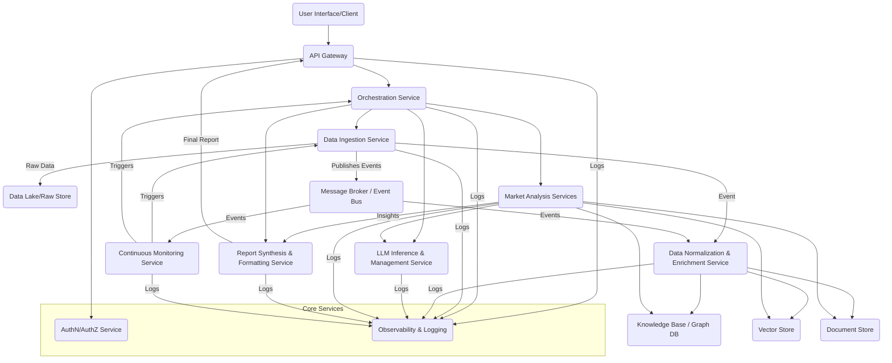

# ArchitecturalDesigner Output
**Agent**: ArchitecturalDesigner
**Execution Order**: 2
**Timestamp**: 2025-07-06 14:48:54

---

## System Architecture Design

### High-Level Architecture

The LLM-guided Gartner-style market research report generation framework will adopt a **Microservices Architecture** pattern, complemented by **Event-Driven Architecture** principles for continuous monitoring and data updates. This approach ensures modularity, scalability, and maintainability, allowing independent development, deployment, and scaling of individual components. An **API Gateway** will serve as the single entry point for external interactions.

**Overall System Design and Components:**

1.  **Client/User Interface:** Provides an intuitive interface for users to define research parameters, trigger report generation, and view/download reports. Could be a web application or an API client.
2.  **API Gateway:** Routes requests, handles authentication/authorization, and provides a unified interface to the backend microservices.
3.  **Orchestration Service:** The central workflow engine. Manages the lifecycle of report generation requests, coordinating the sequence of calls to various analysis and data services.
4.  **Data Ingestion & Management Layer:** A set of services responsible for collecting, normalizing, storing, and indexing data from diverse sources.
    *   **Data Ingestion Service:** Connects to external data sources (APIs, web scrapers, file parsers).
    *   **Data Normalization & Enrichment Service:** Cleanses, standardizes, extracts entities, and enriches raw data.
    *   **Knowledge Base / Vector Store:** Stores structured facts, relationships, and vectorized embeddings of documents for efficient retrieval.
    *   **Document Store:** Stores raw and processed unstructured/semi-structured documents.
5.  **LLM Inference & Management Service:** Centralizes interaction with various LLMs, handles prompt engineering, caching, model selection, and token management.
6.  **Market Analysis Services (Modular Microservices):** Specialized, LLM-powered services, each responsible for a specific aspect of the market research. These services utilize the LLM Inference & Management Service and query the Data Management Layer.
    *   Industry Analysis Service
    *   Competitive Landscape Service
    *   Market Trends & Future Predictions Service
    *   Technology Adoption Analysis Service
    *   Strategic Insights & Recommendations Service
    *   Personalization Service
7.  **Report Synthesis & Formatting Service:** Collects outputs from the Market Analysis Services, structures them into a cohesive "Gartner-style" report, and handles output formatting (PDF, DOCX).
8.  **Continuous Monitoring Service:** Asynchronously monitors external data sources and internal data stores for updates, triggering re-ingestion or re-analysis workflows to keep reports current.
9.  **Authentication & Authorization Service (AuthN/AuthZ):** Manages user identities, roles, and permissions across the system.
10. **Observability & Logging Service:** Provides centralized logging, monitoring, and tracing capabilities for all microservices.

**Architectural Pattern:** Microservices with Event-Driven capabilities.

### Component Design

**Core Components and their Responsibilities:**

1.  **API Gateway:**
    *   **Responsibility:** Single entry point, request routing, authentication enforcement, rate limiting, SSL termination.
    *   **Interfaces:** RESTful API for clients.
2.  **Orchestration Service:**
    *   **Responsibility:** Defines and executes report generation workflows (e.g., sequence of data collection, analysis, synthesis steps). Manages state of report generation.
    *   **Interfaces:** Internal REST/gRPC APIs to trigger and receive results from other microservices.
3.  **Data Ingestion Service:**
    *   **Responsibility:** Connects to diverse external sources (web, APIs, file systems), extracts raw data (HTML, JSON, XML, PDF, DOCX, CSV), handles initial parsing and error management. Publishes events to Message Broker upon new data.
    *   **Interfaces:** External APIs to data sources; internal API to receive data source configurations; publishes messages to Message Broker.
4.  **Data Normalization & Enrichment Service:**
    *   **Responsibility:** Consumes raw data events, performs data cleaning, standardization, schema mapping, entity extraction (NER), relationship identification, and populates the Knowledge Base, Vector Store, and Document Store.
    *   **Interfaces:** Consumes messages from Message Broker; writes to various databases.
5.  **LLM Inference & Management Service:**
    *   **Responsibility:** Provides a unified interface for interacting with various LLM providers (e.g., OpenAI, custom deployed models). Manages API keys, handles prompt templating, token counting, response parsing, and caching. Implements prompt engineering techniques (e.g., Chain-of-Thought).
    *   **Interfaces:** Internal gRPC/REST API for LLM inference requests, `(model_name, prompt, context)` as input, `(generated_text, token_usage, confidence_score)` as output.
6.  **Market Analysis Services (e.g., IndustryAnalysisService, CompetitiveLandscapeService):**
    *   **Responsibility:** Each service focuses on a specific aspect of market research. They retrieve relevant data from the Knowledge Base, Vector Store, and Document Store, construct prompts for the LLM Inference Service, process LLM outputs, and derive specific insights. They might employ agentic patterns to refine results iteratively.
    *   **Interfaces:** Internal gRPC/REST APIs (e.g., `analyze_industry(parameters)`, `map_competitors(company_list)`), returning structured JSON insights.
7.  **Report Synthesis & Formatting Service:**
    *   **Responsibility:** Receives structured insights from all Market Analysis Services. Synthesizes these insights into a coherent narrative, applies "Gartner-style" formatting, and generates the final report in requested formats (PDF, DOCX, interactive HTML).
    *   **Interfaces:** Internal gRPC/REST API (e.g., `generate_report(report_id, insights_payload, format)`).
8.  **Continuous Monitoring Service:**
    *   **Responsibility:** Periodically checks for new data in external sources or triggers based on events (e.g., new SEC filing). Initiates targeted data ingestion or re-analysis workflows via the Orchestration Service to update relevant reports.
    *   **Interfaces:** Internal API to trigger Orchestration Service; external APIs to monitor data sources.
9.  **AuthN/AuthZ Service:**
    *   **Responsibility:** Manages user authentication (e.g., OAuth2, API Keys) and authorization (Role-Based Access Control - RBAC).
    *   **Interfaces:** Internal API for token validation and permission checks.
10. **Observability Service:**
    *   **Responsibility:** Collects logs, metrics, and traces from all services. Provides dashboards for monitoring system health and performance.
    *   **Interfaces:** Standard logging frameworks (e.g., OpenTelemetry, Prometheus exporters).

**Data Flow between Components:**

1.  **Request Initiation:** User sends report generation request to **API Gateway**.
2.  **Authentication/Authorization:** **API Gateway** calls **AuthN/AuthZ Service** to validate credentials and permissions.
3.  **Orchestration Start:** **API Gateway** forwards the validated request to the **Orchestration Service**.
4.  **Data Acquisition (if needed):** **Orchestration Service** identifies required data. If new data sources are specified or updates are needed, it triggers the **Data Ingestion Service**.
5.  **Raw Data Storage:** **Data Ingestion Service** collects raw data and stores it in a **Data Lake/Raw Store**, and publishes an event to the **Message Broker**.
6.  **Data Normalization:** **Data Normalization & Enrichment Service** consumes the event, processes the raw data, and populates the **Knowledge Base**, **Vector Store**, and **Document Store**.
7.  **Analysis Task Delegation:** **Orchestration Service** dispatches parallel requests to various **Market Analysis Services** (e.g., Industry Analysis, Competitive Landscape) based on the report scope.
8.  **LLM-Powered Analysis:** Each **Market Analysis Service**:
    *   Queries **Knowledge Base**, **Vector Store**, and **Document Store** for relevant context.
    *   Constructs prompts and sends requests to the **LLM Inference & Management Service**.
    *   Processes LLM responses, applies validation, and extracts structured insights.
    *   Stores intermediate results/insights.
9.  **Report Synthesis:** Once all **Market Analysis Services** complete their tasks, the **Orchestration Service** triggers the **Report Synthesis & Formatting Service**, passing all collected insights.
10. **Report Generation:** **Report Synthesis & Formatting Service** combines insights, applies formatting, and generates the final report in the specified format.
11. **Report Delivery:** The final report is stored (e.g., in an object storage) and a link/data is returned to the **API Gateway**, which then delivers it to the user.
12. **Continuous Monitoring:** **Continuous Monitoring Service** independently monitors for new data/events. Upon detection, it triggers **Data Ingestion** and/or **Orchestration Service** to update relevant market data or regenerate reports.

### Technology Stack

*   **Programming Language:** Python (primary, due to `coding_standards.docx` and strong LLM/data ecosystem support)
    *   *Rationale:* Adheres to preferred language, rich ecosystem for AI/ML, data processing, and web development.
*   **Web Frameworks (for Microservices APIs):**
    *   FastAPI (for high performance and easy API definition with Pydantic)
    *   Flask (for simpler services)
    *   *Rationale:* Lightweight, high-performance options for building RESTful APIs.
*   **Asynchronous Task Queues/Orchestration:**
    *   Celery with RabbitMQ/Redis (for background tasks, especially data ingestion/processing)
    *   Prefect/Airflow/Kubeflow (for complex workflow orchestration, especially in Orchestration Service)
    *   *Rationale:* Robust tools for managing distributed tasks and complex pipelines.
*   **Data Processing/Manipulation:**
    *   Pandas, NumPy (for data cleaning, transformation, analysis)
    *   Scrapy / Playwright / BeautifulSoup (for web scraping in Data Ingestion)
    *   *Rationale:* Standard libraries for efficient data handling.
*   **LLM Integration:**
    *   LangChain / LlamaIndex (for LLM orchestration, RAG, agentic capabilities)
    *   OpenAI API client, Hugging Face `transformers` (for specific LLM interactions)
    *   *Rationale:* Facilitates interaction with various LLMs and implements advanced LLM patterns.
*   **Databases and Storage Solutions:**
    *   **Relational Database (e.g., PostgreSQL):** For user data, report metadata, system configuration, access control.
        *   *Rationale:* ACID compliance, strong consistency for critical metadata.
    *   **NoSQL Document Database (e.g., MongoDB / Apache Cassandra):** For raw, unstructured, and semi-structured data from diverse sources (Document Store).
        *   *Rationale:* Flexible schema, high scalability for large volumes of varied data.
    *   **Vector Database (e.g., Pinecone, Weaviate, Milvus/Zilliz, ChromaDB):** For storing embeddings of text chunks for RAG and semantic search.
        *   *Rationale:* Crucial for efficient and relevant context retrieval for LLMs.
    *   **Graph Database (e.g., Neo4j):** For Knowledge Base, representing entities and their relationships, enabling complex querying for deeper insights.
        *   *Rationale:* Highly effective for interconnected market data, competitive landscapes, and supply chains.
    *   **Object Storage (e.g., AWS S3, Azure Blob Storage):** For storing raw collected files, intermediate analysis results, and final generated reports.
        *   *Rationale:* Highly scalable, cost-effective storage for large binary objects.
*   **Message Broker / Event Bus:**
    *   Apache Kafka / RabbitMQ / AWS SQS/SNS
    *   *Rationale:* Enables asynchronous communication, decoupling services, and event-driven triggers for continuous monitoring.
*   **Containerization & Orchestration:**
    *   Docker (for containerizing microservices)
    *   Kubernetes (for container orchestration, scaling, and deployment)
    *   *Rationale:* Standard for deploying scalable microservices, ensuring portability and efficient resource management.
*   **Cloud Platform (Recommended):**
    *   AWS / Azure / GCP
    *   *Rationale:* Provides managed services for databases, message queues, serverless functions, and scalable compute (e.g., GPU instances for LLMs), reducing operational overhead.
*   **CI/CD:**
    *   GitHub Actions / GitLab CI / Jenkins
    *   *Rationale:* Automates build, test, and deployment pipelines, ensuring rapid and reliable delivery.
*   **Monitoring & Logging:**
    *   Prometheus & Grafana (for metrics and dashboards)
    *   ELK Stack (Elasticsearch, Logstash, Kibana) / Datadog / Splunk (for centralized logging and analysis)
    *   *Rationale:* Essential for observability, debugging, and performance tuning.
*   **Version Control:**
    *   Git (GitHub / GitLab / Bitbucket)
    *   *Rationale:* Standard for collaborative software development.
*   **Documentation:**
    *   Sphinx with Read the Docs (for comprehensive project and code documentation)
    *   OpenAPI/Swagger (for API documentation)
    *   *Rationale:* Aligns with `coding_standards.docx` for professional, maintainable documentation.

### Design Patterns

**Architectural Patterns Used:**

1.  **Microservices Architecture:** Decomposes the application into loosely coupled, independently deployable services, enhancing scalability, resilience, and modularity.
2.  **Event-Driven Architecture:** Uses events to communicate between services, enabling real-time data updates, continuous monitoring, and asynchronous processing, crucial for data ingestion and updates.
3.  **API Gateway Pattern:** Provides a single, unified entry point for clients, abstracting the complexity of the underlying microservices.
4.  **Service Discovery:** Allows services to find and communicate with each other dynamically.
5.  **Database per Service:** Each microservice owns its data store, promoting loose coupling and independent evolution (though shared Knowledge Base/Vector Store are centralized resources for specific purposes).
6.  **Retrieval Augmented Generation (RAG):** Within LLM-powered services, this pattern is critical. LLMs retrieve relevant data from the Vector Store/Knowledge Base before generating responses, reducing hallucinations and improving accuracy.

**Design Patterns for Implementation:**

1.  **Repository Pattern:** Abstracts data access logic from the business logic, making the system more testable and database-agnostic within each service.
2.  **Strategy Pattern:** Allows defining a family of algorithms (e.g., different LLM prompting strategies, various data source connectors, different report export formats) and encapsulating each one into a separate class, making them interchangeable.
3.  **Factory Pattern:** For creating instances of complex objects like different data source connectors or LLM model wrappers based on configuration.
4.  **Builder Pattern:** Useful for constructing complex report documents or LLM prompts incrementally with various parts.
5.  **Chain of Responsibility / Mediator Pattern:** For orchestrating complex LLM agentic workflows where multiple LLM calls and tool uses are chained or mediated.
6.  **Observer Pattern:** Key to the Event-Driven aspects, allowing services to react to events (e.g., new data ingested, analysis completed).
7.  **Circuit Breaker Pattern:** To handle failures gracefully when calling external APIs or other microservices, preventing cascading failures.
8.  **Singleton Pattern:** Potentially for managing LLM API client instances or shared configuration objects, though generally used sparingly in microservices.
9.  **Decorator Pattern:** To add functionality (e.g., logging, caching, validation) to LLM responses or data processing steps without modifying their core structure.

### Quality Attributes

**Scalability:**

*   **Microservices:** Enables independent scaling of individual components based on load (e.g., scale up LLM Inference Service during peak report generation, scale Data Ingestion based on data volume).
*   **Containerization & Orchestration (Kubernetes):** Facilitates horizontal scaling by automatically deploying more instances of services as demand increases.
*   **Distributed Databases:** Use of NoSQL, Vector, and Graph databases designed for horizontal scaling to handle increasing data volumes and query loads.
*   **Message Queues:** Decouple producer and consumer services, absorbing bursts of traffic and ensuring reliable asynchronous processing without overwhelming downstream services.
*   **Stateless Services:** Most services are designed to be stateless (where applicable), making scaling out easier.
*   **Caching:** Implemented at various levels (API Gateway, LLM Inference Service for repeated prompts/results, Data Management Layer for frequently accessed data) to reduce load on backend services and improve response times.

**Security Considerations:**

*   **Authentication & Authorization:**
    *   **API Gateway:** Enforces authentication via OAuth2/JWT tokens.
    *   **AuthN/AuthZ Service:** Centrally manages user identities, roles, and fine-grained permissions (RBAC) for accessing reports and system functionalities.
    *   **Least Privilege:** Services only have access to resources and data absolutely necessary for their function.
*   **Data Encryption:**
    *   **Data in Transit:** All communication between services and with external APIs will use TLS/SSL.
    *   **Data at Rest:** Data in all databases and object storage will be encrypted.
*   **Secure Coding Practices:** Adherence to OWASP Top 10, input validation, output encoding, parameterization of queries to prevent injection attacks.
*   **Sensitive Data Handling:**
    *   **Anonymization/Pseudonymization:** Where possible, sensitive customer data for personalization will be anonymized.
    *   **Access Control:** Strict access controls on databases containing sensitive market data or proprietary client information.
*   **API Key Management:** Secure storage and rotation of API keys for LLMs and external data sources (e.g., using a secrets manager like AWS Secrets Manager or Vault).
*   **Regular Security Audits & Penetration Testing:** To identify and remediate vulnerabilities.
*   **Compliance:** Design will consider GDPR, CCPA, and other relevant data privacy regulations, especially concerning data retention and user consent.

**Performance Optimizations:**

*   **Asynchronous Processing:** Extensive use of message queues and asynchronous programming (e.g., Python's `asyncio`) for long-running tasks like data ingestion and complex LLM analysis, preventing blocking operations.
*   **LLM Prompt Engineering:** Optimize prompts for conciseness and clarity to reduce token usage and LLM inference time.
*   **Prompt Caching:** Cache common LLM prompts and their deterministic responses to avoid redundant LLM calls.
*   **Contextual Retrieval (RAG):** Leveraging Vector Databases for fast, semantic search to provide LLMs with only the most relevant context, reducing token window usage and improving speed.
*   **Parallel Processing:** Market Analysis Services can run in parallel, significantly reducing overall report generation time.
*   **Efficient Data Structures & Algorithms:** Use of appropriate data structures for storing and querying data (e.g., Knowledge Graph for complex relationships).
*   **Resource Allocation:** Provisioning appropriate compute resources (e.g., GPUs for LLM inference) and memory for data processing.
*   **Database Indexing & Query Optimization:** Ensure all critical database queries are optimized with appropriate indexes.

**Maintainability Features:**

*   **Modular Microservices:** Clearly defined boundaries and interfaces reduce coupling, making services easier to understand, test, modify, and deploy independently.
*   **Clean Architecture Principles:** Separation of concerns (e.g., domain logic from infrastructure), promoting testability and maintainability.
*   **Comprehensive Documentation:** Adherence to `coding_standards.docx` for in-code documentation (docstrings), OpenAPI for API contracts, and Sphinx for system-level documentation.
*   **Consistent Coding Standards:** Enforcing PEP 8 and other Python best practices (`coding_standards.docx`) across the codebase.
*   **Automated Testing:** Unit tests, integration tests, and end-to-end tests for all services to ensure correctness and prevent regressions.
*   **Observability:** Centralized logging, metrics, and tracing provide insights into system behavior, simplifying debugging and performance analysis.
*   **Version Control (Git):** Facilitates collaborative development, change tracking, and rollback capabilities.
*   **Idempotent Operations:** Design services to be idempotent where possible, simplifying retry logic and error recovery.

---
*Saved by after_agent_callback on 2025-07-06 14:48:54*
