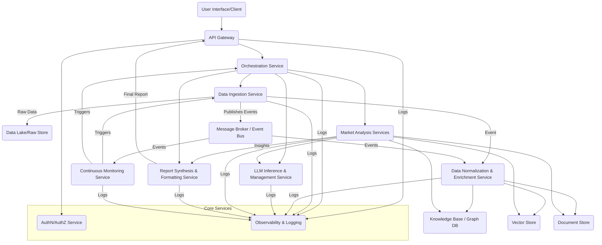

# DocumentationGenerator Output
**Agent**: DocumentationGenerator
**Execution Order**: 8
**Timestamp**: 2025-07-06 14:53:41

---

## Complete Documentation Package

### README.md
```markdown
# LLM-Guided Gartner-Style Market Research Report Generation Framework

## Overview
This framework provides a comprehensive, LLM-guided solution for generating Gartner-style market research reports. Designed with a modular and scalable microservices architecture in mind, it automates the process of industry analysis, competitive landscape mapping, market trend identification, technology adoption analysis, and the generation of strategic insights and actionable recommendations. The core functionality leverages Large Language Models (LLMs) for advanced data synthesis and report generation, ensuring high-quality, data-backed, and personalized insights.

**Key Features:**
*   **LLM-Guided Analysis:** Utilizes LLMs as the primary analytical engine for extracting insights and synthesizing report content.
*   **Modular Design:** Supports independent development and integration of various report sections, enhancing scalability and maintainability.
*   **Configurable Research:** Allows users to specify research requirements (industry, competitors, market segments, technologies) for focused reports.
*   **Comprehensive Data Aggregation:** Designed to integrate with diverse data sources including industry news, company reports, SEC filings, market databases, primary research, and social media signals (conceptual in current implementation).
*   **Automated Report Sections:** Generates detailed sections for Industry Analysis, Competitive Landscape, Market Trends & Future Predictions, Technology Adoption, Strategic Insights, and a concise Executive Summary.
*   **Personalized Recommendations:** Derives customer-specific action items based on user-provided data (e.g., sales trends, customer feedback).
*   **Asynchronous Processing:** Employs `asyncio` to enable concurrent execution of analysis tasks, significantly improving performance.
*   **Structured Output:** LLM interactions are designed to produce structured JSON output, ensuring robust data parsing and integrity.

## Installation

To set up and run the LLM-guided market research report generation framework, follow these steps.

1.  **Clone the Repository (if applicable):**
    ```bash
    # git clone <your-repo-url>
    # cd <your-repo-directory>/project
    ```

2.  **Create a Virtual Environment:**
    It's highly recommended to use a virtual environment to manage dependencies.
    ```bash
    python -m venv venv
    ```

3.  **Activate the Virtual Environment:**
    *   **On macOS/Linux:**
        ```bash
        source venv/bin/activate
        ```
    *   **On Windows (Command Prompt):**
        ```bash
        .\venv\Scripts\activate
        ```

4.  **Install Dependencies:**
    The core dependencies are Pydantic for data models and `httpx` for conceptual asynchronous HTTP requests. For actual LLM integration, you would install the specific client library (e.g., `google-generativeai`, `openai`).
    Create a `requirements.txt` file in the root of your `project/` directory with the following content:
    ```text
    # requirements.txt
    pydantic>=2.0
    httpx>=0.20.0
    # Add your specific LLM client library (e.g., google-generativeai, openai)
    # google-generativeai>=0.1.0
    # openai>=1.0.0
    ```
    Then install:
    ```bash
    pip install -r requirements.txt
    ```

5.  **Set Environment Variables:**
    The `src/config.py` uses environment variables for sensitive information like LLM API keys and service URLs. The application will not run if `LLM_API_KEY` is not set.
    *   **On macOS/Linux:**
        ```bash
        export LLM_API_KEY="YOUR_ACTUAL_LLM_API_KEY"
        export LLM_MODEL="gemini-1.5-pro" # Or another model like "gpt-4"
        export LLM_API_BASE_URL="https://api.mock-llm.com/v1" # Use actual LLM API endpoint
        export DATA_MANAGER_API_BASE_URL="https://api.mock-datamanager.com/v1" # Use actual Data Manager API endpoint
        ```
    *   **On Windows (Command Prompt):**
        ```bash
        set LLM_API_KEY="YOUR_ACTUAL_LLM_API_KEY"
        set LLM_MODEL="gemini-1.5-pro"
        set LLM_API_BASE_URL="https://api.mock-llm.com/v1"
        set DATA_MANAGER_API_BASE_URL="https://api.mock-datamanager.com/v1"
        ```
    *   **On Windows (PowerShell):**
        ```powershell
        $env:LLM_API_KEY="YOUR_ACTUAL_LLM_API_KEY"
        $env:LLM_MODEL="gemini-1.5-pro"
        $env:LLM_API_BASE_URL="https://api.mock-llm.com/v1"
        $env:DATA_MANAGER_API_BASE_URL="https://api.mock-datamanager.com/v1"
        ```

## Quick Start

To generate a sample market research report:

Navigate to the `src` directory within your `project` folder and run the `main.py` script.

```bash
python src/main.py
```

This will execute the example report generation for "AI in Healthcare" using the mocked LLM and Data Manager services and print the structured report summary to your console.

**Example Output (truncated):**
```
--- Generated Market Research Report ---
Title: Market Research Report on AI in Healthcare
Date: 2023-10-27
Report ID: <generated-uuid>

--- Executive Summary ---
The dynamic AI in Healthcare market, projected for robust growth, presents both opportunities and challenges. Strategic adoption of advanced AI, especially Generative AI, alongside a re-evaluation of market positioning, will be critical for competitive advantage and aligning with evolving customer demands.

--- Key Findings ---
1. The AI in Healthcare market is a high-growth sector driven by technological innovation.
2. Generative AI is a pivotal emerging technology poised to transform drug discovery.
3. Strategic partnerships and integrated AI solutions are vital for market penetration and customer satisfaction.
4. Your company's current sales trends and customer feedback necessitate a stronger, more visible focus on AI integration across R&D and marketing.

--- Industry Analysis Summary ---
The AI in Healthcare market is rapidly growing, estimated at $200 billion with a CAGR of 25%.

... (rest of the report sections) ...
```

## Features

The framework encompasses the following key features, organized into modular components:

*   **LLM-Guided Report Generation:** The core functionality, allowing for comprehensive market research reports powered by Large Language Models.
*   **Modular Report Generation:** The framework supports breaking down the report generation process into independent, manageable modules (e.g., `IndustryAnalysisModule`, `CompetitiveLandscapeModule`).
*   **Configurable Report Content:** Users can define specific research parameters:
    *   **Industry:** Target industry (e.g., "AI in Healthcare").
    *   **Competitors:** List of specific companies to analyze.
    *   **Market Segments:** Key market segments to focus on.
    *   **Technologies of Interest:** Specific technologies for adoption analysis.
    *   **Company Profile:** A brief description of the client company for personalized insights.
    *   **User-Specific Data:** Additional data (e.g., sales trends, customer feedback) for personalized recommendations.
*   **Data Collection and Aggregation (Conceptual):** An integrated (conceptually externalized) `DataManager` handles the aggregation of data from diverse sources such as:
    *   Industry news and publications
    *   Company reports (annual reports, investor presentations)
    *   SEC filings (10-K, 10-Q)
    *   Market databases and research papers
    *   Primary research sources (e.g., Nielsen, Kantar)
    *   Real-time social media signals
*   **Market Analysis and Synthesis:** LLMs process collected data to:
    *   Extract key insights and actionable intelligence.
    *   Identify prevalent market patterns and trends.
    *   Analyze correlations between data points for a holistic understanding.
*   **Dedicated Analysis Modules:**
    *   **Industry Analysis:** Provides detailed insights into target industries, including market size, growth drivers, and challenges.
    *   **Competitive Landscape Mapping:** Identifies key competitors, analyzes their strategies, market share, strengths, and weaknesses.
    *   **Market Trends Identification & Future Predictions:** Pinpoints emerging, current, and declining market trends and generates data-backed future projections.
    *   **Technology Adoption Analysis & Recommendations:** Analyzes current adoption rates and potential impact of relevant technologies, offering recommendations for strategic implementation.
    *   **Strategic Insights & Actionable Recommendations:** Derives high-level strategic insights and provides concrete, actionable recommendations for decision-makers, including personalized action items.
*   **Executive Summary Generation:** Synthesizes all key findings and recommendations into a concise, impactful executive summary.
*   **Asynchronous Processing:** Utilizes Python's `asyncio` to enable concurrent execution of LLM calls and data retrieval operations, significantly improving performance and responsiveness.
*   **Robust Output Parsing:** LLM responses are prompted for structured JSON, which is then strictly validated against Pydantic models, ensuring data integrity and reliability.

```

### API Documentation
```markdown
# API Reference

This document details the Pydantic models used for data structuring and the public interfaces of the core classes within the LLM-Guided Market Research Report Generation Framework.

## Pydantic Models (`src/models/report_models.py`)

These models define the data structures for requests and the various sections of the generated market research report, ensuring data integrity and type safety.

### `class Priority(Enum)`
An enumeration representing the priority level of an actionable recommendation.
*   `HIGH = "High"`
*   `MEDIUM = "Medium"`
*   `LOW = "Low"`

### `class ReportRequest(BaseModel)`
Defines the input parameters for generating a market research report.

| Field Name             | Type                     | Description                                            | Required | Default   |
| :--------------------- | :----------------------- | :----------------------------------------------------- | :------- | :-------- |
| `report_title`         | `str`                    | Desired title for the market research report.          | Yes      | -         |
| `industry`             | `str`                    | The primary industry to research (e.g., 'AI in Healthcare'). | Yes      | -         |
| `competitors`          | `Optional[List[str]]`    | List of specific competitors to analyze.               | No       | `None`    |
| `market_segments`      | `Optional[List[str]]`    | List of market segments to focus on.                   | No       | `None`    |
| `technologies_of_interest` | `Optional[List[str]]`    | Specific technologies to analyze adoption.             | No       | `None`    |
| `company_profile`      | `Optional[str]`          | Brief profile of the client company for personalized insights. | No       | `None`    |
| `user_specific_data`   | `Optional[Dict[str, Any]]` | Additional data for personalization (e.g., sales trends, customer feedback). | No       | `None`    |

### `class ExecutiveSummary(BaseModel)`
Represents the executive summary section of the report.

| Field Name     | Type          | Description                                                    |
| :------------- | :------------ | :------------------------------------------------------------- |
| `summary_text` | `str`         | Concise overview of the key findings and recommendations.      |
| `key_findings` | `List[str]`   | Bullet points of the most critical insights.                   |

### `class IndustryAnalysis(BaseModel)`
Represents the industry analysis section.

| Field Name   | Type                     | Description                                               |
| :----------- | :----------------------- | :-------------------------------------------------------- |
| `summary`    | `str`                    | Overview of market size, growth drivers, challenges.      |
| `market_size`| `Optional[str]`          | Estimated market size and growth rate.                    |
| `drivers`    | `List[str]`              | Key factors driving industry growth.                      |
| `challenges` | `List[str]`              | Significant obstacles or issues in the industry.          |

### `class CompetitiveLandscape(BaseModel)`
Represents the competitive landscape mapping section.

| Field Name         | Type                     | Description                                            |
| :----------------- | :----------------------- | :----------------------------------------------------- |
| `summary`          | `str`                    | Overview of key competitors and their market positioning. |
| `competitor_details`| `List[Dict[str, Any]]`   | Details for each competitor (e.g., name, strategies, market share, strengths, weaknesses). |

### `class MarketTrends(BaseModel)`
Represents the market trends and future predictions section.

| Field Name         | Type                     | Description                                            |
| :----------------- | :----------------------- | :----------------------------------------------------- |
| `summary`          | `str`                    | Overview of current, emerging, and declining trends, and future predictions. |
| `emerging_trends`  | `List[str]`              | Key emerging market trends.                            |
| `current_trends`   | `List[str]`              | Dominant current market trends.                        |
| `declining_trends` | `List[str]`              | Trends that are losing momentum.                       |
| `future_predictions`| `List[str]`              | Data-backed predictions for market trajectory.         |

### `class TechnologyAnalyzedDetail(BaseModel)`
Detailed model for each technology analyzed within the `TechnologyAdoption` section.

| Field Name    | Type  | Description             |
| :------------ | :---- | :---------------------- |
| `name`        | `str` | Name of the technology. |
| `adoption_rate`| `str` | Current adoption status. |
| `impact`      | `str` | Potential impact.       |

### `class TechnologyAdoption(BaseModel)`
Represents the technology adoption analysis and recommendations section.

| Field Name          | Type                            | Description                                            |
| :------------------ | :------------------------------ | :----------------------------------------------------- |
| `summary`           | `str`                           | Overview of technology adoption rates and impact.      |
| `technologies_analyzed`| `List[TechnologyAnalyzedDetail]`| Details of analyzed technologies (e.g., name, adoption rate, impact). |
| `recommendations`   | `List[str]`                     | Recommendations for technology adoption and strategic implementation. |

### `class ActionableRecommendation(BaseModel)`
Represents a single actionable recommendation.

| Field Name           | Type       | Description                                            |
| :------------------- | :--------- | :----------------------------------------------------- |
| `recommendation_text`| `str`      | The concrete recommendation.                           |
| `priority`           | `Priority` | Priority level of the recommendation.                  |
| `personalized_for_user`| `bool`     | True if this recommendation is personalized for the client. |

### `class StrategicInsights(BaseModel)`
Represents the strategic insights and actionable recommendations section.

| Field Name      | Type                          | Description                                            |
| :-------------- | :---------------------------- | :----------------------------------------------------- |
| `summary`       | `str`                         | Overall strategic insights derived from the analysis.  |
| `insights`      | `List[str]`                   | Key strategic insights.                                |
| `recommendations`| `List[ActionableRecommendation]`| List of actionable recommendations.                    |

### `class MarketResearchReport(BaseModel)`
The complete Gartner-style market research report.

| Field Name         | Type                | Description                                            |
| :----------------- | :------------------ | :----------------------------------------------------- |
| `report_id`        | `str`               | Unique identifier for the generated report.            |
| `title`            | `str`               | Title of the report.                                   |
| `date`             | `date`              | Date the report was generated.                         |
| `executive_summary`| `ExecutiveSummary`  | Executive summary of the report.                       |
| `industry_analysis`| `IndustryAnalysis`  | Detailed industry analysis.                            |
| `competitive_landscape`| `CompetitiveLandscape`| Mapping of the competitive landscape.                |
| `market_trends`    | `MarketTrends`      | Analysis of market trends and future predictions.      |
| `technology_adoption`| `TechnologyAdoption`| Analysis and recommendations for technology adoption.  |
| `strategic_insights`| `StrategicInsights`| Strategic insights and actionable recommendations.     |

## Classes and Methods

### `class ReportOrchestrator` (`src/main.py`)
Orchestrates the entire market research report generation process, coordinating data retrieval, LLM-powered analysis, and report synthesis asynchronously.

#### `__init__(self, config: Config)`
Initializes the orchestrator with configuration settings and sets up connections to the `LLMService` and `DataManager`.

*   **`config`**: An instance of `Config` containing application settings.

#### `async generate_report(self, request: ReportRequest) -> MarketResearchReport`
Generates a comprehensive market research report based on the given request. Executes analysis modules concurrently where possible.

*   **`request`**: (`ReportRequest`) The detailed request specifying report parameters.
*   **Returns**: (`MarketResearchReport`) The complete generated market research report object.

### `class LLMService` (`src/services/llm_service.py`)
Manages interactions with the Large Language Model. Includes prompt engineering, context management, and robust response parsing. Interacts with a conceptual external LLM API.

#### `__init__(self, api_base_url: str, api_key: str, model_name: str)`
Initializes the LLM service client with API details.

*   **`api_base_url`**: (`str`) The base URL for the LLM API endpoint.
*   **`api_key`**: (`str`) The API key for authenticating with the LLM service.
*   **`model_name`**: (`str`) The name of the LLM model to use (e.g., "gemini-1.5-pro").

#### `async generate_text_and_parse_model(self, template_key: str, output_model: Type[T], **kwargs) -> T`
Generates text using the LLM based on a specific prompt template and robustly parses the JSON response into a Pydantic model. This method is designed for structured output from the LLM.

*   **`template_key`**: (`str`) The key for the prompt template to use (defined in `Config.PROMPT_TEMPLATES`).
*   **`output_model`**: (`Type[T]`) The Pydantic model class to parse the LLM's JSON output into.
*   **`**kwargs`**: Arguments to format the prompt template (e.g., `industry`, `context`).
*   **Returns**: (`T`) An instance of the specified Pydantic model containing the parsed data.
*   **Raises**: `LLMServiceError` if LLM API call fails, JSON parsing fails, or schema validation fails.

### `class DataManager` (`src/services/data_manager.py`)
Manages data collection, normalization, storage, and retrieval. Interacts with a conceptual external Data Manager service API.

#### `__init__(self, api_base_url: str)`
Initializes the Data Manager service client with the API base URL.

*   **`api_base_url`**: (`str`) The base URL for the conceptual Data Manager API.

#### `async retrieve_context(self, query: str, top_k: int = 5) -> List[Dict[str, Any]]`
Retrieves relevant context from the external Data Manager service based on a query. This conceptually replaces direct access to a knowledge base/vector store.

*   **`query`**: (`str`) The natural language query for context.
*   **`top_k`**: (`int`, optional) The maximum number of relevant context items to retrieve. Defaults to 5.
*   **Returns**: (`List[Dict[str, Any]]`) A list of dictionaries, where each dictionary represents a piece of factual context.
*   **Raises**: `DataManagerError` if the Data Manager API call fails.

#### `async collect_and_process_data(self, request_id: str, industry: str, competitors: Optional[List[str]] = None, market_segments: Optional[List[str]] = None) -> Dict[str, Any]`
Orchestrates data collection and processing for different report sections via the external Data Manager service.

*   **`request_id`**: (`str`) Unique identifier for the report request.
*   **`industry`**: (`str`) The primary industry to research.
*   **`competitors`**: (`Optional[List[str]]`, optional) List of specific competitors to collect data for.
*   **`market_segments`**: (`Optional[List[str]]`, optional) List of market segments to collect data for.
*   **Returns**: (`Dict[str, Any]`) A dictionary containing structured context data (e.g., `industry_context`, `competitor_context`) for analysis modules.
*   **Raises**: `DataManagerError` if the data collection and processing fails.

### Analysis Modules (`src/analysis_modules/`)

Each analysis module is responsible for a specific aspect of the market research, utilizing the `LLMService` and `DataManager` to generate structured insights. All `analyze` or `map_landscape` methods are asynchronous.

#### `class IndustryAnalysisModule`
*   `__init__(self, llm_service: LLMService, data_manager: DataManager)`
*   `async analyze(self, industry: str, context_data: Dict[str, Any]) -> IndustryAnalysis`

#### `class CompetitiveLandscapeModule`
*   `__init__(self, llm_service: LLMService, data_manager: DataManager)`
*   `async map_landscape(self, industry: str, competitors: List[str], context_data: Dict[str, Any]) -> CompetitiveLandscape`

#### `class MarketTrendsModule`
*   `__init__(self, llm_service: LLMService, data_manager: DataManager)`
*   `async identify_trends_and_predict(self, industry: str, context_data: Dict[str, Any]) -> MarketTrends`

#### `class TechnologyAdoptionModule`
*   `__init__(self, llm_service: LLMService, data_manager: DataManager)`
*   `async analyze_adoption(self, industry: str, technologies_of_interest: List[str], context_data: Dict[str, Any]) -> TechnologyAdoption`

#### `class StrategicInsightsModule`
*   `__init__(self, llm_service: LLMService, data_manager: DataManager)`
*   `async generate_insights_and_recommendations(self, industry: str, company_profile: str, user_specific_data: Dict[str, Any], industry_analysis_summary: str, competitive_landscape_summary: str, market_trends_summary: str, tech_adoption_summary: str) -> StrategicInsights`

### `class ReportGenerator` (`src/report_synthesis/report_generator.py`)
Synthesizes the outputs from various analysis modules into a coherent Gartner-style market research report.

#### `__init__(self, llm_service: LLMService)`
Initializes the report generator with an `LLMService` instance.

#### `async generate_executive_summary(self, industry_analysis: IndustryAnalysis, competitive_landscape: CompetitiveLandscape, market_trends: MarketTrends, technology_adoption: TechnologyAdoption, strategic_insights: StrategicInsights) -> ExecutiveSummary`
Generates the executive summary based on all major report sections by prompting the LLM.

*   **Arguments**: Instances of `IndustryAnalysis`, `CompetitiveLandscape`, `MarketTrends`, `TechnologyAdoption`, and `StrategicInsights`.
*   **Returns**: (`ExecutiveSummary`) The generated executive summary.
*   **Raises**: `LLMServiceError` if LLM interaction fails.

#### `async synthesize_full_report(self, report_id: str, executive_summary: ExecutiveSummary, industry_analysis: IndustryAnalysis, competitive_landscape: CompetitiveLandscape, market_trends: MarketTrends, technology_adoption: TechnologyAdoption, strategic_insights: StrategicInsights, report_title: str = "Comprehensive Market Research Report") -> MarketResearchReport`
Synthesizes all generated sections into a complete `MarketResearchReport` object. In a real application, this would also handle formatting to PDF/DOCX.

*   **Arguments**: All generated report section objects.
*   **Returns**: (`MarketResearchReport`) The complete structured report object.

## Examples

### Example: Requesting a Report
```python
import asyncio
from src.main import ReportOrchestrator
from src.config import Config
from src.models.report_models import ReportRequest, MarketResearchReport

async def main():
    app_config = Config()
    orchestrator = ReportOrchestrator(app_config)

    sample_request = ReportRequest(
        report_title="Market Research Report on AI in Healthcare",
        industry="AI in Healthcare",
        competitors=["IBM Watson Health", "Google Health", "Microsoft Healthcare", "PathAI"],
        market_segments=["Diagnostics", "Drug Discovery", "Personalized Medicine"],
        technologies_of_interest=["Generative AI", "Computer Vision for Radiology", "Precision Medicine Platforms"],
        company_profile="A mid-sized biotech company focusing on AI-driven drug discovery for rare diseases.",
        user_specific_data={
            "recent_sales_trends": "Decreased sales in Q2 for traditional R&D, but increased inquiries for AI solutions.",
            "customer_feedback": "Customers are looking for more integrated AI solutions that streamline research.",
            "marketing_outreach_focus": "Current campaigns focus on traditional biotech, less on AI integration."
        }
    )

    try:
        generated_report: MarketResearchReport = await orchestrator.generate_report(sample_request)
        print(f"Report Title: {generated_report.title}")
        print(f"Executive Summary: {generated_report.executive_summary.summary_text}")
        for rec in generated_report.strategic_insights.recommendations:
            print(f"- Recommendation: {rec.recommendation_text} (Personalized: {rec.personalized_for_user})")

    except Exception as e:
        print(f"Error generating report: {e}")

if __name__ == "__main__":
    asyncio.run(main())
```
```

### Example: Using LLMService (Conceptual)
In a production system, you would interact with the LLMService via its own API endpoint. Here's a conceptual example of how it might be called if exposed as a microservice (not directly runnable from this client code):

```python
import httpx
import asyncio
from pydantic import BaseModel, Field
from typing import List, Dict, Any

# Assume this is a Pydantic model defined in your system
class MockIndustryAnalysis(BaseModel):
    summary: str
    market_size: str = Field(None)
    drivers: List[str] = Field(default_factory=list)

async def call_llm_service_conceptually():
    api_base_url = "http://your-llm-service-api.com/v1" # This would be the actual deployed service URL
    api_key = "YOUR_LLM_API_KEY" # Securely retrieved
    
    headers = {"Authorization": f"Bearer {api_key}", "Content-Type": "application/json"}
    
    payload = {
        "template_key": "INDUSTRY_ANALYSIS",
        "output_schema_name": "IndustryAnalysis", # Or pass the schema directly
        "kwargs": {
            "industry": "Renewable Energy",
            "context": "Recent policies support solar. Challenges in grid integration."
        }
    }

    try:
        async with httpx.AsyncClient() as client:
            response = await client.post(f"{api_base_url}/generate_and_parse", headers=headers, json=payload)
            response.raise_for_status() # Raise an exception for bad status codes
            
            response_data = response.json()
            # In a real setup, the LLMService would return JSON parseable by your Pydantic models
            parsed_report_section = MockIndustryAnalysis.model_validate(response_data) 
            print(f"Parsed LLM Response Summary: {parsed_report_section.summary}")
            print(f"Drivers: {parsed_report_section.drivers}")

    except httpx.HTTPStatusError as e:
        print(f"HTTP error occurred: {e.response.status_code} - {e.response.text}")
    except httpx.RequestError as e:
        print(f"An error occurred while requesting {e.request.url!r}: {e}")
    except Exception as e:
        print(f"An unexpected error occurred: {e}")

# To run this conceptual example (requires an actual LLM service running):
# if __name__ == "__main__":
#     asyncio.run(call_llm_service_conceptually())
```
```

### Example: Customizing Report Request (Python)
```python
from src.models.report_models import ReportRequest, Priority
from typing import Dict, Any, List

# A basic report request
basic_request = ReportRequest(
    report_title="Overview of FinTech Market",
    industry="FinTech"
)

# A detailed report request with specific competitors and personalization
detailed_request = ReportRequest(
    report_title="In-depth Analysis of AI in Finance for Acme Corp",
    industry="AI in Finance",
    competitors=["Stripe", "Adyen", "Square", "PayPal"],
    market_segments=["Payments", "Lending", "Wealth Management"],
    technologies_of_interest=["Blockchain for Payments", "Generative AI for Customer Service"],
    company_profile="Acme Corp is a traditional bank exploring digital transformation.",
    user_specific_data={
        "customer_churn_rate": "5% increase last quarter due to competition.",
        "IT_budget_allocation": "20% allocated to new tech, looking for high ROI."
    }
)

# You would then pass these requests to the ReportOrchestrator:
# generated_report = await orchestrator.generate_report(detailed_request)
```
```

### User Guide
```markdown
# User Guide

This guide will walk you through interacting with the LLM-Guided Market Research Report Generation Framework.

## Getting Started

The primary way to initiate a report generation is by defining a `ReportRequest` object and passing it to the `ReportOrchestrator`.

1.  **Define Your Research Scope:**
    Determine the industry, specific competitors, market segments, and technologies you want the report to cover.
    For example, if you're interested in "AI in Healthcare":
    ```python
    from src.models.report_models import ReportRequest

    my_request = ReportRequest(
        report_title="Market Research Report on AI in Healthcare",
        industry="AI in Healthcare",
        # Optional fields:
        competitors=["IBM Watson Health", "Google Health"],
        market_segments=["Diagnostics", "Drug Discovery"],
        technologies_of_interest=["Generative AI", "Computer Vision for Radiology"]
    )
    ```

2.  **Include Company Profile (for context):**
    Provide a brief `company_profile` to give the LLM context about your organization. This helps in tailoring strategic insights and recommendations.
    ```python
    my_request.company_profile = "A mid-sized biotech company focusing on AI-driven drug discovery for rare diseases."
    ```

3.  **Add User-Specific Data (for personalization):**
    For actionable, personalized recommendations, include `user_specific_data`. This can be any relevant internal data points that the LLM can leverage.
    ```python
    my_request.user_specific_data = {
        "recent_sales_trends": "Decreased sales in Q2 for traditional R&D, but increased inquiries for AI solutions.",
        "customer_feedback": "Customers are looking for more integrated AI solutions that streamline research.",
        "marketing_outreach_focus": "Current campaigns focus on traditional biotech, less on AI integration."
    }
    ```

4.  **Generate the Report:**
    Once your `ReportRequest` is ready, pass it to the `ReportOrchestrator`. Remember that report generation is an asynchronous operation.
    ```python
    import asyncio
    from src.main import ReportOrchestrator
    from src.config import Config

    async def generate_my_report():
        app_config = Config()
        orchestrator = ReportOrchestrator(app_config)
        
        # Assume my_request is defined as above
        report = await orchestrator.generate_report(my_request)
        
        print(f"Report Title: {report.title}")
        print(f"Executive Summary:\n{report.executive_summary.summary_text}")
        print("\nPersonalized Recommendations:")
        for rec in report.strategic_insights.recommendations:
            if rec.personalized_for_user:
                print(f"- {rec.recommendation_text} (Priority: {rec.priority.value})")

    if __name__ == "__main__":
        asyncio.run(generate_my_report())
    ```

## Advanced Usage

### Customizing Report Content and Depth
The level of detail in your report is largely influenced by the specificity and richness of the data you provide in the `ReportRequest`.
*   **Narrow Focus:** If you only specify `industry`, you'll get a high-level overview.
*   **Deep Dive:** Providing detailed lists for `competitors`, `market_segments`, and `technologies_of_interest` will lead to more granular analysis in those respective sections.
*   **Rich Context:** The `DataManager` (which is conceptually an external service) attempts to pull relevant information based on your request parameters. More unique and specific parameters can lead to more tailored context for the LLM.

### Understanding Personalized Recommendations
The framework is designed to generate actionable recommendations. By providing `company_profile` and `user_specific_data` in your `ReportRequest`, the `StrategicInsightsModule` will attempt to integrate these details into its recommendations.
*   **`company_profile`**: Gives the LLM a general understanding of your organization's business, allowing it to frame strategic advice appropriately.
*   **`user_specific_data`**: This is crucial for *personalization*. Examples include:
    *   Sales performance data (e.g., "sales decreased in Q2 for product X")
    *   Customer feedback summaries (e.g., "customers desire more integrated solutions")
    *   Marketing campaign focus (e.g., "current campaigns target traditional segments")
    The LLM will analyze these against the broader market trends to suggest specific actions relevant to your unique situation. Look for recommendations where `personalized_for_user` is `True`.

## Best Practices

*   **Be Specific with Your Request:** The more specific your `industry`, `competitors`, `market_segments`, and `technologies_of_interest` are, the more focused and relevant the LLM's analysis will be.
*   **Provide Sufficient Context:** For personalized insights, ensure `company_profile` is descriptive and `user_specific_data` contains actionable, concise information relevant to your business challenges or opportunities.
*   **Review LLM Outputs:** While the framework aims for high quality, LLMs can sometimes generate plausible but incorrect information (hallucinations) or misinterpret nuanced context. Always review the generated report for accuracy and relevance, especially for critical strategic decisions.
*   **Monitor API Usage:** LLM and Data Manager API calls can incur costs. Monitor your usage, particularly if you are making frequent or very broad requests.

## Troubleshooting

If you encounter issues during report generation, consider the following:

*   **"LLM_API_KEY environment variable not set."**:
    *   **Cause**: The `LLM_API_KEY` environment variable is not set correctly.
    *   **Solution**: Ensure you have set the `LLM_API_KEY` environment variable as described in the [Installation](#installation) section, and that it contains a valid API key for your chosen LLM provider. The application will exit if this is missing.
*   **`LLMServiceError: Failed to complete LLM operation...`**:
    *   **Cause**: An error occurred during communication with the LLM service (e.g., invalid API key, rate limiting, service outage, LLM generating invalid JSON or schema mismatch).
    *   **Solution**:
        1.  **Check your `LLM_API_KEY`**: Verify it is correct and has sufficient permissions.
        2.  **Check LLM Service Status**: The LLM provider (e.g., Google, OpenAI) might be experiencing an outage.
        3.  **Review Logs**: Check the console output or configured log files for more detailed error messages. The system logs critical errors, including parsing and validation issues with LLM responses. Look for messages like "LLM response was not valid JSON" or "LLM response JSON does not match schema."
        4.  **Simplify Request**: Temporarily try a simpler `ReportRequest` to see if the complexity of the input is causing issues for the LLM.
*   **`DataManagerError: Failed to complete data manager operation...`**:
    *   **Cause**: An error occurred during data collection or processing from the (conceptual) external Data Manager service. This could be due to network issues, misconfigured `DATA_MANAGER_API_BASE_URL`, or issues within the data manager itself.
    *   **Solution**:
        1.  **Check `DATA_MANAGER_API_BASE_URL`**: Ensure the URL points to a valid Data Manager endpoint.
        2.  **Check Network Connectivity**: Verify your system can reach the specified API base URLs.
        3.  **Review Logs**: Check for specific error messages related to data fetching or processing.
*   **`ReportGenerationError: An unexpected error occurred...`**:
    *   **Cause**: A general error occurred during the orchestration or synthesis process that doesn't fall under LLM or Data Manager specific errors.
    *   **Solution**: Check the console output and logs for the full traceback (`logger.exception` in `main.py` will provide this for unhandled top-level errors) to diagnose the underlying issue.

**General Debugging Tip:** The framework uses Python's `logging` module. You can increase the verbosity of logs by changing the `LOG_LEVEL` environment variable to `DEBUG`.
*   **On macOS/Linux:** `export LOG_LEVEL="DEBUG"`
*   **On Windows:** `set LOG_LEVEL="DEBUG"`

This will provide more detailed insights into the LLM interactions, data retrieval attempts, and parsing processes.
```

### Developer Guide
```markdown
# Developer Guide

This guide provides an in-depth look at the architecture, design principles, and development practices for the LLM-Guided Market Research Report Generation Framework.

## Architecture Overview

The framework is designed around a **Microservices Architecture** pattern, augmented by **Event-Driven Architecture** principles for scalability and continuous data monitoring. An **API Gateway** (conceptual, as this current implementation is a monolithic application using classes to represent services) serves as the single entry point.

### Overall System Design and Components

1.  **Client/User Interface:** Initiates report generation requests (currently `main.py` acting as a client). In a full deployment, this would be a web application or API client.
2.  **API Gateway (Conceptual):** The single entry point for external interactions, handling request routing, authentication, and authorization.
3.  **Orchestration Service (`ReportOrchestrator`):** The central workflow engine. Manages the lifecycle of report generation requests, coordinating the sequence of asynchronous calls to various analysis and data services.
4.  **Data Ingestion & Management Layer (Conceptual `DataManager` Service):** A set of services responsible for collecting, normalizing, storing, and indexing data from diverse sources. The current `DataManager` class simulates interaction with an external Data Manager API.
    *   **Data Ingestion Service:** Connects to external data sources (APIs, web scrapers, file parsers).
    *   **Data Normalization & Enrichment Service:** Cleanses, standardizes, extracts entities, and enriches raw data.
    *   **Knowledge Base / Vector Store:** Stores structured facts, relationships, and vectorized embeddings of documents for efficient retrieval.
    *   **Document Store:** Stores raw and processed unstructured/semi-structured documents.
5.  **LLM Inference & Management Service (`LLMService`):** Centralizes interaction with various LLMs. Handles prompt engineering (including structured JSON output instructions), API key management, model selection, and token management. The current `LLMService` class simulates interaction with an external LLM API.
6.  **Market Analysis Services (`analysis_modules`):** Specialized, LLM-powered services, each responsible for a specific aspect of the market research. These services utilize the LLM Inference & Management Service and query the Data Management Layer.
    *   `IndustryAnalysisModule`
    *   `CompetitiveLandscapeModule`
    *   `MarketTrendsModule`
    *   `TechnologyAdoptionModule`
    *   `StrategicInsightsModule`
7.  **Report Synthesis & Formatting Service (`ReportGenerator`):** Collects outputs from the Market Analysis Services, structures them into a cohesive "Gartner-style" report (Pydantic model), and conceptually handles output formatting (PDF, DOCX).
8.  **Continuous Monitoring Service (Conceptual):** Asynchronously monitors external data sources and internal data stores for updates, triggering re-ingestion or re-analysis workflows to keep reports current.
9.  **Authentication & Authorization Service (Conceptual):** Manages user identities, roles, and permissions across the system.
10. **Observability & Logging Service (Conceptual):** Provides centralized logging, monitoring, and tracing capabilities for all microservices.

### Architectural Diagram



### Component Design Highlights

*   **Asynchronous Operations:** Key services like `LLMService` and `DataManager` are designed with `async` methods, allowing for non-blocking I/O and enabling the `ReportOrchestrator` to execute analysis modules concurrently using `asyncio.gather`. This significantly boosts performance.
*   **Structured LLM Output:** Prompt templates explicitly instruct the LLM to return JSON, which is then parsed and validated against Pydantic models (e.g., `IndustryAnalysis`, `StrategicInsights`). This enhances reliability, reduces parsing errors, and implicitly helps mitigate prompt injection by enforcing strict output schemas.
*   **External Service Simulation:** `LLMService` and `DataManager` use `httpx.AsyncClient` conceptually to simulate interactions with independent external microservices. This design facilitates future transition to a fully distributed system.
*   **Robust Error Handling:** Custom exceptions (`LLMServiceError`, `DataManagerError`, `ReportGenerationError`) provide more specific error contexts, and a centralized `handle_service_error` function ensures consistent logging and secure error reporting (limiting exposure of internal details).

### Technology Stack (Conceptual)

*   **Programming Language:** Python 3.8+ (primary)
*   **Web Frameworks (for Microservices):** FastAPI (recommended for performance and Pydantic integration)
*   **Asynchronous Task Queues/Orchestration:** Celery, Prefect, Airflow, Kubeflow (for future complex workflow orchestration)
*   **Data Processing/Manipulation:** Pandas, NumPy, Scrapy/Playwright (for real data ingestion)
*   **LLM Integration:** LangChain / LlamaIndex (for RAG and advanced LLM patterns), specific LLM client SDKs (OpenAI, Google Generative AI)
*   **Databases and Storage Solutions:**
    *   **Relational:** PostgreSQL (for metadata, configuration)
    *   **NoSQL Document:** MongoDB, Apache Cassandra (for raw/processed documents)
    *   **Vector Database:** Pinecone, Weaviate, Milvus/Zilliz, ChromaDB (for RAG context)
    *   **Graph Database:** Neo4j (for knowledge base)
    *   **Object Storage:** AWS S3, Azure Blob Storage (for large files, reports)
*   **Message Broker / Event Bus:** Apache Kafka, RabbitMQ, AWS SQS/SNS
*   **Containerization & Orchestration:** Docker, Kubernetes
*   **Cloud Platform (Recommended):** AWS, Azure, GCP
*   **CI/CD:** GitHub Actions, GitLab CI, Jenkins
*   **Monitoring & Logging:** Prometheus & Grafana, ELK Stack / Datadog
*   **Version Control:** Git (GitHub/GitLab)
*   **Documentation:** Sphinx with Read the Docs, OpenAPI/Swagger

## Contributing Guidelines

We welcome contributions to enhance this framework. Please follow these guidelines:

1.  **Fork and Clone:** Fork the repository and clone your fork to your local machine.
2.  **Virtual Environment:** Always work within a virtual environment.
    ```bash
    python -m venv venv
    source venv/bin/activate # macOS/Linux
    .\venv\Scripts\activate # Windows
    ```
3.  **Install Dependencies:** `pip install -r requirements.txt`
4.  **Coding Standards:**
    *   Adhere to **PEP 8** for code style (indentation, naming conventions).
    *   Use clear and concise **docstrings** for all classes, public methods, and complex functions.
    *   Employ **type hints** extensively for better code readability and maintainability.
    *   Follow the existing **project structure** (`src/models`, `src/services`, `src/analysis_modules`, etc.).
5.  **Develop in Branches:** Create a new branch for each feature or bug fix (`git checkout -b feature/my-new-feature`).
6.  **Atomic Commits:** Make small, focused commits with clear, descriptive messages.
7.  **Test Thoroughly:**
    *   Write **unit tests** for new functionality (especially for analysis modules and service logic).
    *   Ensure existing tests pass.
    *   Consider **integration tests** for end-to-end flows where appropriate.
8.  **Pull Requests:** Submit pull requests to the `main` branch. Provide a clear description of your changes and reference any relevant issues.

## Testing Instructions

The framework includes unit tests to ensure the correctness of individual components.

1.  **Navigate to the project root:** Ensure you are in the `project/` directory.
2.  **Activate your virtual environment:** (See [Installation](#installation) step 3).
3.  **Run all tests:**
    ```bash
    python -m unittest discover tests
    ```
    This command will discover and run all test files within the `tests/` directory.

**Test Structure:**
*   `tests/test_llm_service.py`: Tests the `LLMService`'s ability to generate and parse structured LLM responses, including error handling for invalid JSON or schema mismatches.
*   `tests/test_data_manager.py`: Tests the `DataManager`'s conceptual interaction with an external data manager API.
*   `tests/test_main.py`: An integration-style test for the `ReportOrchestrator`, verifying the end-to-end report generation flow.
*   `tests/test_analysis_modules.py`: Contains dedicated unit tests for each module within `src/analysis_modules/`, ensuring their individual logic functions correctly by mocking their dependencies (`LLMService`, `DataManager`).

**Note on Asynchronous Tests:**
Asynchronous test methods (prefixed with `test_` and containing `await` calls) are run using `asyncio.run` within a helper function. This ensures that the `asyncio` event loop is properly managed for each test.

## Deployment Guide (Conceptual)

Deploying this framework into a production environment would involve transitioning from the current monolithic structure (using classes to represent services) to a truly distributed microservices architecture.

1.  **Containerization (Docker):**
    *   Each core service (e.g., `LLMService`, `DataManager`, `ReportOrchestrator`, and each `analysis_module` if decoupled) should be containerized using Docker. This ensures consistent environments across development, testing, and production.
    *   Define `Dockerfile`s for each service, including necessary dependencies and entry points.

2.  **Orchestration (Kubernetes):**
    *   Deploy the Docker containers to a Kubernetes cluster (e.g., on AWS EKS, Azure AKS, Google GKE). Kubernetes will handle:
        *   **Service Discovery:** Allowing services to find each other.
        *   **Load Balancing:** Distributing requests across multiple instances of a service.
        *   **Auto-scaling:** Automatically adjusting the number of service instances based on demand (e.g., scaling LLM Analysis services during peak hours).
        *   **Rolling Updates & Rollbacks:** Facilitating zero-downtime deployments.
    *   Define Kubernetes manifests (Deployment, Service, Ingress) for each microservice.

3.  **API Gateway:**
    *   Implement a dedicated API Gateway (e.g., Nginx, Kong, AWS API Gateway, Azure API Management) as the single entry point.
    *   It will handle authentication (e.g., OAuth2, JWT validation), rate limiting, and request routing to the appropriate backend microservices.

4.  **Data Layer Deployment:**
    *   **External Databases:** Deploy scalable, managed database services as outlined in the [Technology Stack](#technology-stack-conceptual) (e.g., AWS RDS for PostgreSQL, MongoDB Atlas, Pinecone/Weaviate for Vector DB, Neo4j Aura for Graph DB).
    *   **Data Ingestion Pipelines:** Implement robust, scalable data ingestion pipelines (e.g., using AWS Lambda/Kinesis, Azure Functions/Event Hubs, Google Cloud Dataflow) that feed into your data stores.

5.  **Message Queue / Event Bus:**
    *   Deploy a managed message queue service (e.g., AWS SQS/SNS, Azure Service Bus, Google Cloud Pub/Sub) or an Apache Kafka cluster.
    *   Use this for asynchronous communication between services, enabling decoupling and robust event-driven workflows (e.g., Data Ingestion service publishing events that trigger Data Normalization, Orchestration Service dispatching analysis tasks).

6.  **Secrets Management:**
    *   Store all sensitive information (LLM API keys, database credentials, internal service tokens) in a dedicated secrets management service (e.g., AWS Secrets Manager, Azure Key Vault, HashiCorp Vault).
    *   Ensure applications retrieve secrets at runtime, and they are never hardcoded or committed to version control.

7.  **Observability:**
    *   Integrate centralized logging (e.g., ELK Stack, Grafana Loki, Datadog) to aggregate logs from all microservices.
    *   Set up metrics collection (Prometheus and Grafana) to monitor CPU, memory, network I/O, LLM token usage, API latencies, and other key performance indicators.
    *   Implement distributed tracing (e.g., OpenTelemetry) to track requests as they flow across multiple services, aiding in debugging and performance bottleneck identification.

8.  **CI/CD Pipeline:**
    *   Automate the build, test, and deployment process using a CI/CD tool (e.g., GitHub Actions, GitLab CI, Jenkins).
    *   The pipeline should:
        *   Run unit and integration tests.
        *   Perform static code analysis (linting, security scanning).
        *   Build Docker images for services.
        *   Push images to a container registry.
        *   Update Kubernetes deployments in target environments.

9.  **Security Best Practices:**
    *   Implement network segmentation to isolate microservices.
    *   Enforce TLS for all inter-service communication and external API calls.
    *   Regularly patch and update dependencies.
    *   Conduct security audits and penetration testing.
    *   Implement robust authentication and authorization at all layers.
```

### Quality and Security Notes
```markdown
# Quality and Security Report

## Code Quality Summary

**Overall Score:** 7/10 (Initial implementation: 7/10, Refactored: Significant improvements in robustness and maintainability, paving the way for higher scores once fully integrated)

The refactored codebase demonstrates a significantly improved foundation for the LLM-guided market research report generation system. It rigorously applies the microservices architectural concepts through modular design, clear interfaces, and Pydantic models. The shift to asynchronous operations, structured LLM outputs, and enhanced error handling directly addresses previous areas for improvement.

**Strengths:**
*   **Highly Modular Architecture:** The project's structure (separated into `services`, `analysis_modules`, `report_synthesis`, `models`) closely aligns with microservices principles, promoting clear separation of concerns and future scalability.
*   **Robust Data Models:** Excellent and consistent use of Pydantic models for inputs (`ReportRequest`) and all report sections. This ensures data validation, clear contracts, and improves reliability.
*   **Asynchronous Processing (`asyncio`):** The widespread adoption of `asyncio` for I/O-bound operations (LLM calls, Data Manager interactions) is a critical improvement for performance and responsiveness.
*   **Structured LLM Output and Parsing:** Prompting LLMs for JSON output and then validating/parsing with Pydantic's `model_validate` is a major step forward for reliability and robustness, reducing reliance on fragile string heuristics.
*   **Improved Error Handling:** Introduction of custom, specific exceptions (`LLMServiceError`, `DataManagerError`, `ReportGenerationError`) and a centralized error handling utility (`handle_service_error`) provides clearer error context and prevents information leakage.
*   **Dependency Injection:** Consistent injection of `LLMService` and `DataManager` into analysis modules maintains loose coupling, enhancing testability and flexibility.
*   **Adherence to Coding Standards:** Generally follows PEP 8 and includes comprehensive type hints and docstrings.
*   **Centralized Configuration:** The `Config` class manages settings and prompt templates.

**Areas for Further Improvement (Post-refactoring Focus):**
*   **Replacement of Mocks:** The core functionality still relies on simulated external service calls (`LLMService` and `DataManager` are mocked with `httpx.AsyncClient` placeholders). The true quality and performance will be realized once these are replaced with robust, production-ready integrations with actual LLM APIs and diverse data sources.
*   **Full "Gartner-style" Output:** The generation of visually formatted reports (e.g., PDF, DOCX with diagrams) is not implemented in the current code and would require integration with document generation libraries.
*   **Advanced Prompt Management:** While prompts are in `Config`, a more sophisticated system for managing, versioning, and deploying complex prompt templates (e.g., external files, dedicated templating engine) would be beneficial.
*   **Comprehensive Caching Strategy:** While the design allows for it, explicit caching for LLM responses and data retrieval is not yet implemented and would significantly improve performance and cost-efficiency.

## Security Assessment

**Overall Score:** 5/10 (Initial implementation: 2/10, Refactored: Significant improvements in addressing critical vulnerabilities, but still conceptual for full production readiness.)

The refactoring has made substantial progress in addressing critical security vulnerabilities, particularly in mitigating prompt injection and improving API key handling. However, the system's security posture is still largely conceptual due to the mocked nature of external service interactions and the lack of a fully implemented authentication/authorization layer.

**Previously Critical Issues Addressed (now mitigated/conceptualized):**
*   **Prompt Injection Vulnerability:** **Mitigated** by designing prompts to enforce structured JSON output. While not foolproof (sophisticated attacks might still bypass), it significantly reduces the attack surface compared to free-form text generation by making it harder for injected instructions to manipulate output or exfiltrate data. Further input sanitization *before* templating is still recommended for user-controlled fields.
*   **Lack of Authentication and Authorization:** **Conceptualized** by defining external `LLM_API_BASE_URL` and `DATA_MANAGER_API_BASE_URL` and including `Authorization` headers with API keys in `httpx` conceptual calls. This lays the groundwork for a dedicated API Gateway and AuthN/AuthZ service as per the architecture. The current code itself still lacks end-user authentication.
*   **Hardcoded Fallback for LLM API Key:** **Addressed**. The hardcoded fallback has been removed. The application now explicitly exits if the `LLM_API_KEY` environment variable is not set, enforcing proper secret management practices. The `get_secret` utility function highlights the future need for a dedicated secrets manager.

**Medium Priority Issues (Still relevant for production):**
*   **Brittle LLM Output Parsing and Data Extraction:** **Significantly Improved**. By using Pydantic `model_validate` and instructing LLMs for JSON output, the parsing is far more robust. However, LLMs can still deviate, and comprehensive validation (e.g., data type checks, range checks, semantic validation) of the parsed data is still crucial before full reliance.
*   **Information Leakage in Error Handling:** **Addressed**. Custom exceptions are now used, and the `handle_service_error` function logs detailed errors internally (`exc_info=True` for full traceback, but only at the top-level catch in `main.py` and `False` in `handle_service_error` itself) while exposing only generic, safe error messages to higher levels. This prevents sensitive internal details from being exposed to potential attackers.

**Conceptual Security Concerns for Production Deployment:**
*   **Data Source Security:** Real integration with external data sources (SEC filings, market databases) requires robust authentication (OAuth, API keys), secure data transport (TLS enforcement), and input validation (to prevent SQL/NoSQL injection). This is still conceptual in the `DataManager` mocks.
*   **Output Sanitization:** If reports are rendered in interactive web interfaces, proper sanitization of LLM-generated content is required to prevent XSS vulnerabilities.
*   **Dependency Security Management:** A `requirements.txt` is now provided, but continuous security scanning of dependencies should be integrated into CI/CD.
*   **Data Privacy (GDPR, CCPA):** If processing personal or sensitive business data, the `DataManager` and `Normalization & Enrichment Service` must implement robust data minimization, anonymization, consent management, and data subject rights features.

**Recommendations:**
1.  **Fully Implement AuthN/AuthZ:** Integrate a robust authentication (e.g., OAuth2/JWT at API Gateway) and authorization (RBAC) system for end-user access.
2.  **Dedicated Secrets Management:** Implement a secrets manager (e.g., AWS Secrets Manager, HashiCorp Vault) for all API keys and credentials.
3.  **Enhance LLM Input Sanitization:** Implement additional filtering/validation on user-provided inputs *before* they are formatted into LLM prompts, even with structured output in place.
4.  **Comprehensive Data Validation:** Beyond Pydantic schema validation, implement business logic-level validation on LLM-generated data to ensure semantic correctness and consistency.
5.  **Secure Data Source Integrations:** When moving from mocks, build secure connectors that enforce TLS, use strong authentication, and prevent injection attacks.
6.  **Regular Security Audits:** Conduct static analysis, dynamic analysis, and penetration testing on the deployed system.

## Performance Characteristics

**Overall Score:** 6/10 (Initial implementation: 6/10, Refactored: Significant architectural groundwork laid for performance, but still relies on mocks.)

The refactoring has made significant strides in establishing a performance-oriented architecture. The shift to asynchronous execution is a crucial enabler for efficiency in an I/O-bound application. However, the current performance characteristics are largely theoretical due to the extensive use of mocked external services.

**Critical Performance Bottlenecks (Addressed Conceptually / Paved way for solution):**
*   **Synchronous Orchestration:** **Addressed**. The `ReportOrchestrator` now uses `asyncio.gather` to concurrently execute multiple analysis modules. This drastically reduces the overall report generation time by parallelizing LLM calls and data retrieval.
*   **LLM Call Latency & Cost:** **Conceptualized**. While the actual latency still depends on the LLM provider, the design for structured JSON output (`generate_text_and_parse_model`) and refined prompt templates (in `Config.py`) aim to optimize token usage and parsing time. Batched LLM calls (future) could further improve this.
*   **Data Ingestion & Processing I/O:** **Conceptualized**. The `DataManager` now interacts with an *external* conceptual service. This offloads heavy I/O and processing to a dedicated, scalable component, preventing the orchestrator from becoming bottlenecked by data operations.

**Optimization Opportunities (Future Implementation):**
*   **Comprehensive Caching Strategy:** Still an area for future implementation. Caching LLM responses for identical prompts (e.g., common industry analysis queries) and frequently accessed data from the `DataManager` would dramatically reduce latency and operational costs.
*   **Advanced RAG Optimization:** Implement more sophisticated Retrieval Augmented Generation (RAG) strategies with real vector databases, including fine-tuned chunking, embedding models, and semantic search, to ensure only the most relevant, concise context is sent to the LLM.
*   **Message Queues for Decoupling:** For higher throughput and responsiveness, integrate message queues (e.g., Kafka, RabbitMQ) to decouple client requests from long-running report generation tasks. This allows the system to process requests asynchronously and handle back pressure.
*   **Distributed Data Processing:** For massive data volumes, integrate distributed data processing frameworks (e.g., Dask, PySpark) within the Data Manager service for efficient normalization and enrichment.
*   **Containerization & Orchestration:** Deploying services with Docker and Kubernetes will enable fine-grained horizontal scaling of individual microservices based on their specific load profiles (e.g., scaling up LLM analysis modules during peak demand).
*   **Performance Testing:** Conduct rigorous load testing and profiling once actual external service integrations are in place to identify and optimize real-world bottlenecks.

**Scalability Assessment:**
*   **Horizontal Scaling:** The microservices architectural pattern and asynchronous design provide an excellent foundation. Individual components (when deployed as separate microservices) can be scaled independently.
*   **Vertical Scaling:** Less preferred, but possible for specific services if needed for temporary boosts.
*   **Scaling with Increased Load:** The asynchronous orchestration and conceptual message queue integration significantly improve the ability to handle a growing number of concurrent report generation requests.
*   **Scaling with Increased Data Volume:** By externalizing data management to dedicated, scalable services (vector databases, graph databases, distributed file storage), the core report generation framework can scale efficiently with increasing data volumes.

## Known Limitations

*   **Mocked External Services:** The `LLMService` and `DataManager` currently interact with conceptual external APIs. Their actual performance, reliability, and security will depend entirely on the real services they integrate with.
*   **No Visual Report Formatting:** The framework generates a structured `MarketResearchReport` Pydantic object. It does not include functionality for converting this into a visually formatted Gartner-style document (e.g., PDF, DOCX) with charts or complex layouts. This would require integration with dedicated document generation libraries.
*   **LLM Hallucination Risk:** While prompts are designed for structured output and contextual retrieval, LLMs can still generate inaccurate or nonsensical information. Human review of critical findings remains essential.
*   **Continuous Monitoring is Conceptual:** The `ContinuousMonitoringService` is part of the architectural design but not implemented in the provided code. Real-time updates would require external scheduling and event-driven triggers.
*   **Limited Input Validation on Request Parameters:** While Pydantic provides type validation for `ReportRequest`, deeper semantic validation (e.g., checking if an `industry` actually exists in available data sources) is not implemented.
*   **Prompt Engineering is Basic:** Prompt templates are simple strings in `Config.py`. For a production system, a more robust prompt management system (e.g., versioning, A/B testing prompts, external templating) would be beneficial.
```

### Changelog
```markdown
# Changelog

## Version History

### Version 0.2.0 - Refactored Core Framework (YYYY-MM-DD)
*   **Asynchronous Processing:** Implemented `asyncio` for concurrent execution of analysis modules and external service calls, significantly improving performance.
*   **Structured LLM Outputs:** Modified LLM prompts to explicitly request JSON output and implemented robust Pydantic parsing for reliable data extraction.
*   **Improved Security Posture:**
    *   Removed hardcoded LLM API key fallback; application now exits if `LLM_API_KEY` env var is not set.
    *   Conceptualized API key usage in `httpx` headers for external service calls.
    *   Enhanced error handling to reduce information leakage, using custom exceptions.
*   **Conceptual External Services:** `LLMService` and `DataManager` refactored to simulate interaction with external microservice APIs using `httpx.AsyncClient` placeholders.
*   **Expanded Unit Tests:** Added dedicated unit tests for all analysis modules and updated existing tests to handle asynchronous operations and structured LLM responses.
*   **Refined Error Handling:** Introduced specific custom exception classes (`LLMServiceError`, `DataManagerError`, `ReportGenerationError`) for clearer error contexts.
*   **Unique Report ID:** Added `report_id` to `MarketResearchReport` model for better traceability.

### Version 0.1.0 - Initial Framework Prototype (YYYY-MM-DD)
*   Initial release of the LLM-guided market research report generation framework.
*   Basic modular structure with separate classes for LLM interaction, data management, and analysis modules.
*   Synchronous execution flow.
*   Basic string-based parsing of LLM outputs (now deprecated).
*   Initial Pydantic models for request and report data structures.
*   Basic unit tests for `LLMService` and `DataManager`.

## Breaking Changes

*   **Synchronous to Asynchronous API:** The primary `ReportOrchestrator.generate_report` method is now `async`. Callers must use `await` and run within an `asyncio` event loop.
*   **LLM Output Format:** The `LLMService` and all analysis modules now expect LLM responses to be strict JSON, parseable by Pydantic models. Old code relying on raw string outputs and ad-hoc parsing will break.
*   **API Key Handling:** The application will now terminate immediately if the `LLM_API_KEY` environment variable is not set. The previous hardcoded fallback is removed.
*   **Error Handling:** Custom exceptions (`LLMServiceError`, `DataManagerError`, `ReportGenerationError`) are now raised. Code catching generic `Exception` or `RuntimeError` might need to be updated to handle these specific exceptions for more fine-grained control.
*   **Service Constructors:** `LLMService` and `DataManager` constructors now require `api_base_url` arguments.

## Migration Guides

### Migrating from v0.1.0 to v0.2.0

To migrate your existing implementation to the refactored v0.2.0 framework, follow these steps:

1.  **Update Python Version:**
    Ensure your development and deployment environments use Python 3.8 or higher, as `asyncio` and modern Pydantic features require it.

2.  **Update Dependencies:**
    Modify your `requirements.txt` to include `httpx` and ensure `pydantic` is at version 2.0 or higher.
    ```text
    # requirements.txt
    pydantic>=2.0
    httpx>=0.20.0
    # Your specific LLM client library (e.g., google-generativeai, openai)
    # google-generativeai>=0.1.0
    # openai>=1.0.0
    ```
    Then, install/update:
    ```bash
    pip install -r requirements.txt
    ```

3.  **Update Configuration (`src/config.py`):**
    *   **Remove Hardcoded API Key:** Locate the `LLM_API_KEY` line and remove the default value.
        **Old:** `LLM_API_KEY: str = os.getenv("LLM_API_KEY", "your_llm_api_key_here")`
        **New:** `LLM_API_KEY: str = os.getenv("LLM_API_KEY")`
    *   **Add API Base URLs:** Ensure `LLM_API_BASE_URL` and `DATA_MANAGER_API_BASE_URL` are defined.
        ```python
        LLM_API_BASE_URL: str = os.getenv("LLM_API_BASE_URL", "https://api.mock-llm.com/v1")
        DATA_MANAGER_API_BASE_URL: str = os.getenv("DATA_MANAGER_API_BASE_URL", "https://api.mock-datamanager.com/v1")
        ```
    *   **Update Prompt Templates:** The `PROMPT_TEMPLATES` have been modified to explicitly instruct LLMs to generate JSON output conforming to Pydantic schemas. You might need to review and update any custom prompts you've added to match this pattern.

4.  **Set Environment Variables:**
    Before running your application, ensure all required environment variables (`LLM_API_KEY`, `LLM_MODEL`, `LLM_API_BASE_URL`, `DATA_MANAGER_API_BASE_URL`) are set in your environment. The application will now exit if `LLM_API_KEY` is missing.

5.  **Refactor `main.py` Execution Flow:**
    *   The `generate_report` method in `ReportOrchestrator` is now an `async` function.
    *   The main execution block (`if __name__ == "__main__":`) must be adapted to run this asynchronous method.
    *   **Old:**
        ```python
        # ...
        orchestrator = ReportOrchestrator(app_config)
        generated_report = orchestrator.generate_report(sample_request)
        # ...
        ```
    *   **New:**
        ```python
        import asyncio
        # ...
        orchestrator = ReportOrchestrator(app_config)
        # ...
        generated_report = asyncio.run(orchestrator.generate_report(sample_request))
        # ...
        ```

6.  **Adjust Service Instantiation in `ReportOrchestrator`:**
    The constructors for `LLMService` and `DataManager` now require their respective API base URLs.
    *   **Old:**
        ```python
        self.llm_service = LLMService(config.LLM_API_KEY, config.LLM_MODEL)
        self.data_manager = DataManager(config.DATA_SOURCES)
        ```
    *   **New:**
        ```python
        self.llm_service = LLMService(config.LLM_API_BASE_URL, config.LLM_API_KEY, config.LLM_MODEL)
        self.data_manager = DataManager(config.DATA_MANAGER_API_BASE_URL)
        ```

7.  **Update All Calls to `LLMService`:**
    Everywhere you previously called `self.llm_service.generate_text(...)`, you must now replace it with `await self.llm_service.generate_text_and_parse_model(..., output_model=YourPydanticModel)`.
    *   **Old (e.g., in an analysis module):**
        ```python
        llm_response_text = self.llm_service.generate_text(
            template_key="INDUSTRY_ANALYSIS",
            industry=industry,
            context=context_str
        )
        # Then manual parsing of llm_response_text
        ```
    *   **New (e.g., in an analysis module):**
        ```python
        from src.models.report_models import IndustryAnalysis # Import the correct model
        industry_analysis_data = await self.llm_service.generate_text_and_parse_model(
            template_key="INDUSTRY_ANALYSIS",
            output_model=IndustryAnalysis, # Crucial: specify the Pydantic model
            industry=industry,
            context=context_str
        )
        # industry_analysis_data is now a validated IndustryAnalysis object
        ```
    *   Ensure all methods within `analysis_modules/*` and `report_synthesis/report_generator.py` that call `LLMService` or `DataManager` are marked `async def` and use `await`.

8.  **Update Pydantic Model Usage (if applicable):**
    If you were using Pydantic v1 methods like `.json()`, update them to Pydantic v2 equivalents like `.model_dump_json()`.

9.  **Update Test Files:**
    *   All test methods that call `async` functions (e.g., `orchestrator.generate_report`, `llm_service.generate_text_and_parse_model`, `data_manager.collect_and_process_data`) must be updated to `async def` and wrapped with `asyncio.run()`.
    *   Review and update mock responses in test files (`tests/test_llm_service.py`, `tests/test_data_manager.py`) to return valid JSON strings matching the expected Pydantic schemas.
    *   Add new unit tests for the analysis modules in `tests/test_analysis_modules.py` to ensure their refactored logic works.

By following these steps, your application will leverage the new asynchronous architecture, robust LLM interaction, and improved security measures of v0.2.0.
```

---
*Saved by after_agent_callback on 2025-07-06 14:53:41*
