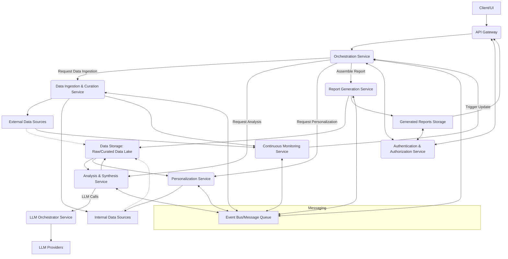

# ArchitecturalDesigner Output
**Agent**: ArchitecturalDesigner
**Execution Order**: 2
**Timestamp**: 2025-07-06 15:42:02

---

## System Architecture Design

### High-Level Architecture

The LLM-guided market research report generation framework will adopt a **Microservices Architecture** combined with an **Event-Driven Architecture**. This approach promotes modularity, scalability, independent development, and resilience, which are crucial for handling diverse data sources, complex LLM interactions, and real-time processing requirements.

**Overall System Design and Components:**

1.  **Client/User Interface (UI):** Provides an intuitive interface for users to define report scope (industry, competitor, market segment), trigger report generation, and view generated reports.
2.  **API Gateway:** Acts as the single entry point for all client requests, handling routing, authentication, and rate limiting.
3.  **Orchestration Service:** The central brain of the system, managing the end-to-end workflow of report generation, coordinating calls between various microservices, and tracking report status.
4.  **Data Ingestion & Curation Service:** Responsible for connecting to diverse external data sources (news, company reports, market databases, social media, primary research) and internal data sources (customer interactions, sales trends). It performs data collection, initial validation, cleansing, and normalization.
5.  **LLM Orchestrator Service:** Manages all interactions with Large Language Models. It handles prompt engineering, context window management, model selection, and potentially fine-tuning. It acts as an abstraction layer for various LLM providers.
6.  **Analysis & Synthesis Service:** Leverages LLMs (via the LLM Orchestrator) to process curated data. It performs core analytical tasks like extracting key insights, identifying market patterns, analyzing correlations, competitive landscape mapping, trend identification, and future predictions. This service might comprise multiple specialized LLM-powered agents.
7.  **Personalization Service:** Integrates with internal customer data (interactions, sales, marketing outreach) to derive and tailor strategic insights and actionable recommendations specific to the user's context.
8.  **Report Generation Service:** Assembles the final market research report from the outputs of the Analysis & Synthesis Service, Personalization Service, and Orchestration Service. It applies "Gartner-style" formatting, structure, and tone.
9.  **Continuous Monitoring Service:** Periodically (or event-driven) triggers data updates and re-analysis based on predefined schedules or detection of significant market changes (e.g., through real-time news feeds).
10. **Data Storage Layer:** A collection of specialized databases for different data types.
11. **Authentication & Authorization Service:** Manages user authentication and access control for the entire system and specific report content.
12. **Messaging/Event Bus:** Facilitates asynchronous communication and decoupling between microservices (e.g., Kafka, RabbitMQ).

### Component Design

**Core Components and their Responsibilities:**

*   **API Gateway:**
    *   **Responsibility:** Expose a unified API, handle request routing, authentication, authorization, rate limiting, and potentially caching.
    *   **Interface/Contracts:** RESTful API endpoints (e.g., `/reports`, `/reports/{id}`, `/data-sources`). JSON payloads for requests/responses. OAuth2/JWT for authentication.
*   **Orchestration Service:**
    *   **Responsibility:** Manage report generation workflows, maintain report states, coordinate calls to other services (Data Ingestion, Analysis, Personalization, Report Generation), handle error recovery.
    *   **Interface/Contracts:** Internal REST/gRPC interfaces with other services. Publishes and subscribes to events on the Message Bus (e.g., `report_requested`, `data_ingested`, `analysis_complete`).
*   **Data Ingestion & Curation Service:**
    *   **Responsibility:** Connect to diverse data sources (APIs, databases, web scraping), ingest data, perform ETL (Extract, Transform, Load) operations like cleansing, normalization, deduplication. Store raw and curated data.
    *   **Interface/Contracts:** Accepts data source configurations. Publishes `data_ingested` events to the Message Bus upon successful data collection. Provides internal API to query curated data.
*   **LLM Orchestrator Service:**
    *   **Responsibility:** Abstract LLM provider complexity. Manage prompt templates, context windows, API keys, model selection (e.g., GPT-4 for synthesis, a smaller model for entity extraction). Implement retry mechanisms and rate limiting for LLM calls. Potentially integrate RAG (Retrieval Augmented Generation) by interacting with a Vector Database.
    *   **Interface/Contracts:** Internal REST/gRPC API for LLM interaction (e.g., `POST /generate-text`, `POST /analyze-data`). Takes structured input (data, context, instructions) and returns LLM output.
*   **Analysis & Synthesis Service:**
    *   **Responsibility:** Process curated data using LLMs to extract insights, identify patterns, perform competitive analysis, market trend identification, technology adoption analysis. This service will contain the sophisticated prompt engineering logic specific to "Gartner-style" analysis.
    *   **Interface/Contracts:** Subscribes to `data_ingested` events. Makes calls to the LLM Orchestrator. Publishes `analysis_complete` events with structured analytical outputs (e.g., identified trends, SWOT elements, market predictions).
*   **Personalization Service:**
    *   **Responsibility:** Access internal customer data (sales, interactions, marketing) to derive context-specific strategic insights and highly personalized actionable recommendations.
    *   **Interface/Contracts:** Internal API to request personalized insights for a given customer/context. Consumes relevant internal data streams/APIs.
*   **Report Generation Service:**
    *   **Responsibility:** Combine structured outputs from Analysis & Synthesis and Personalization services. Apply templating and formatting rules to generate the final report in desired formats (PDF, DOCX, Markdown). Ensure "Gartner-style" tone, structure, and visuals.
    *   **Interface/Contracts:** Subscribes to `analysis_complete` and potentially `personalization_complete` events. Accepts report structure/template parameters. Provides internal API to retrieve generated reports.
*   **Continuous Monitoring Service:**
    *   **Responsibility:** Continuously monitor selected external data sources (e.g., real-time news, social media). Detect significant changes or new data. Trigger re-ingestion or re-analysis workflows for affected reports.
    *   **Interface/Contracts:** Subscribes to new data streams. Publishes `market_change_detected` events or directly signals the Orchestration Service for updates.
*   **Authentication & Authorization Service:**
    *   **Responsibility:** User management, authentication (e.g., OAuth2, JWT token generation/validation), role-based access control (RBAC) for reports and functionalities.
    *   **Interface/Contracts:** RESTful API for login, registration, token validation. Integrated with API Gateway and other services for token validation.
*   **Data Storage Layer:**
    *   **Responsibility:** Store raw ingested data, curated/processed data, LLM interaction logs, generated reports, user metadata, and system configuration.
    *   **Interfaces:** Standard database drivers/ORMs.

**Data Flow Between Components:**

1.  **User Request:** Client sends a `report_request` (e.g., industry: "AI Software", scope: "Competitive Landscape") to the API Gateway.
2.  **Authentication & Routing:** API Gateway authenticates the user and routes the request to the Orchestration Service.
3.  **Orchestration & Data Ingestion:** Orchestration Service initiates the workflow. It signals the Data Ingestion & Curation Service to gather relevant data based on the report scope.
4.  **Data Collection:** Data Ingestion & Curation Service fetches data from External and Internal Data Sources, processes it, and stores it in the Data Lake. It then publishes a `data_ingested` event to the Message Bus.
5.  **Analysis Trigger:** The Analysis & Synthesis Service subscribes to `data_ingested` events. Upon receiving, it retrieves the curated data.
6.  **LLM Processing:** Analysis & Synthesis Service makes multiple calls to the LLM Orchestrator Service, providing data snippets and carefully engineered prompts to perform specific analyses (e.g., SWOT, trend identification). The LLM Orchestrator interacts with various LLM Providers.
7.  **Analysis Completion:** Once analyses are complete, the Analysis & Synthesis Service stores the structured insights in the Data Lake and publishes an `analysis_complete` event.
8.  **Personalization (Concurrent/Sequential):** The Orchestration Service may also trigger the Personalization Service to generate specific customer-centric recommendations using internal data. It publishes `personalization_complete` event.
9.  **Report Assembly:** The Report Generation Service subscribes to `analysis_complete` (and `personalization_complete`) events. It retrieves all relevant insights from the Data Lake and uses pre-defined templates and styling rules to compile the final report.
10. **Report Delivery:** The generated report is stored in the Generated Reports Storage, and a notification is sent back to the Orchestration Service, which then updates the report status for the UI. The user can then retrieve the report via the API Gateway.
11. **Continuous Monitoring:** The Continuous Monitoring Service constantly observes data sources. If new relevant data is detected, it triggers the Data Ingestion & Curation Service, which may lead to re-triggering the entire analysis and report generation process for affected reports.

### Technology Stack

*   **Programming Languages and Frameworks:**
    *   **Backend Services:** Python 3.9+ (Mandatory).
    *   **Web Frameworks:** FastAPI (for high performance, async support, and automatic OpenAPI documentation) or Flask (for smaller services).
    *   **Asynchronous I/O:** `asyncio` for non-blocking operations, `httpx` for async HTTP requests.
    *   **Data Processing:** `Pandas`, `Polars` (for high-performance data manipulation), `Numpy`.
    *   **LLM Interaction:** `LangChain`, `LlamaIndex` (for prompt orchestration, RAG, agentic workflows), specific LLM provider SDKs (e.g., OpenAI API, Anthropic API, Hugging Face `transformers`).
    *   **Data Validation:** `Pydantic` for data model definition and validation, especially for API contracts.
    *   **Background Tasks:** `Celery` with Redis/RabbitMQ backend for long-running or scheduled tasks.
    *   **Testing:** `Pytest`.
*   **Databases and Storage Solutions:**
    *   **Relational Database:** PostgreSQL (for user metadata, report metadata, system configuration, audit logs – ensures ACID properties).
    *   **Document Database:** MongoDB or Couchbase (for flexible storage of raw ingested data, semi-structured analytical outputs).
    *   **Vector Database:** Pinecone, Weaviate, or ChromaDB (for storing embeddings used in RAG for LLM context retrieval).
    *   **Object Storage:** AWS S3, Azure Blob Storage, Google Cloud Storage (for storing large raw data files, generated reports, LLM model artifacts).
    *   **Data Lake:** Apache Iceberg or Delta Lake on top of object storage for structured data warehousing and query optimization.
*   **Infrastructure and Deployment Considerations:**
    *   **Cloud Provider:** AWS, Azure, or GCP (e.g., AWS ECS/EKS for container orchestration, Azure Kubernetes Service, Google Kubernetes Engine).
    *   **Containerization:** Docker for packaging microservices.
    *   **Orchestration:** Kubernetes (K8s) for managing, scaling, and deploying containerized applications.
    *   **Message Broker:** Apache Kafka (for high-throughput, fault-tolerant event streaming) or RabbitMQ (for simpler message queuing).
    *   **CI/CD:** GitHub Actions, GitLab CI/CD, Jenkins (for automated testing, building, and deployment).
    *   **Observability:** Prometheus/Grafana (for monitoring), ELK stack (Elasticsearch, Logstash, Kibana) or Datadog (for centralized logging and tracing).
    *   **API Management:** AWS API Gateway, Azure API Management, Apigee (if specific features beyond basic routing are needed).

### Design Patterns

*   **Architectural Patterns:**
    *   **Microservices Architecture:** Decouples the system into small, independent, deployable services. Promotes scalability and maintainability.
    *   **Event-Driven Architecture:** Uses asynchronous communication via a message bus. Decouples services, enables real-time processing, and facilitates scalability (e.g., Continuous Monitoring triggering updates).
    *   **Clean Architecture (or Hexagonal Architecture):** Applied within each microservice to separate concerns (domain logic, application services, infrastructure details). This ensures testability and maintainability.
*   **Design Patterns for Implementation:**
    *   **Command Pattern:** For encapsulating report generation requests or specific data processing tasks within the Orchestration Service.
    *   **Strategy Pattern:** For defining interchangeable algorithms for data analysis (e.g., different competitive analysis models) or LLM models within the Analysis & Synthesis Service.
    *   **Repository Pattern:** To abstract data access logic within each service, making it independent of the specific database technology.
    *   **Builder Pattern:** For constructing complex objects like LLM prompts or report sections, ensuring consistent construction.
    *   **Observer Pattern:** Key for the Continuous Monitoring Service to observe data changes and notify relevant services.
    *   **Circuit Breaker:** To prevent cascading failures in microservice interactions, especially with external LLM APIs or data sources.
    *   **Saga Pattern:** (Potentially) For managing distributed transactions across multiple services in the Orchestration Service, ensuring data consistency.
    *   **Factory Method/Abstract Factory:** For creating different types of data connectors in the Data Ingestion & Curation Service, or different report output formats in the Report Generation Service.

### Quality Attributes

*   **Scalability:**
    *   **Microservices:** Allows independent scaling of services based on demand (e.g., Data Ingestion can scale independently of Report Generation).
    *   **Containerization & Orchestration (Kubernetes):** Enables automatic scaling of service instances based on load, resource utilization.
    *   **Asynchronous Processing & Message Queues (Kafka):** Decouples producers and consumers, absorbing spikes in traffic and enabling parallel processing.
    *   **Cloud-Native Databases:** Managed services (e.g., Aurora PostgreSQL, MongoDB Atlas) provide inherent scalability and replication.
    *   **Data Partitioning/Sharding:** For large datasets in databases and data lakes to distribute load and improve query performance.
    *   **LLM Caching:** Cache common LLM responses to reduce repetitive calls and latency.
*   **Security:**
    *   **Authentication & Authorization Service:** Centralized user management, OAuth2/JWT for token-based authentication. Role-Based Access Control (RBAC) to restrict access to specific reports or functionalities.
    *   **Data Encryption:**
        *   **At Rest:** Encrypt sensitive data in databases and object storage using KMS (Key Management Service).
        *   **In Transit:** Enforce HTTPS/TLS for all inter-service communication (API Gateway, internal APIs, LLM APIs) and client-server communication.
    *   **Least Privilege:** Services and users only have the minimum necessary permissions to perform their functions.
    *   **Input Validation:** Rigorous validation of all user inputs and data ingested from external sources to prevent injection attacks or malformed data.
    *   **Secrets Management:** Use dedicated secrets management services (e.g., AWS Secrets Manager, Azure Key Vault, HashiCorp Vault) for API keys, database credentials.
    *   **Auditing and Logging:** Comprehensive audit trails of data access, report generation, and system interactions for compliance and incident response.
    *   **Regular Security Audits & Penetration Testing:** Proactive identification and remediation of vulnerabilities.
*   **Performance Optimizations:**
    *   **Asynchronous/Non-blocking I/O:** Utilized in Python services (FastAPI, `asyncio`) to handle multiple concurrent requests efficiently, crucial for high data throughput and LLM interactions.
    *   **Caching:**
        *   **API Gateway Caching:** For frequently requested, static content.
        *   **Data Cache:** Redis or Memcached for frequently accessed curated data or analytical insights.
        *   **LLM Response Caching:** Cache LLM responses for identical prompts/contexts to reduce latency and cost.
    *   **Stream Processing:** For real-time social media signals and continuous market monitoring using Kafka and potentially Flink/Spark Streaming.
    *   **Optimized LLM Usage:**
        *   **Prompt Engineering:** Design efficient prompts to minimize token usage and improve LLM response quality.
        *   **Model Selection:** Use smaller, fine-tuned LLMs for specific tasks where possible, reserving larger models for complex synthesis.
        *   **Batching LLM Calls:** Group multiple independent LLM requests into a single batch where possible.
    *   **Efficient Data Access:** Proper indexing in databases, optimized queries, using appropriate data stores for different data types.
*   **Maintainability Features:**
    *   **Modular Microservices Design:** Each service is self-contained, allowing independent development, testing, and deployment, reducing cognitive load for developers.
    *   **Clear Interfaces and Contracts:** Well-defined APIs and data schemas using Pydantic, facilitating understanding and integration between services.
    *   **Comprehensive Documentation:**
        *   **Code-level:** Adherence to PEP 8 for coding style, PEP 257 for docstrings (Google style recommended), type hinting (PEP 484).
        *   **Project-level:** `README.md`, `requirements.txt`, `LICENSE.txt`. Design documents, architectural diagrams, API documentation (e.g., OpenAPI generated by FastAPI). Use Sphinx and Read The Docs for automated documentation.
    *   **Automated Testing:** Unit tests, integration tests, and end-to-end tests for all services to ensure correctness and prevent regressions.
    *   **Version Control (Git):** Ensures traceability, collaboration, and easy rollback.
    *   **Virtual Environments:** Dedicated virtual environments for each project to manage dependencies and prevent conflicts.
    *   **Observability:** Robust logging, metrics (Prometheus), and distributed tracing (OpenTelemetry) enable developers to understand system behavior, diagnose issues quickly, and monitor performance.
    *   **Coding Standards Enforcement:** Automated linting (e.g., Flake8, Black) and static analysis tools.

---
*Saved by after_agent_callback on 2025-07-06 15:42:02*
