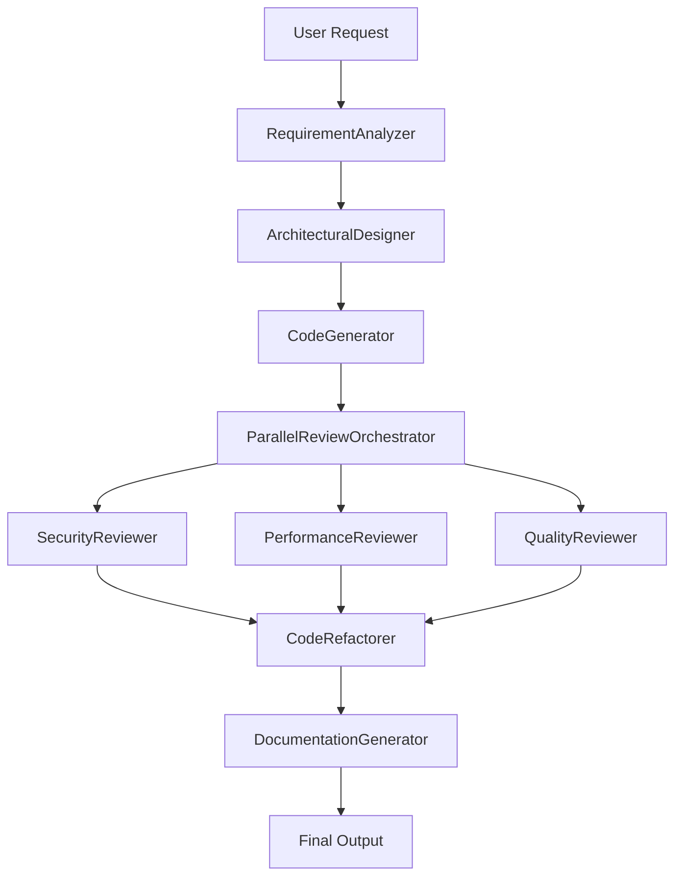

# Flexible Agent Configuration

This directory contains configuration files for the **Flexible Agent Workflow System** - an advanced multi-agent framework that supports various agent types with configurable models, prompts, and behaviors.

## Configuration Files

### 📋 `workflow_flexible.yml`
Main workflow configuration that defines:
- **Agent Definitions**: Individual agents with their types, models, and prompts
- **Workflow Structure**: How agents are orchestrated (Sequential, Parallel, Loop)
- **Agent Types Supported**:
  - `LlmAgent`: Language model agents with custom instructions
  - `SequentialAgent`: Orchestrates sub-agents in sequence
  - `ParallelAgent`: Runs sub-agents concurrently
  - `LoopAgent`: Repeats operations until conditions are met

### 🔑 `gemini_config_flexible.yml`
API and model configuration:
- Google Gemini API settings
- Model-specific configurations
- Performance and security settings
- Agent-specific model mappings

### 💬 `prompts_flexible.yml`
Comprehensive prompt library:
- Specialized prompts for each agent type
- Professional role-based instructions
- Structured output formats
- Domain-specific expertise

## Agent Workflow Architecture

The flexible agent system implements a sophisticated multi-stage workflow:



## Agent Types and Responsibilities

### 🔍 **RequirementAnalyzer**
- **Type**: LlmAgent
- **Role**: Business Analyst & Requirements Engineer
- **Output**: Structured requirement specifications

### 🏗️ **ArchitecturalDesigner**
- **Type**: LlmAgent
- **Role**: Senior Software Architect
- **Output**: System architecture and design patterns

### 👨‍💻 **CodeGenerator**
- **Type**: LlmAgent
- **Role**: Expert Software Developer
- **Output**: Production-ready code with tests

### 🔒 **SecurityReviewer**
- **Type**: LlmAgent
- **Role**: Cybersecurity Expert
- **Output**: Security vulnerability assessment

### ⚡ **PerformanceReviewer**
- **Type**: LlmAgent
- **Role**: Performance Engineering Expert
- **Output**: Performance optimization recommendations

### 🎯 **QualityReviewer**
- **Type**: LlmAgent
- **Role**: Code Quality Expert
- **Output**: Code quality and maintainability assessment

### 🔄 **CodeRefactorer**
- **Type**: LlmAgent
- **Role**: Refactoring Expert
- **Output**: Improved code addressing all review feedback

### 📚 **DocumentationGenerator**
- **Type**: LlmAgent
- **Role**: Technical Writing Expert
- **Output**: Comprehensive documentation package

### 🎭 **ParallelReviewOrchestrator**
- **Type**: ParallelAgent
- **Role**: Orchestrates parallel code reviews
- **Sub-agents**: SecurityReviewer, PerformanceReviewer, QualityReviewer

### 🎯 **MainFlexibleOrchestrator**
- **Type**: SequentialAgent
- **Role**: Main workflow coordinator
- **Sub-agents**: All workflow agents in sequence

## Configuration Examples

### Adding a New Agent

```yaml
agents:
  - name: "TestGenerator"
    type: "LlmAgent"
    model: "gemini-1.5-flash"
    description: "Generates comprehensive unit tests"
    prompt_key: "test_generator"
    output_key: "generated_tests"
    parameters:
      temperature: 0.0
      max_tokens: 2048
    tools: ["code_formatter", "data_validator"]
```

### Creating a Loop Agent

```yaml
agents:
  - name: "IterativeImprover"
    type: "LoopAgent"
    description: "Iteratively improves code quality"
    max_iterations: 3
    sub_agents: ["CodeGenerator", "QualityReviewer"]
```

### Parallel Processing Setup

```yaml
agents:
  - name: "ParallelAnalyzer"
    type: "ParallelAgent"
    description: "Parallel analysis workflow"
    sub_agents: ["SecurityAnalyzer", "PerformanceAnalyzer", "QualityAnalyzer"]
```

## Customization Options

### Model Selection
- Different models for different agent types
- Temperature settings per agent
- Token limits and parameters

### Tool Integration
- Custom tools can be registered
- Tools assigned to specific agents
- Extensible tool registry

### Prompt Engineering
- Role-based prompts for different expertise
- Structured output formats
- Context-aware instructions

## Usage

```bash
# Run the flexible agent workflow
python backend/flexible_agent.py

# Or as a module
python -m backend.flexible_agent
```

## Features

- ✅ **Multi-Agent Architecture**: Sequential, parallel, and loop workflows
- ✅ **Configurable Models**: Different models for different tasks
- ✅ **Professional Prompts**: Role-based expert instructions
- ✅ **Tool Integration**: Extensible tool system
- ✅ **Comprehensive Output**: Code, reviews, refactoring, documentation
- ✅ **Parallel Processing**: Concurrent review workflows
- ✅ **Quality Assurance**: Multi-stage review and improvement
- ✅ **Production Ready**: Error handling, logging, and monitoring

## Advanced Configuration

For advanced use cases, you can:
1. Add new agent types by extending the `FLEXIBLE_AGENT_CLASSES` mapping
2. Create custom tools by using the `@FlexibleToolRegistry.register` decorator
3. Implement custom loop termination conditions
4. Add new prompt templates for domain-specific tasks
5. Configure model-specific parameters per agent

This flexible system allows you to create sophisticated workflows tailored to your specific needs while maintaining the robust architecture and quality standards of the framework. 